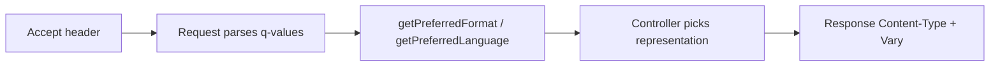

# Content Negotiation

!!! tip "In a nutshell"
    Content negotiation serves different representations of one URL based on the
    client's `Accept*` headers and their `q` weights. Exam hook:
    `getPreferredFormat()` returns a Symfony *format* (not a raw MIME type), and you
    must set `Vary` so shared caches don't mis-serve variants.

!!! example "Real-world analogy"
    Content negotiation is like a letter that says **"reply in French if you can,
    otherwise English; I'd prefer a printed page but a PDF is fine."** The
    `Accept*` headers are those ranked preferences (the `q` values), and the
    office picks the best representation it can produce, then stamps the reply
    with what it chose (`Content-Type`, `Content-Language`) plus a `Vary` note so
    the sorting room files each variant separately.

!!! abstract "Learning objectives"
    By the end of this chapter you can:

    - [ ] Explain how `Accept`, `Accept-Language` and `Accept-Encoding` drive
      negotiation, including quality (`q`) values.
    - [ ] Use `Request::getAcceptableContentTypes()`, `getPreferredFormat()` and
      friends.
    - [ ] Map MIME types to Symfony *formats* and set the response format.
    - [ ] Use the `AcceptHeader` parser.

    **Syllabus:** `HTTP → Content negotiation` ·
    **Level:** Advanced → Expert ·
    **Est. time:** 25 min ·
    **Prerequisites:** [HTTP Request](request.md) · [HTTP Response](response.md)

---

## Theory

**Content negotiation** lets one URL serve different representations. The client
advertises preferences via `Accept*` request headers; the server picks the best
match and echoes its choice in the response (`Content-Type`, `Content-Language`,
`Content-Encoding`) plus a `Vary` header so caches key correctly.

| Request header | Negotiates | Response header |
|---|---|---|
| `Accept` | Media type (`application/json`) | `Content-Type` |
| `Accept-Language` | Locale (`fr-FR`) | `Content-Language` |
| `Accept-Encoding` | Compression (`gzip`, `br`) | `Content-Encoding` |
| `Accept-Charset` | Charset (largely obsolete; UTF-8) | — |

### Quality values

Each option carries an optional `q` weight from 0 to 1 (default 1):

```http
Accept: text/html;q=0.9, application/json;q=1.0, */*;q=0.1
Accept-Language: fr-FR, fr;q=0.8, en;q=0.5
```

Higher `q` wins; `q=0` means "not acceptable". Ties break by specificity.

## Deep Dive — how it works internally

### Request-side API

`Symfony\Component\HttpFoundation\Request` parses these headers for you:

| Method | Returns |
|---|---|
| `getAcceptableContentTypes()` | MIME types, best-first |
| `getPreferredFormat(?string $default = 'html')` | Symfony *format* best matching `Accept` |
| `getLanguages()` | Locales from `Accept-Language`, best-first |
| `getPreferredLanguage(?array $locales = null)` | Best match among your supported locales |
| `getCharsets()` / `getEncodings()` | From `Accept-Charset` / `Accept-Encoding` |
| `getRequestFormat(?string $default = 'html')` | Format from the `_format` attribute |
| `setRequestFormat(string $format)` | Force the format |

`getPreferredLanguage(['en', 'fr'])` intersects the client's ordered languages
with *your* whitelist and returns the best — see [Language Detection](language-detection.md).

### Formats ↔ MIME types

Symfony maps short **format** names (`html`, `json`, `xml`, `csv`, …) to MIME
types via a static registry on `Request`:

```php
Request::getMimeTypes('json');   // ['application/json', 'application/x-json']
$request->getFormat('application/json'); // 'json'
$request->getMimeType('json');   // 'application/json'
```

The `_format` route attribute (e.g. `/api/users.{_format}`) sets
`getRequestFormat()`, and the kernel uses it to pick a response `Content-Type`.



### The `AcceptHeader` parser

For fine control, `Symfony\Component\HttpFoundation\AcceptHeader` parses any
`Accept*` header into sorted `Symfony\Component\HttpFoundation\AcceptHeaderItem`
objects (value, quality, attributes):

```php
<?php
declare(strict_types=1);

use Symfony\Component\HttpFoundation\AcceptHeader;

$accept = AcceptHeader::fromString('text/html;q=0.9, application/json;q=1.0');
$accept->has('application/json'); // true
$best = $accept->first();          // AcceptHeaderItem for application/json
$best?->getQuality();              // 1.0
```

!!! note "Source reference"
    `Request::getPreferredFormat()`, `getAcceptableContentTypes()`,
    `AcceptHeader`, `AcceptHeaderItem` —
    [symfony/symfony `8.0`](https://github.com/symfony/symfony/blob/8.0/src/Symfony/Component/HttpFoundation/AcceptHeader.php).

### Compression & `Vary`

`Accept-Encoding` (gzip/br) is normally handled by the **web server or reverse
proxy**, not PHP. Whenever a response varies by a request header, add
`$response->setVary(['Accept', 'Accept-Language'])` so shared caches store one
entry per variant — otherwise a cache may serve JSON to an HTML client.

### Null behavior

When the client sends **no `Accept` header at all**, there is nothing to
negotiate — Symfony treats it as "accepts anything". `getPreferredFormat()` then
returns the **default** you pass (`getPreferredFormat('html')` → `'html'`). Its
signature is `getPreferredFormat(?string $default = 'html')`: pass `null` and a
truly unmatchable request yields **`null`**, which you must then handle.
`getPreferredLanguage()` called with no argument and no header returns `null` too.

```php
$format = $request->getPreferredFormat('json') ?? 'json';
$locale = $request->getPreferredLanguage(['en', 'fr']) ?? 'en';
```

`AcceptHeader::first()` returns `?AcceptHeaderItem`: on an empty header it is
`null`, so chain with the nullsafe operator — `$accept->first()?->getQuality()`.
The common bug is passing `null` as the default to `getPreferredFormat()` and then
using `match` with no fallback arm, hitting an `UnhandledMatchError` the first
time a client omits `Accept`.

!!! note "Null in real life"
    No `Accept` header is a letter that **states no language preference** — the
    office can't read your mind, so it falls back to the house default rather than
    leaving the reply blank.

## Configuration & code

=== "PHP Attributes"

    ```php
    <?php
    declare(strict_types=1);

    namespace App\Controller;

    use Symfony\Bundle\FrameworkBundle\Controller\AbstractController;
    use Symfony\Component\HttpFoundation\Request;
    use Symfony\Component\HttpFoundation\Response;
    use Symfony\Component\Routing\Attribute\Route;

    final class ArticleController extends AbstractController
    {
        #[Route('/articles/{id}', name: 'article_show')]
        public function show(Request $request, int $id): Response
        {
            $format = $request->getPreferredFormat('html'); // html | json | xml ...

            $response = match ($format) {
                'json' => $this->json(['id' => $id]),
                default => $this->render('article/show.html.twig', ['id' => $id]),
            };
            $response->setVary(['Accept']); // cache per representation

            return $response;
        }
    }
    ```

=== "Console"

    ```console
    $ curl -H 'Accept: application/json' https://localhost/articles/7
    {"id":7}
    $ curl -H 'Accept: text/html' https://localhost/articles/7
    <!DOCTYPE html>...
    ```

## Best practices & anti-patterns

| ✅ Do | ❌ Avoid |
|---|---|
| `getPreferredFormat()` / `getPreferredLanguage()` | Parsing `Accept` by hand |
| Set `Vary` on negotiated responses | One cache entry for all variants |
| Fall back sensibly (`html`, default locale) | Returning 406 for `*/*` |
| Let the proxy handle gzip/br | Compressing in PHP unnecessarily |

## When (not) to use it / alternatives

For APIs, many teams prefer **explicit** representations via a `.json` suffix
(`_format`) or a versioned path over header negotiation, because it is cache- and
debug-friendly. Use `Accept`-based negotiation when the same URL must serve
multiple clients transparently.

!!! danger "Certification traps"
    - **`getPreferredLanguage($locales)` returns the best match *within your
      list***; with no argument it returns the client's top language.
    - `getPreferredFormat()` maps `Accept` to a **Symfony format**, not a raw MIME
      type; `getAcceptableContentTypes()` returns raw MIME types.
    - **`q=0` means "unacceptable"**, not "lowest priority-but-ok".
    - Negotiated responses need **`Vary`** or shared caches will mis-serve.
    - `Accept-Encoding` (gzip) is typically the **web server's** job, not PHP's.

!!! warning "Common mistakes"
    - Forgetting `Vary`, so a proxy serves JSON to a browser.
    - Confusing `getRequestFormat()` (`_format` attribute) with
      `getPreferredFormat()` (client `Accept`).

## Exercises

1. **(Advanced)** Given `Accept: application/xml;q=0.8, application/json;q=0.9`,
   which format does `getPreferredFormat()` choose and why?
2. **(Expert)** Serve `/data` as JSON or CSV based on `Accept`, and make it
   cacheable per representation.

??? success "Solutions"

    **1.** `json` — it carries the higher `q` (0.9 vs 0.8), so it wins the
    ordering.

    **2.**
    ```php
    $format = $request->getPreferredFormat('json');
    $response = $format === 'csv'
        ? new Response($csv, 200, ['Content-Type' => 'text/csv'])
        : $this->json($data);
    $response->setVary(['Accept']);
    return $response;
    ```

## Certification questions

??? question "Q1. `getPreferredLanguage(['en','de'])` returns…"
    - [ ] A. the client's overall top language
    - [x] B. the best of `en`/`de` for this client ✅
    - [ ] C. always `en`
    - [ ] D. all acceptable languages

    **Why:** With a whitelist it intersects the client's ordered languages with
    your list and returns the best match.
    **Ref:** [HttpFoundation](https://symfony.com/doc/current/components/http_foundation.html).

??? question "Q2. `getAcceptableContentTypes()` returns…"
    - [x] A. MIME types ordered by preference ✅
    - [ ] B. Symfony format names
    - [ ] C. locales
    - [ ] D. encodings

    **Why:** It returns raw MIME types (best-first); use `getPreferredFormat()` for
    Symfony format names.
    **Ref:** [Symfony source — Request](https://github.com/symfony/symfony/blob/8.0/src/Symfony/Component/HttpFoundation/Request.php).

??? question "Q3. What does `q=0` mean in an Accept header?"
    - [ ] A. Highest priority
    - [x] B. Not acceptable ✅
    - [ ] C. Default weight
    - [ ] D. Wildcard

    **Why:** `q=0` explicitly rejects that option.
    **Ref:** [MDN — quality values](https://developer.mozilla.org/en-US/docs/Glossary/Quality_values).

??? question "Q4. Which header must you set so a shared cache stores per-representation?"
    - [ ] A. `Content-Type`
    - [ ] B. `Cache-Control: private`
    - [x] C. `Vary` ✅
    - [ ] D. `Accept`

    **Why:** `Vary` tells caches which request headers change the response.
    **Ref:** [MDN — Vary](https://developer.mozilla.org/en-US/docs/Web/HTTP/Headers/Vary).

## Key takeaways

- Client advertises `Accept*` with `q` values; server picks and echoes
  `Content-*`.
- `getPreferredFormat()` → format; `getAcceptableContentTypes()` → MIME types;
  `getPreferredLanguage($list)` → best locale.
- `AcceptHeader`/`AcceptHeaderItem` parse any `Accept*` header.
- Always `Vary` negotiated responses; gzip is the proxy's job.

## Last-minute revision

!!! tip "Cheat sheet"
    - `Accept`→type, `Accept-Language`→locale, `Accept-Encoding`→compression.
    - `q=0` = unacceptable; higher `q` wins.
    - Formats: `getPreferredFormat`, `getRequestFormat`(`_format`),
      `getMimeTypes`.
    - Negotiate → set `Vary`.

## Official References
- [MDN — Content negotiation](https://developer.mozilla.org/en-US/docs/Web/HTTP/Content_negotiation)
- [Symfony docs — HttpFoundation](https://symfony.com/doc/current/components/http_foundation.html)
- [Symfony source — AcceptHeader](https://github.com/symfony/symfony/blob/8.0/src/Symfony/Component/HttpFoundation/AcceptHeader.php)

---

<small>Related: [Language Detection](language-detection.md) · [HTTP Request](request.md) ·
[HTTP Response](response.md) · [Internationalization (Intl)](../miscellaneous/intl.md)</small>
