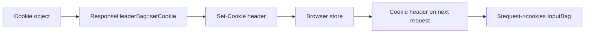

# Cookies

!!! tip "In a nutshell"
    Un cookie est une petite valeur que le serveur demande au navigateur de stocker
    et de renvoyer, ajoutant de l'état au protocole HTTP sans état. Construisez-le avec
    l'objet `Cookie` **immutable** (chaque `with*` retourne une *nouvelle* instance).
    Piège d'examen : `SameSite=None` est rejeté sauf si le cookie est aussi `Secure`.

!!! example "Real-world analogy"
    Un cookie est une **note à votre nom que le bureau vous demande de garder dans
    votre portefeuille** et de montrer à chaque fois que vous écrivez à nouveau.
    `Set-Cookie` vous remet la note ; le header `Cookie` est vous la présentant sur
    la lettre suivante. Les attributs sont les règles écrites dessus — quelles
    agences peuvent la voir (`Domain`/`Path`), la garder au sec (`Secure`), ne pas
    laisser les inconnus la lire (`HttpOnly`), et quand la jeter
    (`Expires`/`Max-Age`).

!!! abstract "Learning objectives"
    À la fin de ce chapitre, vous saurez :

    - [ ] Expliquer chaque attribut de cookie et son impact sur la sécurité.
    - [ ] Construire un cookie avec l'API immutable `Cookie`.
    - [ ] Définir et supprimer des cookies via la response.
    - [ ] Choisir la bonne valeur de `SameSite` selon le scénario.

    **Syllabus:** `HTTP → Cookies` ·
    **Level:** Advanced → Expert ·
    **Est. time:** 25 min ·
    **Prerequisites:** [HTTP Response](response.md) · [Web Security](../php-web-security/web-security.md)

---

## Theory

Un **cookie** est une petite paire clé/valeur que le serveur demande au client de
stocker et de renvoyer sur les requests suivantes, ajoutant de l'état au protocole
HTTP sans état. Le serveur envoie `Set-Cookie` dans une response ; le navigateur
renvoie `Cookie` sur les requests ultérieures vers le périmètre correspondant.

```http
Set-Cookie: token=abc; Path=/; Domain=example.com; Max-Age=3600;
            Secure; HttpOnly; SameSite=Lax
```

### Attributes

| Attribute | Purpose |
|---|---|
| `Domain` | Quel(s) hôte(s) le reçoivent (par défaut, l'hôte qui l'a défini) |
| `Path` | Préfixe d'URL qui le reçoit (par défaut `/`) |
| `Expires` / `Max-Age` | Durée de vie ; omettre les deux → **cookie de session** (supprimé à la fermeture du navigateur) |
| `Secure` | Envoyé uniquement via HTTPS |
| `HttpOnly` | Invisible pour JavaScript (`document.cookie`) — bloque le vol par XSS |
| `SameSite` | Politique d'envoi cross-site : `Strict`, `Lax`, `None` |

!!! question "Predict first"
    `$c = Cookie::create('a'); $c->withValue('b');` puis vous placez `$c` sur la
    response. Quelle valeur le navigateur reçoit-il ?

??? note "Reveal"
    Vide. `Cookie` est **immutable** — `withValue()` retourne une *nouvelle*
    instance que vous avez ignorée. Réassignez-la :
    `$c = Cookie::create('a')->withValue('b');`.

## Deep Dive — how it works internally

### The `Cookie` value object

`Symfony\Component\HttpFoundation\Cookie` est **immutable** : les mutateurs
retournent une nouvelle instance. Créez-le avec la factory statique ou les
méthodes `with*` :

```php
<?php
declare(strict_types=1);

use Symfony\Component\HttpFoundation\Cookie;

$cookie = Cookie::create('token')
    ->withValue('abc')
    ->withExpires(new \DateTimeImmutable('+1 hour'))
    ->withPath('/')
    ->withDomain('.example.com')
    ->withSecure(true)
    ->withHttpOnly(true)
    ->withSameSite(Cookie::SAMESITE_LAX);
```

Constantes `SameSite` : `Cookie::SAMESITE_STRICT`, `Cookie::SAMESITE_LAX`,
`Cookie::SAMESITE_NONE`. Son constructeur accepte aussi tout en positionnel, mais
l'API fluide `with*` est plus claire et évite les erreurs d'ordre des arguments.

```php
// The three SameSite constants (Cookie is immutable: with* returns a new instance)
$bank    = Cookie::create('bank')->withSameSite(Cookie::SAMESITE_STRICT);
$session = Cookie::create('sid')->withSameSite(Cookie::SAMESITE_LAX);
$embed   = Cookie::create('embed')
    ->withSameSite(Cookie::SAMESITE_NONE)
    ->withSecure(true); // SAMESITE_NONE requires Secure
```

!!! note "Source reference"
    `Symfony\Component\HttpFoundation\Cookie` et les constantes `SAMESITE_*` —
    [symfony/symfony `8.0`](https://github.com/symfony/symfony/blob/8.0/src/Symfony/Component/HttpFoundation/Cookie.php).

### Setting and clearing via the response

Les cookies vivent sur le `ResponseHeaderBag` (`$response->headers`) :



- `$response->headers->setCookie($cookie)` — met en file un `Set-Cookie`.
- `$response->headers->clearCookie('token', '/', '.example.com')` — émet un
  `Set-Cookie` avec une expiration dans le passé pour que le navigateur le
  supprime. **Le path et le domain doivent correspondre** à ceux utilisés lors de
  la définition, sinon le navigateur conserve l'original.
- À l'entrée, les cookies se lisent depuis `$request->cookies` (un `InputBag`).

```php
// Queue a Set-Cookie header on the outgoing response
$response->headers->setCookie($cookie);

// Delete it: path and domain must match the original scope
$response->headers->clearCookie('token', '/', '.example.com');

// Read incoming cookies from the InputBag
$token = $request->cookies->get('token'); // null when absent
```

### `SameSite` semantics

| Value | Sent on cross-site request? | Use for |
|---|---|---|
| `Strict` | Jamais | Cookies à haute sécurité (banque) |
| `Lax` | Seulement sur les navigations GET de premier niveau | Défaut pour les sessions |
| `None` | Toujours (**exige `Secure`**) | Intégrations cross-site, tiers |

`SameSite=None` **doit** être associé à `Secure`, sinon les navigateurs rejettent
le cookie. `Lax` est le défaut de session de Symfony et atténue la plupart des
CSRF via cookies.

### Security implications

- **`HttpOnly`** empêche JavaScript de lire les cookies d'authentification →
  limite les dégâts d'une XSS.
- **`Secure`** évite la fuite des cookies via HTTP en clair.
- **`SameSite`** est une atténuation CSRF (voir [Web Security](../php-web-security/web-security.md)).
- **Préfixe `__Host-`** : un cookie nommé `__Host-...` doit être `Secure`, sans
  `Domain`, et avec `Path=/` — le périmètre le plus strict que le navigateur
  impose.

```http
Set-Cookie: sid=abc; Secure; HttpOnly; SameSite=Lax
Set-Cookie: widget=1; SameSite=None; Secure
Set-Cookie: bank=42; Secure; HttpOnly; SameSite=Strict
Set-Cookie: __Host-token=xyz; Secure; Path=/; HttpOnly; SameSite=Strict
```

Les cookies de session de Symfony se configurent sous
`framework.session.cookie_*` et valent par défaut `HttpOnly: true`,
`SameSite: lax`.

### Null behavior

Les cookies entrants se lisent depuis `$request->cookies`, un `InputBag`, donc un
cookie que le navigateur n'a jamais envoyé est une **clé absente** :
`$request->cookies->get('consent')` retourne **`null`** (le défaut de `get()`).
Un visiteur qui arrive pour la première fois, un cookie effacé et un cookie
abandonné par le navigateur parce qu'il était `SameSite=None` sans `Secure` sont
tous identiques vus du serveur — absents.

```php
$consent = $request->cookies->get('consent');            // null on first visit
$theme   = $request->cookies->getString('theme', 'light'); // 'light' when absent
if (null === $consent) {
    // show the consent banner
}
```

Fournissez un défaut (`get('theme', 'light')`) ou un repli `??` plutôt que de
supposer que la valeur est là. Le bug classique consiste à traiter `null` (jamais
défini) comme une valeur « refusé » connue — stockez un marqueur explicite
(`'0'`) pour distinguer « n'a pas encore choisi » de « a choisi non ».

!!! note "Null in real life"
    Un cookie manquant, c'est se présenter au guichet **sans la note dans votre
    portefeuille** — c'est peut-être votre première visite, ou peut-être l'avez-vous
    jetée. Le guichetier ne peut pas deviner ce qu'elle disait ; il vous traite
    comme un nouveau venu.

## Configuration & code

=== "PHP Attributes"

    ```php
    <?php
    declare(strict_types=1);

    namespace App\Controller;

    use Symfony\Bundle\FrameworkBundle\Controller\AbstractController;
    use Symfony\Component\HttpFoundation\Cookie;
    use Symfony\Component\HttpFoundation\Response;
    use Symfony\Component\Routing\Attribute\Route;

    final class ConsentController extends AbstractController
    {
        #[Route('/consent/accept', methods: ['POST'])]
        public function accept(): Response
        {
            $response = new Response('ok');
            $response->headers->setCookie(
                Cookie::create('consent')
                    ->withValue('1')
                    ->withExpires(new \DateTimeImmutable('+1 year'))
                    ->withSecure(true)
                    ->withHttpOnly(true)
                    ->withSameSite(Cookie::SAMESITE_LAX),
            );

            return $response;
        }

        #[Route('/consent/revoke', methods: ['POST'])]
        public function revoke(): Response
        {
            $response = new Response('revoked');
            $response->headers->clearCookie('consent'); // match path/domain used above
            return $response;
        }
    }
    ```

=== "YAML"

    ```yaml
    # config/packages/framework.yaml
    framework:
        session:
            cookie_secure: auto        # Secure when the request is HTTPS
            cookie_httponly: true
            cookie_samesite: lax       # strict | lax | none
    ```

=== "Console"

    ```console
    $ curl -i -X POST https://localhost/consent/accept | grep -i set-cookie
    Set-Cookie: consent=1; expires=...; path=/; secure; httponly; samesite=lax
    ```

## Best practices & anti-patterns

| ✅ Do | ❌ Avoid |
|---|---|
| `HttpOnly` + `Secure` sur les cookies d'authentification | Stocker des tokens lisibles par JS |
| `SameSite=Lax` (ou Strict) par défaut | `SameSite=None` sans `Secure` |
| Faire correspondre path/domain à la suppression | `clearCookie('x')` avec le mauvais périmètre |
| Garder les cookies petits | Stocker un gros état côté client |

## When (not) to use it / alternatives

Utilisez les cookies pour les identifiants de session et les petits drapeaux. Pour
un état côté serveur plus volumineux, utilisez la session (adossée à un cookie ne
contenant que l'ID). Pour l'authentification SPA/API, envisagez des tokens dans
les headers `Authorization` plutôt que des cookies (pas de surface CSRF, mais
vous perdez la protection `HttpOnly` — des compromis s'appliquent).

!!! danger "Certification traps"
    - **`SameSite=None` exige `Secure`**, sinon le navigateur abandonne le cookie.
    - **`clearCookie()` doit utiliser les mêmes path/domain** que `setCookie()`,
      sinon le cookie original survit.
    - Omettre **à la fois** `Expires` et `Max-Age` en fait un **cookie de
      session** (supprimé à la fermeture du navigateur) — pas un cookie permanent.
    - L'objet `Cookie` est **immutable** ; `with*` retourne une **nouvelle**
      instance — oublier de réassigner est un no-op silencieux.
    - Les cookies de session de Symfony valent par défaut `HttpOnly: true`,
      `SameSite: lax`.

!!! warning "Common mistakes"
    - `$cookie->withSecure(true);` sans utiliser la valeur de retour.
    - Lire les cookies depuis `$_COOKIE` au lieu de `$request->cookies`.
    - Supposer qu'un cookie défini pour `Domain=app.example.com` est envoyé à
      `example.com` (ce n'est pas le cas — enfant, pas parent).

## Exercises

1. **(Advanced)** Définissez un cookie `theme` valable 30 jours, lisible par
   JavaScript, couvrant tout le site.
2. **(Expert)** Vous définissez `session` avec `Path=/app; Domain=.example.com`
   mais `clearCookie('session')` ne le supprime pas. Pourquoi, et comment
   corriger ?

??? success "Solutions"

    **1.**
    ```php
    $response->headers->setCookie(
        Cookie::create('theme')->withValue('dark')
            ->withExpires(new \DateTimeImmutable('+30 days'))
            ->withPath('/')
            ->withHttpOnly(false), // JS-readable
    );
    ```

    **2.** `clearCookie()` utilise par défaut `path='/'` et aucun domain, ce qui ne
    correspond pas au périmètre original ; le navigateur conserve donc un cookie
    *différent*. Correction :
    `$response->headers->clearCookie('session', '/app', '.example.com');`.

## Certification questions

??? question "Q1. `SameSite=None` is only accepted by browsers when the cookie is also…"
    - [ ] A. `HttpOnly`
    - [x] B. `Secure` ✅
    - [ ] C. `Domain`-scoped
    - [ ] D. a session cookie

    **Why:** `SameSite=None` exige `Secure` ; sinon le cookie est rejeté.
    **Ref:** [MDN SameSite](https://developer.mozilla.org/en-US/docs/Web/HTTP/Headers/Set-Cookie#samesitesamesite-value).

??? question "Q2. Which attribute prevents JavaScript from reading a cookie?"
    - [ ] A. `Secure`
    - [x] B. `HttpOnly` ✅
    - [ ] C. `SameSite`
    - [ ] D. `Path`

    **Why:** `HttpOnly` cache le cookie à `document.cookie`, atténuant le vol de
    token par XSS.
    **Ref:** [MDN Set-Cookie](https://developer.mozilla.org/en-US/docs/Web/HTTP/Headers/Set-Cookie).

??? question "Q3. A cookie with neither Expires nor Max-Age is…"
    - [x] A. a session cookie deleted when the browser closes ✅
    - [ ] B. permanent
    - [ ] C. rejected
    - [ ] D. valid for 24 hours

    **Why:** Sans durée de vie, c'est un cookie de session.
    **Ref:** [MDN Set-Cookie](https://developer.mozilla.org/en-US/docs/Web/HTTP/Headers/Set-Cookie).

??? question "Q4. `$cookie = Cookie::create('a'); $cookie->withValue('b');` — what is the value?"
    - [ ] A. `b`
    - [x] B. empty — `with*` returns a new instance not reassigned ✅
    - [ ] C. `a`
    - [ ] D. throws

    **Why:** `Cookie` est immutable ; l'instance retournée a été ignorée.
    **Ref:** [Symfony source — Cookie](https://github.com/symfony/symfony/blob/8.0/src/Symfony/Component/HttpFoundation/Cookie.php).

## Key takeaways

- Attributs : Domain, Path, Expires/Max-Age, Secure, HttpOnly, SameSite.
- `Cookie` est immutable — chaînez les `with*` et utilisez le résultat.
- Définissez via `$response->headers->setCookie()`, supprimez via `clearCookie()`
  avec des path/domain correspondants.
- `SameSite=None` ⇒ doit être `Secure` ; le défaut de session est `Lax`.

## Last-minute revision

!!! tip "Cheat sheet"
    - `Cookie::create()->withValue()->withSecure()->withHttpOnly()->withSameSite()`.
    - Pas d'expiration ⇒ cookie de session. `SameSite=None` exige `Secure`.
    - `clearCookie(name, path, domain)` doit correspondre au périmètre original.
    - Lire les entrants : `$request->cookies->get('name')`.

## Connections

- **Depends on:** [HTTP Response](response.md) — les cookies sont mis en file sur le `ResponseHeaderBag` (`setCookie`/`clearCookie`).
- **Reused in:** [The Session](../controllers/session.md) — l'ID de session voyage dans un cookie.
- **Confused with:** [Web Security](../php-web-security/web-security.md) — `SameSite`/`HttpOnly` sont des atténuations CSRF/XSS, pas de simples drapeaux.

## Official References
- [MDN — Set-Cookie](https://developer.mozilla.org/en-US/docs/Web/HTTP/Headers/Set-Cookie)
- [Symfony docs — Setting cookies](https://symfony.com/doc/8.0/components/http_foundation.html#setting-cookies)
- [Symfony source — Cookie](https://github.com/symfony/symfony/blob/8.0/src/Symfony/Component/HttpFoundation/Cookie.php)

## Video references

!!! tip "Watch & learn"
    Voici des chaînes vidéo officielles, mises à jour en continu — cherchez-y
    "HTTP foundation" pour consolider ce chapitre. Nous lions des chaînes stables
    plutôt que des vidéos individuelles pour que les références ne périment jamais.

    - [SymfonyCasts screencasts](https://symfonycasts.com/tracks/symfony) — tutoriels scénarisés à suivre en codant.
    - [Symfony official YouTube](https://www.youtube.com/@SymfonyOfficial) — conférences et keynotes SymfonyCon.
    - [Official docs for this topic](https://symfony.com/doc/8.0/components/http_foundation.html#setting-cookies) — certaines pages de la doc Symfony intègrent un screencast.

## Confidence check

Je suis prêt quand je peux :

- [ ] expliquer **pourquoi** les cookies existent et ce que contrôle chaque attribut
- [ ] construire un cookie avec l'API immutable `Cookie` et le définir/supprimer via la response
- [ ] déboguer un `clearCookie()` qui ne supprime pas (désaccord de path/domain)
- [ ] repérer le piège : `SameSite=None` exige `Secure` ; pas d'expiration ⇒ cookie de session
- [ ] expliquer comment `HttpOnly`/`Secure`/`SameSite`/`__Host-` durcissent un cookie

---

<small>Related: [HTTP Response](response.md) · [Web Security](../php-web-security/web-security.md) ·
[Cookies (Controllers)](../controllers/cookies.md) · [The Session](../controllers/session.md)</small>
