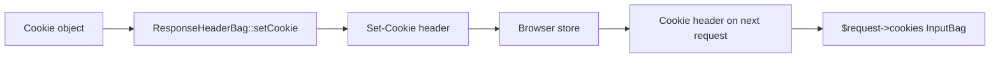

# Cookies

!!! tip "In a nutshell"
    A cookie is a small value the server asks the browser to store and resend,
    adding state to stateless HTTP. Build it with the **immutable** `Cookie` object
    (each `with*` returns a *new* instance). Exam hook: `SameSite=None` is rejected
    unless the cookie is also `Secure`.

!!! abstract "Learning objectives"
    By the end of this chapter you can:

    - [ ] Explain every cookie attribute and its security impact.
    - [ ] Build a cookie with the immutable `Cookie` API.
    - [ ] Set and clear cookies via the response.
    - [ ] Choose the right `SameSite` value for a scenario.

    **Syllabus:** `HTTP → Cookies` ·
    **Level:** Advanced → Expert ·
    **Est. time:** 25 min ·
    **Prerequisites:** [HTTP Response](response.md) · [Web Security](../php-web-security/web-security.md)

---

## Theory

A **cookie** is a small key/value pair the server asks the client to store and
send back on subsequent requests, adding state to stateless HTTP. The server sends
`Set-Cookie` in a response; the browser returns `Cookie` on later requests to the
matching scope.

```http
Set-Cookie: token=abc; Path=/; Domain=example.com; Max-Age=3600;
            Secure; HttpOnly; SameSite=Lax
```

### Attributes

| Attribute | Purpose |
|---|---|
| `Domain` | Which host(s) receive it (defaults to the setting host) |
| `Path` | URL prefix that receives it (default `/`) |
| `Expires` / `Max-Age` | Lifetime; omit both → **session cookie** (dropped on browser close) |
| `Secure` | Sent only over HTTPS |
| `HttpOnly` | Hidden from JavaScript (`document.cookie`) — blocks XSS theft |
| `SameSite` | Cross-site sending policy: `Strict`, `Lax`, `None` |

## Deep Dive — how it works internally

### The `Cookie` value object

`Symfony\Component\HttpFoundation\Cookie` is **immutable**: mutators return a new
instance. Create with the static factory or the `with*` methods:

```php
<?php
declare(strict_types=1);

use Symfony\Component\HttpFoundation\Cookie;

$cookie = Cookie::create('token')
    ->withValue('abc')
    ->withExpires(new \DateTimeImmutable('+1 hour'))
    ->withPath('/')
    ->withDomain('.example.com')
    ->withSecure(true)
    ->withHttpOnly(true)
    ->withSameSite(Cookie::SAMESITE_LAX);
```

`SameSite` constants: `Cookie::SAMESITE_STRICT`, `Cookie::SAMESITE_LAX`,
`Cookie::SAMESITE_NONE`. Its constructor also accepts everything positionally, but
the fluent `with*` API is clearer and avoids argument order mistakes.

!!! note "Source reference"
    `Symfony\Component\HttpFoundation\Cookie` and the `SAMESITE_*` constants —
    [symfony/symfony `8.0`](https://github.com/symfony/symfony/blob/8.0/src/Symfony/Component/HttpFoundation/Cookie.php).

### Setting and clearing via the response

Cookies live on the `ResponseHeaderBag` (`$response->headers`):



- `$response->headers->setCookie($cookie)` — queue a `Set-Cookie`.
- `$response->headers->clearCookie('token', '/', '.example.com')` — emit a
  `Set-Cookie` with an expiry in the past so the browser deletes it. **The path
  and domain must match** the ones used when setting it, or the browser keeps the
  original.
- On the way in, cookies are read from `$request->cookies` (an `InputBag`).

### `SameSite` semantics

| Value | Sent on cross-site request? | Use for |
|---|---|---|
| `Strict` | Never | High-security cookies (banking) |
| `Lax` | Only on top-level GET navigations | Default for sessions |
| `None` | Always (**requires `Secure`**) | Cross-site embeds, third-party |

`SameSite=None` **must** be paired with `Secure`, or browsers reject the cookie.
`Lax` is Symfony's session default and mitigates most CSRF via cookies.

### Security implications

- **`HttpOnly`** stops JavaScript from reading auth cookies → limits XSS damage.
- **`Secure`** prevents leaking cookies over plain HTTP.
- **`SameSite`** is a CSRF mitigation (see [Web Security](../php-web-security/web-security.md)).
- **Prefix `__Host-`**: a cookie named `__Host-...` must be `Secure`, have no
  `Domain`, and `Path=/` — the strongest scoping the browser enforces.

Session cookies in Symfony are configured under `framework.session.cookie_*` and
default to `HttpOnly: true`, `SameSite: lax`.

## Configuration & code

=== "PHP Attributes"

    ```php
    <?php
    declare(strict_types=1);

    namespace App\Controller;

    use Symfony\Bundle\FrameworkBundle\Controller\AbstractController;
    use Symfony\Component\HttpFoundation\Cookie;
    use Symfony\Component\HttpFoundation\Response;
    use Symfony\Component\Routing\Attribute\Route;

    final class ConsentController extends AbstractController
    {
        #[Route('/consent/accept', methods: ['POST'])]
        public function accept(): Response
        {
            $response = new Response('ok');
            $response->headers->setCookie(
                Cookie::create('consent')
                    ->withValue('1')
                    ->withExpires(new \DateTimeImmutable('+1 year'))
                    ->withSecure(true)
                    ->withHttpOnly(true)
                    ->withSameSite(Cookie::SAMESITE_LAX),
            );

            return $response;
        }

        #[Route('/consent/revoke', methods: ['POST'])]
        public function revoke(): Response
        {
            $response = new Response('revoked');
            $response->headers->clearCookie('consent'); // match path/domain used above
            return $response;
        }
    }
    ```

=== "YAML"

    ```yaml
    # config/packages/framework.yaml
    framework:
        session:
            cookie_secure: auto        # Secure when the request is HTTPS
            cookie_httponly: true
            cookie_samesite: lax       # strict | lax | none
    ```

=== "Console"

    ```console
    $ curl -i -X POST https://localhost/consent/accept | grep -i set-cookie
    Set-Cookie: consent=1; expires=...; path=/; secure; httponly; samesite=lax
    ```

## Best practices & anti-patterns

| ✅ Do | ❌ Avoid |
|---|---|
| `HttpOnly` + `Secure` on auth cookies | Storing tokens JS can read |
| `SameSite=Lax` (or Strict) by default | `SameSite=None` without `Secure` |
| Match path/domain when clearing | `clearCookie('x')` with wrong scope |
| Keep cookies small | Storing large state client-side |

## When (not) to use it / alternatives

Use cookies for session identifiers and small flags. For larger server-side state
use the session (backed by a cookie holding only the ID). For SPA/API auth,
consider tokens in `Authorization` headers instead of cookies (no CSRF surface,
but you lose `HttpOnly` protection — trade-offs apply).

!!! danger "Certification traps"
    - **`SameSite=None` requires `Secure`** or the browser drops the cookie.
    - **`clearCookie()` must use the same path/domain** as `setCookie()`, or the
      original cookie survives.
    - Omitting **both** `Expires` and `Max-Age` makes it a **session cookie**
      (deleted when the browser closes) — not a permanent one.
    - The `Cookie` object is **immutable**; `with*` returns a **new** instance —
      forgetting to reassign is a silent no-op.
    - Symfony session cookies default to `HttpOnly: true`, `SameSite: lax`.

!!! warning "Common mistakes"
    - `$cookie->withSecure(true);` without using the return value.
    - Reading cookies from `$_COOKIE` instead of `$request->cookies`.
    - Assuming a cookie set for `Domain=app.example.com` is sent to
      `example.com` (it is not — child, not parent).

## Exercises

1. **(Advanced)** Set a `theme` cookie lasting 30 days, readable by JavaScript,
   scoped to the whole site.
2. **(Expert)** You set `session` with `Path=/app; Domain=.example.com` but
   `clearCookie('session')` doesn't delete it. Why, and how do you fix it?

??? success "Solutions"

    **1.**
    ```php
    $response->headers->setCookie(
        Cookie::create('theme')->withValue('dark')
            ->withExpires(new \DateTimeImmutable('+30 days'))
            ->withPath('/')
            ->withHttpOnly(false), // JS-readable
    );
    ```

    **2.** `clearCookie()` defaults to `path='/'` and no domain, which does not
    match the original scope, so the browser keeps a *different* cookie. Fix:
    `$response->headers->clearCookie('session', '/app', '.example.com');`.

## Certification questions

??? question "Q1. `SameSite=None` is only accepted by browsers when the cookie is also…"
    - [ ] A. `HttpOnly`
    - [x] B. `Secure` ✅
    - [ ] C. `Domain`-scoped
    - [ ] D. a session cookie

    **Why:** `SameSite=None` requires `Secure`; otherwise the cookie is rejected.
    **Ref:** [MDN SameSite](https://developer.mozilla.org/en-US/docs/Web/HTTP/Headers/Set-Cookie#samesitesamesite-value).

??? question "Q2. Which attribute prevents JavaScript from reading a cookie?"
    - [ ] A. `Secure`
    - [x] B. `HttpOnly` ✅
    - [ ] C. `SameSite`
    - [ ] D. `Path`

    **Why:** `HttpOnly` hides the cookie from `document.cookie`, mitigating XSS
    token theft.
    **Ref:** [MDN Set-Cookie](https://developer.mozilla.org/en-US/docs/Web/HTTP/Headers/Set-Cookie).

??? question "Q3. A cookie with neither Expires nor Max-Age is…"
    - [x] A. a session cookie deleted when the browser closes ✅
    - [ ] B. permanent
    - [ ] C. rejected
    - [ ] D. valid for 24 hours

    **Why:** Without a lifetime it is a session cookie.
    **Ref:** [MDN Set-Cookie](https://developer.mozilla.org/en-US/docs/Web/HTTP/Headers/Set-Cookie).

??? question "Q4. `$cookie = Cookie::create('a'); $cookie->withValue('b');` — what is the value?"
    - [ ] A. `b`
    - [x] B. empty — `with*` returns a new instance not reassigned ✅
    - [ ] C. `a`
    - [ ] D. throws

    **Why:** `Cookie` is immutable; the returned instance was discarded.
    **Ref:** [Symfony source — Cookie](https://github.com/symfony/symfony/blob/8.0/src/Symfony/Component/HttpFoundation/Cookie.php).

## Key takeaways

- Attributes: Domain, Path, Expires/Max-Age, Secure, HttpOnly, SameSite.
- `Cookie` is immutable — chain `with*` and use the result.
- Set via `$response->headers->setCookie()`, delete via `clearCookie()` with
  matching path/domain.
- `SameSite=None` ⇒ must be `Secure`; session default is `Lax`.

## Last-minute revision

!!! tip "Cheat sheet"
    - `Cookie::create()->withValue()->withSecure()->withHttpOnly()->withSameSite()`.
    - No expiry ⇒ session cookie. `SameSite=None` needs `Secure`.
    - `clearCookie(name, path, domain)` must match the original scope.
    - Read incoming: `$request->cookies->get('name')`.

## Official References
- [MDN — Set-Cookie](https://developer.mozilla.org/en-US/docs/Web/HTTP/Headers/Set-Cookie)
- [Symfony docs — Setting cookies](https://symfony.com/doc/current/components/http_foundation.html#setting-cookies)
- [Symfony source — Cookie](https://github.com/symfony/symfony/blob/8.0/src/Symfony/Component/HttpFoundation/Cookie.php)

---

<small>Related: [HTTP Response](response.md) · [Web Security](../php-web-security/web-security.md) ·
[Cookies (Controllers)](../controllers/cookies.md) · [The Session](../controllers/session.md)</small>
