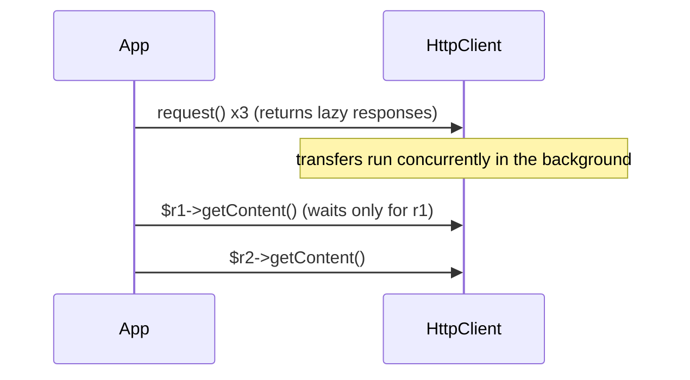
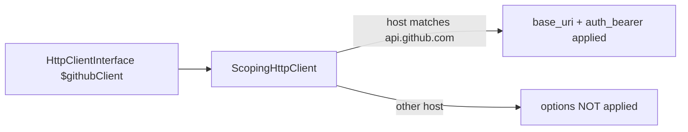

# HttpClient Component

!!! tip "In a nutshell"
    HttpClient est la couche HTTP *sortante* de Symfony — votre application appelant
    d'autres API. Typez `HttpClientInterface`, jamais un transport concret. Piège
    d'examen : `request()` est **lazy/async** ; le transfert ne s'exécute qu'à la
    première lecture de la response (ce qui rend la concurrence gratuite).

!!! example "Real-world analogy"
    Si HttpFoundation gère le courrier qui arrive à *votre* bureau, HttpClient c'est
    **vous qui postez des lettres à un autre bureau** et attendez sa réponse. Vous
    rédigez la request, la remettez au coursier (`request()`), et — comme le coursier
    est async — vous pouvez en envoyer toute une pile d'un coup et n'attendre que
    lorsque vous ouvrez effectivement une réponse (`getContent()`). Un scoped client
    est une enveloppe pré-adressée et pré-affranchie pour un bureau bien précis.

!!! abstract "Learning objectives"
    À la fin de ce chapitre, vous saurez :

    - [ ] Effectuer des requests via `HttpClientInterface` et lire `ResponseInterface`.
    - [ ] Configurer des scoped clients / base-URI et des options par request.
    - [ ] Streamer et exécuter des requests en parallèle (async par défaut).
    - [ ] Ajouter des retries et mocker le client dans les tests.

    **Syllabus:** `HTTP → HttpClient component` ·
    **Level:** Expert ·
    **Est. time:** 35 min ·
    **Prerequisites:** [HTTP Request](request.md) · [HTTP Response](response.md)

---

## Theory

`Symfony\Component\HttpClient` est le versant **sortant** de HTTP : votre application
en tant que *client* appelant d'autres services/API. Il fournit une petite interface
indépendante du transport, plus des décorateurs pour le scoping, le retry, le logging
et les tests. Il implémente l'interface `HttpClientInterface` propre à Symfony **et**
PSR-18 (`Psr18Client`).

Deux transports le sous-tendent :

- `Symfony\Component\HttpClient\CurlHttpClient` — utilise ext-curl ; supporte HTTP/2,
  la concurrence, le push. Préféré quand curl est disponible.
- `Symfony\Component\HttpClient\NativeHttpClient` — streams PHP purs ; le repli.

`HttpClient::create()` choisit automatiquement le meilleur disponible.

!!! question "Predict first"
    Vous appelez `$client->request('GET', $url)` trois fois dans une boucle sans lire
    aucune response. Combien de transferts HTTP se sont terminés ?

??? note "Reveal"
    Zéro du seul fait de `request()` — elle est **lazy**. Les trois transferts
    s'exécutent en parallèle en arrière-plan et chacun ne se termine qu'à la première
    lecture de son statut/headers/contenu. Lancez d'abord tout le lot, lisez ensuite,
    et la concurrence est gratuite.

## Deep Dive — how it works internally

### Interfaces and the lazy/async model

Le contrat vit dans `Symfony\Contracts\HttpClient` :

- `HttpClientInterface::request(string $method, string $url, array $options = []): ResponseInterface`
- `ResponseInterface` — `getStatusCode()`, `getHeaders()`, `getContent()`,
  `toArray()`, `getInfo()`, `cancel()`.
- `ResponseStreamInterface` + `ChunkInterface` pour le streaming.

`request()` est **non bloquante** : elle retourne immédiatement une
`ResponseInterface` lazy. L'échange HTTP n'est *terminé* que lorsque vous lisez pour la
première fois le statut/les headers/le contenu. Cela rend la concurrence gratuite —
lancez de nombreuses requests, puis lisez-les :



!!! note "Source reference"
    `Symfony\Contracts\HttpClient\HttpClientInterface`,
    `Symfony\Component\HttpClient\HttpClient`, `CurlHttpClient`,
    `NativeHttpClient` —
    [symfony/symfony `8.0`](https://github.com/symfony/symfony/blob/8.0/src/Symfony/Component/HttpClient/HttpClient.php).

### Reading responses & error handling

`getStatusCode()` ne lève jamais d'exception. `getContent()` et `toArray()` **lèvent
sur les 3xx/4xx/5xx** par défaut (`throw: true`) :

- `Symfony\Contracts\HttpClient\Exception\ClientExceptionInterface` (4xx)
- `ServerExceptionInterface` (5xx), `RedirectionExceptionInterface` (3xx),
  `TransportExceptionInterface` (réseau).

Passez `getContent(false)` (ou l'option `throw`) pour inspecter vous-même les corps
d'erreur. `toArray()` décode le JSON et renvoie un tableau.

### Options that matter

Par request ou comme valeurs par défaut du client via `withOptions()` :

| Option | Effect |
|---|---|
| `query` | Paramètres de query ajoutés (tableau) |
| `headers` | Headers de la request |
| `json` | Corps encodé en JSON + `Content-Type: application/json` |
| `body` | Corps brut/string/iterable/closure (streamé) |
| `auth_basic` / `auth_bearer` | Authentification |
| `base_uri` | Préfixé aux URLs relatives |
| `timeout` / `max_duration` | Timeout d'inactivité / plafond total |
| `max_redirects` | Limite de redirections suivies |

### Scoped clients & base URI

Un **scoped client** applique des options (base URI, auth, headers) uniquement aux
URLs correspondant à un hôte/une regexp — idéal pour envelopper une API donnée.
Configurez-le de façon déclarative ; le framework injecte un client nommé que vous
autowirez par le nom de variable :



Programmatiquement, `ScopingHttpClient::forBaseUri($client, 'https://api.github.com')`
ou `$client->withOptions(['base_uri' => '...'])`.

### Retry & streaming decorators

- `Symfony\Component\HttpClient\RetryableHttpClient` enveloppe n'importe quel client et
  rejoue les requests échouées/5xx/429 via une `GenericRetryStrategy` (respecte
  `Retry-After`).
- `$client->stream($response)` renvoie une `ResponseStreamInterface` ; itérez pour
  obtenir des morceaux `ChunkInterface` sans mettre tout le corps en mémoire — pour les
  gros téléchargements ou les Server-Sent Events (`EventSourceHttpClient`).

### Null behavior

`getContent()` renvoie une **string** — pour un corps légitimement vide (un `204 No
Content`, ou un `200` sans rien à envoyer) cette string est simplement `''`, **pas
`null`**. Ne testez pas le corps avec `=== null` ; testez `'' === $response->getContent()`
ou vérifiez d'abord le code de statut.

`toArray()` est plus stricte : sur un corps vide elle lève une `JsonException` car `""`
n'est pas du JSON valide — il n'y a aucun retour `null` silencieux. Protégez un payload
potentiellement vide avant de décoder :

```php
$response = $client->request('GET', $url);
if (204 === $response->getStatusCode() || '' === $response->getContent(false)) {
    return [];
}

return $response->toArray();
```

Pour lire un header potentiellement absent, les sacs de headers sont ici des tableaux
indexés par clé, utilisez donc `$response->getHeaders()['x-total'][0] ?? null` plutôt
qu'un getter nullable. Le bug classique est d'appeler `toArray()` sur un `204` et
d'être surpris par l'exception de décodage au lieu de recevoir `null`.

!!! note "Null in real life"
    Une response vide est une **enveloppe-réponse arrivée vide** — le coursier l'a
    bien livrée (statut `204`), il n'y a simplement aucune page dedans. C'est un
    résultat valide, pas une lettre perdue.

## Configuration & code

=== "PHP Attributes"

    ```php
    <?php
    declare(strict_types=1);

    namespace App\Service;

    use Symfony\Component\DependencyInjection\Attribute\Autowire;
    use Symfony\Contracts\HttpClient\HttpClientInterface;

    final readonly class GitHubApi
    {
        public function __construct(
            // Inject a scoped client defined in framework.yaml by its name.
            #[Autowire(service: 'github.client')]
            private HttpClientInterface $client,
        ) {}

        /** @return array<string, mixed> */
        public function repo(string $owner, string $name): array
        {
            $response = $this->client->request('GET', "/repos/{$owner}/{$name}");

            return $response->toArray(); // decodes JSON; throws on 4xx/5xx
        }
    }
    ```

=== "YAML"

    ```yaml
    # config/packages/framework.yaml
    framework:
        http_client:
            scoped_clients:
                github.client:
                    base_uri: 'https://api.github.com/'
                    headers:
                        Accept: 'application/vnd.github+json'
                    auth_bearer: '%env(GITHUB_TOKEN)%'
                    retry_failed:
                        max_retries: 3
    ```

=== "Console"

    ```console
    $ php bin/console debug:container --tag=http_client.client
    ```

### Concurrency & streaming

```php
<?php
declare(strict_types=1);

use Symfony\Component\HttpClient\HttpClient;

$client = HttpClient::create();

// Fire concurrently — responses are lazy.
$responses = [];
foreach (['https://a.example', 'https://b.example'] as $url) {
    $responses[] = $client->request('GET', $url);
}

// Stream as chunks arrive across all responses.
foreach ($client->stream($responses) as $response => $chunk) {
    if ($chunk->isLast()) {
        // this $response finished
    }
}
```

### Mocking in tests

```php
<?php
declare(strict_types=1);

use Symfony\Component\HttpClient\MockHttpClient;
use Symfony\Component\HttpClient\Response\MockResponse;

$client = new MockHttpClient([
    new MockResponse('{"id":42}', ['http_code' => 200]),
]);

$data = $client->request('GET', 'https://api.test/thing')->toArray();
// $data === ['id' => 42] — no network traffic
```

`Symfony\Component\HttpClient\MockHttpClient` + `Response\MockResponse` renvoient des
responses préparées (ou un callback) avec **zéro accès réseau** — la façon standard de
tester les intégrations d'API.

## Best practices & anti-patterns

| ✅ Do | ❌ Avoid |
|---|---|
| Typer `HttpClientInterface` | Dépendre directement de `CurlHttpClient` |
| Un scoped client par API | Répéter base URI + auth partout |
| `MockHttpClient` dans les tests | De vrais appels HTTP dans les tests |
| Lot de requests + `stream()` pour la concurrence | Boucles séquentielles bloquantes |
| `RetryableHttpClient` pour les API instables | Boucles de retry écrites à la main |

## When (not) to use it / alternatives

Utilisez HttpClient pour tout HTTP sortant. Pour le fire-and-forget ou le fan-out
massif, combinez-le avec Messenger (async). Il ne sert **pas** à servir les requests
entrantes — c'est le rôle de HttpFoundation/HttpKernel. Guzzle est superflu ;
HttpClient est compatible PSR-18 si une bibliothèque en a besoin.

!!! danger "Certification traps"
    - **`request()` est lazy/async** — le transfert se termine à la première lecture
      du statut/des headers/du contenu, ce qui offre une concurrence gratuite.
    - **`getContent()`/`toArray()` lèvent sur les 3xx/4xx/5xx par défaut** ;
      `getStatusCode()` ne lève jamais. Passez `false` / `throw: false` pour lire les
      corps d'erreur.
    - Typez la **`HttpClientInterface`** (le contrat), pas un transport concret.
    - **Les options d'un scoped client ne s'appliquent qu'aux hôtes/base URI
      correspondants** ; les autres URLs les ignorent.
    - Mockez avec `MockHttpClient` + `MockResponse` — aucun réseau dans les tests.

!!! warning "Common mistakes"
    - Lire `getContent()` à l'intérieur de la boucle de requests, ce qui tue la
      concurrence.
    - Oublier que les URLs relatives exigent un client (scoped) avec `base_uri`.
    - S'attendre à ce que `toArray()` fonctionne sur des responses non-JSON.

## Exercises

1. **(Advanced)** Récupérez du JSON depuis une API et renvoyez-le comme tableau PHP,
   en gérant un 404 avec élégance (sans exception).
2. **(Expert)** Écrivez un test unitaire qui vérifie que votre service parse
   `{"ok":true}` sans aucun appel réseau.

??? success "Solutions"

    **1.**
    ```php
    $response = $client->request('GET', $url);
    if (404 === $response->getStatusCode()) {
        return [];
    }
    return $response->toArray(); // safe: status already checked
    ```
    (Ou `$response->toArray(false)` pour supprimer l'exception et inspecter.)

    **2.**
    ```php
    $client = new MockHttpClient(new MockResponse('{"ok":true}'));
    $service = new MyService($client);
    self::assertTrue($service->check());
    ```

## Certification questions

??? question "Q1. When is an HttpClient request actually performed?"
    - [ ] A. Immediately when `request()` is called
    - [x] B. Lazily, on first read of status/headers/content ✅
    - [ ] C. Only when `stream()` is called
    - [ ] D. When the kernel terminates

    **Why:** `request()` renvoie une response lazy ; le transfert se termine au premier
    accès, ce qui est précisément ce qui permet la concurrence.
    **Ref:** [HttpClient](https://symfony.com/doc/current/http_client.html).

??? question "Q2. What does `getContent()` do on a 500 response by default?"
    - [ ] A. Returns the body
    - [ ] B. Returns an empty string
    - [x] C. Throws a `ServerExceptionInterface` ✅
    - [ ] D. Returns null

    **Why:** Par défaut les erreurs lèvent une exception ; passez `false` pour lire le
    corps sans lever.
    **Ref:** [HttpClient exceptions](https://symfony.com/doc/current/http_client.html#handling-exceptions).

??? question "Q3. Which type should you type-hint for autowiring an HTTP client?"
    - [x] A. `Symfony\Contracts\HttpClient\HttpClientInterface` ✅
    - [ ] B. `CurlHttpClient`
    - [ ] C. `NativeHttpClient`
    - [ ] D. `Psr18Client`

    **Why:** Dépendez du contrat ; le transport est choisi par le framework.
    **Ref:** [HttpClient DI](https://symfony.com/doc/current/http_client.html).

??? question "Q4. Which class lets you test API code with no network?"
    - [ ] A. `RetryableHttpClient`
    - [ ] B. `ScopingHttpClient`
    - [x] C. `MockHttpClient` ✅
    - [ ] D. `EventSourceHttpClient`

    **Why:** `MockHttpClient` renvoie des objets `MockResponse` sans requests
    réelles.
    **Ref:** [Testing HttpClient](https://symfony.com/doc/current/http_client.html#testing).

## Key takeaways

- `HttpClientInterface::request()` est lazy/async ; la concurrence est gratuite.
- `getContent()`/`toArray()` lèvent sur les 3xx–5xx par défaut ; `getStatusCode()` jamais.
- Les scoped clients lient base URI/auth aux hôtes correspondants.
- `RetryableHttpClient` pour la résilience ; `MockHttpClient` pour les tests.

## Last-minute revision

!!! tip "Cheat sheet"
    - Contrat : `HttpClientInterface` / `ResponseInterface`. Factory :
      `HttpClient::create()`.
    - Options : `json`, `query`, `headers`, `auth_bearer`, `base_uri`, `timeout`.
    - Concurrence : bouclez sur `request()`, puis `$client->stream($responses)`.
    - Test : `MockHttpClient` + `MockResponse`. Résilience : `RetryableHttpClient`.

## Connections

- **Depends on:** [HTTP Response](response.md) — `ResponseInterface` reflète le modèle de response, dans le sens sortant.
- **Reused in:** [Messenger Component](../miscellaneous/messenger.md) — associez les appels sortants au fan-out async et aux retries.
- **Confused with:** [HTTP Request](request.md) — HttpClient est le client *sortant* ; `Request` enveloppe l'échange *entrant*.

## Official References
- [Symfony docs — HttpClient](https://symfony.com/doc/current/http_client.html)
- [Symfony source — HttpClient](https://github.com/symfony/symfony/blob/8.0/src/Symfony/Component/HttpClient/HttpClient.php)
- [Symfony source — HttpClientInterface](https://github.com/symfony/symfony/blob/8.0/src/Symfony/Contracts/HttpClient/HttpClientInterface.php)

## Video references

!!! tip "Watch & learn"
    Ce sont des chaînes vidéo officielles, mises à jour en continu — cherchez-y
    "HTTP foundation" pour consolider ce chapitre. Nous lions des chaînes stables plutôt
    que des vidéos individuelles pour que les références ne se périment jamais.

    - [SymfonyCasts screencasts](https://symfonycasts.com/tracks/symfony) — tutoriels scénarisés à suivre en codant.
    - [Symfony official YouTube](https://www.youtube.com/@SymfonyOfficial) — conférences et keynotes SymfonyCon.
    - [Official docs for this topic](https://symfony.com/doc/current/http_client.html) — certaines pages de la doc Symfony intègrent un screencast.

## Confidence check

Je suis prêt quand je peux :

- [ ] expliquer **pourquoi** on type `HttpClientInterface` plutôt qu'un transport concret
- [ ] configurer un scoped client / base-URI et envoyer des options par request
- [ ] déboguer une concurrence perdue (lecture dans la boucle de requests) et les erreurs de décodage sur corps vide
- [ ] repérer le piège : `request()` est lazy, `getContent()`/`toArray()` lèvent sur les 3xx–5xx
- [ ] expliquer comment `stream()`, `RetryableHttpClient` et `MockHttpClient` s'articulent

---

<small>Related: [HTTP Request](request.md) · [HTTP Response](response.md) ·
[Status Codes](status-codes.md) · [Messenger Component](../miscellaneous/messenger.md)</small>
