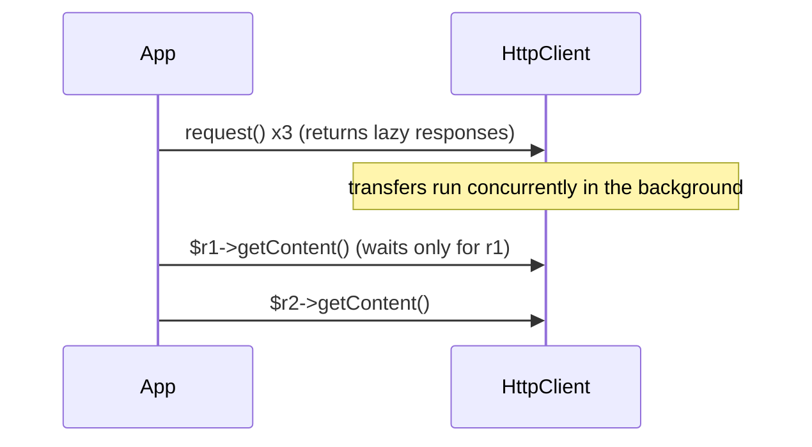
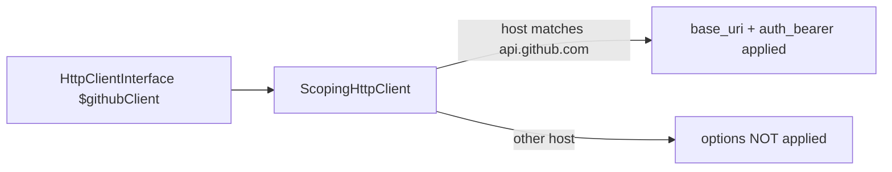

# HttpClient Component

!!! tip "In a nutshell"
    HttpClient is Symfony's *outgoing* HTTP layer — your app calling other APIs.
    Type-hint `HttpClientInterface`, never a concrete transport. Exam hook:
    `request()` is **lazy/async**; the transfer runs only on first read of the
    response (which makes concurrency free).

!!! example "Real-world analogy"
    If HttpFoundation handles the mail arriving at *your* office, HttpClient is
    **you posting letters to another office** and awaiting their reply. You write
    the request, hand it to the courier (`request()`), and — because the courier
    is async — you can send a whole stack at once and only wait when you actually
    open a reply (`getContent()`). A scoped client is a pre-addressed,
    pre-stamped envelope for one specific office.

!!! abstract "Learning objectives"
    By the end of this chapter you can:

    - [ ] Make requests through `HttpClientInterface` and read `ResponseInterface`.
    - [ ] Configure scoped/base-URI clients and per-request options.
    - [ ] Stream and run requests concurrently (async by default).
    - [ ] Add retries and mock the client in tests.

    **Syllabus:** `HTTP → HttpClient component` ·
    **Level:** Expert ·
    **Est. time:** 35 min ·
    **Prerequisites:** [HTTP Request](request.md) · [HTTP Response](response.md)

---

## Theory

`Symfony\Component\HttpClient` is the **outgoing** side of HTTP: your app as a
*client* calling other services/APIs. It provides a small, transport-agnostic
interface plus decorators for scoping, retry, logging and testing. It implements
Symfony's own `HttpClientInterface` **and** PSR-18 (`Psr18Client`).

Two transports back it:

- `Symfony\Component\HttpClient\CurlHttpClient` — uses ext-curl; supports HTTP/2,
  concurrency, push. Preferred when curl is available.
- `Symfony\Component\HttpClient\NativeHttpClient` — pure PHP streams; the fallback.

`HttpClient::create()` picks the best available automatically.

## Deep Dive — how it works internally

### Interfaces and the lazy/async model

The contract lives in `Symfony\Contracts\HttpClient`:

- `HttpClientInterface::request(string $method, string $url, array $options = []): ResponseInterface`
- `ResponseInterface` — `getStatusCode()`, `getHeaders()`, `getContent()`,
  `toArray()`, `getInfo()`, `cancel()`.
- `ResponseStreamInterface` + `ChunkInterface` for streaming.

`request()` is **non-blocking**: it returns immediately with a lazy
`ResponseInterface`. The HTTP exchange is only *completed* when you first read the
status/headers/content. This makes concurrency free — fire many requests, then
read them:



!!! note "Source reference"
    `Symfony\Contracts\HttpClient\HttpClientInterface`,
    `Symfony\Component\HttpClient\HttpClient`, `CurlHttpClient`,
    `NativeHttpClient` —
    [symfony/symfony `8.0`](https://github.com/symfony/symfony/blob/8.0/src/Symfony/Component/HttpClient/HttpClient.php).

### Reading responses & error handling

`getStatusCode()` never throws. `getContent()` and `toArray()` **throw on 3xx/4xx/
5xx** by default (`throw: true`):

- `Symfony\Contracts\HttpClient\Exception\ClientExceptionInterface` (4xx)
- `ServerExceptionInterface` (5xx), `RedirectionExceptionInterface` (3xx),
  `TransportExceptionInterface` (network).

Pass `getContent(false)` (or the `throw` option) to inspect error bodies yourself.
`toArray()` JSON-decodes and returns an array.

### Options that matter

Per-request or as client defaults via `withOptions()`:

| Option | Effect |
|---|---|
| `query` | Appended query params (array) |
| `headers` | Request headers |
| `json` | Body encoded as JSON + `Content-Type: application/json` |
| `body` | Raw/string/iterable/closure body (streamed) |
| `auth_basic` / `auth_bearer` | Authentication |
| `base_uri` | Prefixed to relative URLs |
| `timeout` / `max_duration` | Idle timeout / total cap |
| `max_redirects` | Follow limit |

### Scoped clients & base URI

A **scoped client** applies options (base URI, auth, headers) only to URLs
matching a host/regexp — ideal for wrapping one API. Configure declaratively; the
framework injects a named client you autowire by variable name:



Programmatically, `ScopingHttpClient::forBaseUri($client, 'https://api.github.com')`
or `$client->withOptions(['base_uri' => '...'])`.

### Retry & streaming decorators

- `Symfony\Component\HttpClient\RetryableHttpClient` wraps any client and retries
  failed/5xx/429 requests using a `GenericRetryStrategy` (honours `Retry-After`).
- `$client->stream($response)` returns a `ResponseStreamInterface`; iterate to get
  `ChunkInterface` pieces without buffering the whole body — for large downloads
  or Server-Sent Events (`EventSourceHttpClient`).

## Configuration & code

=== "PHP Attributes"

    ```php
    <?php
    declare(strict_types=1);

    namespace App\Service;

    use Symfony\Component\DependencyInjection\Attribute\Autowire;
    use Symfony\Contracts\HttpClient\HttpClientInterface;

    final readonly class GitHubApi
    {
        public function __construct(
            // Inject a scoped client defined in framework.yaml by its name.
            #[Autowire(service: 'github.client')]
            private HttpClientInterface $client,
        ) {}

        /** @return array<string, mixed> */
        public function repo(string $owner, string $name): array
        {
            $response = $this->client->request('GET', "/repos/{$owner}/{$name}");

            return $response->toArray(); // decodes JSON; throws on 4xx/5xx
        }
    }
    ```

=== "YAML"

    ```yaml
    # config/packages/framework.yaml
    framework:
        http_client:
            scoped_clients:
                github.client:
                    base_uri: 'https://api.github.com/'
                    headers:
                        Accept: 'application/vnd.github+json'
                    auth_bearer: '%env(GITHUB_TOKEN)%'
                    retry_failed:
                        max_retries: 3
    ```

=== "Console"

    ```console
    $ php bin/console debug:container --tag=http_client.client
    ```

### Concurrency & streaming

```php
<?php
declare(strict_types=1);

use Symfony\Component\HttpClient\HttpClient;

$client = HttpClient::create();

// Fire concurrently — responses are lazy.
$responses = [];
foreach (['https://a.example', 'https://b.example'] as $url) {
    $responses[] = $client->request('GET', $url);
}

// Stream as chunks arrive across all responses.
foreach ($client->stream($responses) as $response => $chunk) {
    if ($chunk->isLast()) {
        // this $response finished
    }
}
```

### Mocking in tests

```php
<?php
declare(strict_types=1);

use Symfony\Component\HttpClient\MockHttpClient;
use Symfony\Component\HttpClient\Response\MockResponse;

$client = new MockHttpClient([
    new MockResponse('{"id":42}', ['http_code' => 200]),
]);

$data = $client->request('GET', 'https://api.test/thing')->toArray();
// $data === ['id' => 42] — no network traffic
```

`Symfony\Component\HttpClient\MockHttpClient` + `Response\MockResponse` return
canned responses (or a callback) with **zero network access** — the standard way
to test API integrations.

## Best practices & anti-patterns

| ✅ Do | ❌ Avoid |
|---|---|
| Type-hint `HttpClientInterface` | Depending on `CurlHttpClient` directly |
| Scoped clients for each API | Repeating base URI + auth everywhere |
| `MockHttpClient` in tests | Real HTTP calls in tests |
| Batch + `stream()` for concurrency | Sequential blocking loops |
| `RetryableHttpClient` for flaky APIs | Hand-rolled retry loops |

## When (not) to use it / alternatives

Use HttpClient for any outbound HTTP. For fire-and-forget or heavy fan-out,
combine it with Messenger (async). It is **not** for serving inbound requests —
that is HttpFoundation/HttpKernel. Guzzle is unnecessary; HttpClient is
PSR-18-compatible if a library needs it.

!!! danger "Certification traps"
    - **`request()` is lazy/async** — the transfer completes on first read of
      status/headers/content, enabling free concurrency.
    - **`getContent()`/`toArray()` throw on 3xx/4xx/5xx by default**;
      `getStatusCode()` never throws. Pass `false` / `throw: false` to read error
      bodies.
    - Type-hint the **`HttpClientInterface`** (the contract), not a concrete
      transport.
    - **Scoped-client options apply only to matching hosts/base URI**; other URLs
      ignore them.
    - Mock with `MockHttpClient` + `MockResponse` — no network in tests.

!!! warning "Common mistakes"
    - Reading `getContent()` inside the request loop, killing concurrency.
    - Forgetting relative URLs need a `base_uri` (scoped) client.
    - Expecting `toArray()` to work on non-JSON responses.

## Exercises

1. **(Advanced)** Fetch JSON from an API and return it as a PHP array, handling a
   404 gracefully (no exception).
2. **(Expert)** Write a unit test that asserts your service parses `{"ok":true}`
   without any network call.

??? success "Solutions"

    **1.**
    ```php
    $response = $client->request('GET', $url);
    if (404 === $response->getStatusCode()) {
        return [];
    }
    return $response->toArray(); // safe: status already checked
    ```
    (Or `$response->toArray(false)` to suppress the exception and inspect.)

    **2.**
    ```php
    $client = new MockHttpClient(new MockResponse('{"ok":true}'));
    $service = new MyService($client);
    self::assertTrue($service->check());
    ```

## Certification questions

??? question "Q1. When is an HttpClient request actually performed?"
    - [ ] A. Immediately when `request()` is called
    - [x] B. Lazily, on first read of status/headers/content ✅
    - [ ] C. Only when `stream()` is called
    - [ ] D. When the kernel terminates

    **Why:** `request()` returns a lazy response; the transfer completes on first
    access, which is what enables concurrency.
    **Ref:** [HttpClient](https://symfony.com/doc/current/http_client.html).

??? question "Q2. What does `getContent()` do on a 500 response by default?"
    - [ ] A. Returns the body
    - [ ] B. Returns an empty string
    - [x] C. Throws a `ServerExceptionInterface` ✅
    - [ ] D. Returns null

    **Why:** By default errors throw; pass `false` to read the body without
    throwing.
    **Ref:** [HttpClient exceptions](https://symfony.com/doc/current/http_client.html#handling-exceptions).

??? question "Q3. Which type should you type-hint for autowiring an HTTP client?"
    - [x] A. `Symfony\Contracts\HttpClient\HttpClientInterface` ✅
    - [ ] B. `CurlHttpClient`
    - [ ] C. `NativeHttpClient`
    - [ ] D. `Psr18Client`

    **Why:** Depend on the contract; the transport is chosen by the framework.
    **Ref:** [HttpClient DI](https://symfony.com/doc/current/http_client.html).

??? question "Q4. Which class lets you test API code with no network?"
    - [ ] A. `RetryableHttpClient`
    - [ ] B. `ScopingHttpClient`
    - [x] C. `MockHttpClient` ✅
    - [ ] D. `EventSourceHttpClient`

    **Why:** `MockHttpClient` returns `MockResponse` objects without real
    requests.
    **Ref:** [Testing HttpClient](https://symfony.com/doc/current/http_client.html#testing).

## Key takeaways

- `HttpClientInterface::request()` is lazy/async; concurrency is free.
- `getContent()`/`toArray()` throw on 3xx–5xx by default; `getStatusCode()` never.
- Scoped clients bind base URI/auth to matching hosts.
- `RetryableHttpClient` for resilience; `MockHttpClient` for tests.

## Last-minute revision

!!! tip "Cheat sheet"
    - Contract: `HttpClientInterface` / `ResponseInterface`. Factory:
      `HttpClient::create()`.
    - Options: `json`, `query`, `headers`, `auth_bearer`, `base_uri`, `timeout`.
    - Concurrency: loop `request()`, then `$client->stream($responses)`.
    - Test: `MockHttpClient` + `MockResponse`. Resilience: `RetryableHttpClient`.

## Official References
- [Symfony docs — HttpClient](https://symfony.com/doc/current/http_client.html)
- [Symfony source — HttpClient](https://github.com/symfony/symfony/blob/8.0/src/Symfony/Component/HttpClient/HttpClient.php)
- [Symfony source — HttpClientInterface](https://github.com/symfony/symfony/blob/8.0/src/Symfony/Contracts/HttpClient/HttpClientInterface.php)

---

<small>Related: [HTTP Request](request.md) · [HTTP Response](response.md) ·
[Status Codes](status-codes.md) · [Messenger Component](../miscellaneous/messenger.md)</small>
