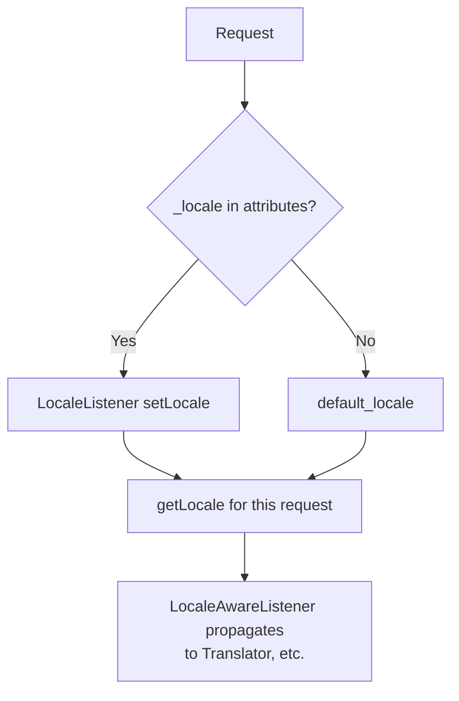

# Language Detection

!!! tip "In a nutshell"
    Détecter la locale, c'est choisir la meilleure langue parmi l'URL (`_locale`),
    une préférence utilisateur, `Accept-Language` ou la valeur par défaut — en se
    limitant aux locales que vous supportez. Piège d'examen : `getPreferredLanguage($whitelist)`
    est l'API sûre (la forme sans argument peut renvoyer une locale non supportée).

!!! example "Real-world analogy"
    Pensez à un réceptionniste d'hôtel accueillant un client international. Il choisit
    une langue dans cet ordre : si le formulaire de réservation en indique une explicitement
    (le `_locale` de l'URL), il l'utilise ; sinon une note dans le profil du client (une
    préférence enregistrée) ; sinon les langues que le client a déclarées parler, dans
    l'ordre indiqué (`Accept-Language`) ; sinon la langue maison de l'hôtel (la valeur par
    défaut). Point crucial : le réceptionniste ne choisit jamais qu'une langue effectivement
    parlée par le personnel de service (la whitelist des locales supportées) — saluer le
    client dans une langue que personne ne maîtrise serait pire que de revenir poliment à
    la langue maison.

!!! abstract "Learning objectives"
    À la fin de ce chapitre, vous saurez :

    - [ ] Lister les sources utilisées par Symfony pour déterminer la locale de la request.
    - [ ] Deviner une locale depuis `Accept-Language` avec une whitelist de locales supportées.
    - [ ] Expliquer comment l'attribut `_locale` et `enabled_locales` interagissent.
    - [ ] Définir la locale de la request et comprendre la propagation `LocaleAware`.

    **Syllabus:** `HTTP → Language detection` ·
    **Level:** Advanced → Expert ·
    **Est. time:** 22 min ·
    **Prerequisites:** [Content Negotiation](content-negotiation.md)

---

## Theory

La **locale** détermine la langue et le formatage régional utilisés par l'application.
Elle peut provenir de plusieurs endroits, dans un ordre de précédence typique :

1. Un paramètre de route **`_locale`** explicite (p. ex. `/fr/articles`).
2. Une **préférence utilisateur** enregistrée (session / profil utilisateur).
3. L'en-tête de request **`Accept-Language`** (préférence du navigateur).
4. La **locale par défaut** de l'application (`framework.default_locale`).

La détection consiste à choisir la meilleure de ces sources, en se restreignant aux
locales que vous supportez réellement.

```php
// 1. explicit route parameter (/fr/articles)
$request->attributes->get('_locale');      // 'fr'
// 3. browser preference
$request->headers->get('Accept-Language'); // 'fr-FR, fr;q=0.8, en;q=0.5'
// 4. fallback configured as framework.default_locale
$request->getDefaultLocale();              // 'en'
```

!!! question "Predict first"
    Le navigateur envoie `Accept-Language: es, en;q=0.8` et votre application ne
    supporte que `en` et `fr`. Que renvoie `getPreferredLanguage(['en', 'fr'])` ?

??? note "Reveal"
    `en` — `es` n'est pas dans votre whitelist, donc l'intersection retombe sur la
    prochaine option acceptable (`en`, poids 0.8). La forme **sans argument** aurait
    renvoyé `es`, une locale que vous ne pouvez pas servir.

## Deep Dive — how it works internally

### The `_locale` attribute

Si une route définit `{_locale}` (ou un `_locale` par défaut), le Router l'écrit dans
`$request->attributes`, et le `LocaleListener` de Symfony
(`Symfony\Component\HttpKernel\EventListener\LocaleListener`) appelle
`$request->setLocale($locale)` pendant `kernel.request`. À partir de là,
`$request->getLocale()` la renvoie, et la valeur est stockée en session pour que les
requests suivantes la conservent. Le comportement complet côté routing est couvert dans
[Locale Guessing](../routing/locale.md).

```php
// what LocaleListener does during kernel.request (simplified):
if ($locale = $request->attributes->get('_locale')) {
    $request->setLocale($locale);
}

$request->getLocale(); // 'fr' for /fr/articles, else the default locale
```



!!! note "Source reference"
    `Symfony\Component\HttpKernel\EventListener\LocaleListener` et
    `LocaleAwareListener`, plus `Request::setLocale()`/`getLocale()` —
    [symfony/symfony `8.0`](https://github.com/symfony/symfony/blob/8.0/src/Symfony/Component/HttpKernel/EventListener/LocaleListener.php).

### Guessing from `Accept-Language`

Quand il n'y a pas de locale explicite, utilisez l'en-tête avec votre **whitelist** :

```php
$locale = $request->getPreferredLanguage(['en', 'fr', 'de']); // best supported
```

`getPreferredLanguage($locales)` fait l'intersection de la liste ordonnée
`Accept-Language` du client avec vos locales supportées et renvoie la meilleure
correspondance (ou la première de votre liste si aucune ne correspond). Sans argument,
elle renvoie la langue préférée du client telle quelle, à laquelle vous ne devez **pas**
faire confiance aveuglément (ce peut être une locale que vous ne supportez pas).

### `enabled_locales`

`framework.enabled_locales` restreint les locales que le framework accepte et
génère (elle limite aussi la compilation des traductions et l'exigence spéciale
`_locale`). Demander une locale hors de cette liste produit un 404 sur les routes
localisées. Définissez votre valeur par défaut avec `framework.default_locale`.

```yaml
# config/packages/framework.yaml
framework:
    default_locale: en             # fallback locale
    enabled_locales: ['en', 'fr']  # '/de/...' on a {_locale} route -> 404
```

### Propagation via `LocaleAware`

Une fois la locale de la request définie, le `LocaleAwareListener` la propage à chaque
service implémentant `Symfony\Contracts\Translation\LocaleAwareInterface` (p. ex. le
`Translator`). Vous pouvez aussi changer de locale programmatiquement pour un bloc de
code avec `Symfony\Component\Translation\LocaleSwitcher` (couvert dans
[Intl](../miscellaneous/intl.md)).

```php
// LocaleAwareListener propagates the request locale to such services:
assert($translator instanceof LocaleAwareInterface);
$translator->setLocale($request->getLocale());

// LocaleSwitcher: run one block in another locale, then restore it
$greeting = $localeSwitcher->runWithLocale('fr', fn () => $translator->trans('hello'));
```

## Configuration & code

=== "PHP Attributes"

    ```php
    <?php
    declare(strict_types=1);

    namespace App\Controller;

    use Symfony\Bundle\FrameworkBundle\Controller\AbstractController;
    use Symfony\Component\HttpFoundation\Request;
    use Symfony\Component\HttpFoundation\Response;
    use Symfony\Component\Routing\Attribute\Route;

    final class LandingController extends AbstractController
    {
        // Explicit locale segment; matched only for enabled locales.
        #[Route('/{_locale}/welcome', name: 'welcome', requirements: ['_locale' => 'en|fr|de'])]
        public function welcome(Request $request): Response
        {
            return new Response('Locale: '.$request->getLocale());
        }

        // No segment: guess from Accept-Language, constrained to what we support.
        #[Route('/', name: 'home')]
        public function home(Request $request): Response
        {
            $locale = $request->getPreferredLanguage(['en', 'fr', 'de']);
            $request->setLocale($locale);

            return $this->redirectToRoute('welcome', ['_locale' => $locale]);
        }
    }
    ```

=== "YAML"

    ```yaml
    # config/packages/framework.yaml
    framework:
        default_locale: en
        enabled_locales: ['en', 'fr', 'de']   # whitelist
        set_locale_from_accept_language: false # optional built-in guessing
    ```

=== "Console"

    ```console
    $ curl -H 'Accept-Language: fr-FR,fr;q=0.9,en;q=0.5' https://localhost/
    # → redirects to /fr/welcome
    ```

!!! info "Built-in guessing"
    `framework.set_locale_from_accept_language: true` fait deviner automatiquement à
    Symfony la locale de la request depuis `Accept-Language` (dans les limites de
    `enabled_locales`) quand aucun `_locale` n'est présent — aucun listener personnalisé
    n'est nécessaire.

## Best practices & anti-patterns

| ✅ Do | ❌ Avoid |
|---|---|
| Deviner avec une whitelist de locales supportées | Faire confiance au `Accept-Language` brut |
| Mettre `_locale` dans l'URL pour des pages partageables et cacheables | La locale seulement en session |
| Rediriger `/` vers une URL localisée | Servir plusieurs locales à une même URL sans `Vary` |
| Définir `enabled_locales` + `default_locale` | Laisser la locale sans limite |

## When (not) to use it / alternatives

La détection basée sur l'en-tête est idéale pour la première visite ; persistez ensuite
le choix (URL ou profil utilisateur) pour que les liens soient partageables et
cacheables. Pour la traduction du contenu elle-même, voyez [Intl](../miscellaneous/intl.md) ;
pour la mécanique de routing, [Locale Guessing](../routing/locale.md).

!!! danger "Certification traps"
    - **`getPreferredLanguage($whitelist)` est l'API sûre** — elle renvoie une locale
      que vous supportez ; la forme sans argument renvoie le premier choix du client
      sans filtre.
    - L'attribut de request **`_locale`** pilote `Request::setLocale()` via le
      `LocaleListener` ; définir `$request->getLocale()` met aussi à jour la session.
    - `enabled_locales` borne les locales valides ; en demander une en dehors → 404.
    - La détection de locale est au **niveau HTTP** (`Accept-Language`), la traduction
      est une préoccupation séparée (Translator/Intl).

!!! warning "Common mistakes"
    - Appeler `getPreferredLanguage()` sans whitelist et obtenir une locale non
      supportée (p. ex. `pt-BR`).
    - Oublier `Vary: Accept-Language` quand plusieurs langues sont servies à une même
      URL.

## Exercises

1. **(Advanced)** Le navigateur envoie `Accept-Language: es, en;q=0.8`. Votre
   application supporte `en` et `fr`. Que renvoie `getPreferredLanguage(['en','fr'])` ?
2. **(Expert)** Activez la détection automatique via `Accept-Language` restreinte à
   `en`, `fr` sans écrire de listener.

??? success "Solutions"

    **1.** `en` — `es` n'est pas supporté, donc la meilleure option acceptable suivante
    dans votre whitelist (`en`, poids 0.8) l'emporte.

    **2.** Dans `framework.yaml` :
    ```yaml
    framework:
        enabled_locales: ['en', 'fr']
        set_locale_from_accept_language: true
    ```
    Symfony définit la locale de la request depuis `Accept-Language` dans les limites
    de la whitelist.

## Certification questions

??? question "Q1. Which is the safe way to pick a locale from the browser?"
    - [ ] A. `getLocale()`
    - [x] B. `getPreferredLanguage(['en','fr'])` with a whitelist ✅
    - [ ] C. `getLanguages()[0]`
    - [ ] D. reading `$_SERVER['HTTP_ACCEPT_LANGUAGE']`

    **Why:** La forme avec whitelist garantit une locale supportée ; les autres peuvent
    en renvoyer une que vous ne supportez pas.
    **Ref:** [HttpFoundation](https://symfony.com/doc/current/components/http_foundation.html).

??? question "Q2. What sets the request locale when a route has `{_locale}`?"
    - [x] A. `LocaleListener` on `kernel.request` calls `setLocale()` ✅
    - [ ] B. The Router directly
    - [ ] C. Twig
    - [ ] D. The Translator

    **Why:** Le `LocaleListener` lit l'attribut `_locale` et appelle
    `Request::setLocale()`.
    **Ref:** [Symfony source](https://github.com/symfony/symfony/blob/8.0/src/Symfony/Component/HttpKernel/EventListener/LocaleListener.php).

??? question "Q3. What does `framework.enabled_locales` do?"
    - [x] A. Whitelists the locales the app accepts/generates ✅
    - [ ] B. Sets the default locale
    - [ ] C. Enables the Translator
    - [ ] D. Turns on content negotiation

    **Why:** Elle restreint les locales valides (`_locale` du routing, compilation des
    traductions) ; `default_locale` définit la valeur de repli.
    **Ref:** [Translations config](https://symfony.com/doc/current/translation.html).

## Key takeaways

- Sources : paramètre de route `_locale` → préférence utilisateur → `Accept-Language` → défaut.
- Devinez en sécurité avec `getPreferredLanguage($whitelist)`.
- Le `LocaleListener` définit la locale de la request ; le `LocaleAwareListener` la propage.
- Bornez les locales avec `enabled_locales` ; définissez `default_locale`.

## Last-minute revision

!!! tip "Cheat sheet"
    - Attribut `_locale` → `setLocale()` via le `LocaleListener`.
    - `getPreferredLanguage($list)` = sûr ; sans argument = premier choix du client.
    - `framework.default_locale`, `enabled_locales`,
      `set_locale_from_accept_language`.
    - Plusieurs langues à une même URL ⇒ `Vary: Accept-Language`.

## Connections

- **Depends on:** [Content Negotiation](content-negotiation.md) — la détection de locale réutilise la même mécanique `Accept-Language`/valeurs `q`.
- **Reused in:** [Locale Guessing](../routing/locale.md) — le paramètre de route `_locale` et `enabled_locales` dans le routing.
- **Confused with:** [Internationalization (Intl)](../miscellaneous/intl.md) — *détecter* la locale (HTTP) vs *traduire* le contenu.

## Official References
- [Symfony docs — Translations & locale](https://symfony.com/doc/current/translation.html#the-locale-used-in-translations)
- [Symfony docs — HttpFoundation](https://symfony.com/doc/current/components/http_foundation.html)
- [Symfony source — LocaleListener](https://github.com/symfony/symfony/blob/8.0/src/Symfony/Component/HttpKernel/EventListener/LocaleListener.php)

## Video references

!!! tip "Watch & learn"
    Ce sont des chaînes vidéo officielles, mises à jour en continu — cherchez-y
    "HTTP foundation" pour consolider ce chapitre. Nous lions des chaînes stables plutôt
    que des vidéos individuelles pour que les références ne se périment jamais.

    - [SymfonyCasts screencasts](https://symfonycasts.com/tracks/symfony) — tutoriels scénarisés à suivre en codant.
    - [Symfony official YouTube](https://www.youtube.com/@SymfonyOfficial) — conférences et keynotes SymfonyCon.
    - [Official docs for this topic](https://symfony.com/doc/current/components/http_foundation.html) — certaines pages de la doc Symfony intègrent un screencast.

## Confidence check

Je suis prêt quand je peux :

- [ ] expliquer **pourquoi** la détection de locale est bornée aux locales que vous supportez
- [ ] deviner une locale depuis `Accept-Language` avec `getPreferredLanguage($whitelist)`
- [ ] déboguer une locale non supportée qui s'infiltre (`getPreferredLanguage()` sans argument)
- [ ] repérer le piège : la forme avec whitelist est sûre ; `enabled_locales` borne les locales valides
- [ ] expliquer comment `LocaleListener`/`LocaleAwareListener` définissent et propagent la locale

---

<small>Related: [Content Negotiation](content-negotiation.md) · [Locale Guessing](../routing/locale.md) ·
[Internationalization (Intl)](../miscellaneous/intl.md) · [HTTP Request](request.md)</small>
