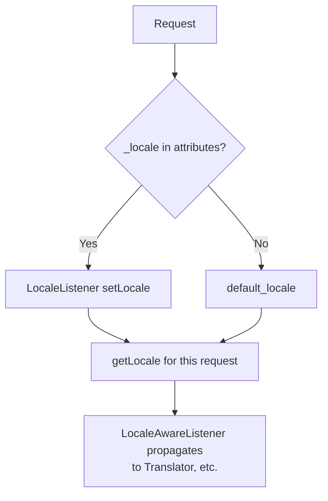

# Language Detection

!!! abstract "Learning objectives"
    By the end of this chapter you can:

    - [ ] List the sources Symfony uses to determine the request locale.
    - [ ] Guess a locale from `Accept-Language` with a supported-locale whitelist.
    - [ ] Explain how the `_locale` attribute and `enabled_locales` interact.
    - [ ] Set the request locale and understand the `LocaleAware` propagation.

    **Syllabus:** `HTTP → Language detection` ·
    **Level:** Advanced → Expert ·
    **Est. time:** 22 min ·
    **Prerequisites:** [Content Negotiation](content-negotiation.md)

---

## Theory

The **locale** decides which language and regional formatting the app uses. It can
come from several places, in rough order of precedence in a typical app:

1. An explicit **`_locale`** route parameter (e.g. `/fr/articles`).
2. A stored **user preference** (session / user profile).
3. The **`Accept-Language`** request header (browser preference).
4. The application **default locale** (`framework.default_locale`).

Detection is choosing the best of these, constrained to the locales you actually
support.

## Deep Dive — how it works internally

### The `_locale` attribute

If a route defines `{_locale}` (or a default `_locale`), the Router writes it into
`$request->attributes`, and Symfony's `LocaleListener`
(`Symfony\Component\HttpKernel\EventListener\LocaleListener`) calls
`$request->setLocale($locale)` during `kernel.request`. From then on
`$request->getLocale()` returns it, and the value is stored on the session so
subsequent requests keep it. Full routing behaviour is covered in
[Locale Guessing](../routing/locale.md).



!!! note "Source reference"
    `Symfony\Component\HttpKernel\EventListener\LocaleListener` and
    `LocaleAwareListener`, plus `Request::setLocale()`/`getLocale()` —
    [symfony/symfony `8.0`](https://github.com/symfony/symfony/blob/8.0/src/Symfony/Component/HttpKernel/EventListener/LocaleListener.php).

### Guessing from `Accept-Language`

When there is no explicit locale, use the header with your **whitelist**:

```php
$locale = $request->getPreferredLanguage(['en', 'fr', 'de']); // best supported
```

`getPreferredLanguage($locales)` intersects the client's ordered
`Accept-Language` list with your supported locales and returns the best match (or
the first of your list if none match). Without the argument it returns the
client's single top language, which you should **not** trust blindly (it may be a
locale you do not support).

### `enabled_locales`

`framework.enabled_locales` restricts which locales the framework will accept and
generate (it also limits translation compilation and the special `_locale`
requirement). Requesting a locale outside this list results in a 404 for locale
routes. Set your default with `framework.default_locale`.

### Propagation via `LocaleAware`

Once the request locale is set, `LocaleAwareListener` pushes it into every service
implementing `Symfony\Contracts\Translation\LocaleAwareInterface` (e.g. the
`Translator`). You can also switch locale programmatically for a block of code
with `Symfony\Component\Translation\LocaleSwitcher` (covered under
[Intl](../miscellaneous/intl.md)).

## Configuration & code

=== "PHP Attributes"

    ```php
    <?php
    declare(strict_types=1);

    namespace App\Controller;

    use Symfony\Bundle\FrameworkBundle\Controller\AbstractController;
    use Symfony\Component\HttpFoundation\Request;
    use Symfony\Component\HttpFoundation\Response;
    use Symfony\Component\Routing\Attribute\Route;

    final class LandingController extends AbstractController
    {
        // Explicit locale segment; matched only for enabled locales.
        #[Route('/{_locale}/welcome', name: 'welcome', requirements: ['_locale' => 'en|fr|de'])]
        public function welcome(Request $request): Response
        {
            return new Response('Locale: '.$request->getLocale());
        }

        // No segment: guess from Accept-Language, constrained to what we support.
        #[Route('/', name: 'home')]
        public function home(Request $request): Response
        {
            $locale = $request->getPreferredLanguage(['en', 'fr', 'de']);
            $request->setLocale($locale);

            return $this->redirectToRoute('welcome', ['_locale' => $locale]);
        }
    }
    ```

=== "YAML"

    ```yaml
    # config/packages/framework.yaml
    framework:
        default_locale: en
        enabled_locales: ['en', 'fr', 'de']   # whitelist
        set_locale_from_accept_language: false # optional built-in guessing
    ```

=== "Console"

    ```console
    $ curl -H 'Accept-Language: fr-FR,fr;q=0.9,en;q=0.5' https://localhost/
    # → redirects to /fr/welcome
    ```

!!! info "Built-in guessing"
    `framework.set_locale_from_accept_language: true` makes Symfony guess the
    request locale from `Accept-Language` automatically (within `enabled_locales`)
    when no `_locale` is present — no custom listener needed.

## Best practices & anti-patterns

| ✅ Do | ❌ Avoid |
|---|---|
| Guess with a supported-locale whitelist | Trusting raw `Accept-Language` |
| Put `_locale` in the URL for shareable, cacheable pages | Locale only in session |
| Redirect `/` to a localized URL | Serving many locales at one URL without `Vary` |
| Set `enabled_locales` + `default_locale` | Leaving locale unbounded |

## When (not) to use it / alternatives

Header-based detection is great for the first visit; persist the choice (URL or
user profile) afterward so links are shareable and cacheable. For content
translation itself, see [Intl](../miscellaneous/intl.md); for routing mechanics,
[Locale Guessing](../routing/locale.md).

!!! danger "Certification traps"
    - **`getPreferredLanguage($whitelist)` is the safe API** — it returns a locale
      you support; the no-argument form returns the client's top choice unfiltered.
    - The **`_locale`** request attribute drives `Request::setLocale()` via
      `LocaleListener`; setting `$request->getLocale()` also updates the session.
    - `enabled_locales` bounds valid locales; requesting one outside → 404.
    - Locale detection is **HTTP-level** (`Accept-Language`), translation is a
      separate concern (Translator/Intl).

!!! warning "Common mistakes"
    - Calling `getPreferredLanguage()` with no whitelist and getting an
      unsupported locale (e.g. `pt-BR`).
    - Forgetting `Vary: Accept-Language` when serving different languages at one
      URL.

## Exercises

1. **(Advanced)** The browser sends `Accept-Language: es, en;q=0.8`. Your app
   supports `en` and `fr`. What does `getPreferredLanguage(['en','fr'])` return?
2. **(Expert)** Enable automatic `Accept-Language` detection restricted to
   `en`, `fr` without writing a listener.

??? success "Solutions"

    **1.** `en` — `es` is not supported, so the next-best acceptable option in
    your whitelist (`en`, weight 0.8) wins.

    **2.** In `framework.yaml`:
    ```yaml
    framework:
        enabled_locales: ['en', 'fr']
        set_locale_from_accept_language: true
    ```
    Symfony sets the request locale from `Accept-Language` within the whitelist.

## Certification questions

??? question "Q1. Which is the safe way to pick a locale from the browser?"
    - [ ] A. `getLocale()`
    - [x] B. `getPreferredLanguage(['en','fr'])` with a whitelist ✅
    - [ ] C. `getLanguages()[0]`
    - [ ] D. reading `$_SERVER['HTTP_ACCEPT_LANGUAGE']`

    **Why:** The whitelist form guarantees a supported locale; the others may
    return one you do not support.
    **Ref:** [HttpFoundation](https://symfony.com/doc/current/components/http_foundation.html).

??? question "Q2. What sets the request locale when a route has `{_locale}`?"
    - [x] A. `LocaleListener` on `kernel.request` calls `setLocale()` ✅
    - [ ] B. The Router directly
    - [ ] C. Twig
    - [ ] D. The Translator

    **Why:** `LocaleListener` reads the `_locale` attribute and calls
    `Request::setLocale()`.
    **Ref:** [Symfony source](https://github.com/symfony/symfony/blob/8.0/src/Symfony/Component/HttpKernel/EventListener/LocaleListener.php).

??? question "Q3. What does `framework.enabled_locales` do?"
    - [x] A. Whitelists the locales the app accepts/generates ✅
    - [ ] B. Sets the default locale
    - [ ] C. Enables the Translator
    - [ ] D. Turns on content negotiation

    **Why:** It restricts valid locales (routing `_locale`, translation
    compilation); `default_locale` sets the fallback.
    **Ref:** [Translations config](https://symfony.com/doc/current/translation.html).

## Key takeaways

- Sources: `_locale` route param → user pref → `Accept-Language` → default.
- Guess safely with `getPreferredLanguage($whitelist)`.
- `LocaleListener` sets the request locale; `LocaleAwareListener` propagates it.
- Bound locales with `enabled_locales`; set `default_locale`.

## Last-minute revision

!!! tip "Cheat sheet"
    - `_locale` attribute → `setLocale()` via `LocaleListener`.
    - `getPreferredLanguage($list)` = safe; no-arg = client top choice.
    - `framework.default_locale`, `enabled_locales`,
      `set_locale_from_accept_language`.
    - Different languages at one URL ⇒ `Vary: Accept-Language`.

## Official References
- [Symfony docs — Translations & locale](https://symfony.com/doc/current/translation.html#the-locale-used-in-translations)
- [Symfony docs — HttpFoundation](https://symfony.com/doc/current/components/http_foundation.html)
- [Symfony source — LocaleListener](https://github.com/symfony/symfony/blob/8.0/src/Symfony/Component/HttpKernel/EventListener/LocaleListener.php)

---

<small>Related: [Content Negotiation](content-negotiation.md) · [Locale Guessing](../routing/locale.md) ·
[Internationalization (Intl)](../miscellaneous/intl.md) · [HTTP Request](request.md)</small>
