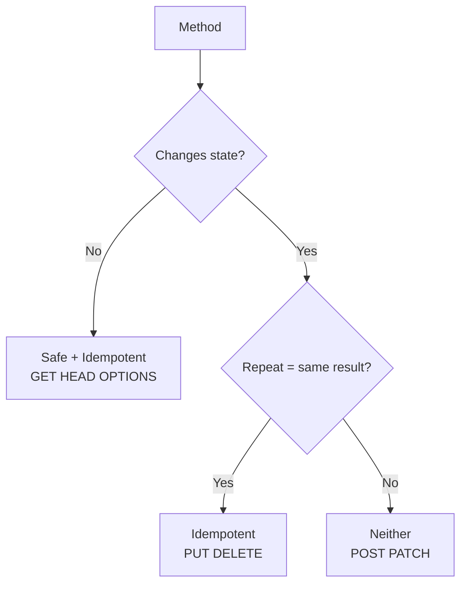
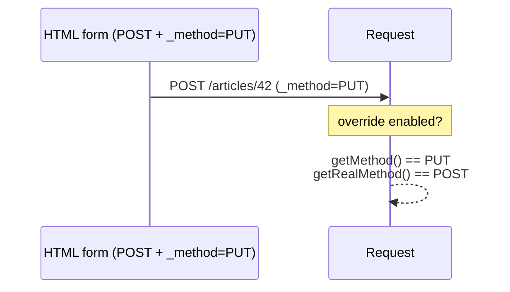

# HTTP Methods

!!! tip "In a nutshell"
    La méthode (verbe) exprime l'intention du client et porte des propriétés
    safe / idempotent / cacheable. Piège d'examen : PUT et DELETE sont
    idempotentes mais pas safe, POST et PATCH ne sont ni l'un ni l'autre, et
    l'override `_method` est **désactivé par défaut**.

!!! example "Real-world analogy"
    La méthode est le **type de service postal** que vous choisissez pour une
    lettre. `GET` revient à demander une copie d'un document — safe, cela ne
    change rien. `PUT`/`DELETE` sont des instructions en recommandé qui laissent
    le même état final quel que soit le nombre de doublons qui arrivent
    (idempotentes). `POST` consiste à déposer un *nouveau* bon de commande à
    chaque fois — envoyez-le deux fois et vous obtenez deux commandes. L'override
    `_method` revient à griffonner « à traiter comme DELETE » sur une enveloppe
    ordinaire, honoré seulement si le bureau a donné son accord.

!!! abstract "Learning objectives"
    À la fin de ce chapitre, vous saurez :

    - [ ] Nommer chaque méthode HTTP et son usage prévu.
    - [ ] Classer les méthodes comme safe, idempotentes et/ou cacheables.
    - [ ] Expliquer l'override de méthode (`_method`) et quand Symfony l'honore.
    - [ ] Restreindre les méthodes sur les routes et lire la méthode effective.

    **Syllabus:** `HTTP → HTTP methods` ·
    **Level:** Advanced ·
    **Est. time:** 25 min ·
    **Prerequisites:** [HTTP Request](request.md)

---

## Theory

La **méthode** (verbe) exprime l'intention du client. Les méthodes principales :

| Méthode | Intention | Body ? |
|---|---|---|
| `GET` | Récupérer une ressource | Non |
| `HEAD` | Comme GET mais headers uniquement | Non |
| `POST` | Créer / traiter ; non idempotente | Oui |
| `PUT` | Remplacer une ressource en entier | Oui |
| `PATCH` | Modifier partiellement une ressource | Oui |
| `DELETE` | Supprimer une ressource | Optionnel |
| `OPTIONS` | Découvrir les méthodes autorisées (preflight CORS) | Non |
| `TRACE` | Diagnostic en boucle | Non |
| `CONNECT` | Établir un tunnel (proxies) | Non |

!!! question "Predict first"
    Un formulaire fait un POST avec un champ caché `_method=DELETE`, mais vous
    n'avez touché à aucune config. Que retourne `$request->getMethod()` ?

??? note "Reveal"
    `POST`. `http_method_override` vaut **`false`** par défaut, donc `_method`
    est ignoré. Activez `framework.http_method_override: true` ; alors
    `getMethod()` retourne `DELETE` tandis que `getRealMethod()` retourne
    toujours `POST`.

## Deep Dive — how it works internally

### Safe, idempotent, cacheable

Trois propriétés orthogonales que l'examen adore :

| Propriété | Signification | Méthodes |
|---|---|---|
| **Safe** | Aucun changement d'état côté serveur (lecture seule) | GET, HEAD, OPTIONS, TRACE |
| **Idempotent** | Même effet si répétée N fois | GET, HEAD, OPTIONS, TRACE, **PUT, DELETE** |
| **Cacheable** | La response peut être stockée | GET, HEAD (POST uniquement avec fraîcheur explicite) |

- **Toutes les méthodes safe sont idempotentes**, mais pas l'inverse : `PUT` et
  `DELETE` sont idempotentes mais pas safe (elles changent l'état, mais la
  répétition donne le même état final).
- **`POST` et `PATCH` ne sont ni safe ni idempotentes** (répéter un POST crée
  des doublons ; PATCH peut appliquer un delta deux fois). C'est pourquoi on
  redirige en 303 après un POST (voir [Status Codes](status-codes.md)).



### Symfony helpers

`Symfony\Component\HttpFoundation\Request` expose :

- `getMethod()` — la méthode **effective** (en majuscules, tenant compte de
  l'override).
- `getRealMethod()` — la méthode brute de transport.
- `isMethod(string $method)` — comparaison insensible à la casse
  (`$request->isMethod('POST')`).
- `isMethodSafe()`, `isMethodIdempotent()`, `isMethodCacheable()` — encodent
  directement la classification de la RFC 9110.

```php
// For an incoming "POST /articles" request:
$request->getMethod();          // 'POST' — effective method (override-aware)
$request->getRealMethod();      // 'POST' — raw transport method
$request->isMethod('post');     // true  — case-insensitive comparison
$request->isMethodSafe();       // false — POST changes server state
$request->isMethodIdempotent(); // false — repeating a POST creates duplicates
$request->isMethodCacheable();  // false — only GET and HEAD are cacheable
```

!!! note "Source reference"
    `Request::isMethodSafe()`, `isMethodIdempotent()`, `isMethodCacheable()`,
    `getMethod()` et la logique d'override —
    [symfony/symfony `8.0`](https://github.com/symfony/symfony/blob/8.0/src/Symfony/Component/HttpFoundation/Request.php).

### Method override (`_method`)

Les formulaires HTML ne peuvent envoyer que `GET` ou `POST`. Pour émuler
`PUT`/`PATCH`/`DELETE` depuis un formulaire, Symfony prend en charge un
**override de méthode** : un champ `_method` (ou le header
`X-HTTP-Method-Override`) réécrit la méthode — **mais uniquement quand c'est
explicitement activé**.



- Activé globalement via `framework.http_method_override: true`, ou dans le code
  via la méthode statique `Request::enableHttpMethodParameterOverride()`.
- **La valeur par défaut est `false`** dans les versions modernes de Symfony —
  ne supposez pas que `_method` fonctionne d'emblée.
- L'override ne s'applique qu'à une request **`POST`** ; les autres méthodes ne
  sont jamais réécrites. Seules les valeurs `PUT`, `PATCH`, `DELETE` sont
  acceptées.
- Après l'override, `getMethod()` retourne le verbe substitué tandis que
  `getRealMethod()` retourne toujours `POST`.

```php
// Enable in code (equivalent to framework.http_method_override: true)
Request::enableHttpMethodParameterOverride();

// Incoming: POST /articles/42 with body "_method=DELETE"
// (the X-HTTP-Method-Override header works the same way)
$request->getMethod();     // 'DELETE' — overridden verb
$request->getRealMethod(); // 'POST'   — raw transport method
```

## Configuration & code

=== "PHP Attributes"

    ```php
    <?php
    declare(strict_types=1);

    namespace App\Controller;

    use Symfony\Bundle\FrameworkBundle\Controller\AbstractController;
    use Symfony\Component\HttpFoundation\Request;
    use Symfony\Component\HttpFoundation\Response;
    use Symfony\Component\Routing\Attribute\Route;

    final class ArticleController extends AbstractController
    {
        #[Route('/articles/{id}', methods: ['PUT', 'PATCH'])]
        public function update(Request $request, int $id): Response
        {
            $effective = $request->getMethod();       // PUT or PATCH
            $transport = $request->getRealMethod();   // could be POST (override)

            return $this->json([
                'id'        => $id,
                'method'    => $effective,
                'transport' => $transport,
                'safe'      => $request->isMethodSafe(),      // false
                'idempotent'=> $request->isMethodIdempotent(),// true
            ]);
        }
    }
    ```

=== "YAML"

    ```yaml
    # config/packages/framework.yaml
    framework:
        http_method_override: true   # honour _method on POST forms (default: false)
    ```

=== "Console"

    ```console
    $ curl -X POST https://localhost/articles/42 -d '_method=PUT'
    {"id":42,"method":"PUT","transport":"POST","safe":false,"idempotent":true}
    ```

## Best practices & anti-patterns

| ✅ Do | ❌ Avoid |
|---|---|
| Utiliser PUT/PATCH/DELETE selon leur sémantique | Les APIs tout-en-POST |
| Rediriger en 303 après un POST | Les requests GET qui modifient l'état |
| Restreindre les routes avec `methods:` | Une route acceptant tous les verbes |
| Activer l'override seulement si les formulaires en ont besoin | Supposer que `_method` est actif par défaut |

## When (not) to use it / alternatives

Les APIs REST mappent le CRUD sur POST/GET/PUT-PATCH/DELETE. Les navigateurs ne
parlent que GET/POST pour la navigation et les formulaires, donc l'override de
méthode comble l'écart pour les applications rendues côté serveur — les clients
JS (fetch) peuvent envoyer n'importe quel verbe directement et n'en ont pas
besoin.

!!! danger "Certification traps"
    - **Safe ⊂ idempotent.** GET/HEAD/OPTIONS sont les deux ; **PUT et DELETE
      sont idempotentes mais pas safe** ; **POST et PATCH ne sont ni l'un ni
      l'autre**.
    - **`http_method_override` vaut `false` par défaut** — `_method` est ignoré
      tant qu'il n'est pas activé. L'override ne se déclenche que sur une request
      **POST**.
    - `getMethod()` = effective (tenant compte de l'override) ;
      `getRealMethod()` = brute.
    - `GET` et `HEAD` sont les méthodes cacheables par défaut.
    - `OPTIONS` alimente le **preflight CORS** ; répondez avec un header `Allow`.

!!! warning "Common mistakes"
    - Croire que PATCH est idempotente — elle ne l'est généralement **pas**.
    - Utiliser des liens GET pour supprimer/modifier des données (les crawlers
      les déclencheront).
    - S'attendre à ce que `_method` fonctionne sans
      `http_method_override: true`.

## Exercises

1. **(Advanced)** Classez PUT et POST sur les axes safe/idempotent et justifiez.
2. **(Expert)** Une application rendue côté serveur a besoin d'un bouton
   « supprimer » dans un formulaire. Détaillez les deux éléments requis pour que
   Symfony le traite comme un `DELETE`.

??? success "Solutions"

    **1.** **PUT** : pas safe (elle change l'état) mais idempotente (remplacer
    une ressource deux fois avec le même body donne le même état). **POST** : ni
    l'un ni l'autre — elle peut créer une nouvelle ressource à chaque envoi.

    **2.** (1) Activer `framework.http_method_override: true`. (2) Le formulaire
    doit faire un `POST` et inclure un champ caché `_method` valant `DELETE`
    (Twig : `{{ form_start(form, {method: 'DELETE'}) }}` le rend
    automatiquement). Alors `$request->getMethod()` retourne `DELETE`.

## Certification questions

??? question "Q1. Which set contains only idempotent methods?"
    - [ ] A. GET, POST, PUT
    - [x] B. GET, PUT, DELETE ✅
    - [ ] C. POST, PATCH, DELETE
    - [ ] D. POST, PUT, PATCH

    **Why:** GET, PUT et DELETE sont idempotentes ; POST et PATCH ne le sont pas.
    **Ref:** [MDN — idempotent](https://developer.mozilla.org/en-US/docs/Glossary/Idempotent).

??? question "Q2. By default in Symfony 8, is `_method` honoured?"
    - [ ] A. Yes, always
    - [x] B. No — `http_method_override` defaults to false ✅
    - [ ] C. Only for GET requests
    - [ ] D. Only for JSON requests

    **Why:** Vous devez activer `framework.http_method_override` (ou appeler
    `Request::enableHttpMethodParameterOverride()`) ; cela ne s'applique qu'au
    POST.
    **Ref:** [Method override](https://symfony.com/doc/current/routing.html).

??? question "Q3. Which method is safe AND idempotent?"
    - [ ] A. POST
    - [ ] B. PUT
    - [x] C. GET ✅
    - [ ] D. PATCH

    **Why:** GET lit sans effet de bord (safe) et se répète à l'identique
    (idempotente).
    **Ref:** [MDN — safe](https://developer.mozilla.org/en-US/docs/Glossary/Safe/HTTP).

## Key takeaways

- Safe : GET/HEAD/OPTIONS/TRACE. Idempotent ajoute PUT/DELETE. POST & PATCH : ni
  l'un ni l'autre.
- Cacheables par défaut : GET, HEAD.
- L'override `_method` ne concerne que POST et est **désactivé par défaut**.
- `getMethod()` = effective ; `getRealMethod()` = brute ; helpers
  `isMethodSafe()` etc.

## Last-minute revision

!!! tip "Cheat sheet"
    - Idempotent = répéter → même état : GET HEAD OPTIONS PUT DELETE.
    - Non idempotentes : **POST, PATCH**. Non safe : tout ce qui écrit.
    - Override : `framework.http_method_override: true`, POST uniquement,
      valeurs PUT/PATCH/DELETE.
    - Restriction de route : `#[Route('/x', methods: ['POST'])]`.

## Connections

- **Depends on:** [HTTP Request](request.md) — `getMethod()`/`isMethodSafe()` et la logique d'override vivent sur `Request`.
- **Reused in:** [HTTP Methods Matching](../routing/methods.md) — les routes restreignent les verbes avec `methods: [...]`.
- **Confused with:** [Status Codes](status-codes.md) — le 303-après-POST existe parce que POST n'est pas idempotente.

## Official References
- [MDN — HTTP request methods](https://developer.mozilla.org/en-US/docs/Web/HTTP/Methods)
- [Symfony docs — Routing (method matching)](https://symfony.com/doc/current/routing.html)
- [Symfony source — Request](https://github.com/symfony/symfony/blob/8.0/src/Symfony/Component/HttpFoundation/Request.php)

## Video references

!!! tip "Watch & learn"
    Voici des chaînes vidéo officielles, mises à jour en continu — cherchez-y
    "HTTP foundation" pour consolider ce chapitre. Nous lions des chaînes stables
    plutôt que des vidéos individuelles afin que les références ne périment
    jamais.

    - [SymfonyCasts screencasts](https://symfonycasts.com/tracks/symfony) — tutoriels scénarisés à suivre en codant.
    - [Symfony official YouTube](https://www.youtube.com/@SymfonyOfficial) — conférences et keynotes SymfonyCon.
    - [Official docs for this topic](https://symfony.com/doc/current/routing.html) — certaines pages de la doc Symfony intègrent un screencast.

## Confidence check

Je suis prêt quand je peux :

- [ ] expliquer **pourquoi** safe/idempotent/cacheable comptent et comment ces propriétés se relient
- [ ] classer GET/HEAD/PUT/DELETE/POST/PATCH sur chaque axe sans hésitation
- [ ] déboguer un formulaire « bouton supprimer » que Symfony traite comme un simple POST
- [ ] repérer le piège : `_method` ne concerne que POST et est **désactivé par défaut**
- [ ] expliquer la différence entre `getMethod()` et `getRealMethod()` après un override

---

<small>Related: [HTTP Request](request.md) · [Status Codes](status-codes.md) ·
[HTTP Methods Matching](../routing/methods.md) · [Content Negotiation](content-negotiation.md)</small>
