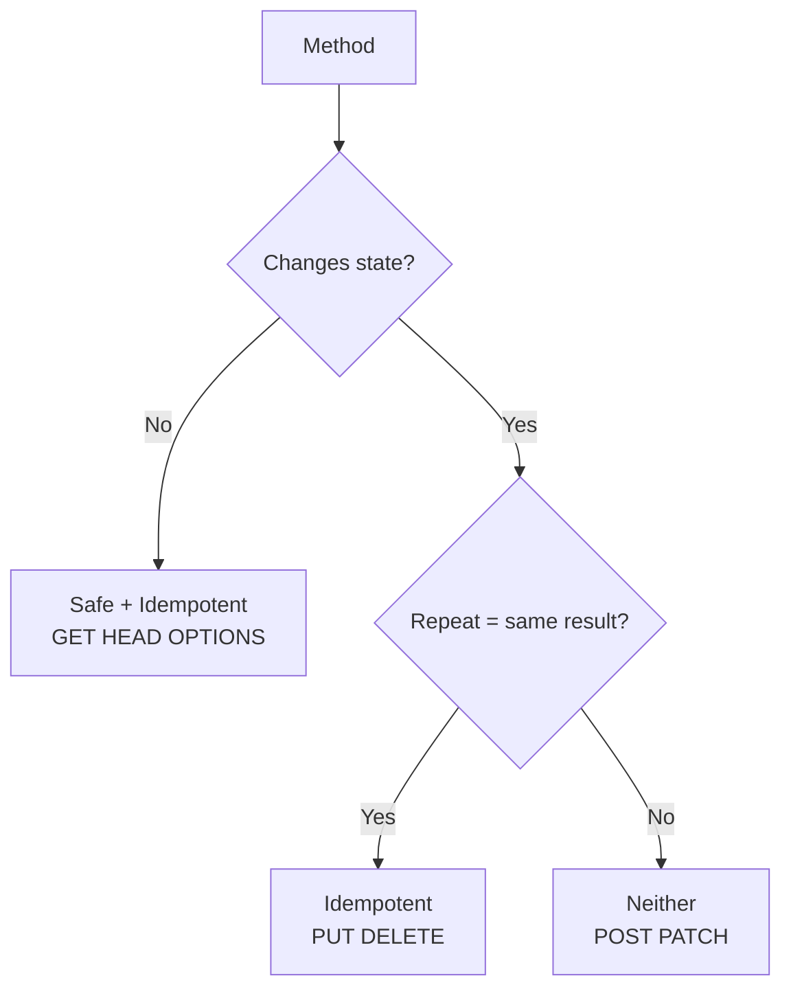
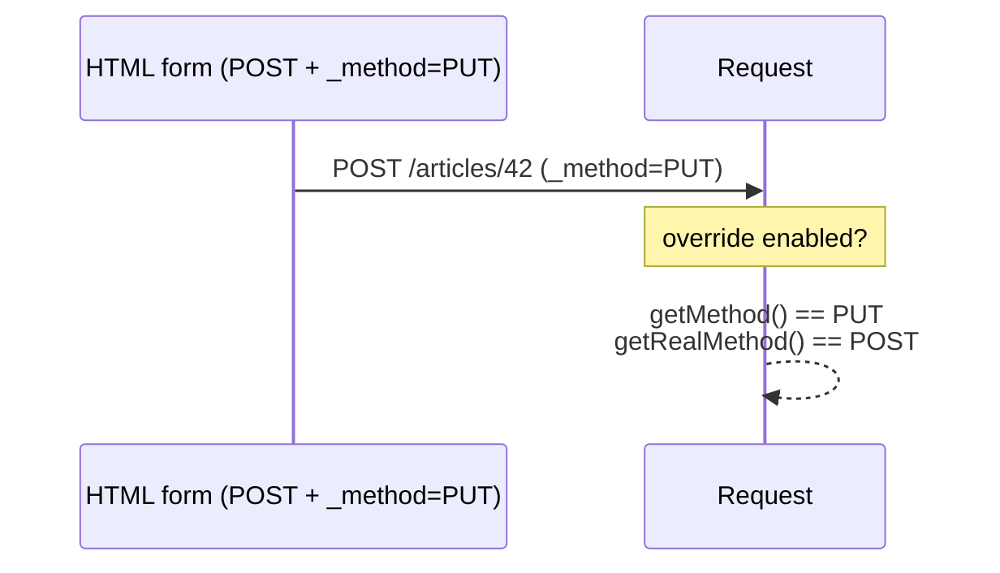

# HTTP Methods

!!! tip "In a nutshell"
    The method (verb) states the client's intent and carries safe / idempotent /
    cacheable properties. Exam hook: PUT and DELETE are idempotent but not safe,
    POST and PATCH are neither, and `_method` override is **off by default**.

!!! example "Real-world analogy"
    The method is the **type of postal service** you pick for a letter. `GET` is
    asking for a copy of a document — safe, it changes nothing. `PUT`/`DELETE` are
    registered instructions that leave the same end state no matter how many
    duplicates arrive (idempotent). `POST` is dropping a *new* order form each
    time — send it twice and you get two orders. `_method` override is scribbling
    "treat as DELETE" on a plain envelope, honoured only if the office opted in.

!!! abstract "Learning objectives"
    By the end of this chapter you can:

    - [ ] Name every HTTP method and its intended use.
    - [ ] Classify methods as safe, idempotent and/or cacheable.
    - [ ] Explain method override (`_method`) and when Symfony honours it.
    - [ ] Match methods on routes and read the effective method.

    **Syllabus:** `HTTP → HTTP methods` ·
    **Level:** Advanced ·
    **Est. time:** 25 min ·
    **Prerequisites:** [HTTP Request](request.md)

---

## Theory

The **method** (verb) states the client's intent. The core methods:

| Method | Intent | Body? |
|---|---|---|
| `GET` | Retrieve a resource | No |
| `HEAD` | Like GET but headers only | No |
| `POST` | Create / process; non-idempotent | Yes |
| `PUT` | Replace a resource wholesale | Yes |
| `PATCH` | Partially modify a resource | Yes |
| `DELETE` | Remove a resource | Optional |
| `OPTIONS` | Discover allowed methods (CORS preflight) | No |
| `TRACE` | Loop-back diagnostic | No |
| `CONNECT` | Establish a tunnel (proxies) | No |

!!! question "Predict first"
    A form POSTs with a hidden `_method=DELETE` field, but you haven't touched any
    config. What does `$request->getMethod()` return?

??? note "Reveal"
    `POST`. `http_method_override` defaults to **`false`**, so `_method` is ignored.
    Enable `framework.http_method_override: true`; then `getMethod()` returns
    `DELETE` while `getRealMethod()` still returns `POST`.

## Deep Dive — how it works internally

### Safe, idempotent, cacheable

Three orthogonal properties the exam loves:

| Property | Meaning | Methods |
|---|---|---|
| **Safe** | No server state change (read-only) | GET, HEAD, OPTIONS, TRACE |
| **Idempotent** | Same effect if repeated N times | GET, HEAD, OPTIONS, TRACE, **PUT, DELETE** |
| **Cacheable** | Response may be stored | GET, HEAD (POST only with explicit freshness) |

- **All safe methods are idempotent**, but not vice-versa: `PUT` and `DELETE` are
  idempotent yet not safe (they change state, but repeating gives the same end
  state).
- **`POST` and `PATCH` are neither safe nor idempotent** (repeating a POST creates
  duplicates; PATCH may apply a delta twice). This is why you 303-redirect after a
  POST (see [Status Codes](status-codes.md)).



### Symfony helpers

`Symfony\Component\HttpFoundation\Request` exposes:

- `getMethod()` — the **effective** method (uppercased, override-aware).
- `getRealMethod()` — the raw transport method.
- `isMethod(string $method)` — case-insensitive comparison
  (`$request->isMethod('POST')`).
- `isMethodSafe()`, `isMethodIdempotent()`, `isMethodCacheable()` — encode the
  RFC 9110 classification directly.

!!! note "Source reference"
    `Request::isMethodSafe()`, `isMethodIdempotent()`, `isMethodCacheable()`,
    `getMethod()` and the override logic —
    [symfony/symfony `8.0`](https://github.com/symfony/symfony/blob/8.0/src/Symfony/Component/HttpFoundation/Request.php).

### Method override (`_method`)

HTML forms can only send `GET` or `POST`. To emulate `PUT`/`PATCH`/`DELETE` from a
form, Symfony supports a **method override**: a `_method` field (or the
`X-HTTP-Method-Override` header) rewrites the method — **but only when it is
explicitly enabled**.



- Enabled globally via `framework.http_method_override: true`, or in code via the
  static `Request::enableHttpMethodParameterOverride()`.
- **The default is `false`** in modern Symfony — do not assume `_method` works out
  of the box.
- Override only applies to a **`POST`** request; other methods are never
  rewritten. Only `PUT`, `PATCH`, `DELETE` are accepted values.
- After override, `getMethod()` returns the overridden verb while
  `getRealMethod()` still returns `POST`.

## Configuration & code

=== "PHP Attributes"

    ```php
    <?php
    declare(strict_types=1);

    namespace App\Controller;

    use Symfony\Bundle\FrameworkBundle\Controller\AbstractController;
    use Symfony\Component\HttpFoundation\Request;
    use Symfony\Component\HttpFoundation\Response;
    use Symfony\Component\Routing\Attribute\Route;

    final class ArticleController extends AbstractController
    {
        #[Route('/articles/{id}', methods: ['PUT', 'PATCH'])]
        public function update(Request $request, int $id): Response
        {
            $effective = $request->getMethod();       // PUT or PATCH
            $transport = $request->getRealMethod();   // could be POST (override)

            return $this->json([
                'id'        => $id,
                'method'    => $effective,
                'transport' => $transport,
                'safe'      => $request->isMethodSafe(),      // false
                'idempotent'=> $request->isMethodIdempotent(),// true
            ]);
        }
    }
    ```

=== "YAML"

    ```yaml
    # config/packages/framework.yaml
    framework:
        http_method_override: true   # honour _method on POST forms (default: false)
    ```

=== "Console"

    ```console
    $ curl -X POST https://localhost/articles/42 -d '_method=PUT'
    {"id":42,"method":"PUT","transport":"POST","safe":false,"idempotent":true}
    ```

## Best practices & anti-patterns

| ✅ Do | ❌ Avoid |
|---|---|
| Use PUT/PATCH/DELETE for their semantics | POST-for-everything APIs |
| 303-redirect after a POST | GET requests that mutate state |
| Restrict routes with `methods:` | One route accepting every verb |
| Enable override only if forms need it | Assuming `_method` is on by default |

## When (not) to use it / alternatives

REST APIs map CRUD to POST/GET/PUT-PATCH/DELETE. Browsers speak only GET/POST for
navigation and forms, so method override bridges the gap for server-rendered
apps — JS clients (fetch) can send any verb directly and don't need it.

!!! danger "Certification traps"
    - **Safe ⊂ idempotent.** GET/HEAD/OPTIONS are both; **PUT and DELETE are
      idempotent but not safe**; **POST and PATCH are neither**.
    - **`http_method_override` defaults to `false`** — `_method` is ignored until
      enabled. Override only fires on a **POST** request.
    - `getMethod()` = effective (override-aware); `getRealMethod()` = raw.
    - `GET` and `HEAD` are the cacheable methods by default.
    - `OPTIONS` powers **CORS preflight**; respond with an `Allow` header.

!!! warning "Common mistakes"
    - Believing PATCH is idempotent — it generally is **not**.
    - Using GET links to delete/modify data (crawlers will trigger them).
    - Expecting `_method` to work without `http_method_override: true`.

## Exercises

1. **(Advanced)** Classify PUT and POST on the safe/idempotent axes and justify.
2. **(Expert)** A server-rendered app needs a "delete" button in a form. Outline
   the two pieces required for Symfony to treat it as `DELETE`.

??? success "Solutions"

    **1.** **PUT**: not safe (it changes state) but idempotent (replacing a
    resource with the same body twice yields the same state). **POST**: neither —
    it may create a new resource each time it is sent.

    **2.** (1) Enable `framework.http_method_override: true`. (2) The form must
    `POST` and include a hidden `_method` field set to `DELETE` (Twig:
    `{{ form_start(form, {method: 'DELETE'}) }}` renders this automatically). Then
    `$request->getMethod()` returns `DELETE`.

## Certification questions

??? question "Q1. Which set contains only idempotent methods?"
    - [ ] A. GET, POST, PUT
    - [x] B. GET, PUT, DELETE ✅
    - [ ] C. POST, PATCH, DELETE
    - [ ] D. POST, PUT, PATCH

    **Why:** GET, PUT and DELETE are idempotent; POST and PATCH are not.
    **Ref:** [MDN — idempotent](https://developer.mozilla.org/en-US/docs/Glossary/Idempotent).

??? question "Q2. By default in Symfony 8, is `_method` honoured?"
    - [ ] A. Yes, always
    - [x] B. No — `http_method_override` defaults to false ✅
    - [ ] C. Only for GET requests
    - [ ] D. Only for JSON requests

    **Why:** You must enable `framework.http_method_override` (or call
    `Request::enableHttpMethodParameterOverride()`); it applies to POST only.
    **Ref:** [Method override](https://symfony.com/doc/current/routing.html).

??? question "Q3. Which method is safe AND idempotent?"
    - [ ] A. POST
    - [ ] B. PUT
    - [x] C. GET ✅
    - [ ] D. PATCH

    **Why:** GET reads without side effects (safe) and repeats identically
    (idempotent).
    **Ref:** [MDN — safe](https://developer.mozilla.org/en-US/docs/Glossary/Safe/HTTP).

## Key takeaways

- Safe: GET/HEAD/OPTIONS/TRACE. Idempotent adds PUT/DELETE. POST & PATCH: neither.
- Cacheable by default: GET, HEAD.
- `_method` override is POST-only and **off by default**.
- `getMethod()` = effective; `getRealMethod()` = raw; helper `isMethodSafe()` etc.

## Last-minute revision

!!! tip "Cheat sheet"
    - Idempotent = repeat → same state: GET HEAD OPTIONS PUT DELETE.
    - Not idempotent: **POST, PATCH**. Not safe: everything that writes.
    - Override: `framework.http_method_override: true`, POST only, values
      PUT/PATCH/DELETE.
    - Route match: `#[Route('/x', methods: ['POST'])]`.

## Connections

- **Depends on:** [HTTP Request](request.md) — `getMethod()`/`isMethodSafe()` and the override logic live on `Request`.
- **Reused in:** [HTTP Methods Matching](../routing/methods.md) — routes restrict verbs with `methods: [...]`.
- **Confused with:** [Status Codes](status-codes.md) — 303-after-POST exists because POST is not idempotent.

## Official References
- [MDN — HTTP request methods](https://developer.mozilla.org/en-US/docs/Web/HTTP/Methods)
- [Symfony docs — Routing (method matching)](https://symfony.com/doc/current/routing.html)
- [Symfony source — Request](https://github.com/symfony/symfony/blob/8.0/src/Symfony/Component/HttpFoundation/Request.php)

## Video references

!!! tip "Watch & learn"
    These are official, continuously-updated video channels — search them for
    "HTTP foundation" to reinforce this chapter. We link stable channels rather than
    individual videos so the references never rot.

    - [SymfonyCasts screencasts](https://symfonycasts.com/tracks/symfony) — scripted, code-along tutorials.
    - [Symfony official YouTube](https://www.youtube.com/@SymfonyOfficial) — SymfonyCon conference talks & keynotes.
    - [Official docs for this topic](https://symfony.com/doc/current/routing.html) — some Symfony doc pages embed a screencast.

## Confidence check

I'm ready when I can:

- [ ] explain **why** safe/idempotent/cacheable matter and how they relate
- [ ] classify GET/HEAD/PUT/DELETE/POST/PATCH on each axis without hesitation
- [ ] debug a "delete button" form that Symfony treats as a plain POST
- [ ] spot the trick: `_method` is POST-only and **off by default**
- [ ] explain the difference between `getMethod()` and `getRealMethod()` after an override

---

<small>Related: [HTTP Request](request.md) · [Status Codes](status-codes.md) ·
[HTTP Methods Matching](../routing/methods.md) · [Content Negotiation](content-negotiation.md)</small>
