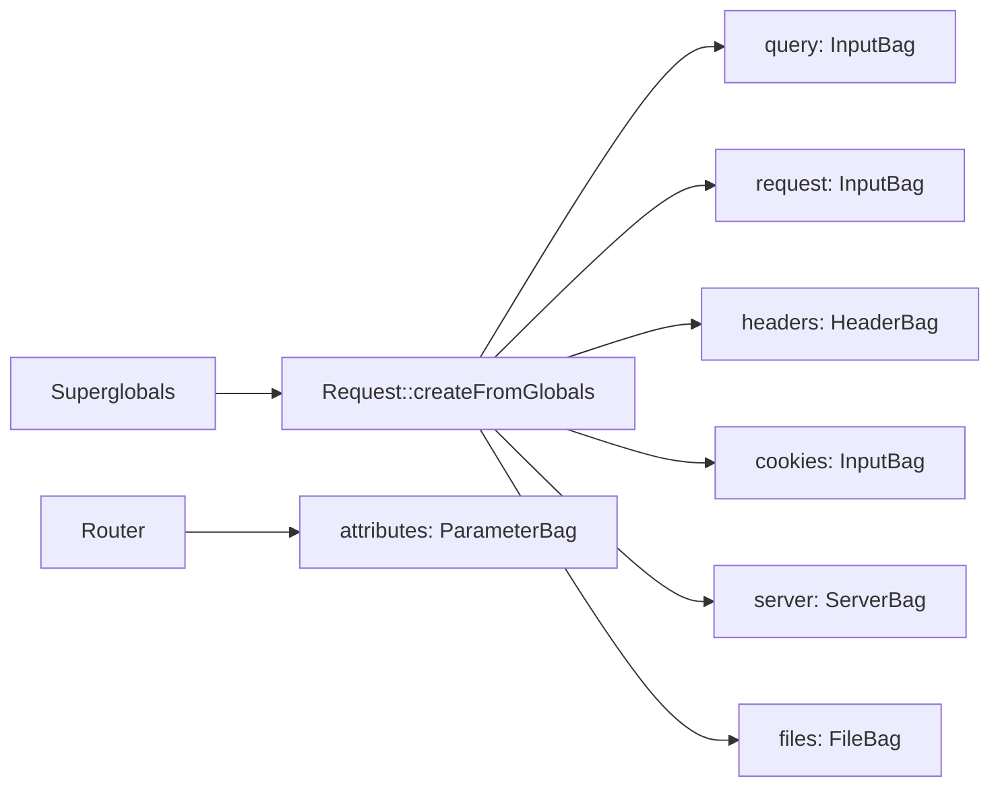

# HTTP Request

!!! tip "In a nutshell"
    `Request` est une enveloppe orientée objet autour des superglobales de PHP :
    lisez les données depuis des *bags* typés plutôt que depuis `$_GET`/`$_POST`.
    Piège d'examen : les paramètres de route vivent dans **`attributes`** (un
    `ParameterBag`), pas dans `query`.

!!! example "Real-world analogy"
    Une request HTTP est une **lettre** que vous postez. La **méthode** est votre
    intention (« envoyez-moi une copie », « voici un formulaire »), l'**URI** est
    l'adresse sur l'enveloppe, les **headers** sont les notes dans la marge (votre
    langue, le content type, qui vous êtes), et le **body** est le contenu de la
    lettre. La `Request` de Symfony est le commis qui ouvre l'enveloppe et trie
    chaque partie dans un bac étiqueté (un *bag*), pour que vous n'ayez jamais à
    fouiller dans le courrier brut (`$_GET`/`$_POST`).

!!! abstract "Learning objectives"
    À la fin de ce chapitre, vous saurez :

    - [ ] Décomposer une request HTTP en méthode, URI, headers et body.
    - [ ] Nommer chaque parameter bag de `Request` et ce qu'il contient.
    - [ ] Lire correctement les données de query, body, route, cookie, server, header et fichiers.
    - [ ] Expliquer comment `Request::createFromGlobals()` construit l'objet.

    **Syllabus:** `HTTP → The HTTP request` ·
    **Level:** Advanced → Expert ·
    **Est. time:** 30 min ·
    **Prerequisites:** [Client / Server](client-server.md)

---

## Theory

Une request HTTP comporte quatre parties :

```http
POST /articles?draft=1 HTTP/1.1      ← request line: method + URI + version
Host: example.com                    ← headers
Content-Type: application/json
                                     ← blank line
{"title":"Hello"}                    ← body
```

- **Méthode** — le verbe (`GET`, `POST`, …). Voir [Methods](methods.md).
- **URI** — chemin + query string (`/articles?draft=1`).
- **Headers** — métadonnées (`Host`, `Content-Type`, `Accept`, `Cookie`, …).
- **Body** — charge utile pour POST/PUT/PATCH (données de formulaire, JSON, fichiers uploadés).

```http
GET /articles?draft=1 HTTP/1.1       ← GET: read-only, no body
Host: example.com
Accept: application/json             ← headers: metadata about the exchange
Cookie: PHPSESSID=abc123

POST /articles HTTP/1.1              ← POST: sends a payload
Host: example.com
Content-Type: application/json       ← describes the body below

{"title":"Hello"}
```

!!! question "Predict first"
    Pour `GET /users/42?draft=1`, quel bag contient `42` et lequel contient `draft` ?

??? note "Reveal"
    `42` est un **paramètre de route** → `attributes` (un `ParameterBag`), écrit par
    le Router. `draft` est un **paramètre de query** → `query` (un `InputBag`, issu
    de `$_GET`). Les paramètres de route ne sont *jamais* dans `query` — c'est le
    piège d'examen classique.

## Deep Dive — how it works internally

`Symfony\Component\HttpFoundation\Request` est une **enveloppe orientée objet
autour des superglobales PHP** (`$_GET`, `$_POST`, `$_SERVER`, `$_COOKIE`,
`$_FILES`). `Request::createFromGlobals()` les lit une seule fois dans le front
controller ; vous ne touchez plus jamais aux superglobales ensuite.

```php
use Symfony\Component\HttpFoundation\Request;

// public/index.php — wrap $_GET, $_POST, $_SERVER, $_COOKIE, $_FILES once
$request = Request::createFromGlobals();

$request->query->get('draft');      // was: $_GET['draft']
$request->request->get('title');    // was: $_POST['title']
$request->server->get('HTTP_HOST'); // was: $_SERVER['HTTP_HOST']
```

### The parameter bags

Chaque partie de la request vit dans une **propriété publique** qui est un *bag*
typé :

| Propriété | Classe (FQCN) | Contient | Superglobale |
|---|---|---|---|
| `$request->query` | `InputBag` | Query string (`?a=b`) | `$_GET` |
| `$request->request` | `InputBag` | Body parsé (POST de formulaire) | `$_POST` |
| `$request->attributes` | `ParameterBag` | Paramètres de route & données applicatives | — |
| `$request->cookies` | `InputBag` | Cookies | `$_COOKIE` |
| `$request->files` | `FileBag` | Fichiers uploadés | `$_FILES` |
| `$request->server` | `ServerBag` | Variables serveur/env | `$_SERVER` |
| `$request->headers` | `HeaderBag` | Headers HTTP | (depuis `$_SERVER`) |

Tous les FQCN vivent sous `Symfony\Component\HttpFoundation\`. `InputBag` étend
`ParameterBag` mais **restreint les valeurs aux scalaires, tableaux de scalaires
ou null** — son `get()` lève `\TypeError`/`BadRequestException` si vous tentez de
lire un tableau là où un scalaire est attendu, ce qui durcit l'application contre
les entrées imbriquées malveillantes.



!!! note "Source reference"
    `Symfony\Component\HttpFoundation\Request`, `InputBag`, `FileBag`,
    `ServerBag`, `HeaderBag` —
    [symfony/symfony `8.0`](https://github.com/symfony/symfony/blob/8.0/src/Symfony/Component/HttpFoundation/Request.php).

### `attributes` — the odd one out

`attributes` ne vient **pas** du client. Le Router y écrit les paramètres de la
route correspondante (`_route`, `_controller`, `id`, `_locale`, …), et les
listeners y stockent de l'état propre à la request. Lire `id` depuis une route
s'écrit `$request->attributes->get('id')`.

### Reading values safely

`InputBag::get()` accepte une valeur par défaut et propose des getters typés :

```php
$page   = $request->query->getInt('page', 1);      // int, default 1
$active = $request->query->getBoolean('active');    // bool
$sort   = $request->query->getString('sort', 'id'); // string (8.x)
$tags   = $request->query->all('tags');             // array
$title  = $request->getPayload()->getString('title'); // JSON or form body
```

`Request::getPayload()` retourne un `InputBag` fusionnant le body parsé — pour les
requests JSON il décode le body JSON, pour les requests de formulaire il retourne
`request`. C'est la manière moderne, indépendante du content type, de lire les
données soumises.

### URI, method and metadata helpers

| Appel | Retourne |
|---|---|
| `getMethod()` | La méthode effective (respecte l'override) |
| `getRealMethod()` | La méthode brute avant override |
| `getPathInfo()` | `/articles` (sans query, sans base) |
| `getRequestUri()` | `/articles?draft=1` |
| `getUri()` | L'URL absolue complète |
| `getQueryString()` | `draft=1` (normalisée) |
| `getClientIp()` | L'IP du client (nécessite les trusted proxies) |
| `getContent()` | Le body brut sous forme de chaîne |
| `getContentTypeFormat()` | Le format issu de `Content-Type` (p. ex. `json`) |
| `isXmlHttpRequest()` | `X-Requested-With: XMLHttpRequest` |

!!! info "Renamed in modern Symfony"
    `getContentType()` a été supprimé ; utilisez **`getContentTypeFormat()`**. Lire
    le format de la request (depuis `_format`) se fait via `getRequestFormat()` ; le
    format préféré du client via `getPreferredFormat()` (voir
    [Content Negotiation](content-negotiation.md)).

### Null behavior

Un getter de bag est une *consultation*, et une clé absente est un cas normal.
`HeaderBag::get('X')` et `ParameterBag::get('x')` retournent **`null`** quand la
clé est absente — le second argument est la valeur par défaut et il *vaut `null`
par défaut* (`get(string $key, mixed $default = null)`). Ainsi,
`$request->headers->get('X-Trace-Id')` vaut `null` pour un client qui ne l'a
jamais envoyé, ce n'est pas une erreur.

`getClientIp()` peut aussi retourner **`null`** : sans configuration de trusted
proxies et sans `REMOTE_ADDR` exploitable (par exemple une request créée en
console), il n'y a tout simplement aucune IP à rapporter.

Gérez-le en bordure avec `??` :

```php
$id = $request->headers->get('X-Trace-Id') ?? bin2hex(random_bytes(8));
$ip = $request->getClientIp() ?? '0.0.0.0';
$q  = $request->query->getString('q'); // '' when absent — never null
```

Les getters typés (`getInt`, `getString`, `getBoolean`) *ramènent* une valeur
manquante au zéro du type (`0`, `''`, `false`), donc ils ne renvoient jamais
`null` — ne recourez au `get()` brut que lorsque « absent » doit rester
distinguable de « vide ». Le bug classique consiste à appeler une méthode de
chaîne sur `headers->get()` sans garde `??` et à récolter un `TypeError` la
première fois que ce header manque.

!!! note "Null in real life"
    Ici, `null` est une lettre arrivée **sans adresse de retour** dans la marge :
    l'enveloppe est intacte, c'est juste cette note-là qui manque — vous fournissez
    un défaut raisonnable plutôt que de refuser le courrier.

## Configuration & code

=== "PHP Attributes"

    ```php
    <?php
    declare(strict_types=1);

    namespace App\Controller;

    use Symfony\Bundle\FrameworkBundle\Controller\AbstractController;
    use Symfony\Component\HttpFoundation\Request;
    use Symfony\Component\HttpFoundation\Response;
    use Symfony\Component\Routing\Attribute\Route;

    final class SearchController extends AbstractController
    {
        #[Route('/search/{category}', name: 'search', methods: ['GET'])]
        public function __invoke(Request $request, string $category): Response
        {
            $term  = $request->query->getString('q', '');
            $page  = $request->query->getInt('page', 1);
            $route = $request->attributes->getString('_route'); // "search"
            $ua    = $request->headers->get('User-Agent', 'unknown');

            return $this->json([
                'route'    => $route,
                'category' => $category,   // from attributes bag (route param)
                'q'        => $term,
                'page'     => $page,
                'ua'       => $ua,
            ]);
        }
    }
    ```

=== "Console"

    ```console
    $ curl 'https://localhost/search/books?q=symfony&page=2' \
        -H 'User-Agent: demo/1.0'
    {"route":"search","category":"books","q":"symfony","page":2,"ua":"demo/1.0"}
    ```

## Best practices & anti-patterns

| ✅ À faire | ❌ À éviter |
|---|---|
| Lire via les bags (`query`, `request`, `getPayload()`) | Toucher à `$_GET`/`$_POST` |
| Utiliser les getters typés (`getInt`, `getBoolean`) | Caster des chaînes brutes à la main |
| Lire les paramètres de route depuis `attributes` | Les lire depuis `query` |
| `getContentTypeFormat()` | Le `getContentType()` supprimé |

## When (not) to use it / alternatives

Dans les controllers, préférez les **argument value resolvers**
(`#[MapQueryParameter]`, `#[MapRequestPayload]`) à la lecture manuelle des bags —
ils typent, valident et sont plus testables (voir
[Value Resolvers](../controllers/value-resolvers.md)). Réservez la `Request`
brute aux besoins bas niveau (headers, IP, body brut).

!!! danger "Certification traps"
    - **`query` = `$_GET`, `request` = `$_POST` (body), `attributes` = données de
      route/applicatives.** Les paramètres de route sont dans **`attributes`**,
      pas dans `query`.
    - `query`, `request`, `cookies` sont des **`InputBag`** (scalaires
      uniquement) ; `attributes` est un **`ParameterBag`** ; `server` est un
      **`ServerBag`** ; `headers` est un **`HeaderBag`** ; `files` est un
      **`FileBag`**.
    - `getMethod()` respecte le method override ; `getRealMethod()` non.
    - `getContentType()` a disparu — utilisez `getContentTypeFormat()`.
    - `getClientIp()` retourne l'IP du proxy tant que `setTrustedProxies()` n'est
      pas configuré.

!!! warning "Common mistakes"
    - Appeler `$request->query->get('tags')` pour un tableau — utilisez `all('tags')`.
    - Confondre `getPathInfo()` (sans query) et `getRequestUri()` (avec query).
    - S'attendre à ce que `getContent()` soit pré-parsé — c'est la chaîne **brute** du body.

## Exercises

1. **(Advanced)** Pour `GET /users/42?verbose=1`, quel bag contient `42` et
   lequel contient `verbose` ? Écrivez les deux appels de getter.
2. **(Expert)** Lisez un body JSON `{"email":"a@b.co"}` de manière indépendante
   du content type et retournez l'email en JSON.

??? success "Solutions"

    **1.** `42` est un paramètre de route → `$request->attributes->get('id')` (en
    supposant `{id}`). `verbose` est un paramètre de query →
    `$request->query->getBoolean('verbose')`.

    **2.**
    ```php
    $email = $request->getPayload()->getString('email');
    return $this->json(['email' => $email]);
    ```
    `getPayload()` décode un body JSON (ou lit les données de formulaire) dans un
    `InputBag`.

## Certification questions

??? question "Q1. Where does the Router place matched route parameters?"
    - [ ] A. `$request->query`
    - [ ] B. `$request->request`
    - [x] C. `$request->attributes` ✅
    - [ ] D. `$request->server`

    **Why:** `attributes` (un `ParameterBag`) contient les données du framework et
    de la route comme `_route`, `_controller` et les paramètres du chemin.
    **Ref:** [HttpFoundation](https://symfony.com/doc/current/components/http_foundation.html).

??? question "Q2. Which class backs `$request->query`?"
    - [x] A. `InputBag` ✅
    - [ ] B. `ParameterBag`
    - [ ] C. `HeaderBag`
    - [ ] D. `ServerBag`

    **Why:** `query`, `request` et `cookies` sont des `InputBag` (restreints aux
    scalaires) ; `attributes` est un simple `ParameterBag`.
    **Ref:** [Symfony source](https://github.com/symfony/symfony/blob/8.0/src/Symfony/Component/HttpFoundation/InputBag.php).

??? question "Q3. Which method returns the request format derived from the Content-Type header?"
    - [ ] A. `getRequestFormat()`
    - [ ] B. `getPreferredFormat()`
    - [x] C. `getContentTypeFormat()` ✅
    - [ ] D. `getContentType()`

    **Why:** `getContentTypeFormat()` fait correspondre le `Content-Type` du body
    à un format ; `getContentType()` a été supprimé.
    **Ref:** [Request API](https://github.com/symfony/symfony/blob/8.0/src/Symfony/Component/HttpFoundation/Request.php).

## Key takeaways

- `Request` enveloppe les superglobales via `createFromGlobals()` ; utilisez les
  bags, jamais `$_GET`.
- Bags : `query`/`request`/`cookies` = `InputBag`, `attributes` = `ParameterBag`,
  `server` = `ServerBag`, `headers` = `HeaderBag`, `files` = `FileBag`.
- Les paramètres de route vivent dans `attributes` ; les getters typés (`getInt`,
  `getBoolean`) parsent les valeurs.
- `getPayload()` est le lecteur de body indépendant du content type.

## Last-minute revision

!!! tip "Cheat sheet"
    - `query`→GET, `request`→body POST, `attributes`→route/applicatif, `cookies`,
      `files`, `server`, `headers`.
    - `InputBag` = scalaires uniquement ; `getInt/getBoolean/getString/all`.
    - `getMethod()` vs `getRealMethod()` ; `getPathInfo()` vs `getRequestUri()`.
    - `getPayload()` lit uniformément un body JSON ou de formulaire ; `getContent()` est brut.

## Connections

- **Depends on:** [Client / Server](client-server.md) — `Request` est l'enveloppe OO autour de l'échange entrant brut.
- **Reused in:** [The Request (Controllers)](../controllers/request.md) — les [value resolvers](../controllers/value-resolvers.md) lisent ces bags pour vous.
- **Confused with:** [HTTP Response](response.md) — les `InputBag`/`ParameterBag` entrants vs le `ResponseHeaderBag` sortant.

## Official References
- [Symfony docs — HttpFoundation Request](https://symfony.com/doc/current/components/http_foundation.html#accessing-request-data)
- [Symfony source — Request](https://github.com/symfony/symfony/blob/8.0/src/Symfony/Component/HttpFoundation/Request.php)
- [Symfony source — InputBag](https://github.com/symfony/symfony/blob/8.0/src/Symfony/Component/HttpFoundation/InputBag.php)

## Video references

!!! tip "Watch & learn"
    Voici des chaînes vidéo officielles, mises à jour en continu — cherchez-y
    « HTTP foundation » pour consolider ce chapitre. Nous lions des chaînes stables
    plutôt que des vidéos individuelles pour que les références ne périment jamais.

    - [SymfonyCasts screencasts](https://symfonycasts.com/tracks/symfony) — tutoriels scénarisés à suivre en codant.
    - [Symfony official YouTube](https://www.youtube.com/@SymfonyOfficial) — conférences et keynotes SymfonyCon.
    - [Official docs for this topic](https://symfony.com/doc/current/components/http_foundation.html) — certaines pages de la doc Symfony intègrent un screencast.

## Confidence check

Je suis prêt quand je sais :

- [ ] expliquer **pourquoi** `Request` enveloppe les superglobales et ce que fait `createFromGlobals()`
- [ ] nommer chaque bag et sa classe (`InputBag`/`ParameterBag`/`ServerBag`/`HeaderBag`/`FileBag`)
- [ ] lire les données de query, body, route et headers avec le bon getter typé
- [ ] repérer le piège : les paramètres de route vivent dans `attributes`, pas dans `query`
- [ ] expliquer pourquoi `InputBag` restreint les valeurs aux scalaires et comment `getPayload()` lit n'importe quel body

---

<small>Related: [HTTP Response](response.md) · [HTTP Methods](methods.md) ·
[The Request (Controllers)](../controllers/request.md) · [Value Resolvers](../controllers/value-resolvers.md)</small>
