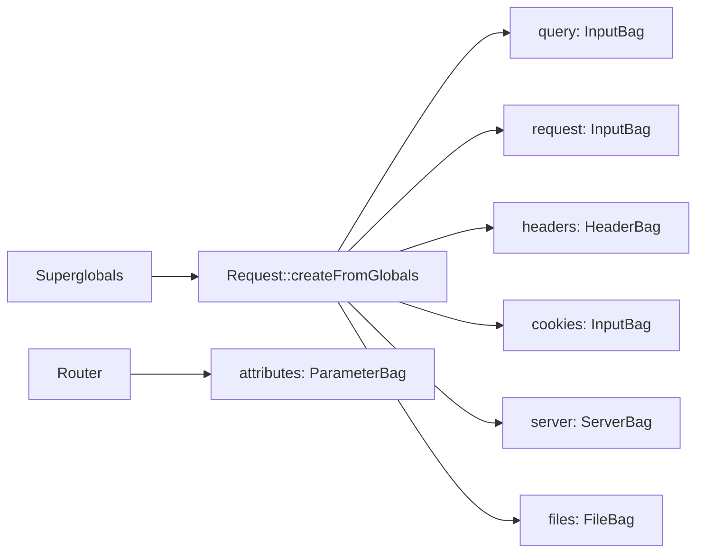

# HTTP Request

!!! tip "In a nutshell"
    `Request` is an object-oriented wrapper around PHP's superglobals: read data
    from typed *bags* instead of `$_GET`/`$_POST`. Exam hook: route parameters live
    in **`attributes`** (a `ParameterBag`), not in `query`.

!!! example "Real-world analogy"
    An HTTP request is a **letter** you drop in the mail. The **method** is your
    intent ("send me a copy", "here is a form"), the **URI** is the address on the
    envelope, the **headers** are the notes in the margin (your language, the
    content type, who you are), and the **body** is the letter's contents.
    Symfony's `Request` is the clerk who opens the envelope and sorts each part
    into a labelled tray (a *bag*) so you never rummage through the raw mail
    (`$_GET`/`$_POST`).

!!! abstract "Learning objectives"
    By the end of this chapter you can:

    - [ ] Break an HTTP request into method, URI, headers and body.
    - [ ] Name every parameter bag on `Request` and what it holds.
    - [ ] Read query, body, route, cookie, server, header and file data correctly.
    - [ ] Explain how `Request::createFromGlobals()` builds the object.

    **Syllabus:** `HTTP → The HTTP request` ·
    **Level:** Advanced → Expert ·
    **Est. time:** 30 min ·
    **Prerequisites:** [Client / Server](client-server.md)

---

## Theory

An HTTP request has four parts:

```http
POST /articles?draft=1 HTTP/1.1      ← request line: method + URI + version
Host: example.com                    ← headers
Content-Type: application/json
                                     ← blank line
{"title":"Hello"}                    ← body
```

- **Method** — the verb (`GET`, `POST`, …). See [Methods](methods.md).
- **URI** — path + query string (`/articles?draft=1`).
- **Headers** — metadata (`Host`, `Content-Type`, `Accept`, `Cookie`, …).
- **Body** — payload for POST/PUT/PATCH (form data, JSON, uploaded files).

!!! question "Predict first"
    For `GET /users/42?draft=1`, which bag holds `42` and which holds `draft`?

??? note "Reveal"
    `42` is a **route parameter** → `attributes` (a `ParameterBag`), written by the
    Router. `draft` is a **query param** → `query` (an `InputBag`, from `$_GET`).
    Route parameters are *never* in `query` — that is the classic exam trap.

## Deep Dive — how it works internally

`Symfony\Component\HttpFoundation\Request` is an **object-oriented wrapper around
the PHP superglobals** (`$_GET`, `$_POST`, `$_SERVER`, `$_COOKIE`, `$_FILES`).
`Request::createFromGlobals()` reads them once at the front controller; you never
touch superglobals again.

### The parameter bags

Each part of the request lives in a **public property** that is a typed *bag*:

| Property | Class (FQCN) | Holds | Superglobal |
|---|---|---|---|
| `$request->query` | `InputBag` | Query string (`?a=b`) | `$_GET` |
| `$request->request` | `InputBag` | Parsed body (form POST) | `$_POST` |
| `$request->attributes` | `ParameterBag` | Route params & app data | — |
| `$request->cookies` | `InputBag` | Cookies | `$_COOKIE` |
| `$request->files` | `FileBag` | Uploaded files | `$_FILES` |
| `$request->server` | `ServerBag` | Server/env vars | `$_SERVER` |
| `$request->headers` | `HeaderBag` | HTTP headers | (from `$_SERVER`) |

All FQCNs live under `Symfony\Component\HttpFoundation\`. `InputBag` extends
`ParameterBag` but **restricts values to scalars, arrays of scalars, or null** —
its `get()` throws `\TypeError`/`BadRequestException` if you try to read an array
where a scalar is expected, hardening against malicious nested input.



!!! note "Source reference"
    `Symfony\Component\HttpFoundation\Request`, `InputBag`, `FileBag`,
    `ServerBag`, `HeaderBag` —
    [symfony/symfony `8.0`](https://github.com/symfony/symfony/blob/8.0/src/Symfony/Component/HttpFoundation/Request.php).

### `attributes` — the odd one out

`attributes` is **not** from the client. The Router writes matched route
parameters here (`_route`, `_controller`, `id`, `_locale`, …), and listeners store
per-request state. Reading `id` from a route is `$request->attributes->get('id')`.

### Reading values safely

`InputBag::get()` accepts a default and supports typed getters:

```php
$page   = $request->query->getInt('page', 1);      // int, default 1
$active = $request->query->getBoolean('active');    // bool
$sort   = $request->query->getString('sort', 'id'); // string (8.x)
$tags   = $request->query->all('tags');             // array
$title  = $request->getPayload()->getString('title'); // JSON or form body
```

`Request::getPayload()` returns an `InputBag` merging the parsed body — for JSON
requests it decodes the JSON body, for form requests it returns `request`. It is
the modern, content-type-agnostic way to read submitted data.

### URI, method and metadata helpers

| Call | Returns |
|---|---|
| `getMethod()` | Effective method (honours override) |
| `getRealMethod()` | Raw method before override |
| `getPathInfo()` | `/articles` (no query, no base) |
| `getRequestUri()` | `/articles?draft=1` |
| `getUri()` | Full absolute URL |
| `getQueryString()` | `draft=1` (normalised) |
| `getClientIp()` | Client IP (needs trusted proxies) |
| `getContent()` | Raw body string |
| `getContentTypeFormat()` | Format from `Content-Type` (e.g. `json`) |
| `isXmlHttpRequest()` | `X-Requested-With: XMLHttpRequest` |

!!! info "Renamed in modern Symfony"
    `getContentType()` was removed; use **`getContentTypeFormat()`**. Reading the
    request format (from `_format`) is `getRequestFormat()`; the client-preferred
    format is `getPreferredFormat()` (see [Content Negotiation](content-negotiation.md)).

### Null behavior

A bag getter is a *lookup*, and a missing key is normal. `HeaderBag::get('X')`
and `ParameterBag::get('x')` return **`null`** when the key is absent — the second
argument is the default and it *defaults to `null`*
(`get(string $key, mixed $default = null)`). So
`$request->headers->get('X-Trace-Id')` is `null` for a client that never sent it,
not an error.

`getClientIp()` can also return **`null`**: with no trusted-proxy configuration
and no usable `REMOTE_ADDR` (for example a console-created request) there is
simply no IP to report.

Handle it at the edge with `??`:

```php
$id = $request->headers->get('X-Trace-Id') ?? bin2hex(random_bytes(8));
$ip = $request->getClientIp() ?? '0.0.0.0';
$q  = $request->query->getString('q'); // '' when absent — never null
```

Typed getters (`getInt`, `getString`, `getBoolean`) *coalesce* a missing value to
the type's zero (`0`, `''`, `false`), so they never hand back `null` — reach for
the raw `get()` only when "absent" must stay distinguishable from "empty". The
common bug is calling a string method on `headers->get()` with no `??` guard and
hitting a `TypeError` the first time that header is missing.

!!! note "Null in real life"
    `null` here is a letter that arrived with **no return address** in the margin:
    the envelope is fine, that one note just isn't there — you supply a sensible
    default rather than refuse the mail.

## Configuration & code

=== "PHP Attributes"

    ```php
    <?php
    declare(strict_types=1);

    namespace App\Controller;

    use Symfony\Bundle\FrameworkBundle\Controller\AbstractController;
    use Symfony\Component\HttpFoundation\Request;
    use Symfony\Component\HttpFoundation\Response;
    use Symfony\Component\Routing\Attribute\Route;

    final class SearchController extends AbstractController
    {
        #[Route('/search/{category}', name: 'search', methods: ['GET'])]
        public function __invoke(Request $request, string $category): Response
        {
            $term  = $request->query->getString('q', '');
            $page  = $request->query->getInt('page', 1);
            $route = $request->attributes->getString('_route'); // "search"
            $ua    = $request->headers->get('User-Agent', 'unknown');

            return $this->json([
                'route'    => $route,
                'category' => $category,   // from attributes bag (route param)
                'q'        => $term,
                'page'     => $page,
                'ua'       => $ua,
            ]);
        }
    }
    ```

=== "Console"

    ```console
    $ curl 'https://localhost/search/books?q=symfony&page=2' \
        -H 'User-Agent: demo/1.0'
    {"route":"search","category":"books","q":"symfony","page":2,"ua":"demo/1.0"}
    ```

## Best practices & anti-patterns

| ✅ Do | ❌ Avoid |
|---|---|
| Read via bags (`query`, `request`, `getPayload()`) | Touching `$_GET`/`$_POST` |
| Use typed getters (`getInt`, `getBoolean`) | Casting raw strings by hand |
| Read route params from `attributes` | Reading them from `query` |
| `getContentTypeFormat()` | Removed `getContentType()` |

## When (not) to use it / alternatives

In controllers, prefer **argument value resolvers** (`#[MapQueryParameter]`,
`#[MapRequestPayload]`) over reading bags manually — they type, validate and are
more testable (see [Value Resolvers](../controllers/value-resolvers.md)). Reach
for the raw `Request` when you need low-level access (headers, IP, raw body).

!!! danger "Certification traps"
    - **`query` = `$_GET`, `request` = `$_POST` (body), `attributes` = route/app
      data.** Route parameters are in **`attributes`**, not `query`.
    - `query`, `request`, `cookies` are **`InputBag`** (scalar-only); `attributes`
      is **`ParameterBag`**; `server` is **`ServerBag`**; `headers` is
      **`HeaderBag`**; `files` is **`FileBag`**.
    - `getMethod()` honours method override; `getRealMethod()` does not.
    - `getContentType()` is gone — use `getContentTypeFormat()`.
    - `getClientIp()` returns the proxy IP unless `setTrustedProxies()` is set.

!!! warning "Common mistakes"
    - Calling `$request->query->get('tags')` for an array — use `all('tags')`.
    - Confusing `getPathInfo()` (no query) with `getRequestUri()` (with query).
    - Expecting `getContent()` to be pre-parsed — it is the **raw** body string.

## Exercises

1. **(Advanced)** For `GET /users/42?verbose=1`, which bag holds `42` and which
   holds `verbose`? Write the two getter calls.
2. **(Expert)** Read a JSON body `{"email":"a@b.co"}` in a content-type-agnostic
   way and return the email as JSON.

??? success "Solutions"

    **1.** `42` is a route parameter → `$request->attributes->get('id')` (assuming
    `{id}`). `verbose` is a query param → `$request->query->getBoolean('verbose')`.

    **2.**
    ```php
    $email = $request->getPayload()->getString('email');
    return $this->json(['email' => $email]);
    ```
    `getPayload()` decodes a JSON body (or reads form data) into an `InputBag`.

## Certification questions

??? question "Q1. Where does the Router place matched route parameters?"
    - [ ] A. `$request->query`
    - [ ] B. `$request->request`
    - [x] C. `$request->attributes` ✅
    - [ ] D. `$request->server`

    **Why:** `attributes` (a `ParameterBag`) holds framework/route data like
    `_route`, `_controller` and path parameters.
    **Ref:** [HttpFoundation](https://symfony.com/doc/current/components/http_foundation.html).

??? question "Q2. Which class backs `$request->query`?"
    - [x] A. `InputBag` ✅
    - [ ] B. `ParameterBag`
    - [ ] C. `HeaderBag`
    - [ ] D. `ServerBag`

    **Why:** `query`, `request` and `cookies` are `InputBag` (scalar-restricted);
    `attributes` is a plain `ParameterBag`.
    **Ref:** [Symfony source](https://github.com/symfony/symfony/blob/8.0/src/Symfony/Component/HttpFoundation/InputBag.php).

??? question "Q3. Which method returns the request format derived from the Content-Type header?"
    - [ ] A. `getRequestFormat()`
    - [ ] B. `getPreferredFormat()`
    - [x] C. `getContentTypeFormat()` ✅
    - [ ] D. `getContentType()`

    **Why:** `getContentTypeFormat()` maps the body `Content-Type` to a format;
    `getContentType()` was removed.
    **Ref:** [Request API](https://github.com/symfony/symfony/blob/8.0/src/Symfony/Component/HttpFoundation/Request.php).

## Key takeaways

- `Request` wraps superglobals via `createFromGlobals()`; use bags, never `$_GET`.
- Bags: `query`/`request`/`cookies` = `InputBag`, `attributes` = `ParameterBag`,
  `server` = `ServerBag`, `headers` = `HeaderBag`, `files` = `FileBag`.
- Route params live in `attributes`; typed getters (`getInt`, `getBoolean`) parse.
- `getPayload()` is the content-type-agnostic body reader.

## Last-minute revision

!!! tip "Cheat sheet"
    - `query`→GET, `request`→POST body, `attributes`→route/app, `cookies`,
      `files`, `server`, `headers`.
    - `InputBag` = scalar-only; `getInt/getBoolean/getString/all`.
    - `getMethod()` vs `getRealMethod()`; `getPathInfo()` vs `getRequestUri()`.
    - `getPayload()` reads JSON or form body uniformly; `getContent()` is raw.

## Connections

- **Depends on:** [Client / Server](client-server.md) — `Request` is the OO wrapper around the raw inbound exchange.
- **Reused in:** [The Request (Controllers)](../controllers/request.md) — [value resolvers](../controllers/value-resolvers.md) read these bags for you.
- **Confused with:** [HTTP Response](response.md) — inbound `InputBag`/`ParameterBag` vs the outbound `ResponseHeaderBag`.

## Official References
- [Symfony docs — HttpFoundation Request](https://symfony.com/doc/current/components/http_foundation.html#accessing-request-data)
- [Symfony source — Request](https://github.com/symfony/symfony/blob/8.0/src/Symfony/Component/HttpFoundation/Request.php)
- [Symfony source — InputBag](https://github.com/symfony/symfony/blob/8.0/src/Symfony/Component/HttpFoundation/InputBag.php)

## Video references

!!! tip "Watch & learn"
    These are official, continuously-updated video channels — search them for
    "HTTP foundation" to reinforce this chapter. We link stable channels rather than
    individual videos so the references never rot.

    - [SymfonyCasts screencasts](https://symfonycasts.com/tracks/symfony) — scripted, code-along tutorials.
    - [Symfony official YouTube](https://www.youtube.com/@SymfonyOfficial) — SymfonyCon conference talks & keynotes.
    - [Official docs for this topic](https://symfony.com/doc/current/components/http_foundation.html) — some Symfony doc pages embed a screencast.

## Confidence check

I'm ready when I can:

- [ ] explain **why** `Request` wraps the superglobals and what `createFromGlobals()` does
- [ ] name every bag and its class (`InputBag`/`ParameterBag`/`ServerBag`/`HeaderBag`/`FileBag`)
- [ ] read query, body, route and header data with the right typed getter
- [ ] spot the trick: route params live in `attributes`, not `query`
- [ ] explain why `InputBag` restricts values to scalars and how `getPayload()` reads any body

---

<small>Related: [HTTP Response](response.md) · [HTTP Methods](methods.md) ·
[The Request (Controllers)](../controllers/request.md) · [Value Resolvers](../controllers/value-resolvers.md)</small>
