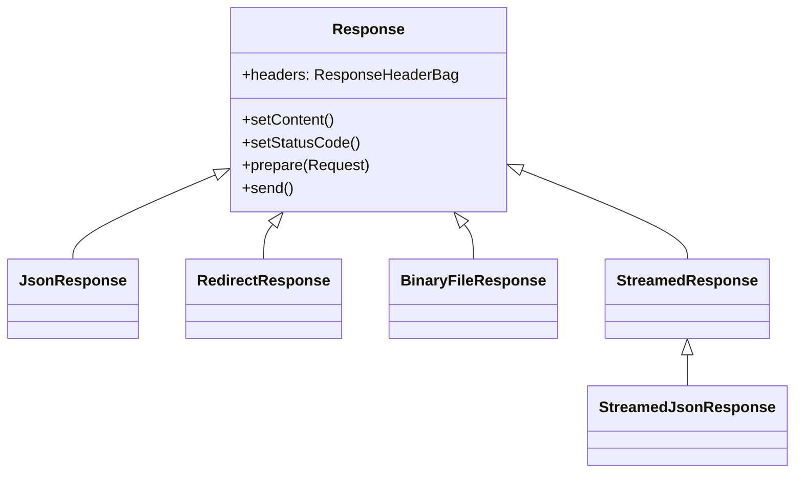
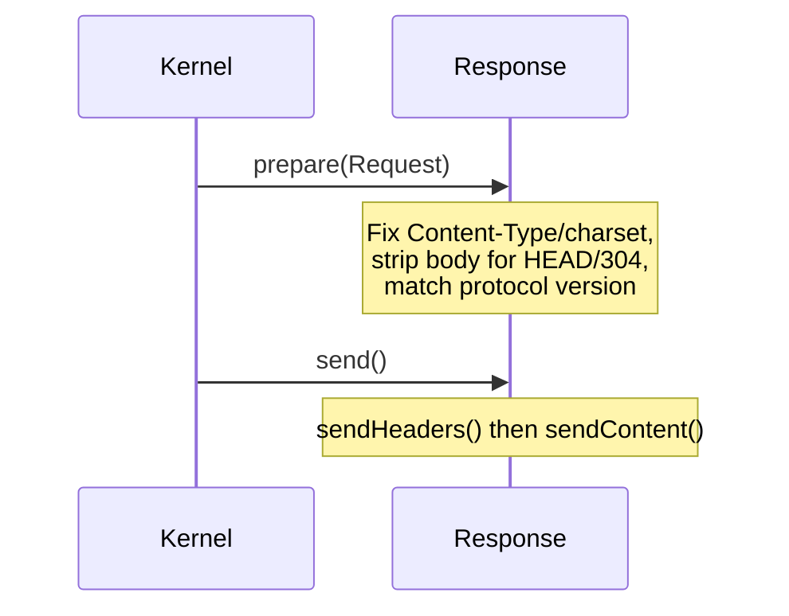

# HTTP Response

!!! tip "In a nutshell"
    `Response` modélise ce que votre application renvoie — status line, headers et
    body — avec des sous-classes comme `JsonResponse` pour les payloads courants.
    Piège d'examen : `$response->headers` est un **`ResponseHeaderBag`**, et
    `prepare()` rend la response conforme à la request avant que `send()` ne la
    transmette.

!!! example "Real-world analogy"
    Si la request est la lettre que vous avez postée, la `Response` est la
    **réponse que le bureau vous renvoie par courrier**. La **status line** est le
    tampon de résultat sur l'enveloppe (`200 OK`, `404`), les **headers** sont les
    notes de traitement (type de contenu, mise en cache, cookies à conserver), et
    le **body** est la réponse elle-même. `prepare()` est la salle du courrier qui
    met l'enveloppe en conformité avec votre lettre d'origine avant que `send()`
    ne la dépose dans le courrier sortant.

!!! abstract "Learning objectives"
    À la fin de ce chapitre, vous saurez :

    - [ ] Décomposer une response HTTP en status line, headers et body.
    - [ ] Choisir entre `Response`, `JsonResponse`, `BinaryFileResponse` et
      `StreamedResponse`.
    - [ ] Manipuler les headers via `ResponseHeaderBag`.
    - [ ] Expliquer ce que font `Response::prepare()` et `send()` en interne.

    **Syllabus:** `HTTP → The HTTP response` ·
    **Level:** Advanced → Expert ·
    **Est. time:** 30 min ·
    **Prerequisites:** [HTTP Request](request.md) · [Status Codes](status-codes.md)

---

## Theory

Une response HTTP est le miroir de la request :

```http
HTTP/1.1 200 OK                              ← status line
Content-Type: application/json; charset=UTF-8 ← headers
Cache-Control: private, max-age=0
                                             ← blank line
{"id":42}                                    ← body
```

- **Status line** — version du protocole + [status code](status-codes.md) + raison.
- **Headers** — métadonnées (`Content-Type`, `Cache-Control`, `Set-Cookie`, …).
- **Body** — le payload.

!!! question "Predict first"
    Vous faites `new Response('hi')` sans rien configurer d'autre. Un CDN peut-il
    la stocker, et quel `Cache-Control` porte-t-elle ?

??? note "Reveal"
    Non — une `Response` par défaut reçoit **`Cache-Control: no-cache, private`**
    de `ResponseHeaderBag`, donc les caches partagés ne la stockeront pas tant que
    vous n'appelez pas `setPublic()`/`setSharedMaxAge()`.

## Deep Dive — how it works internally

### The `Response` family

`Symfony\Component\HttpFoundation\Response` est la classe de base. Son
constructeur est
`__construct(string $content = '', int $status = 200, array $headers = [])`.
Chaque sous-classe spécialisée définit les bons headers pour son payload :

| Class (FQCN under `Symfony\Component\HttpFoundation`) | Utilisation | Définit |
|---|---|---|
| `Response` | Tout contenu | `Content-Type: text/html` par défaut |
| `JsonResponse` | APIs JSON | Encode les données, `Content-Type: application/json` |
| `RedirectResponse` | Redirections | Header `Location`, 302 par défaut |
| `BinaryFileResponse` | Servir un fichier sur disque | `Content-Type`, ranges, disposition |
| `StreamedResponse` | Sortie volumineuse/générée | Streame un callback, pas de buffering |
| `StreamedJsonResponse` | Streamer le JSON d'un generator | JSON en chunks |



!!! note "Source reference"
    `Symfony\Component\HttpFoundation\Response` et ses sous-classes —
    [symfony/symfony `8.0`](https://github.com/symfony/symfony/blob/8.0/src/Symfony/Component/HttpFoundation/Response.php).

### `ResponseHeaderBag`

`$response->headers` est un `Symfony\Component\HttpFoundation\ResponseHeaderBag`
(sous-classe de `HeaderBag`). Il ajoute la gestion des cookies et la
normalisation du `Cache-Control` :

```php
$response->headers->set('X-Robots-Tag', 'noindex');
$response->headers->setCookie($cookie);       // add a Set-Cookie
$response->headers->clearCookie('session');   // expire a cookie
$response->headers->getCookies();             // Cookie[]
```

`ResponseHeaderBag` calcule automatiquement un `Cache-Control` raisonnable : si
vous n'en définissez aucun, il devient `no-cache, private` ; définir
`max-age`/`public` l'ajuste. C'est pourquoi la response *par défaut* n'est pas
cacheable par les caches partagés.

### `prepare()` and `send()` — the lifecycle



- **`prepare(Request $request)`** rend la response *conforme* à la request :
  supprime le body pour `HEAD` et `304`/`204`, définit le charset, corrige
  `Content-Type`/`Content-Length`, et aligne la version du protocole. Le kernel
  l'appelle automatiquement avant l'envoi.
- **`send()`** appelle `sendHeaders()` (status line + headers + cookies) puis
  `sendContent()` (affiche le body avec echo). `StreamedResponse::sendContent()`
  invoque le callback, donc rien n'est mis en buffer en mémoire.

### Response-building helpers

`setStatusCode(int $code, ?string $text = null)`, `setContent()`,
`setCharset('UTF-8')`, et les setters de cache `setPublic()`, `setPrivate()`,
`setMaxAge()`, `setSharedMaxAge()`, `setEtag()`, `setLastModified()`,
`isNotModified(Request)`, `setCache([...])` — voir [Caching Overview](caching.md).

### Streaming vs buffering (memory)

`StreamedResponse` et `BinaryFileResponse` évitent de charger tout le payload en
mémoire. Servir un téléchargement de 2 Go avec
`new Response(file_get_contents(...))` épuisera la mémoire ;
`BinaryFileResponse` (qui prend en charge les requests HTTP range et
`X-Sendfile`) ou `StreamedResponse` ne le feront pas.

## Configuration & code

=== "PHP Attributes"

    ```php
    <?php
    declare(strict_types=1);

    namespace App\Controller;

    use Symfony\Bundle\FrameworkBundle\Controller\AbstractController;
    use Symfony\Component\HttpFoundation\BinaryFileResponse;
    use Symfony\Component\HttpFoundation\HeaderUtils;
    use Symfony\Component\HttpFoundation\JsonResponse;
    use Symfony\Component\HttpFoundation\Response;
    use Symfony\Component\HttpFoundation\StreamedResponse;
    use Symfony\Component\Routing\Attribute\Route;

    final class DownloadController extends AbstractController
    {
        #[Route('/api/ping')]
        public function ping(): JsonResponse
        {
            return new JsonResponse(['pong' => true], Response::HTTP_OK);
        }

        #[Route('/invoice/{id}.pdf')]
        public function invoice(string $id): BinaryFileResponse
        {
            $response = new BinaryFileResponse(\sprintf('%s/invoices/%s.pdf', \sys_get_temp_dir(), $id));
            $response->setContentDisposition(
                HeaderUtils::DISPOSITION_ATTACHMENT, // force download
                "invoice-{$id}.pdf",
            );

            return $response;
        }

        #[Route('/export.csv')]
        public function export(): StreamedResponse
        {
            $response = new StreamedResponse(function (): void {
                $out = \fopen('php://output', 'wb');
                \fputcsv($out, ['id', 'name']);
                foreach ([[1, 'Ada'], [2, 'Alan']] as $row) {
                    \fputcsv($out, $row);
                }
                \fclose($out);
            });
            $response->headers->set('Content-Type', 'text/csv; charset=UTF-8');

            return $response;
        }
    }
    ```

=== "Console"

    ```console
    $ curl -i https://localhost/api/ping
    HTTP/1.1 200 OK
    Content-Type: application/json
    {"pong":true}
    ```

!!! info "`makeDisposition` moved"
    Utilisez `Symfony\Component\HttpFoundation\HeaderUtils::makeDisposition()`
    (ou `BinaryFileResponse::setContentDisposition()`) ; l'ancien
    `ResponseHeaderBag::makeDisposition()` a été supprimé.

## Best practices & anti-patterns

| ✅ Do | ❌ Avoid |
|---|---|
| `JsonResponse` pour les APIs | `new Response(json_encode(...))` à la main |
| `BinaryFileResponse`/`StreamedResponse` pour les sorties volumineuses | `file_get_contents()` dans une `Response` |
| Laisser le kernel appeler `prepare()` | Émettre les headers manuellement avec `header()` |
| Utiliser les constantes `Response::HTTP_*` | Les nombres magiques |

## When (not) to use it / alternatives

Utilisez `StreamedResponse` quand la sortie est générée de façon incrémentale ou
est trop volumineuse pour la mémoire ; utilisez `BinaryFileResponse` quand les
octets existent déjà sur disque (elle offre gratuitement le support des ranges et
des requests conditionnelles). Pour les pages templatées simples, les
controllers retournent `$this->render()` qui produit une `Response`.

!!! danger "Certification traps"
    - **`prepare()` supprime le body pour `HEAD`, `204` et `304`** et corrige le
      charset/`Content-Type` — vous l'appelez rarement vous-même ; le kernel s'en
      charge.
    - `$response->headers` est un **`ResponseHeaderBag`**, pas un simple
      `HeaderBag` ; il gère les cookies et normalise le `Cache-Control`.
    - Une `Response` par défaut reçoit **`Cache-Control: no-cache, private`** —
      elle n'est *pas* cacheable par les caches partagés tant que vous n'appelez
      pas `setPublic()`/`setSharedMaxAge()`.
    - `JsonResponse::fromJsonString()` définit un contenu JSON sans le ré-encoder.
    - `makeDisposition()` vit sur `HeaderUtils`, pas sur `ResponseHeaderBag`.

!!! warning "Common mistakes"
    - Mettre en buffer des fichiers énormes en mémoire au lieu de les streamer.
    - Définir le `Content-Type` manuellement sur une `JsonResponse` (elle le fait
      déjà).
    - Appeler `send()` deux fois, ou faire un echo avant `send()` (casse les
      headers).

## Exercises

1. **(Advanced)** Retournez une response JSON `201 Created` avec un header
   `Location` pointant vers la nouvelle ressource.
2. **(Expert)** Streamez un gros CSV sans le charger en mémoire, en forçant un
   téléchargement navigateur nommé `report.csv`.

??? success "Solutions"

    **1.**
    ```php
    $response = new JsonResponse(['id' => 42], Response::HTTP_CREATED);
    $response->headers->set('Location', '/articles/42');
    return $response;
    ```

    **2.** Utilisez `StreamedResponse` en écrivant dans `php://output` (voir
    l'action d'export ci-dessus) plus
    `$response->headers->set('Content-Disposition',
    HeaderUtils::makeDisposition(HeaderUtils::DISPOSITION_ATTACHMENT, 'report.csv'));`

## Certification questions

??? question "Q1. Which class avoids loading a large on-disk file into memory and supports range requests?"
    - [ ] A. `Response`
    - [ ] B. `JsonResponse`
    - [x] C. `BinaryFileResponse` ✅
    - [ ] D. `RedirectResponse`

    **Why:** `BinaryFileResponse` streame un fichier, prend en charge les
    requests `Range` et `X-Sendfile`.
    **Ref:** [Streaming responses](https://symfony.com/doc/current/components/http_foundation.html#serving-files).

??? question "Q2. What does `Response::prepare()` do?"
    - [x] A. Makes the response compliant with the request (charset, body for HEAD/304, protocol) ✅
    - [ ] B. Sends the headers and body
    - [ ] C. Validates the status code
    - [ ] D. Encodes JSON

    **Why:** `prepare()` normalise la response par rapport à la `Request`
    entrante ; `send()` la transmet.
    **Ref:** [Symfony source — Response](https://github.com/symfony/symfony/blob/8.0/src/Symfony/Component/HttpFoundation/Response.php).

??? question "Q3. What is `$response->headers` an instance of?"
    - [ ] A. `HeaderBag`
    - [ ] B. `ParameterBag`
    - [x] C. `ResponseHeaderBag` ✅
    - [ ] D. `InputBag`

    **Why:** `ResponseHeaderBag` étend `HeaderBag` et ajoute la gestion des
    cookies et du Cache-Control.
    **Ref:** [Symfony source](https://github.com/symfony/symfony/blob/8.0/src/Symfony/Component/HttpFoundation/ResponseHeaderBag.php).

## Key takeaways

- `Response` de base + sous-classes : `JsonResponse`, `RedirectResponse`,
  `BinaryFileResponse`, `StreamedResponse`.
- `$response->headers` est un `ResponseHeaderBag` (cookies + Cache-Control).
- `prepare()` normalise, `send()` = `sendHeaders()` + `sendContent()`.
- Streamez les sorties volumineuses ; ne mettez jamais des fichiers énormes en
  buffer en mémoire.

## Last-minute revision

!!! tip "Cheat sheet"
    - `new Response($body, $status, $headers)` ; par défaut
      `Cache-Control: no-cache, private`.
    - `JsonResponse::fromJsonString()`, `RedirectResponse(url, 302)`.
    - `BinaryFileResponse` = fichiers sur disque (range/X-Sendfile) ;
      `StreamedResponse` = sortie générée.
    - Disposition via `HeaderUtils::makeDisposition()`.

## Connections

- **Depends on:** [HTTP Request](request.md) — `prepare(Request)` rend la response conforme à la request entrante.
- **Reused in:** [The Response (Controllers)](../controllers/response.md) — `$this->render()`/`json()` vous remettent une `Response`.
- **Confused with:** [Caching Overview](caching.md) — les setters de cache (`setPublic`, `setEtag`) vivent sur `Response`.

## Official References
- [Symfony docs — HttpFoundation Response](https://symfony.com/doc/current/components/http_foundation.html#response)
- [Symfony source — Response](https://github.com/symfony/symfony/blob/8.0/src/Symfony/Component/HttpFoundation/Response.php)
- [Symfony source — ResponseHeaderBag](https://github.com/symfony/symfony/blob/8.0/src/Symfony/Component/HttpFoundation/ResponseHeaderBag.php)

## Video references

!!! tip "Watch & learn"
    Voici des chaînes vidéo officielles, mises à jour en continu — cherchez-y
    "HTTP foundation" pour consolider ce chapitre. Nous lions des chaînes stables
    plutôt que des vidéos individuelles afin que les références ne périment
    jamais.

    - [SymfonyCasts screencasts](https://symfonycasts.com/tracks/symfony) — tutoriels scénarisés à suivre en codant.
    - [Symfony official YouTube](https://www.youtube.com/@SymfonyOfficial) — conférences et keynotes SymfonyCon.
    - [Official docs for this topic](https://symfony.com/doc/current/components/http_foundation.html#serving-files) — certaines pages de la doc Symfony intègrent un screencast.

## Confidence check

Je suis prêt quand je peux :

- [ ] expliquer **pourquoi** les sous-classes de `Response` existent et quand choisir chacune
- [ ] choisir entre `Response`, `JsonResponse`, `BinaryFileResponse` et `StreamedResponse`
- [ ] déboguer un téléchargement de fichier énorme qui épuise la mémoire (buffering vs streaming)
- [ ] repérer le piège : `$response->headers` est un `ResponseHeaderBag`, et `prepare()` supprime le body pour HEAD/304
- [ ] expliquer ce que font `prepare()` et `send()` (`sendHeaders()` + `sendContent()`) en interne

---

<small>Related: [HTTP Request](request.md) · [Status Codes](status-codes.md) ·
[The Response (Controllers)](../controllers/response.md) · [Caching Overview](caching.md)</small>
