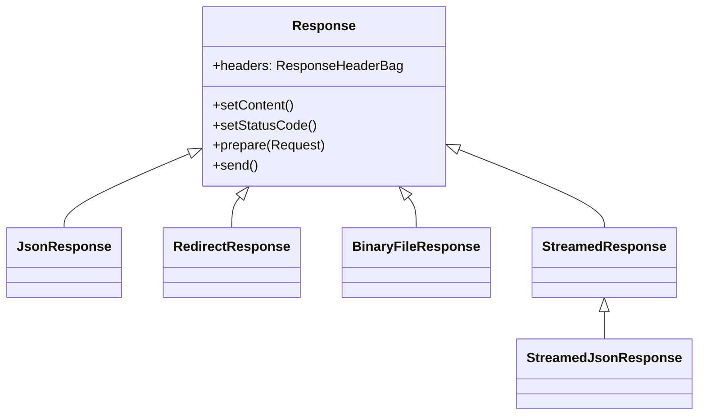
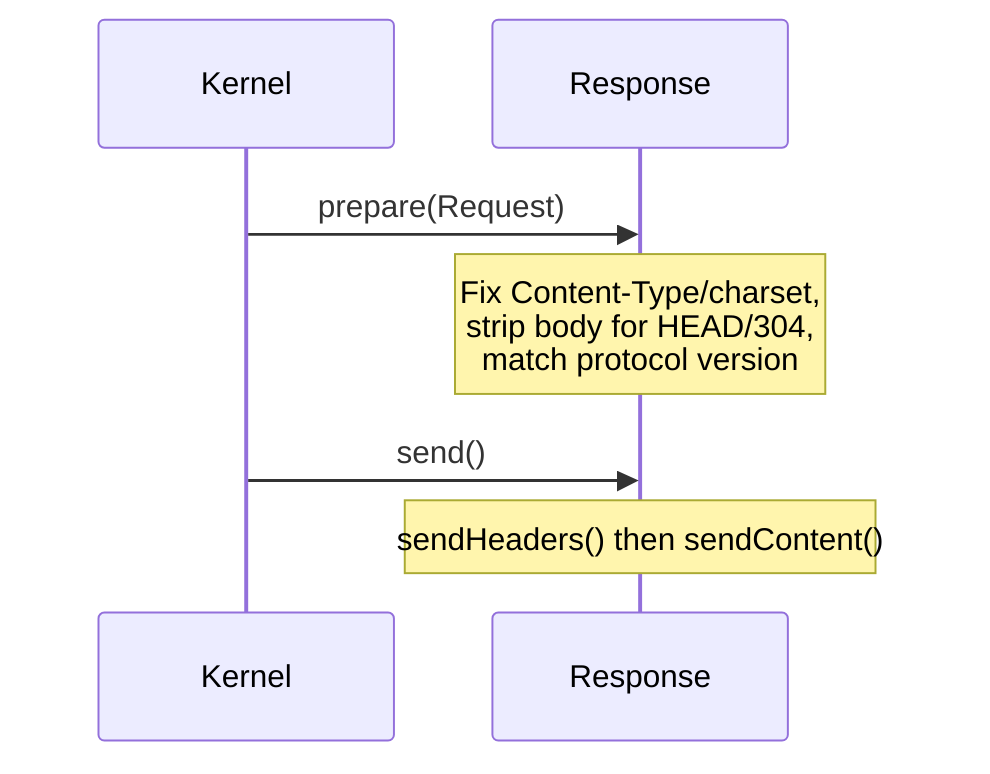

# HTTP Response

!!! tip "In a nutshell"
    `Response` models what your app sends back — status line, headers and body —
    with subclasses like `JsonResponse` for common payloads. Exam hook:
    `$response->headers` is a **`ResponseHeaderBag`**, and `prepare()` makes the
    response compliant with the request before `send()` transmits it.

!!! example "Real-world analogy"
    If the request is the letter you posted, the `Response` is the **reply the
    office mails back**. The **status line** is the outcome stamp on the outside
    (`200 OK`, `404`), the **headers** are the handling notes (content type,
    caching, cookies to keep), and the **body** is the reply itself. `prepare()`
    is the mail room making the envelope compliant with your original letter
    before `send()` drops it in the outgoing post.

!!! abstract "Learning objectives"
    By the end of this chapter you can:

    - [ ] Break an HTTP response into status line, headers and body.
    - [ ] Choose between `Response`, `JsonResponse`, `BinaryFileResponse` and
      `StreamedResponse`.
    - [ ] Manipulate headers via `ResponseHeaderBag`.
    - [ ] Explain what `Response::prepare()` and `send()` do internally.

    **Syllabus:** `HTTP → The HTTP response` ·
    **Level:** Advanced → Expert ·
    **Est. time:** 30 min ·
    **Prerequisites:** [HTTP Request](request.md) · [Status Codes](status-codes.md)

---

## Theory

An HTTP response mirrors the request:

```http
HTTP/1.1 200 OK                              ← status line
Content-Type: application/json; charset=UTF-8 ← headers
Cache-Control: private, max-age=0
                                             ← blank line
{"id":42}                                    ← body
```

- **Status line** — protocol version + [status code](status-codes.md) + reason.
- **Headers** — metadata (`Content-Type`, `Cache-Control`, `Set-Cookie`, …).
- **Body** — the payload.

```http
HTTP/1.1 200 OK
Content-Type: text/html; charset=UTF-8   ← what the body is
Cache-Control: public, max-age=3600      ← who may cache it, for how long
Set-Cookie: theme=dark; Path=/; HttpOnly ← one Set-Cookie header per cookie

<!DOCTYPE html>
```

!!! question "Predict first"
    You `new Response('hi')` and set nothing else. Can a CDN store it, and what
    `Cache-Control` does it carry?

??? note "Reveal"
    No — a default `Response` gets **`Cache-Control: no-cache, private`** from
    `ResponseHeaderBag`, so shared caches won't store it until you call
    `setPublic()`/`setSharedMaxAge()`.

## Deep Dive — how it works internally

### The `Response` family

`Symfony\Component\HttpFoundation\Response` is the base class. Its constructor is
`__construct(string $content = '', int $status = 200, array $headers = [])`.
Specialised subclasses each set the right headers for their payload:

```php
use Symfony\Component\HttpFoundation\Response;

// __construct(string $content = '', int $status = 200, array $headers = [])
$response = new Response(
    '<h1>Hello</h1>',
    Response::HTTP_OK,
    ['Content-Type' => 'text/html; charset=UTF-8'],
);
```

| Class (FQCN under `Symfony\Component\HttpFoundation`) | Use for | Sets |
|---|---|---|
| `Response` | Any content | `Content-Type: text/html` by default |
| `JsonResponse` | JSON APIs | Encodes data, `Content-Type: application/json` |
| `RedirectResponse` | Redirects | `Location` header, 302 by default |
| `BinaryFileResponse` | Serving a file on disk | `Content-Type`, ranges, disposition |
| `StreamedResponse` | Large/generated output | Streams a callback, no buffering |
| `StreamedJsonResponse` | Streaming JSON of a generator | Chunked JSON |



!!! note "Source reference"
    `Symfony\Component\HttpFoundation\Response` and subclasses —
    [symfony/symfony `8.0`](https://github.com/symfony/symfony/blob/8.0/src/Symfony/Component/HttpFoundation/Response.php).

### `ResponseHeaderBag`

`$response->headers` is a `Symfony\Component\HttpFoundation\ResponseHeaderBag`
(subclass of `HeaderBag`). It adds cookie management and `Cache-Control`
normalisation:

```php
$response->headers->set('X-Robots-Tag', 'noindex');
$response->headers->setCookie($cookie);       // add a Set-Cookie
$response->headers->clearCookie('session');   // expire a cookie
$response->headers->getCookies();             // Cookie[]
```

`ResponseHeaderBag` computes a sensible `Cache-Control` automatically: if you set
none, it becomes `no-cache, private`; setting `max-age`/`public` adjusts it. This
is why the *default* response is not cacheable by shared caches.

```php
$response = new Response('hi');
$response->headers->get('Cache-Control'); // "no-cache, private" — computed default

$response->setPublic();
$response->setMaxAge(3600);
$response->headers->get('Cache-Control'); // "max-age=3600, public"
```

### `prepare()` and `send()` — the lifecycle



- **`prepare(Request $request)`** makes the response *compliant* with the request:
  removes the body for `HEAD` and `304`/`204`, sets the charset, fixes
  `Content-Type`/`Content-Length`, and aligns the protocol version. The kernel
  calls it automatically before sending.
- **`send()`** calls `sendHeaders()` (status line + headers + cookies) then
  `sendContent()` (echoes the body). `StreamedResponse::sendContent()` invokes the
  callback so nothing is buffered in memory.

```php
// What the kernel runs at the end of every request:
$response->prepare($request); // HEAD/204/304 -> body stripped; charset,
                              // Content-Type and Content-Length fixed
$response->send();            // sendHeaders() first, then sendContent()

// StreamedResponse overrides sendContent() to invoke your callback
(new StreamedResponse(fn () => print('chunk')))->send();
```

### Response-building helpers

`setStatusCode(int $code, ?string $text = null)`, `setContent()`,
`setCharset('UTF-8')`, and the caching setters `setPublic()`, `setPrivate()`,
`setMaxAge()`, `setSharedMaxAge()`, `setEtag()`, `setLastModified()`,
`isNotModified(Request)`, `setCache([...])` — see [Caching Overview](caching.md).

```php
$response->setStatusCode(Response::HTTP_OK);
$response->setContent('<p>cached page</p>');
$response->setCharset('UTF-8');

$response->setPrivate();          // one user only
$response->setPublic();           // shared caches may store it
$response->setMaxAge(60);         // browser TTL (seconds)
$response->setSharedMaxAge(3600); // proxy/CDN TTL — implies public
$response->setEtag('v1');         // validator: ETag
$response->setLastModified(new \DateTimeImmutable('2026-01-01')); // validator: date

// Same, in one call
$response->setCache(['public' => true, 'max_age' => 60, 's_maxage' => 3600]);

// True when the client cache is still fresh — body stripped, 304 sent
if ($response->isNotModified($request)) {
    return $response;
}
```

### Streaming vs buffering (memory)

`StreamedResponse` and `BinaryFileResponse` avoid loading the whole payload into
memory. Serving a 2 GB download with `new Response(file_get_contents(...))` will
exhaust memory; `BinaryFileResponse` (which supports HTTP range requests and
`X-Sendfile`) or `StreamedResponse` will not.

## Configuration & code

=== "PHP Attributes"

    ```php
    <?php
    declare(strict_types=1);

    namespace App\Controller;

    use Symfony\Bundle\FrameworkBundle\Controller\AbstractController;
    use Symfony\Component\HttpFoundation\BinaryFileResponse;
    use Symfony\Component\HttpFoundation\HeaderUtils;
    use Symfony\Component\HttpFoundation\JsonResponse;
    use Symfony\Component\HttpFoundation\Response;
    use Symfony\Component\HttpFoundation\StreamedResponse;
    use Symfony\Component\Routing\Attribute\Route;

    final class DownloadController extends AbstractController
    {
        #[Route('/api/ping')]
        public function ping(): JsonResponse
        {
            return new JsonResponse(['pong' => true], Response::HTTP_OK);
        }

        #[Route('/invoice/{id}.pdf')]
        public function invoice(string $id): BinaryFileResponse
        {
            $response = new BinaryFileResponse(\sprintf('%s/invoices/%s.pdf', \sys_get_temp_dir(), $id));
            $response->setContentDisposition(
                HeaderUtils::DISPOSITION_ATTACHMENT, // force download
                "invoice-{$id}.pdf",
            );

            return $response;
        }

        #[Route('/export.csv')]
        public function export(): StreamedResponse
        {
            $response = new StreamedResponse(function (): void {
                $out = \fopen('php://output', 'wb');
                \fputcsv($out, ['id', 'name']);
                foreach ([[1, 'Ada'], [2, 'Alan']] as $row) {
                    \fputcsv($out, $row);
                }
                \fclose($out);
            });
            $response->headers->set('Content-Type', 'text/csv; charset=UTF-8');

            return $response;
        }
    }
    ```

=== "Console"

    ```console
    $ curl -i https://localhost/api/ping
    HTTP/1.1 200 OK
    Content-Type: application/json
    {"pong":true}
    ```

!!! info "`makeDisposition` moved"
    Use `Symfony\Component\HttpFoundation\HeaderUtils::makeDisposition()` (or
    `BinaryFileResponse::setContentDisposition()`); the old
    `ResponseHeaderBag::makeDisposition()` was removed.

## Best practices & anti-patterns

| ✅ Do | ❌ Avoid |
|---|---|
| `JsonResponse` for APIs | `new Response(json_encode(...))` by hand |
| `BinaryFileResponse`/`StreamedResponse` for large output | `file_get_contents()` into a `Response` |
| Let the kernel call `prepare()` | Manually echoing headers with `header()` |
| Use `Response::HTTP_*` constants | Magic numbers |

## When (not) to use it / alternatives

Use `StreamedResponse` when output is generated incrementally or is too big for
memory; use `BinaryFileResponse` when the bytes already exist on disk (it adds
range + conditional support for free). For simple templated pages, controllers
return `$this->render()` which produces a `Response`.

!!! danger "Certification traps"
    - **`prepare()` strips the body for `HEAD`, `204` and `304`** and fixes
      charset/`Content-Type` — you rarely call it yourself; the kernel does.
    - `$response->headers` is a **`ResponseHeaderBag`**, not a plain `HeaderBag`;
      it manages cookies and normalises `Cache-Control`.
    - A default `Response` gets **`Cache-Control: no-cache, private`** — it is
      *not* shared-cacheable until you call `setPublic()`/`setSharedMaxAge()`.
    - `JsonResponse::fromJsonString()` sets JSON content without re-encoding.
    - `makeDisposition()` lives on `HeaderUtils`, not `ResponseHeaderBag`.

!!! warning "Common mistakes"
    - Buffering huge files into memory instead of streaming.
    - Setting `Content-Type` manually on a `JsonResponse` (it already does).
    - Calling `send()` twice, or echoing before `send()` (breaks headers).

## Exercises

1. **(Advanced)** Return a `201 Created` JSON response with a `Location` header
   pointing at the new resource.
2. **(Expert)** Stream a large CSV without loading it into memory, forcing a
   browser download named `report.csv`.

??? success "Solutions"

    **1.**
    ```php
    $response = new JsonResponse(['id' => 42], Response::HTTP_CREATED);
    $response->headers->set('Location', '/articles/42');
    return $response;
    ```

    **2.** Use `StreamedResponse` writing to `php://output` (see the export action
    above) plus
    `$response->headers->set('Content-Disposition',
    HeaderUtils::makeDisposition(HeaderUtils::DISPOSITION_ATTACHMENT, 'report.csv'));`

## Certification questions

??? question "Q1. Which class avoids loading a large on-disk file into memory and supports range requests?"
    - [ ] A. `Response`
    - [ ] B. `JsonResponse`
    - [x] C. `BinaryFileResponse` ✅
    - [ ] D. `RedirectResponse`

    **Why:** `BinaryFileResponse` streams a file, supports `Range` requests and
    `X-Sendfile`.
    **Ref:** [Streaming responses](https://symfony.com/doc/current/components/http_foundation.html#serving-files).

??? question "Q2. What does `Response::prepare()` do?"
    - [x] A. Makes the response compliant with the request (charset, body for HEAD/304, protocol) ✅
    - [ ] B. Sends the headers and body
    - [ ] C. Validates the status code
    - [ ] D. Encodes JSON

    **Why:** `prepare()` normalises the response against the incoming `Request`;
    `send()` transmits it.
    **Ref:** [Symfony source — Response](https://github.com/symfony/symfony/blob/8.0/src/Symfony/Component/HttpFoundation/Response.php).

??? question "Q3. What is `$response->headers` an instance of?"
    - [ ] A. `HeaderBag`
    - [ ] B. `ParameterBag`
    - [x] C. `ResponseHeaderBag` ✅
    - [ ] D. `InputBag`

    **Why:** `ResponseHeaderBag` extends `HeaderBag` and adds cookie + Cache-Control handling.
    **Ref:** [Symfony source](https://github.com/symfony/symfony/blob/8.0/src/Symfony/Component/HttpFoundation/ResponseHeaderBag.php).

## Key takeaways

- Base `Response` + subclasses: `JsonResponse`, `RedirectResponse`,
  `BinaryFileResponse`, `StreamedResponse`.
- `$response->headers` is a `ResponseHeaderBag` (cookies + Cache-Control).
- `prepare()` normalises, `send()` = `sendHeaders()` + `sendContent()`.
- Stream large output; never buffer huge files into memory.

## Last-minute revision

!!! tip "Cheat sheet"
    - `new Response($body, $status, $headers)`; default `Cache-Control: no-cache, private`.
    - `JsonResponse::fromJsonString()`, `RedirectResponse(url, 302)`.
    - `BinaryFileResponse` = files on disk (range/X-Sendfile);
      `StreamedResponse` = generated output.
    - Disposition via `HeaderUtils::makeDisposition()`.

## Connections

- **Depends on:** [HTTP Request](request.md) — `prepare(Request)` makes the response compliant with the incoming request.
- **Reused in:** [The Response (Controllers)](../controllers/response.md) — `$this->render()`/`json()` hand you a `Response`.
- **Confused with:** [Caching Overview](caching.md) — the cache setters (`setPublic`, `setEtag`) live on `Response`.

## Official References
- [Symfony docs — HttpFoundation Response](https://symfony.com/doc/current/components/http_foundation.html#response)
- [Symfony source — Response](https://github.com/symfony/symfony/blob/8.0/src/Symfony/Component/HttpFoundation/Response.php)
- [Symfony source — ResponseHeaderBag](https://github.com/symfony/symfony/blob/8.0/src/Symfony/Component/HttpFoundation/ResponseHeaderBag.php)

## Video references

!!! tip "Watch & learn"
    These are official, continuously-updated video channels — search them for
    "HTTP foundation" to reinforce this chapter. We link stable channels rather than
    individual videos so the references never rot.

    - [SymfonyCasts screencasts](https://symfonycasts.com/tracks/symfony) — scripted, code-along tutorials.
    - [Symfony official YouTube](https://www.youtube.com/@SymfonyOfficial) — SymfonyCon conference talks & keynotes.
    - [Official docs for this topic](https://symfony.com/doc/current/components/http_foundation.html#serving-files) — some Symfony doc pages embed a screencast.

## Confidence check

I'm ready when I can:

- [ ] explain **why** the `Response` subclasses exist and when to pick each
- [ ] choose between `Response`, `JsonResponse`, `BinaryFileResponse` and `StreamedResponse`
- [ ] debug a huge-file download that exhausts memory (buffering vs streaming)
- [ ] spot the trick: `$response->headers` is a `ResponseHeaderBag`, and `prepare()` strips the body for HEAD/304
- [ ] explain what `prepare()` and `send()` (`sendHeaders()` + `sendContent()`) do internally

---

<small>Related: [HTTP Request](request.md) · [Status Codes](status-codes.md) ·
[The Response (Controllers)](../controllers/response.md) · [Caching Overview](caching.md)</small>
