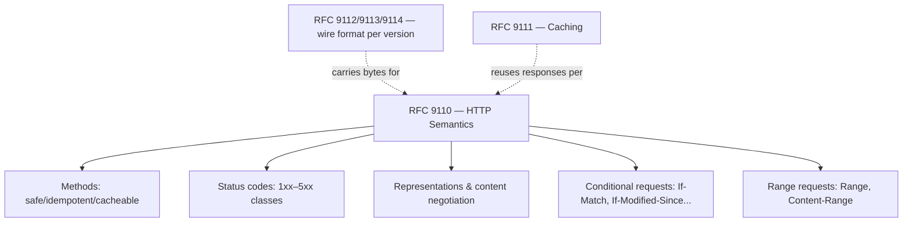

# Spécification HTTP (RFC 9110)

!!! tip "In a nutshell"
    RFC 9110 ("HTTP Semantics") est la spécification indépendante de la
    version de *ce que signifie HTTP* — méthodes, codes de statut, champs
    d'en-tête, négociation de contenu, requêtes conditionnelles et de plage —
    séparée de *comment les octets sont encadrés sur le fil* (RFC 9112 pour
    HTTP/1.1) et de *comment les réponses peuvent être réutilisées* (RFC 9111,
    caching). [Client/Server Interaction](client-server.fr.md) est
    l'introduction de cette plateforme au protocole ; ça ne remplace pas
    RFC 9110 comme la définition faisant autorité sur laquelle l'examen
    s'appuie.

!!! example "Real-world analogy"
    RFC 9110 est le règlement qui définit ce que *signifie* une "lettre
    recommandée" ou un "accusé de réception" — peu importe qu'elle voyage
    par camion, avion, ou drone. Le mode de livraison (HTTP/1.1, /2, /3 —
    RFC 9112/9113/9114) peut changer ; le sens de la request et de la
    réponse, et ce qu'un coursier a le droit d'en déduire, ne change pas.

!!! abstract "Learning objectives"
    À la fin de ce chapitre, vous saurez :

    - [ ] Nommer quelles RFC ont remplacé RFC 7230–7235 et ce que chacune couvre désormais.
    - [ ] Énoncer les propriétés sémantiques (sûre, idempotente, cacheable) que RFC 9110
          attribue à chaque méthode de base.
    - [ ] Expliquer ce que régit RFC 9110 par rapport à RFC 9111 et RFC 9112.

    **Syllabus:** `HTTP → HTTP Specification (RFC 9110)` ·
    **Level:** Expert ·
    **Est. time:** 20 min ·
    **Prerequisites:** [Client/Server Interaction](client-server.fr.md)

    **Examen Symfony 8 :** OUI

---

## Pour les nuls

### L'idée en une phrase
RFC 9110 est le "dictionnaire officiel" qui définit ce que veulent dire les mots d'HTTP (méthodes, codes, en-têtes) — indépendamment du moyen de transport utilisé.

### Imagine dans la vraie vie
Un règlement postal définit ce que signifie "lettre recommandée avec accusé de réception", quel que soit le mode de transport — camion, avion ou vélo. Le mode de transport peut changer (HTTP/1.1, 2, 3), mais ce qu'une "lettre recommandée" *signifie* pour l'expéditeur et le facteur ne change jamais.

### Dans Symfony
Quand `Request`/`Response` définissent la sémantique d'une méthode GET ou d'un code 404, ils implémentent ce que RFC 9110 a défini — pas une convention Symfony maison.

### Exemple simple
```
GET /produits HTTP/1.1
```
Ce que "GET" *signifie* (sûr, sans effet de bord) vient de RFC 9110 — pas du protocole de transport utilisé pour l'envoyer.

### Comment le mémoriser 🧠
Trois RFC, trois rôles : **9110 = le sens** des mots ("que veut dire GET ?"), **9111 = la réutilisation** (cache), **9112 = le transport** (comment les octets voyagent en HTTP/1.1).

## Theory

Pendant des années, la spécification d'HTTP/1.1 était éparpillée sur les
RFC 7230–7235 (2014), chacune couvrant une facette (syntaxe des messages,
sémantique, requêtes conditionnelles, requêtes de plage, cache,
authentification). En 2022, le groupe de travail IETF HTTPbis a remplacé cet
ensemble par un découpage plus propre selon un autre axe — **sémantique**
vs **format sur le fil** vs **cache** — pour qu'un seul document
indépendant du protocole puisse décrire le sens d'HTTP pour HTTP/1.1,
HTTP/2 et HTTP/3 à la fois :

| RFC | Title | Replaces |
|---|---|---|
| **RFC 9110** | HTTP Semantics | RFC 7231, 7232, 7233, 7235, 7538 |
| RFC 9111 | HTTP Caching | RFC 7234 |
| RFC 9112 | HTTP/1.1 | RFC 7230 |
| RFC 9113 | HTTP/2 | RFC 7540 |
| RFC 9114 | HTTP/3 | (new) |

RFC 9110 est celle qui compte le plus pour la correction au niveau
applicatif : c'est là que sont formellement définis "que signifie GET",
"qu'est-ce qui fait qu'un code de statut est une redirection", et
"qu'est-ce qu'une méthode sûre", indépendamment de la version de transport
qui a réellement porté les octets.

!!! question "Predict first"
    La disposition exacte des octets d'une ligne de requête
    (`GET /path HTTP/1.1\r\n`) fait-elle partie de RFC 9110, ou d'une autre RFC ?

??? note "Reveal"
    Une autre RFC — **RFC 9112** (syntaxe des messages HTTP/1.1). RFC 9110
    définit le *sens* de la requête (sémantique des méthodes, sémantique des
    en-têtes) indépendamment de comment elle est encadrée sur le fil ;
    l'encadrement est spécifique à la version (9112 pour HTTP/1.1, 9113 pour
    HTTP/2, 9114 pour HTTP/3).

## Deep Dive — how it works internally

### What RFC 9110 actually defines

RFC 9110 est organisée autour des concepts sur lesquels s'appuie chaque
chapitre suivant de cette étape :

- **Méthodes et leurs propriétés** — *sûre* (aucun effet de bord côté
  serveur prévu), *idempotente* (N requêtes identiques ont le même effet
  qu'une seule), et *cacheable* sont des propriétés que RFC 9110 attribue
  par méthode, pas des conventions inventées par Symfony. Voir
  [HTTP Methods](methods.md) pour le tableau par méthode.
- **Codes de statut** — les cinq classes (1xx Informational, 2xx Successful,
  3xx Redirection, 4xx Client Error, 5xx Server Error) et la sémantique de
  chaque code enregistré. Voir [Status Codes](status-codes.md) pour les
  constantes de Symfony.
- **Représentations et négociation de contenu** — une *représentation*
  (corps + métadonnées : `Content-Type`, `Content-Encoding`,
  `Content-Language`) est distincte de la *ressource* qu'elle représente ;
  la négociation choisit quelle représentation renvoyer. Voir
  [Content Negotiation](content-negotiation.md).
- **Requêtes conditionnelles** — `If-Match`, `If-None-Match`,
  `If-Modified-Since`, `If-Unmodified-Since` permettent à un client de
  conditionner une requête à l'état actuel d'une ressource, ce qui
  sous-tend [HTTP Caching validation](../http-caching/validation.md).
- **Requêtes de plage** — `Range`/`Content-Range`/`Accept-Ranges`, pour
  récupérer une partie d'une représentation.



### Why Symfony's API matches this split

Les objets `Request`/`Response` de `HttpFoundation` de Symfony sont une
abstraction indépendante de la version au-dessus de la couche
*sémantique* — exactement la couche que décrit RFC 9110. C'est pourquoi
`$request->getMethod()`, `$response->setStatusCode()`, et les helpers
`Cache-Control`/`ETag` sur `Response` n'ont jamais besoin de savoir si la
connexion sous-jacente était HTTP/1.1, /2, ou /3 : le transport
(RFC 9112/9113/9114) est le problème du serveur web (voir
[Client/Server Interaction](client-server.fr.md)), tandis que
`Request`/`Response` modélisent la sémantique RFC 9110 sur laquelle
raisonne réellement le code PHP.

!!! note "Source reference"
    `Symfony\Component\HttpFoundation\Response::isCacheable()` implémente
    directement la règle RFC 9110 des codes de statut cacheables —
    [symfony/symfony `8.0`](https://github.com/symfony/symfony/blob/8.0/src/Symfony/Component/HttpFoundation/Response.php).

### Null behavior

RFC 9110 elle-même n'a pas de "null" — mais une confusion courante proche
de l'examen consiste à traiter un en-tête **absent** comme équivalent à une
valeur d'en-tête **vide**. RFC 9110 trace cette ligne précisément : un
champ d'en-tête non présent dans le message est simplement absent (le
`HeaderBag::get()` de Symfony renvoie `null` pour lui), tandis qu'un champ
d'en-tête présent avec une valeur vide est une vraie valeur explicite. Les
deux ne sont pas interchangeables quand la sémantique d'un en-tête dépend
de sa présence (par ex. un en-tête de requête conditionnelle).

```php
$request->headers->get('If-None-Match');       // null — en-tête absent
$request->headers->get('If-None-Match', '');   // '' — valeur par défaut explicite que tu as choisie,
                                                //      pas quelque chose que le message a envoyé
```

!!! note "Null in real life"
    Une lettre sans demande d'accusé de réception est différente d'un
    coupon d'accusé de réception rempli en blanc — RFC 9110 traite "tu n'as
    pas demandé" et "tu as demandé rien de particulier" comme des
    situations distinctes.

## Configuration & code

=== "PHP Attributes"

    ```php
    <?php
    declare(strict_types=1);

    namespace App\Controller;

    use Symfony\Component\HttpFoundation\Response;
    use Symfony\Component\Routing\Attribute\Route;

    final class ResourceController
    {
        #[Route('/resource/{id}', methods: ['GET'])]
        public function show(int $id): Response
        {
            $response = new Response('...');
            // Règle RFC 9110 des codes de statut cacheables, appliquée par Symfony :
            $response->setStatusCode(200); // 200 est cacheable selon RFC 9110
            return $response;
        }
    }
    ```

=== "Console"

    ```console
    $ curl -I https://example.com/resource/1
    HTTP/2 200
    content-type: application/json
    etag: "abc123"
    ```

## Best practices & anti-patterns

| ✅ Do | ❌ Avoid |
|---|---|
| Traiter la sûreté/idempotence des méthodes comme un contrat protocolaire | Faire muter l'état par GET "parce que c'est pratique" |
| Distinguer un en-tête absent d'un en-tête vide | Mettre `''` par défaut pour chaque en-tête manquant et perdre la distinction |
| Raisonner sur la sémantique indépendamment de la version HTTP | Supposer que des détails d'encadrement spécifiques à HTTP/2 affectent le code applicatif |

## When (not) to use it / alternatives

Il n'y a pas d'alternative à RFC 9110 pour la sémantique HTTP — c'est la
spécification, pas une option parmi d'autres. Ce qui varie, c'est *quelle*
partie une tâche donnée nécessite : allez vers [Methods](methods.md) ou
[Status Codes](status-codes.md) pour la surface d'API quotidienne, et
revenez à ce chapitre quand une question porte vraiment sur la règle
sous-jacente que ces chapitres implémentent.

!!! danger "Certification traps"
    - RFC 9110 a remplacé **RFC 7231, 7232, 7233, 7235, et 7538** — pas 7230
      (devenue RFC 9112) ni 7234 (devenue RFC 9111).
    - "Sûre", "idempotente", et "cacheable" sont des propriétés formelles que
      RFC 9110 attribue **par méthode** — ce ne sont pas des conventions Symfony.
    - La sémantique HTTP (RFC 9110) est **indépendante de la version** ;
      l'encadrement sur le fil ne l'est pas (RFC 9112/9113/9114 diffèrent
      selon la version HTTP).
    - Un en-tête absent et un en-tête présent avec une valeur vide sont des
      **choses différentes** selon le modèle de RFC 9110.

!!! warning "Common mistakes"
    - Citer "RFC 7231" pour la sémantique HTTP dans un contexte Symfony 8 —
      elle a été rendue obsolète par RFC 9110 en 2022.
    - Supposer que les règles de cache HTTP vivent dans RFC 9110 — le cache
      c'est RFC 9111.

## Exercises

1. **(Advanced)** Listez quelle RFC définit désormais : (a) la sémantique
   des méthodes, (b) l'encadrement des messages HTTP/1.1, (c) le cache.
2. **(Expert)** Expliquez pourquoi les objets `Request`/`Response` de
   Symfony ne changent pas de forme entre une requête HTTP/1.1 et HTTP/3.

??? success "Solutions"

    **1.** (a) RFC 9110, (b) RFC 9112, (c) RFC 9111.

    **2.** `Request`/`Response` modélisent la couche sémantique de RFC 9110,
    qui est explicitement indépendante de la version par conception ; le
    format sur le fil spécifique à la version (RFC 9112/9113/9114) est géré
    en dessous de Symfony, par le serveur web ou le reverse proxy, avant
    même qu'un objet `Request` ne soit construit.

## Certification questions

*Question d'entraînement inspirée du syllabus — jamais une question officielle de l'examen.*

??? question "Q1. Quelle RFC définit désormais la sémantique des méthodes HTTP et des codes de statut ?"
    - [ ] A. RFC 7230
    - [x] B. RFC 9110 ✅
    - [ ] C. RFC 9111
    - [ ] D. RFC 9112

    **Why:** RFC 9110 ("HTTP Semantics") a consolidé et remplacé RFC 7231/
    7232/7233/7235/7538. **Ref:** [RFC 9110](https://www.rfc-editor.org/rfc/rfc9110.html).

??? question "Q2. Quelle RFC régit le cache HTTP ?"
    - [ ] A. RFC 9110
    - [x] B. RFC 9111 ✅
    - [ ] C. RFC 9112
    - [ ] D. RFC 9113

    **Why:** Le cache a été extrait de l'ancienne RFC 7234 dans son propre
    document, RFC 9111, séparé de la sémantique (9110).
    **Ref:** [RFC 9111](https://www.rfc-editor.org/rfc/rfc9111.html).

??? question "Q3. Que sont sûre, idempotente et cacheable, dans les termes de RFC 9110 ?"
    - [x] A. Des propriétés formelles attribuées à chaque méthode HTTP ✅
    - [ ] B. Des flags de configuration spécifiques à Symfony
    - [ ] C. Des noms d'en-têtes HTTP
    - [ ] D. Des classes de codes de statut

    **Why:** RFC 9110 définit ces propriétés au niveau protocolaire pour les
    méthodes (par ex. GET est sûre et idempotente ; POST n'est ni l'une ni l'autre).
    **Ref:** [RFC 9110](https://www.rfc-editor.org/rfc/rfc9110.html).

## Key takeaways

- RFC 9110 définit la **sémantique** HTTP (méthodes, codes de statut,
  en-têtes, négociation, requêtes conditionnelles/de plage), indépendamment
  de la version HTTP.
- RFC 9112/9113/9114 définissent le **format sur le fil** par version HTTP ;
  RFC 9111 définit le **cache** — les deux séparés de RFC 9110.
- Les `Request`/`Response` de Symfony modélisent la couche RFC 9110, c'est
  pourquoi ils ne changent pas de forme entre HTTP/1.1, /2, /3.
- Un en-tête absent et une valeur d'en-tête vide sont distincts selon RFC 9110.

## Last-minute revision

!!! tip "Cheat sheet"
    - **9110** = Sémantique (méthodes, statuts, en-têtes, négociation, conditionnel/plage).
    - **9111** = Cache. **9112** = HTTP/1.1. **9113** = HTTP/2. **9114** = HTTP/3.
    - 9110 a remplacé 7231/7232/7233/7235/7538 — **pas** 7230 (→9112) ni 7234 (→9111).
    - Sûre / idempotente / cacheable = propriétés RFC 9110 par méthode, pas des règles du framework.

## Connections

- **Depends on:** [Client/Server Interaction](client-server.fr.md) — le
  cycle de vie de la connexion sur lequel repose la sémantique de cette
  spécification.
- **Reused in:** [HTTP Methods](methods.md), [Status Codes](status-codes.md),
  [Content Negotiation](content-negotiation.md), [HTTP Caching](../http-caching/index.md) —
  chacun de ces chapitres implémente une tranche de RFC 9110.
- **Confused with:** [HTTP Caching → Validation](../http-caching/validation.md) —
  les *en-têtes* de requête conditionnelle sont définis par RFC 9110 ; la
  *politique de cache* qui les utilise, c'est RFC 9111.

## Official References
- [RFC 9110 — HTTP Semantics](https://www.rfc-editor.org/rfc/rfc9110.html)
- [RFC 9111 — HTTP Caching](https://www.rfc-editor.org/rfc/rfc9111.html)
- [RFC 9112 — HTTP/1.1](https://www.rfc-editor.org/rfc/rfc9112.html)
- [Symfony source — Response](https://github.com/symfony/symfony/blob/8.0/src/Symfony/Component/HttpFoundation/Response.php)

## Video references

!!! tip "Watch & learn"
    Ce sont des chaînes vidéo officielles, mises à jour en continu — cherchez-y
    "HTTP semantics RFC 9110" pour renforcer ce chapitre. Nous lions des
    chaînes stables plutôt que des vidéos individuelles pour que les
    références ne deviennent jamais obsolètes.

    - [SymfonyCasts screencasts](https://symfonycasts.com/tracks/symfony) — tutoriels scénarisés, en code.
    - [Symfony official YouTube](https://www.youtube.com/@SymfonyOfficial) — conférences et keynotes SymfonyCon.
    - [Official docs for this topic](https://symfony.com/doc/8.0/components/http_foundation.html) — la doc HttpFoundation de Symfony, qui implémente cette spécification.

## Confidence check

Je suis prêt quand je peux :

- [ ] expliquer **pourquoi** la sémantique HTTP a été séparée du format sur le fil en 2022
- [ ] nommer quelle RFC a remplacé laquelle parmi RFC 7230–7235
- [ ] déboguer la confusion entre "en-tête absent" et "valeur d'en-tête vide"
- [ ] repérer le piège : le cache c'est RFC 9111, pas RFC 9110
- [ ] expliquer comment `Request`/`Response` de Symfony se projettent sur la couche sémantique de RFC 9110

---

<small>Related: [Client/Server Interaction](client-server.fr.md) · [HTTP Methods](methods.md) ·
[Status Codes](status-codes.md) · [HTTP Caching](../http-caching/index.md)</small>
