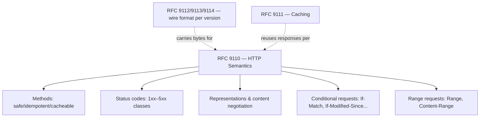

# HTTP Specification (RFC 9110)

!!! tip "In a nutshell"
    RFC 9110 ("HTTP Semantics") is the version-independent specification of
    *what HTTP means* — methods, status codes, header fields, content
    negotiation, conditional and range requests — separate from *how bytes
    are framed on the wire* (RFC 9112 for HTTP/1.1) and *how responses may be
    reused* (RFC 9111, caching). [Client/Server Interaction](client-server.md)
    is this platform's introduction to the protocol; it does not replace
    RFC 9110 as the authoritative definition the exam draws on.

!!! example "Real-world analogy"
    RFC 9110 is the rulebook that defines what a "certified letter" or a
    "return receipt" *means* — regardless of whether it travels by truck,
    plane, or drone. The delivery method (HTTP/1.1, /2, /3 — RFC 9112/9113/9114)
    can change; the meaning of the request and the reply, and what a courier
    is allowed to infer from them, does not.

!!! abstract "Learning objectives"
    By the end of this chapter you can:

    - [ ] Name which RFCs replaced RFC 7230–7235 and what each one now covers.
    - [ ] State the semantic properties (safe, idempotent, cacheable) RFC 9110
          assigns to each core method.
    - [ ] Explain what RFC 9110 governs vs. what RFC 9111 and RFC 9112 govern.

    **Syllabus:** `HTTP → HTTP Specification (RFC 9110)` ·
    **Level:** Expert ·
    **Est. time:** 20 min ·
    **Prerequisites:** [Client/Server Interaction](client-server.md)

    **Examen Symfony 8 :** OUI

---

## Pour les nuls

### L'idée en une phrase
RFC 9110 est le "dictionnaire officiel" qui définit ce que veulent dire les mots d'HTTP (méthodes, codes, en-têtes) — indépendamment du moyen de transport utilisé.

### Imagine dans la vraie vie
Un règlement postal définit ce que signifie "lettre recommandée avec accusé de réception", quel que soit le mode de transport — camion, avion ou vélo. Le mode de transport peut changer (HTTP/1.1, 2, 3), mais ce qu'une "lettre recommandée" *signifie* pour l'expéditeur et le facteur ne change jamais.

### Dans Symfony
Quand `Request`/`Response` définissent la sémantique d'une méthode GET ou d'un code 404, ils implémentent ce que RFC 9110 a défini — pas une convention Symfony maison.

### Exemple simple
```
GET /produits HTTP/1.1
```
Ce que "GET" *signifie* (sûr, sans effet de bord) vient de RFC 9110 — pas du protocole de transport utilisé pour l'envoyer.

### Comment le mémoriser 🧠
Trois RFC, trois rôles : **9110 = le sens** des mots ("que veut dire GET ?"), **9111 = la réutilisation** (cache), **9112 = le transport** (comment les octets voyagent en HTTP/1.1).

## Theory

For years, HTTP/1.1's specification was spread across RFC 7230–7235 (2014),
each covering one facet (message syntax, semantics, conditional requests,
range requests, caching, authentication). In 2022 the IETF HTTPbis working
group replaced that set with a cleaner split along a different axis —
**semantics** vs. **wire format** vs. **caching** — so that a single
protocol-agnostic document could describe HTTP's meaning for HTTP/1.1,
HTTP/2, and HTTP/3 alike:

| RFC | Title | Replaces |
|---|---|---|
| **RFC 9110** | HTTP Semantics | RFC 7231, 7232, 7233, 7235, 7538 |
| RFC 9111 | HTTP Caching | RFC 7234 |
| RFC 9112 | HTTP/1.1 | RFC 7230 |
| RFC 9113 | HTTP/2 | RFC 7540 |
| RFC 9114 | HTTP/3 | (new) |

RFC 9110 is the one that matters most for application-level correctness: it
is where "what does GET mean", "what makes a status code a redirect", and
"what is a safe method" are formally defined, independent of which
transport version actually carried the bytes.

!!! question "Predict first"
    Is the exact byte layout of a request line (`GET /path HTTP/1.1\r\n`) part
    of RFC 9110, or a different RFC?

??? note "Reveal"
    A different RFC — **RFC 9112** (HTTP/1.1 message syntax). RFC 9110 defines
    the request's *meaning* (method semantics, header semantics) independently
    of how it is framed on the wire; framing is version-specific (9112 for
    HTTP/1.1, 9113 for HTTP/2, 9114 for HTTP/3).

## Deep Dive — how it works internally

### What RFC 9110 actually defines

RFC 9110 is organized around the concepts every later chapter in this stage
relies on:

- **Methods and their properties** — *safe* (no server-side side effects
  intended), *idempotent* (N identical requests have the same effect as one),
  and *cacheable* are properties RFC 9110 assigns per method, not
  conventions Symfony invented. See [HTTP Methods](methods.md) for the
  per-method table.
- **Status codes** — the five classes (1xx Informational, 2xx Successful,
  3xx Redirection, 4xx Client Error, 5xx Server Error) and the semantics of
  each registered code. See [Status Codes](status-codes.md) for Symfony's
  constants.
- **Representations and content negotiation** — a *representation* (body +
  metadata: `Content-Type`, `Content-Encoding`, `Content-Language`) is
  distinct from the *resource* it represents; negotiation picks which
  representation to return. See [Content Negotiation](content-negotiation.md).
- **Conditional requests** — `If-Match`, `If-None-Match`,
  `If-Modified-Since`, `If-Unmodified-Since` let a client make a request
  contingent on a resource's current state, underpinning
  [HTTP Caching validation](../http-caching/validation.md).
- **Range requests** — `Range`/`Content-Range`/`Accept-Ranges`, for
  retrieving part of a representation.



### Why Symfony's API matches this split

Symfony's `HttpFoundation` `Request`/`Response` objects are a version-agnostic
abstraction over the *semantics* layer — exactly the layer RFC 9110
describes. That is why `$request->getMethod()`, `$response->setStatusCode()`,
and the `Cache-Control`/`ETag` helpers on `Response` never need to know
whether the underlying connection was HTTP/1.1, /2, or /3: the transport
(RFC 9112/9113/9114) is the web server's problem (see
[Client/Server Interaction](client-server.md)), while `Request`/`Response`
model the RFC 9110 semantics PHP code actually reasons about.

!!! note "Source reference"
    `Symfony\Component\HttpFoundation\Response::isCacheable()` implements
    RFC 9110's cacheable-status-code rule directly —
    [symfony/symfony `8.0`](https://github.com/symfony/symfony/blob/8.0/src/Symfony/Component/HttpFoundation/Response.php).

### Null behavior

RFC 9110 itself has no "null" — but a common exam-adjacent confusion is
treating an **absent** header as equivalent to an **empty** header value.
RFC 9110 draws that line precisely: a header field that is not present in
the message is simply absent (Symfony's `HeaderBag::get()` returns `null`
for it), while a header field present with an empty value is a real,
explicit value. The two are not interchangeable when the semantics of a
header depend on its presence (e.g. a conditional request header).

```php
$request->headers->get('If-None-Match');       // null — header absent
$request->headers->get('If-None-Match', '');   // '' — explicit default you chose,
                                                //      not something the message sent
```

!!! note "Null in real life"
    A letter with no return-receipt request is different from a return
    receipt slip that was filled in blank — RFC 9110 treats "you didn't ask"
    and "you asked for nothing in particular" as distinct situations.

## Configuration & code

=== "PHP Attributes"

    ```php
    <?php
    declare(strict_types=1);

    namespace App\Controller;

    use Symfony\Component\HttpFoundation\Response;
    use Symfony\Component\Routing\Attribute\Route;

    final class ResourceController
    {
        #[Route('/resource/{id}', methods: ['GET'])]
        public function show(int $id): Response
        {
            $response = new Response('...');
            // RFC 9110 cacheable-status-code rule, applied by Symfony:
            $response->setStatusCode(200); // 200 is cacheable per RFC 9110
            return $response;
        }
    }
    ```

=== "Console"

    ```console
    $ curl -I https://example.com/resource/1
    HTTP/2 200
    content-type: application/json
    etag: "abc123"
    ```

## Best practices & anti-patterns

| ✅ Do | ❌ Avoid |
|---|---|
| Treat method safety/idempotency as protocol contract | Making GET mutate state because "it's convenient" |
| Distinguish an absent header from an empty one | Defaulting every missing header to `''` and losing the distinction |
| Reason about semantics independent of HTTP version | Assuming HTTP/2-specific framing details affect application code |

## When (not) to use it / alternatives

There is no alternative to RFC 9110 for HTTP semantics — it is the
specification, not one option among several. What varies is *which* part of
it a given task needs: reach for [Methods](methods.md) or
[Status Codes](status-codes.md) for the day-to-day API surface, and come
back to this chapter when a question is really about the underlying rule
those chapters implement.

!!! danger "Certification traps"
    - RFC 9110 replaced **RFC 7231, 7232, 7233, 7235, and 7538** — not 7230
      (that became RFC 9112) or 7234 (that became RFC 9111).
    - "Safe", "idempotent", and "cacheable" are formal properties RFC 9110
      assigns **per method** — they are not Symfony conventions.
    - HTTP semantics (RFC 9110) are **version-independent**; wire framing is
      not (RFC 9112/9113/9114 differ per HTTP version).
    - An absent header and a header present with an empty value are
      **different things** under RFC 9110's model.

!!! warning "Common mistakes"
    - Citing "RFC 7231" for HTTP semantics in a Symfony 8 context — it was
      obsoleted by RFC 9110 in 2022.
    - Assuming HTTP caching rules live in RFC 9110 — caching is RFC 9111.

## Exercises

1. **(Advanced)** List which RFC now defines: (a) method semantics, (b)
   HTTP/1.1 message framing, (c) caching.
2. **(Expert)** Explain why `Request`/`Response` objects in Symfony don't
   change shape between an HTTP/1.1 and an HTTP/3 request.

??? success "Solutions"

    **1.** (a) RFC 9110, (b) RFC 9112, (c) RFC 9111.

    **2.** `Request`/`Response` model the RFC 9110 semantics layer, which is
    explicitly version-independent by design; the version-specific wire
    format (RFC 9112/9113/9114) is handled below Symfony, by the web server
    or reverse proxy, before a `Request` object is ever built.

## Certification questions

*Question d'entraînement inspirée du syllabus — jamais une question officielle de l'examen.*

??? question "Q1. Which RFC now defines HTTP method and status-code semantics?"
    - [ ] A. RFC 7230
    - [x] B. RFC 9110 ✅
    - [ ] C. RFC 9111
    - [ ] D. RFC 9112

    **Why:** RFC 9110 ("HTTP Semantics") consolidated and replaced RFC 7231/
    7232/7233/7235/7538. **Ref:** [RFC 9110](https://www.rfc-editor.org/rfc/rfc9110.html).

??? question "Q2. Which RFC governs HTTP caching?"
    - [ ] A. RFC 9110
    - [x] B. RFC 9111 ✅
    - [ ] C. RFC 9112
    - [ ] D. RFC 9113

    **Why:** Caching was split out of the old RFC 7234 into its own document,
    RFC 9111, separate from semantics (9110).
    **Ref:** [RFC 9111](https://www.rfc-editor.org/rfc/rfc9111.html).

??? question "Q3. What are safe, idempotent and cacheable, in RFC 9110's terms?"
    - [x] A. Formal properties assigned to each HTTP method ✅
    - [ ] B. Symfony-specific configuration flags
    - [ ] C. HTTP header names
    - [ ] D. Status code classes

    **Why:** RFC 9110 defines these as protocol-level properties of methods
    (e.g. GET is safe and idempotent; POST is neither).
    **Ref:** [RFC 9110](https://www.rfc-editor.org/rfc/rfc9110.html).

## Key takeaways

- RFC 9110 defines HTTP **semantics** (methods, status codes, headers,
  negotiation, conditional/range requests), independent of HTTP version.
- RFC 9112/9113/9114 define the **wire format** per HTTP version; RFC 9111
  defines **caching** — both separate from RFC 9110.
- Symfony's `Request`/`Response` model the RFC 9110 layer, which is why they
  don't change shape across HTTP/1.1, /2, /3.
- An absent header and an empty header value are distinct under RFC 9110.

## Last-minute revision

!!! tip "Cheat sheet"
    - **9110** = Semantics (methods, status, headers, negotiation, conditional/range).
    - **9111** = Caching. **9112** = HTTP/1.1. **9113** = HTTP/2. **9114** = HTTP/3.
    - 9110 replaced 7231/7232/7233/7235/7538 — **not** 7230 (→9112) or 7234 (→9111).
    - Safe / idempotent / cacheable = per-method RFC 9110 properties, not framework rules.

## Connections

- **Depends on:** [Client/Server Interaction](client-server.md) — the
  connection lifecycle this specification's semantics ride on.
- **Reused in:** [HTTP Methods](methods.md), [Status Codes](status-codes.md),
  [Content Negotiation](content-negotiation.md), [HTTP Caching](../http-caching/index.md) —
  every one of these chapters implements a slice of RFC 9110.
- **Confused with:** [HTTP Caching → Validation](../http-caching/validation.md) —
  conditional-request *headers* are defined by RFC 9110; the *caching policy*
  that uses them is RFC 9111.

## Official References
- [RFC 9110 — HTTP Semantics](https://www.rfc-editor.org/rfc/rfc9110.html)
- [RFC 9111 — HTTP Caching](https://www.rfc-editor.org/rfc/rfc9111.html)
- [RFC 9112 — HTTP/1.1](https://www.rfc-editor.org/rfc/rfc9112.html)
- [Symfony source — Response](https://github.com/symfony/symfony/blob/8.0/src/Symfony/Component/HttpFoundation/Response.php)

## Video references

!!! tip "Watch & learn"
    These are official, continuously-updated video channels — search them for
    "HTTP semantics RFC 9110" to reinforce this chapter. We link stable channels
    rather than individual videos so the references never rot.

    - [SymfonyCasts screencasts](https://symfonycasts.com/tracks/symfony) — scripted, code-along tutorials.
    - [Symfony official YouTube](https://www.youtube.com/@SymfonyOfficial) — SymfonyCon conference talks & keynotes.
    - [Official docs for this topic](https://symfony.com/doc/8.0/components/http_foundation.html) — Symfony's HttpFoundation docs, which implement this specification.

## Confidence check

I'm ready when I can:

- [ ] explain **why** HTTP semantics were split from wire format in 2022
- [ ] name which RFC replaced which of RFC 7230–7235
- [ ] debug confusion between "absent header" and "empty header value"
- [ ] spot the trap: caching is RFC 9111, not RFC 9110
- [ ] explain how Symfony's `Request`/`Response` map onto the RFC 9110 semantics layer

---

<small>Related: [Client/Server Interaction](client-server.md) · [HTTP Methods](methods.md) ·
[Status Codes](status-codes.md) · [HTTP Caching](../http-caching/index.md)</small>
