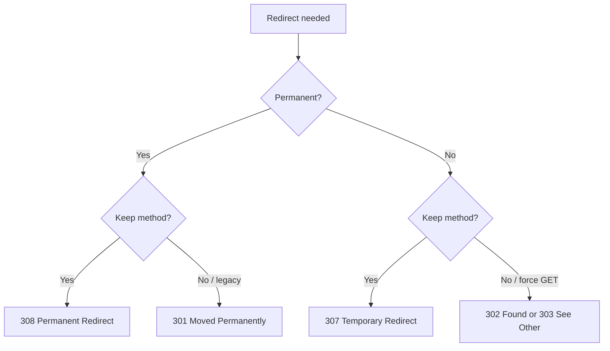

# Status Codes

!!! tip "In a nutshell"
    Un status code indique au client le sort de sa request ; le premier chiffre
    fixe la famille (2xx succès, 3xx redirection, 4xx erreur client, 5xx erreur
    serveur). Piège d'examen : 307/308 préservent la méthode, 303 force GET ;
    **401 = non authentifié, 403 = non autorisé**.

!!! example "Real-world analogy"
    Un status code est le **tampon de résultat de livraison** que la poste appose
    sur un envoi retourné : « Distribué » en vert (`2xx`), « Adresse modifiée —
    réexpédié » (`3xx`), « Destinataire inconnu / non autorisé » (`4xx`), ou
    « Le centre de tri a pris feu » (`5xx`). Le client agit sur le tampon, pas
    sur la note manuscrite à côté — tout comme les clients HTTP agissent sur le
    code numérique, pas sur la reason phrase.

!!! abstract "Learning objectives"
    À la fin de ce chapitre, vous saurez :

    - [ ] Classer n'importe quel status code dans sa famille 1xx–5xx et sa
      signification.
    - [ ] Choisir correctement entre 301/302/303/307/308, 401/403, 404/410.
    - [ ] Expliquer quand 422 et 429 s'appliquent et leurs headers associés.
    - [ ] Utiliser `Response::$statusTexts` et les constantes `Response::HTTP_*`.

    **Syllabus:** `HTTP → Status codes` ·
    **Level:** Advanced ·
    **Est. time:** 25 min ·
    **Prerequisites:** [Client / Server](client-server.md)

---

## Theory

Chaque response HTTP porte un **status code** à trois chiffres et une courte
**reason phrase** (p. ex. `404 Not Found`). Le premier chiffre définit la
*classe* :

| Classe | Signification | Exemples |
|---|---|---|
| **1xx** | Informationnel | 100 Continue, 101 Switching Protocols, 103 Early Hints |
| **2xx** | Succès | 200 OK, 201 Created, 204 No Content, 206 Partial Content |
| **3xx** | Redirection | 301, 302, 303, 304, 307, 308 |
| **4xx** | Erreur client | 400, 401, 403, 404, 405, 409, 410, 415, 422, 429 |
| **5xx** | Erreur serveur | 500, 502, 503, 504 |

La reason phrase est purement informative ; les clients agissent sur le code
numérique.

!!! question "Predict first"
    Une API reçoit du JSON bien formé qui échoue à la validation. Est-ce un 400,
    un 422 ou un 500 ?

??? note "Reveal"
    **422 Unprocessable Content** — la syntaxe est valide mais le contenu est
    sémantiquement incorrect. 400 est réservé à la syntaxe malformée ; 500 est
    une faute serveur. `Response::HTTP_UNPROCESSABLE_ENTITY` vaut **422** (la
    constante garde l'ancien nom).

## Deep Dive — how it works internally

### `Response::$statusTexts`

`Symfony\Component\HttpFoundation\Response` contient une map **public static**
de chaque code connu vers sa reason phrase, plus une constante `HTTP_*` par
code :

```php
<?php
declare(strict_types=1);

use Symfony\Component\HttpFoundation\Response;

Response::HTTP_NOT_FOUND;                     // 404 (int constant)
Response::$statusTexts[404];                  // 'Not Found'
Response::$statusTexts[Response::HTTP_I_AM_A_TEAPOT]; // "I'm a teapot"
```

Quand vous appelez `new Response($body, Response::HTTP_CREATED)`,
`setStatusCode()` consulte `$statusTexts` pour remplir la reason phrase si vous
n'en fournissez pas. Si vous passez un code inconnu, `$statusTexts` n'a pas
d'entrée et la phrase est vide (toujours valide).

```php
$response = new Response('Created!', Response::HTTP_CREATED); // phrase from $statusTexts
$response->setStatusCode(404); // reason phrase auto-filled: 'Not Found'
$response->setStatusCode(599); // unknown code -> empty reason phrase, still valid
$response->setStatusCode(999); // throws \InvalidArgumentException (outside 100-599)
```

!!! note "Source reference"
    `Symfony\Component\HttpFoundation\Response::$statusTexts` et les constantes
    `HTTP_*` —
    [symfony/symfony `8.0`](https://github.com/symfony/symfony/blob/8.0/src/Symfony/Component/HttpFoundation/Response.php).

`setStatusCode()` lève une `\InvalidArgumentException` si le code sort de la
plage 100–599 — un piège courant lorsque les codes sont calculés dynamiquement.

### Redirects — the four that matter



| Code | Permanent ? | Méthode préservée ? |
|---|---|---|
| **301** Moved Permanently | Oui | Historiquement peut basculer en GET |
| **302** Found | Non | Historiquement peut basculer en GET |
| **303** See Other | Non | **Force GET** (POST→GET après formulaire) |
| **307** Temporary Redirect | Non | **Préserve** la méthode + le body |
| **308** Permanent Redirect | Oui | **Préserve** la méthode + le body |

- Utilisez **303** après un POST réussi (Post/Redirect/Get) pour empêcher la
  re-soumission.
- Utilisez **307/308** quand vous devez conserver une méthode autre que GET
  (p. ex. rediriger un PUT).
- **301/308** sont mis en cache agressivement par les navigateurs — évitez-les
  tant que le déplacement n'est pas vraiment permanent.

### Authentication vs authorization

| Code | Signification | Source Symfony |
|---|---|---|
| **401** Unauthorized | *Non authentifié* — credentials manquants/invalides. Doit envoyer `WWW-Authenticate`. | Levé en `AuthenticationException` → entry point |
| **403** Forbidden | *Authentifié mais non autorisé* — se ré-authentifier n'aidera pas. | `AccessDeniedException` |

« Unauthorized » est un nom trompeur : 401 signifie en réalité *non
authentifié*. Dans Symfony, l'entry point du firewall produit un 401 ; un voter
en échec / `denyAccessUnlessGranted()` produit un 403 via
`AccessDeniedException`.

```php
// In a controller: authenticated but lacking the role -> 403
$this->denyAccessUnlessGranted('ROLE_ADMIN'); // throws AccessDeniedException

// Explicit equivalent
if (!$this->isGranted('ROLE_ADMIN')) {
    throw new AccessDeniedException('Admins only.'); // converted to a 403 response
}
```

### Not found vs gone

- **404 Not Found** — la ressource peut exister plus tard ; aucune affirmation
  sur l'avenir.
- **410 Gone** — ressource retirée *intentionnellement*, permanent ; indique aux
  crawlers de l'abandonner.

### The API-favourites: 422 and 429

- **422 Unprocessable Content** — la request est **syntaxiquement valide** mais
  **sémantiquement incorrecte** (échec de validation sur un body JSON bien
  formé). Préférez 422 à 400 pour les erreurs de validation dans les APIs.
- **429 Too Many Requests** — limite de débit dépassée. Accompagnez-le d'un
  header **`Retry-After`**. L'intégration RateLimiter de Symfony retourne 429.

Autres 4xx à connaître : **405 Method Not Allowed** (doit envoyer `Allow`),
**406 Not Acceptable** (négociation de contenu), **409 Conflict**,
**415 Unsupported Media Type**.

## Configuration & code

=== "PHP Attributes"

    ```php
    <?php
    declare(strict_types=1);

    namespace App\Controller;

    use Symfony\Bundle\FrameworkBundle\Controller\AbstractController;
    use Symfony\Component\HttpFoundation\JsonResponse;
    use Symfony\Component\HttpFoundation\RedirectResponse;
    use Symfony\Component\HttpFoundation\Response;
    use Symfony\Component\Routing\Attribute\Route;

    final class ArticleController extends AbstractController
    {
        #[Route('/articles', methods: ['POST'])]
        public function create(): Response
        {
            // Validation failed on a well-formed body → 422, not 400/500.
            return new JsonResponse(
                ['errors' => ['title' => 'This value should not be blank.']],
                Response::HTTP_UNPROCESSABLE_ENTITY, // 422
            );
        }

        #[Route('/old-path')]
        public function moved(): RedirectResponse
        {
            // Permanent move, preserve the method → 308.
            return new RedirectResponse('/new-path', Response::HTTP_PERMANENTLY_REDIRECT);
        }
    }
    ```

=== "Console"

    ```console
    $ php -r 'require "vendor/autoload.php";
      echo Symfony\Component\HttpFoundation\Response::$statusTexts[418];'
    I'm a teapot
    ```

!!! info "Constant naming quirks"
    `Response::HTTP_UNPROCESSABLE_ENTITY` = **422** (la constante garde l'ancien
    nom de la RFC 4918 « Unprocessable Entity » ; la RFC 9110 l'a renommé
    « Unprocessable Content »). `Response::HTTP_PERMANENTLY_REDIRECT` = **308** ;
    `Response::HTTP_TEMPORARY_REDIRECT` = **307**.

## Best practices & anti-patterns

| ✅ Do | ❌ Avoid |
|---|---|
| 303 après un POST de formulaire réussi | 200 avec un message d'erreur dans le body |
| 422 pour les erreurs de validation dans les APIs | 400/500 pour les échecs de validation |
| 401 + `WWW-Authenticate` pour l'authentification manquante | 403 quand l'utilisateur n'est simplement pas connecté |
| 429 + `Retry-After` pour les limites de débit | Limitation silencieuse avec un 200 |

## When (not) to use it / alternatives

Utilisez les constantes `HTTP_*` plutôt que des nombres magiques pour la
lisibilité. Utilisez `410` uniquement quand la suppression est délibérée et
permanente ; sinon `404`. Pour les redirections après authentification, la
couche de sécurité de Symfony choisit le code pour vous.

!!! danger "Certification traps"
    - **307/308 préservent la méthode et le body ; 301/302 peuvent la basculer
      en GET.** **303 force toujours GET.**
    - **401 = non authentifié** (nécessite `WWW-Authenticate`), **403 = non
      autorisé** — se ré-authentifier ne corrigera pas un 403.
    - **422** concerne les requests bien formées mais *sémantiquement invalides*
      (validation), pas la syntaxe malformée (c'est 400).
    - `Response::HTTP_UNPROCESSABLE_ENTITY` vaut **422** ; le nom de la constante
      dit toujours « Entity ».
    - `setStatusCode()` lève une exception pour les codes hors de **100–599**.

!!! warning "Common mistakes"
    - Retourner `200 OK` avec un payload d'erreur — les clients et les caches ne
      peuvent pas faire la différence.
    - Utiliser `302` là où `303` est attendu, provoquant un re-POST du navigateur
      lors de la redirection.
    - Oublier le header `Allow` avec un `405` ou `Retry-After` avec un `429`.

## Exercises

1. **(Advanced)** Un utilisateur soumet un formulaire d'inscription valide ; le
   compte est créé. Quel status code la redirection après le POST doit-elle
   utiliser, et pourquoi ?
2. **(Expert)** Une API reçoit du JSON bien formé qui échoue à la validation.
   Retournez le bon statut avec `Response::HTTP_*` et un tableau d'erreurs.

??? success "Solutions"

    **1.** **303 See Other**. Post/Redirect/Get : 303 force le navigateur à
    émettre un GET vers la page de confirmation, empêchant la re-soumission
    accidentelle du formulaire lors d'un rafraîchissement.

    **2.**
    ```php
    return new JsonResponse(
        ['errors' => $violations],
        Response::HTTP_UNPROCESSABLE_ENTITY, // 422
    );
    ```
    422 signale « bien formé mais sémantiquement invalide », le contrat d'API
    correct pour les échecs de validation.

## Certification questions

??? question "Q1. A POST must be redirected while preserving its method and body. Which code?"
    - [ ] A. 301
    - [ ] B. 302
    - [ ] C. 303
    - [x] D. 307 ✅

    **Why:** 307 (et 308 pour le permanent) préservent la méthode et le body ;
    301/302 peuvent basculer en GET, 303 force GET.
    **Ref:** [MDN 307](https://developer.mozilla.org/en-US/docs/Web/HTTP/Status/307).

??? question "Q2. The user is logged in but lacks permission. Which code?"
    - [ ] A. 401 Unauthorized
    - [x] B. 403 Forbidden ✅
    - [ ] C. 400 Bad Request
    - [ ] D. 422 Unprocessable Content

    **Why:** 401 signifie *non authentifié* ; 403 signifie authentifié mais non
    autorisé.
    **Ref:** [MDN 403](https://developer.mozilla.org/en-US/docs/Web/HTTP/Status/403).

??? question "Q3. `Response::HTTP_UNPROCESSABLE_ENTITY` equals which number?"
    - [ ] A. 400
    - [ ] B. 409
    - [x] C. 422 ✅
    - [ ] D. 429

    **Why:** La constante garde le nom de la RFC 4918 mais vaut le code 422
    (erreurs de validation).
    **Ref:** [Symfony Response constants](https://github.com/symfony/symfony/blob/8.0/src/Symfony/Component/HttpFoundation/Response.php).

??? question "Q4. A rate limit is exceeded. Which code + header pair is correct?"
    - [ ] A. 403 + `WWW-Authenticate`
    - [ ] B. 503 + `Allow`
    - [x] C. 429 + `Retry-After` ✅
    - [ ] D. 409 + `Location`

    **Why:** 429 Too Many Requests doit annoncer quand réessayer via
    `Retry-After`.
    **Ref:** [MDN 429](https://developer.mozilla.org/en-US/docs/Web/HTTP/Status/429).

## Key takeaways

- 1xx info, 2xx succès, 3xx redirection, 4xx erreur client, 5xx erreur serveur.
- 307/308 conservent la méthode ; 303 force GET ; 301/308 sont permanents (mis
  en cache).
- 401 = non authentifié (+`WWW-Authenticate`) ; 403 = non autorisé.
- 404 (peut-être plus tard) vs 410 (délibérément disparu) ; 422 validation ;
  429 limite de débit.

## Last-minute revision

!!! tip "Cheat sheet"
    - **Redirections :** 301 perm, 302 temp, 303 →GET, 307 temp garde la
      méthode, 308 perm garde la méthode.
    - **Auth :** 401 pas de credentials, 403 pas de droits.
    - **Introuvable :** 404 inconnu, 410 disparu pour toujours.
    - **API :** 422 validation, 429 limite de débit (+`Retry-After`), 405
      (+`Allow`).
    - `Response::$statusTexts[$code]` → reason phrase ; constantes
      `Response::HTTP_*`.

## Connections

- **Depends on:** [HTTP Response](response.md) — le code est défini sur `Response` (`$statusTexts`, constantes `HTTP_*`).
- **Reused in:** [HTTP Redirects](../controllers/http-redirects.md) — choisir parmi 301/302/303/307/308.
- **Confused with:** [HTTP Methods](methods.md) — 303 force GET parce que POST n'est pas idempotente ; aussi 401 vs 403.

## Official References
- [MDN — HTTP status codes](https://developer.mozilla.org/en-US/docs/Web/HTTP/Status)
- [Symfony docs — HttpFoundation](https://symfony.com/doc/current/components/http_foundation.html)
- [Symfony source — Response](https://github.com/symfony/symfony/blob/8.0/src/Symfony/Component/HttpFoundation/Response.php)

## Video references

!!! tip "Watch & learn"
    Voici des chaînes vidéo officielles, mises à jour en continu — cherchez-y
    "HTTP foundation" pour consolider ce chapitre. Nous lions des chaînes stables
    plutôt que des vidéos individuelles afin que les références ne périment
    jamais.

    - [SymfonyCasts screencasts](https://symfonycasts.com/tracks/symfony) — tutoriels scénarisés à suivre en codant.
    - [Symfony official YouTube](https://www.youtube.com/@SymfonyOfficial) — conférences et keynotes SymfonyCon.
    - [Official docs for this topic](https://symfony.com/doc/current/components/http_foundation.html) — certaines pages de la doc Symfony intègrent un screencast.

## Confidence check

Je suis prêt quand je peux :

- [ ] expliquer **pourquoi** le code (et non la reason phrase) pilote les clients et les caches
- [ ] choisir correctement parmi 301/302/303/307/308, 401/403, 404/410, 422/429
- [ ] déboguer un navigateur qui re-POST au rafraîchissement (302 là où 303 était attendu)
- [ ] repérer le piège : 307/308 préservent la méthode, 303 force GET ; 401 ≠ 403
- [ ] expliquer comment `Response::$statusTexts`/`HTTP_*` fonctionnent et quand `setStatusCode()` lève une exception

---

<small>Related: [HTTP Response](response.md) · [HTTP Methods](methods.md) ·
[HTTP Redirects](../controllers/http-redirects.md) · [Error Pages](../controllers/error-pages.md)</small>
