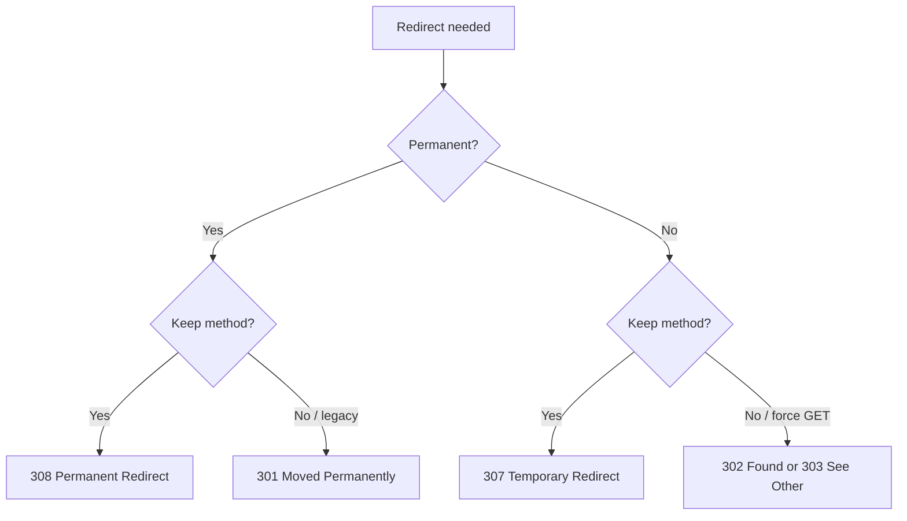

# Status Codes

!!! tip "In a nutshell"
    A status code tells the client the fate of its request; the first digit sets
    the family (2xx success, 3xx redirect, 4xx client error, 5xx server error).
    Exam hook: 307/308 preserve the method, 303 forces GET; **401 = not
    authenticated, 403 = not authorized**.

!!! example "Real-world analogy"
    A status code is the **delivery-outcome stamp** the postal service puts on a
    returned item: green "Delivered" (`2xx`), "Address changed — forwarded"
    (`3xx`), "No such recipient / not allowed" (`4xx`), or "Sorting office caught
    fire" (`5xx`). The client acts on the stamp, not the human note beside it —
    just as HTTP clients act on the numeric code, not the reason phrase.

!!! abstract "Learning objectives"
    By the end of this chapter you can:

    - [ ] Classify any status code into its 1xx–5xx family and meaning.
    - [ ] Choose correctly between 301/302/303/307/308, 401/403, 404/410.
    - [ ] Explain when 422 and 429 apply and their companion headers.
    - [ ] Use `Response::$statusTexts` and the `Response::HTTP_*` constants.

    **Syllabus:** `HTTP → Status codes` ·
    **Level:** Advanced ·
    **Est. time:** 25 min ·
    **Prerequisites:** [Client / Server](client-server.md)

---

## Theory

Every HTTP response carries a three-digit **status code** and a short **reason
phrase** (e.g. `404 Not Found`). The first digit defines the *class*:

| Class | Meaning | Examples |
|---|---|---|
| **1xx** | Informational | 100 Continue, 101 Switching Protocols, 103 Early Hints |
| **2xx** | Success | 200 OK, 201 Created, 204 No Content, 206 Partial Content |
| **3xx** | Redirection | 301, 302, 303, 304, 307, 308 |
| **4xx** | Client error | 400, 401, 403, 404, 405, 409, 410, 415, 422, 429 |
| **5xx** | Server error | 500, 502, 503, 504 |

The reason phrase is informational only; clients act on the numeric code.

!!! question "Predict first"
    An API receives well-formed JSON that fails validation. Is that a 400, a 422,
    or a 500?

??? note "Reveal"
    **422 Unprocessable Content** — the syntax is valid but the content is
    semantically wrong. 400 is for malformed syntax; 500 is a server fault.
    `Response::HTTP_UNPROCESSABLE_ENTITY` equals **422** (the constant keeps the
    old name).

## Deep Dive — how it works internally

### `Response::$statusTexts`

`Symfony\Component\HttpFoundation\Response` holds a **public static** map of every
known code to its reason phrase, plus a `HTTP_*` constant per code:

```php
<?php
declare(strict_types=1);

use Symfony\Component\HttpFoundation\Response;

Response::HTTP_NOT_FOUND;                     // 404 (int constant)
Response::$statusTexts[404];                  // 'Not Found'
Response::$statusTexts[Response::HTTP_I_AM_A_TEAPOT]; // "I'm a teapot"
```

When you call `new Response($body, Response::HTTP_CREATED)`, `setStatusCode()`
looks up `$statusTexts` to fill the reason phrase if you do not supply one. If you
pass an unknown code, `$statusTexts` has no entry and the phrase is empty (still
valid).

```php
$response = new Response('Created!', Response::HTTP_CREATED); // phrase from $statusTexts
$response->setStatusCode(404); // reason phrase auto-filled: 'Not Found'
$response->setStatusCode(599); // unknown code -> empty reason phrase, still valid
$response->setStatusCode(999); // throws \InvalidArgumentException (outside 100-599)
```

!!! note "Source reference"
    `Symfony\Component\HttpFoundation\Response::$statusTexts` and the
    `HTTP_*` constants —
    [symfony/symfony `8.0`](https://github.com/symfony/symfony/blob/8.0/src/Symfony/Component/HttpFoundation/Response.php).

`setStatusCode()` throws `\InvalidArgumentException` if the code is outside the
100–599 range — a common gotcha when computing codes dynamically.

### Redirects — the four that matter



| Code | Permanent? | Method preserved? |
|---|---|---|
| **301** Moved Permanently | Yes | Historically may switch to GET |
| **302** Found | No | Historically may switch to GET |
| **303** See Other | No | **Forces GET** (POST→GET after form) |
| **307** Temporary Redirect | No | **Preserves** method + body |
| **308** Permanent Redirect | Yes | **Preserves** method + body |

- Use **303** after a successful POST (Post/Redirect/Get) to prevent resubmission.
- Use **307/308** when you must keep a non-GET method (e.g. redirecting a PUT).
- **301/308** are cached aggressively by browsers — avoid until the move is truly
  permanent.

### Authentication vs authorization

| Code | Meaning | Symfony source |
|---|---|---|
| **401** Unauthorized | *Not authenticated* — credentials missing/invalid. Must send `WWW-Authenticate`. | Thrown as `AuthenticationException` → entry point |
| **403** Forbidden | *Authenticated but not allowed* — re-auth won't help. | `AccessDeniedException` |

"Unauthorized" is a misnomer: 401 is really *unauthenticated*. In Symfony the
firewall entry point produces 401; a failed voter/`denyAccessUnlessGranted()`
produces 403 via `AccessDeniedException`.

```php
// In a controller: authenticated but lacking the role -> 403
$this->denyAccessUnlessGranted('ROLE_ADMIN'); // throws AccessDeniedException

// Explicit equivalent
if (!$this->isGranted('ROLE_ADMIN')) {
    throw new AccessDeniedException('Admins only.'); // converted to a 403 response
}
```

### Not found vs gone

- **404 Not Found** — resource may exist later; no claim about the future.
- **410 Gone** — resource *intentionally* removed, permanent; tells crawlers to
  drop it.

### The API-favourites: 422 and 429

- **422 Unprocessable Content** — the request is **syntactically valid** but
  **semantically wrong** (validation failure on a well-formed JSON body). Prefer
  422 over 400 for validation errors in APIs.
- **429 Too Many Requests** — rate limit exceeded. Pair with a **`Retry-After`**
  header. Symfony's RateLimiter integration returns 429.

Other 4xx worth knowing: **405 Method Not Allowed** (must send `Allow`),
**406 Not Acceptable** (content negotiation), **409 Conflict**,
**415 Unsupported Media Type**.

## Configuration & code

=== "PHP Attributes"

    ```php
    <?php
    declare(strict_types=1);

    namespace App\Controller;

    use Symfony\Bundle\FrameworkBundle\Controller\AbstractController;
    use Symfony\Component\HttpFoundation\JsonResponse;
    use Symfony\Component\HttpFoundation\RedirectResponse;
    use Symfony\Component\HttpFoundation\Response;
    use Symfony\Component\Routing\Attribute\Route;

    final class ArticleController extends AbstractController
    {
        #[Route('/articles', methods: ['POST'])]
        public function create(): Response
        {
            // Validation failed on a well-formed body → 422, not 400/500.
            return new JsonResponse(
                ['errors' => ['title' => 'This value should not be blank.']],
                Response::HTTP_UNPROCESSABLE_ENTITY, // 422
            );
        }

        #[Route('/old-path')]
        public function moved(): RedirectResponse
        {
            // Permanent move, preserve the method → 308.
            return new RedirectResponse('/new-path', Response::HTTP_PERMANENTLY_REDIRECT);
        }
    }
    ```

=== "Console"

    ```console
    $ php -r 'require "vendor/autoload.php";
      echo Symfony\Component\HttpFoundation\Response::$statusTexts[418];'
    I'm a teapot
    ```

!!! info "Constant naming quirks"
    `Response::HTTP_UNPROCESSABLE_ENTITY` = **422** (the constant keeps the old
    RFC 4918 name "Unprocessable Entity"; RFC 9110 renamed it "Unprocessable
    Content"). `Response::HTTP_PERMANENTLY_REDIRECT` = **308**;
    `Response::HTTP_TEMPORARY_REDIRECT` = **307**.

## Best practices & anti-patterns

| ✅ Do | ❌ Avoid |
|---|---|
| 303 after a successful POST form | 200 with an error message body |
| 422 for validation errors in APIs | 400/500 for validation failures |
| 401 + `WWW-Authenticate` for missing auth | 403 when the user simply isn't logged in |
| 429 + `Retry-After` for rate limits | Silent throttling with 200 |

## When (not) to use it / alternatives

Use `HTTP_*` constants over magic numbers for readability. Use `410` only when the
removal is deliberate and permanent; otherwise `404`. For redirects after auth,
Symfony's security layer picks the code for you.

!!! danger "Certification traps"
    - **307/308 preserve the method and body; 301/302 may switch it to GET.**
      **303 always forces GET.**
    - **401 = not authenticated** (needs `WWW-Authenticate`), **403 = not
      authorized** — re-authenticating won't fix a 403.
    - **422** is for *semantically invalid* well-formed requests (validation), not
      malformed syntax (that's 400).
    - `Response::HTTP_UNPROCESSABLE_ENTITY` is **422**; the constant name still
      says "Entity".
    - `setStatusCode()` throws for codes outside **100–599**.

!!! warning "Common mistakes"
    - Returning `200 OK` with an error payload — clients and caches can't tell.
    - Using `302` where `303` is meant, causing a browser to re-POST on redirect.
    - Forgetting the `Allow` header with `405` or `Retry-After` with `429`.

## Exercises

1. **(Advanced)** A user submits a valid registration form; the account is
   created. Which status code should the redirect after the POST use, and why?
2. **(Expert)** An API receives well-formed JSON that fails validation. Return the
   correct status with `Response::HTTP_*` and an errors array.

??? success "Solutions"

    **1.** **303 See Other**. Post/Redirect/Get: 303 forces the browser to issue a
    GET to the confirmation page, preventing accidental form resubmission on
    refresh.

    **2.**
    ```php
    return new JsonResponse(
        ['errors' => $violations],
        Response::HTTP_UNPROCESSABLE_ENTITY, // 422
    );
    ```
    422 signals "well-formed but semantically invalid", the correct API contract
    for validation failures.

## Certification questions

??? question "Q1. A POST must be redirected while preserving its method and body. Which code?"
    - [ ] A. 301
    - [ ] B. 302
    - [ ] C. 303
    - [x] D. 307 ✅

    **Why:** 307 (and 308 for permanent) preserve the method and body; 301/302 may
    change to GET, 303 forces GET.
    **Ref:** [MDN 307](https://developer.mozilla.org/en-US/docs/Web/HTTP/Status/307).

??? question "Q2. The user is logged in but lacks permission. Which code?"
    - [ ] A. 401 Unauthorized
    - [x] B. 403 Forbidden ✅
    - [ ] C. 400 Bad Request
    - [ ] D. 422 Unprocessable Content

    **Why:** 401 means *unauthenticated*; 403 means authenticated but not allowed.
    **Ref:** [MDN 403](https://developer.mozilla.org/en-US/docs/Web/HTTP/Status/403).

??? question "Q3. `Response::HTTP_UNPROCESSABLE_ENTITY` equals which number?"
    - [ ] A. 400
    - [ ] B. 409
    - [x] C. 422 ✅
    - [ ] D. 429

    **Why:** The constant keeps the RFC 4918 name but is code 422 (validation
    errors).
    **Ref:** [Symfony Response constants](https://github.com/symfony/symfony/blob/8.0/src/Symfony/Component/HttpFoundation/Response.php).

??? question "Q4. A rate limit is exceeded. Which code + header pair is correct?"
    - [ ] A. 403 + `WWW-Authenticate`
    - [ ] B. 503 + `Allow`
    - [x] C. 429 + `Retry-After` ✅
    - [ ] D. 409 + `Location`

    **Why:** 429 Too Many Requests should advertise when to retry via
    `Retry-After`.
    **Ref:** [MDN 429](https://developer.mozilla.org/en-US/docs/Web/HTTP/Status/429).

## Key takeaways

- 1xx info, 2xx success, 3xx redirect, 4xx client error, 5xx server error.
- 307/308 keep the method; 303 forces GET; 301/308 are permanent (cached).
- 401 = unauthenticated (+`WWW-Authenticate`); 403 = not authorized.
- 404 (maybe later) vs 410 (deliberately gone); 422 validation; 429 rate limit.

## Last-minute revision

!!! tip "Cheat sheet"
    - **Redirects:** 301 perm, 302 temp, 303 →GET, 307 temp keep-method, 308 perm
      keep-method.
    - **Auth:** 401 no creds, 403 no rights.
    - **Missing:** 404 unknown, 410 gone-forever.
    - **API:** 422 validation, 429 rate-limit (+`Retry-After`), 405 (+`Allow`).
    - `Response::$statusTexts[$code]` → reason phrase; `Response::HTTP_*` constants.

## Connections

- **Depends on:** [HTTP Response](response.md) — the code is set on `Response` (`$statusTexts`, `HTTP_*` constants).
- **Reused in:** [HTTP Redirects](../controllers/http-redirects.md) — choosing among 301/302/303/307/308.
- **Confused with:** [HTTP Methods](methods.md) — 303 forces GET because POST is non-idempotent; also 401 vs 403.

## Official References
- [MDN — HTTP status codes](https://developer.mozilla.org/en-US/docs/Web/HTTP/Status)
- [Symfony docs — HttpFoundation](https://symfony.com/doc/current/components/http_foundation.html)
- [Symfony source — Response](https://github.com/symfony/symfony/blob/8.0/src/Symfony/Component/HttpFoundation/Response.php)

## Video references

!!! tip "Watch & learn"
    These are official, continuously-updated video channels — search them for
    "HTTP foundation" to reinforce this chapter. We link stable channels rather than
    individual videos so the references never rot.

    - [SymfonyCasts screencasts](https://symfonycasts.com/tracks/symfony) — scripted, code-along tutorials.
    - [Symfony official YouTube](https://www.youtube.com/@SymfonyOfficial) — SymfonyCon conference talks & keynotes.
    - [Official docs for this topic](https://symfony.com/doc/current/components/http_foundation.html) — some Symfony doc pages embed a screencast.

## Confidence check

I'm ready when I can:

- [ ] explain **why** the code (not the reason phrase) drives clients and caches
- [ ] pick correctly among 301/302/303/307/308, 401/403, 404/410, 422/429
- [ ] debug a browser re-POSTing on refresh (302 where 303 was meant)
- [ ] spot the trick: 307/308 preserve the method, 303 forces GET; 401 ≠ 403
- [ ] explain how `Response::$statusTexts`/`HTTP_*` work and when `setStatusCode()` throws

---

<small>Related: [HTTP Response](response.md) · [HTTP Methods](methods.md) ·
[HTTP Redirects](../controllers/http-redirects.md) · [Error Pages](../controllers/error-pages.md)</small>
