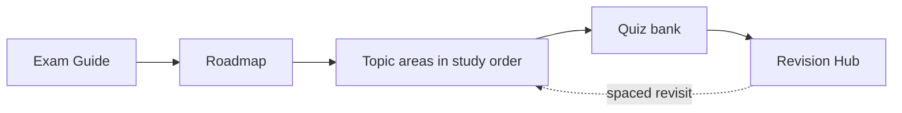

# Préparation à la Certification Symfony 8 Expert

La plateforme de référence, open source et autonome, pour préparer la
**Certification Symfony 8** — aux niveaux **Advanced** et **Expert**. Chaque
sujet du syllabus officiel est enseigné en profondeur : théorie, mécanismes internes,
diagrammes, code Symfony 8 / PHP 8.4 exécutable, exercices, pièges de certification
et révision de dernière minute.

!!! abstract "What this is"
    Une ressource d'étude complète avec laquelle vous pouvez vous préparer **sans
    aucun autre support** que la documentation officielle vers laquelle elle renvoie.
    Elle a démarré comme une réécriture de la
    [liste de préparation communautaire de ThomasBerends](https://github.com/ThomasBerends/symfony-certification-preparation-list)
    (une liste de liens, ciblant Symfony 7) et a été entièrement reconstruite en
    contenu pédagogique complet pour Symfony 8.

## Who it's for

- **Le praticien** — 2 à 5 ans de Symfony, visant le niveau **Advanced**. Vous
  cherchez une couverture structurée et de l'assurance sur les cas limites.
- **Le candidat Expert** — profil senior, visant le niveau **Expert**. Vous
  cherchez les mécanismes internes, les compromis et la détection des pièges.

Les deux niveaux correspondent au *même examen*, noté différemment — voir
[Advanced vs Expert](exam-guide/levels.md).

## How to use this platform

1. Lisez l'**[Exam Guide](exam-guide/index.md)** pour connaître le format et la notation.
2. Suivez la **[Roadmap](roadmap.md)** — l'ordre d'étude optimisé, délibérément
   *différent* de l'ordre du syllabus.
3. Travaillez les chapitres de chaque domaine ; tentez les exercices et les
   questions intégrées *avant* de révéler les réponses.
4. Auto-évaluez-vous avec la **[Practice Quiz Bank](revision/quiz.md)**.
5. Dans les derniers jours, entraînez-vous avec le **[Revision Hub](revision/index.md)** —
   choisissez un **[mode de révision](revision/modes.md)** selon le temps dont vous disposez.

!!! tip "Three ways to study (your coach picks by time)"
    - :material-flash: **Rapide (5–15 min) :** [Cheat Sheet](revision/cheat-sheet.md),
      [Flashcards](revision/flashcards/index.md), [Easily Confused](revision/confusions.md).
    - :material-book-open-page-variant: **Approfondi (45–90 min) :** un domaine de
      bout en bout (Deep Dive + exercices).
    - :material-timer: **Examen (90 min) :** le [Mock Exam](revision/mock-exam.md) chronométré.

!!! tip "Start here"
    Vous découvrez la plateforme ? Lisez l'[Exam Format](exam-guide/format.md), puis
    passez à la [Roadmap](roadmap.md) et commencez par **PHP & Web Security**. Peu de
    temps devant vous ? Priorisez les domaines **Critical** : Architecture,
    Dependency Injection, Security et Messenger.

## Exam facts (Symfony 8)

| Fait | Valeur |
|---|---|
| Questions | 75, sélectionnées aléatoirement |
| Durée | 90 minutes (~72 s/question) |
| Types de questions | Choix unique, choix multiple, vrai/faux |
| Niveaux | **Advanced** et **Expert** (déterminés par le score) |
| Version PHP requise | **PHP 8.4+** (exigence de Symfony 8) |
| Évolution des pondérations | Messenger **davantage pondéré** ; HTTP Caching **moins pondéré** |

## Scope

!!! info "In scope"
    Les 14 domaines officiels et tous leurs sous-sujets : PHP & Web Security, HTTP,
    Symfony Architecture, Controllers, Routing, Templating (Twig), Forms, Data
    Validation, Dependency Injection, Security, HTTP Caching, Console, Automated
    Tests et Miscellaneous (Messenger, Serializer, Mailer, Cache, et plus encore).

!!! warning "Out of scope — not taught here"
    Conformément au syllabus : Symfony UX, Symfony AI, Doctrine, Monolog, AssetMapper,
    Webpack Encore et les bundles/bridges tiers. Ils n'apparaissent que pour signaler
    qu'ils sont hors programme.

## Where to go next

- [Exam Guide](exam-guide/index.md) — format, notation, Advanced vs Expert, stratégie.
- [Roadmap](roadmap.md) — le parcours d'étude ordonné et le graphe de dépendances.
- [Revision Hub](revision/index.md) — modes, cheat sheets, flashcards, confusions,
  mock exam, pièges, moyens mnémotechniques, quiz.

---

<small>Sous licence MIT. Symfony est une marque déposée de Symfony SAS. Ceci est un
projet communautaire indépendant, sans affiliation ni approbation de Symfony SAS.</small>

## Official References

- [Official Symfony Certification](https://certification.symfony.com/)
- [Certification syllabus](https://certification.symfony.com/exams/symfony.html)
- [Symfony documentation home](https://symfony.com/doc/current/)
