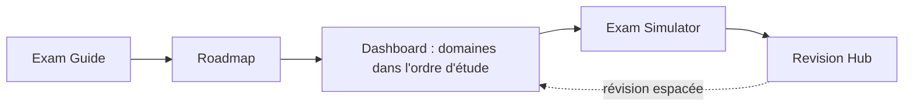

# Symfony 8 Expert Certification Prep

Ressource communautaire de préparation alignée sur le programme de la
certification Symfony 8.0. La couverture est validée via la matrice de
traçabilité et des contrôles automatisés. Elle cible à la fois les niveaux
**Advanced** et **Expert**, avec théorie, mécanismes internes, diagrammes,
code Symfony 8 / PHP 8.4 exécutable, exercices, pièges de certification et
révision de dernière minute.

!!! abstract "What this is"
    Une ressource d'étude à utiliser **en complément de la documentation
    officielle Symfony** qu'elle référence, pas en remplacement. Le projet a
    commencé comme une réécriture de la
    [liste de préparation communautaire de ThomasBerends](https://github.com/ThomasBerends/symfony-certification-preparation-list)
    (une liste de liens, ciblant Symfony 7) et a été reconstruit en contenu
    pédagogique complet pour Symfony 8.

## Learning Dashboard

Nouveau ici ? Ce tableau **est** la carte : une ligne par domaine officiel,
dans l'ordre que le graphe de dépendances de la [Roadmap](roadmap.md) impose
réellement — pas l'ordre du syllabus — avec chaque ressource de la plateforme
pour ce domaine à un clic. Colonnes expliquées sous le tableau.

!!! tip "Comment lire ce tableau"
    - **#** — ordre d'étude recommandé (issu du [graphe de dépendances](roadmap.md#dependency-graph)).
    - **Prérequis** — domaine(s) à terminer avant ; source : les métadonnées de
      chaque chapitre, jamais devinées.
    - **Statut** — preuve automatisée issue de la
      [Traceability Matrix](https://github.com/jasseryah-mazars/Sf-8.0/blob/master/specs/TraceabilityMatrix.md) :
      sous-sujets avec un chapitre confirmé, un exemple travaillé, un exercice
      et une couverture quiz. *Pas* une affirmation que toute question
      possible est déjà posée.
    - **Cours** — l'index du chapitre (la théorie, les deep dives, les
      exercices et les questions de certification vivent à l'intérieur de
      chaque chapitre ; il n'existe pas de page d'exercices séparée par
      domaine).
    - **TP** — le lab pratique (exercice guidé, test-first).
    - **Quiz** — l'[Exam Simulator](exam-simulator.md), filtrable sur ce
      domaine (même lien sur chaque ligne ; c'est un seul outil interactif
      pour tous les sujets).
    - **Flashcards**, **Examens**, **Révision** — le deck de répétition
      espacée, l'examen à questions fixes et la fiche de révision d'une page
      du domaine.

### 🧱 Fondations

Pas encore de Symfony — le langage et le protocole sur lesquels tout le reste
s'appuie.

| # | Domaine | Statut | Prérequis | Cours | TP | Quiz | Flashcards | Examens | Révision |
|---|---|---|---|---|---|---|---|---|---|
| 1 | [PHP & Web Security](php-web-security/index.md) | 9/9 PASS | — | [Cours](php-web-security/index.md) | [TP](labs/php-web-security.md) | [Quiz](exam-simulator.md) | [Cartes](revision/flashcards/php-web-security.md) | [Examen](exams/php-web-security.md) | [Fiche](revision/sheets/php-web-security.md) |
| 2 | [HTTP](http/index.md) | 11/11 PASS | PHP & Web Security | [Cours](http/index.md) | [TP](labs/http.md) | [Quiz](exam-simulator.md) | [Cartes](revision/flashcards/http.md) | [Examen](exams/http.md) | [Fiche](revision/sheets/http.md) |

### 🧠 Cœur Symfony (le modèle mental)

Le kernel et le container — les deux machines sur lesquelles tous les autres
composants se branchent. Rendement examen maximal ; ne jamais bâcler ces deux
domaines.

| # | Domaine | Statut | Prérequis | Cours | TP | Quiz | Flashcards | Examens | Révision |
|---|---|---|---|---|---|---|---|---|---|
| 3 | [Symfony Architecture](architecture/index.md) | 12/17 PASS · 5 TO VERIFY | HTTP | [Cours](architecture/index.md) | [TP](labs/architecture.md) | [Quiz](exam-simulator.md) | [Cartes](revision/flashcards/architecture.md) | [Examen](exams/architecture.md) | [Fiche](revision/sheets/architecture.md) |
| 4 | [Dependency Injection](dependency-injection/index.md) | 12/12 PASS | Symfony Architecture | [Cours](dependency-injection/index.md) | [TP](labs/dependency-injection.md) | [Quiz](exam-simulator.md) | [Cartes](revision/flashcards/dependency-injection.md) | [Examen](exams/dependency-injection.md) | [Fiche](revision/sheets/dependency-injection.md) |

### 🧩 Composants applicatifs (la couche fonctionnelle et l'étendue)

Le traitement de request au quotidien, puis le bloc sécurité à fort
coefficient, puis l'étendue. Chaque domaine ne liste que ses **vrais**
prérequis — plusieurs (Security, HTTP Caching, Console) sont techniquement
débloqués plus tôt qu'ils n'apparaissent ci-dessous ; ils sont séquencés plus
tard pour des raisons de pondération d'examen expliquées dans la
[Roadmap](roadmap.md).

| # | Domaine | Statut | Prérequis | Cours | TP | Quiz | Flashcards | Examens | Révision |
|---|---|---|---|---|---|---|---|---|---|
| 5 | [Controllers](controllers/index.md) | 15/15 PASS | Architecture, DI, HTTP | [Cours](controllers/index.md) | [TP](labs/controllers.md) | [Quiz](exam-simulator.md) | [Cartes](revision/flashcards/controllers.md) | [Examen](exams/controllers.md) | [Fiche](revision/sheets/controllers.md) |
| 6 | [Routing](routing/index.md) | 13/13 PASS | Controllers, HTTP | [Cours](routing/index.md) | [TP](labs/routing.md) | [Quiz](exam-simulator.md) | [Cartes](revision/flashcards/routing.md) | [Examen](exams/routing.md) | [Fiche](revision/sheets/routing.md) |
| 7 | [Templating (Twig)](twig/index.md) | 14/14 PASS | Controllers, PHP API | [Cours](twig/index.md) | [TP](labs/twig.md) | [Quiz](exam-simulator.md) | [Cartes](revision/flashcards/twig.md) | [Examen](exams/twig.md) | [Fiche](revision/sheets/twig.md) |
| 8 | [Data Validation](validation/index.md) | 9/9 PASS | Dependency Injection | [Cours](validation/index.md) | [TP](labs/validation.md) | [Quiz](exam-simulator.md) | [Cartes](revision/flashcards/validation.md) | [Examen](exams/validation.md) | [Fiche](revision/sheets/validation.md) |
| 9 | [Forms](forms/index.md) | 13/13 PASS | Twig, Validation | [Cours](forms/index.md) | [TP](labs/forms.md) | [Quiz](exam-simulator.md) | [Cartes](revision/flashcards/forms.md) | [Examen](exams/forms.md) | [Fiche](revision/sheets/forms.md) |
| 10 | [Security](security/index.md) | 13/13 PASS | Symfony Architecture | [Cours](security/index.md) | [TP](labs/security.md) | [Quiz](exam-simulator.md) | [Cartes](revision/flashcards/security.md) | [Examen](exams/security.md) | [Fiche](revision/sheets/security.md) |
| 11 | [HTTP Caching](http-caching/index.md) | 5/5 PASS | HTTP, Controllers | [Cours](http-caching/index.md) | [TP](labs/http-caching.md) | [Quiz](exam-simulator.md) | [Cartes](revision/flashcards/http-caching.md) | [Examen](exams/http-caching.md) | [Fiche](revision/sheets/http-caching.md) |
| 12 | [Console](console/index.md) | 9/9 PASS | Dependency Injection | [Cours](console/index.md) | [TP](labs/console.md) | [Quiz](exam-simulator.md) | [Cartes](revision/flashcards/console.md) | [Examen](exams/console.md) | [Fiche](revision/sheets/console.md) |
| 13 | [Messenger](messenger/index.md) | 7/7 PASS | DI, Console, Events | [Cours](messenger/index.md) | [TP](labs/miscellaneous.md) | [Quiz](exam-simulator.md) | [Cartes](revision/flashcards/messenger.md) | [Examen](exams/messenger.md) | [Fiche](revision/sheets/messenger.md) |
| 14 | [Automated Tests](testing/index.md) | 12/12 PASS | Controllers, Routing, Forms | [Cours](testing/index.md) | [TP](labs/testing.md) | [Quiz](exam-simulator.md) | [Cartes](revision/flashcards/testing.md) | [Examen](exams/testing.md) | [Fiche](revision/sheets/testing.md) |
| 15 | [Miscellaneous](miscellaneous/index.md) | 15/15 PASS | Architecture, DI | [Cours](miscellaneous/index.md) | [TP](labs/miscellaneous.md) | [Quiz](exam-simulator.md) | [Cartes](revision/flashcards/miscellaneous.md) | [Examen](exams/miscellaneous.md) | [Fiche](revision/sheets/miscellaneous.md) |
| — | [Internationalization and localization](miscellaneous/intl.md) | 1/1 PASS | Miscellaneous | [Cours](miscellaneous/intl.md) | — | [Quiz](exam-simulator.md) | — | — | — |

<small>L'internationalisation est un unique sous-sujet à l'intérieur des
chapitres Miscellaneous (aucun fichier de lab/flashcard/examen dédié
n'existe pour l'instant) — son lien « Cours » pointe directement vers cette
section ; les cellules vides sont des lacunes honnêtes, pas des liens
cassés.</small>

### 🎓 Révision Certification

Pas des domaines de contenu — les outils méta qui enveloppent les quinze
domaines : comment fonctionne l'examen, le parcours d'étude complet, et
toutes les surfaces de révision de dernière minute.

| Outil | À quoi ça sert |
|---|---|
| [Exam Guide](exam-guide/index.md) | Format, notation, Advanced vs Expert, stratégie du jour J |
| [Roadmap](roadmap.md) | Le graphe de dépendances complet, 4 phases, 15 étapes, checkpoints |
| [Exam Simulator](exam-simulator.md) | Modes Practice/Exam interactifs, filtrables par domaine et difficulté |
| [Chapter Exams](exams/index.md) | Séries fixes par domaine, page d'index pour les 15 |
| [Revision Hub](revision/index.md) | Cheat sheet, confusions, pièges, codex, cas limites, index flashcards, mock exams |
| [Glossary](glossary.md) | Définitions en une ligne renvoyant au chapitre qui enseigne chaque terme |

### 🚫 Hors programme (exclu, non enseigné)

Mentionné ici **uniquement** pour marquer la frontière — rien de tout cela
n'est enseigné ni évalué comme contenu substantiel. Deux composants existent
dans la navigation en tant que chapitres complets *parce que* le programme
les nomme explicitement comme exclus et qu'un candidat doit pouvoir les
reconnaître au premier coup d'œil ; chacun porte sa propre mention « Excluded
from Symfony 8 certification ».

| Sujet | Où il est mentionné |
|---|---|
| Edge Side Includes (ESI) | [Chapitre exclu](appendices/out-of-syllabus/esi.md) — accessible depuis HTTP Caching par souci d'exhaustivité |
| PHPUnit Bridge | [Chapitre exclu](appendices/out-of-syllabus/phpunit-bridge.md) — accessible depuis Automated Tests par souci d'exhaustivité |
| Lock Component | [Chapitre exclu](appendices/out-of-syllabus/lock.md) — accessible depuis Miscellaneous par souci d'exhaustivité |
| Symfony UX, Symfony AI, Doctrine, Monolog, AssetMapper, Webpack Encore, PHP Polyfills, composants String/Uid/TypeInfo, Amazon SQS, transports Messenger tiers | Mentions de frontière uniquement (distracteurs, notes de scope) — voir [Requirements.md](https://github.com/jasseryah-mazars/Sf-8.0/blob/master/specs/Requirements.md) FR-5 |

## Who it's for

- **The Practitioner** — 2 à 5 ans d'expérience Symfony, visant **Advanced**.
  Vous voulez une couverture structurée et de l'assurance sur les cas limites.
- **The Expert candidate** — senior, visant **Expert**. Vous voulez les
  mécanismes internes, les arbitrages et le repérage des pièges.

Les deux niveaux sont le *même examen*, noté différemment — voir
[Advanced vs Expert](exam-guide/levels.md).

## How to use this platform

1. Lisez l'**[Exam Guide](exam-guide/index.md)** pour connaître le format et la notation.
2. Suivez le **[Learning Dashboard](#learning-dashboard)** ci-dessus (ou la
   **[Roadmap](roadmap.md)** complète) — l'ordre d'étude optimisé,
   délibérément différent de l'ordre du syllabus.
3. Travaillez les chapitres de chaque domaine ; tentez les exercices et les
   questions intégrées *avant* de révéler les réponses.
4. Auto-évaluez-vous avec l'**[Exam Simulator](exam-simulator.md)**.
5. Dans les derniers jours, entraînez-vous avec le **[Revision Hub](revision/index.md)** —
   choisissez un **[mode de révision](revision/modes.md)** selon le temps dont vous disposez.

!!! tip "Trois façons d'étudier (votre coach choisit selon le temps)"
    - :material-flash: **Rapide (5–15 min) :** [Cheat Sheet](revision/cheat-sheet.md),
      [Flashcards](revision/flashcards/index.md), [Easily Confused](revision/confusions.md).
    - :material-book-open-page-variant: **Approfondi (45–90 min) :** un domaine
      de bout en bout (Deep Dive + exercices).
    - :material-timer: **Examen (90 min) :** le [Mock Exam](revision/mock-exam.md) chronométré.

!!! tip "Start here"
    Vous découvrez la plateforme ? Lisez l'[Exam Format](exam-guide/format.md),
    puis regardez le [Learning Dashboard](#learning-dashboard) ci-dessus et
    commencez par **PHP & Web Security**. Peu de temps ? Priorisez les
    domaines **Critical** : Architecture, Dependency Injection, Security et
    Messenger.

## Exam facts (Symfony 8)

| Fait | Valeur |
|---|---|
| Questions | 75, sélectionnées aléatoirement |
| Durée | 90 minutes (~72 s/question) |
| Types de questions | Choix unique, choix multiple, vrai/faux |
| Niveaux | **Advanced** et **Expert** (déterminés par le score) |
| Base PHP | **PHP 8.4+** (exigence de Symfony 8) |
| Changement de pondération | Messenger **davantage pondéré** ; HTTP Caching **moins pondéré** |

## Scope

!!! info "In scope"
    Les 15 domaines officiels et tous leurs sous-sujets — voir le
    [Learning Dashboard](#learning-dashboard) ci-dessus pour la liste complète
    avec le statut de couverture par domaine.

!!! warning "Out of scope — not taught here"
    Voir [Hors programme](#hors-programme-exclu-non-enseigne) ci-dessus.

## Where to go next

- [Exam Guide](exam-guide/index.md) — format, notation, Advanced vs Expert, stratégie.
- [Roadmap](roadmap.md) — le parcours d'étude ordonné et le graphe de dépendances.
- [Revision Hub](revision/index.md) — modes, cheat sheets, flashcards, confusions,
  mock exam, pièges, aides-mémoire, quiz.

---

<small>Contenu sous licence MIT. Symfony est une marque de Symfony SAS. Ceci
est un projet communautaire indépendant, non affilié à Symfony SAS et non
approuvé par elle.</small>

## Official References

- [Official Symfony Certification](https://certification.symfony.com/)
- [Certification syllabus](https://certification.symfony.com/exams/symfony.html)
- [Symfony documentation home](https://symfony.com/doc/8.0/)
