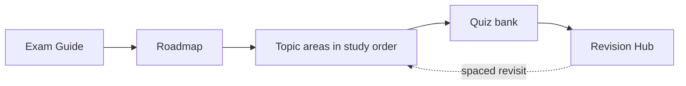

# Symfony 8 Expert Certification Prep

The definitive, open-source, self-contained platform to prepare for the
**Symfony 8 Certification** — both the **Advanced** and **Expert** levels. Every
official syllabus topic is taught in depth: theory, internals, diagrams, runnable
Symfony 8 / PHP 8.4 code, exercises, certification traps, and last-minute revision.

!!! abstract "What this is"
    A complete study resource you can prepare with **without any other material**
    except the official documentation it links to. It began as a rewrite of the
    community [ThomasBerends preparation list](https://github.com/ThomasBerends/symfony-certification-preparation-list)
    (a list of links, targeting Symfony 7) and was rebuilt into full teaching
    content for Symfony 8.

## Who it's for

- **The Practitioner** — 2–5 years of Symfony, targeting **Advanced**. You want
  structured coverage and confidence on edge cases.
- **The Expert candidate** — senior, targeting **Expert**. You want internals,
  trade-offs, and trap-spotting.

Both levels are the *same exam*, scored differently — see
[Advanced vs Expert](exam-guide/levels.md).

## How to use this platform

1. Read the **[Exam Guide](exam-guide/index.md)** so you know the format and scoring.
2. Follow the **[Roadmap](roadmap.md)** — the optimized study order, deliberately
   *not* the syllabus order.
3. Work each topic area's chapters; attempt the exercises and inline questions
   *before* revealing answers.
4. Self-test with the **[Practice Quiz Bank](revision/quiz.md)**.
5. In the final days, drill the **[Revision Hub](revision/index.md)** — master cheat
   sheet, trap index, and memory aids.

!!! tip "Start here"
    New to the platform? Read the [Exam Format](exam-guide/format.md), then jump to
    the [Roadmap](roadmap.md) and begin with **PHP & Web Security**. Short on time?
    Prioritize the **Critical** areas: Architecture, Dependency Injection, Security,
    and Messenger.

## Exam facts (Symfony 8)

| Fact | Value |
|---|---|
| Questions | 75, randomly selected |
| Duration | 90 minutes (~72 s/question) |
| Question types | Single choice, multiple choice, true/false |
| Levels | **Advanced** and **Expert** (determined by score) |
| PHP baseline | **PHP 8.4+** (Symfony 8 requirement) |
| Emphasis shift | Messenger **up-weighted**; HTTP Caching **down-weighted** |

## Scope

!!! info "In scope"
    The 14 official topic areas and all their sub-topics: PHP & Web Security, HTTP,
    Symfony Architecture, Controllers, Routing, Templating (Twig), Forms, Data
    Validation, Dependency Injection, Security, HTTP Caching, Console, Automated
    Tests, and Miscellaneous (Messenger, Serializer, Mailer, Cache, and more).

!!! warning "Out of scope — not taught here"
    Per the syllabus: Symfony UX, Symfony AI, Doctrine, Monolog, AssetMapper,
    Webpack Encore, and third-party bundles/bridges. These appear only to note they
    are out of scope.

## Where to go next

- [Exam Guide](exam-guide/index.md) — format, scoring, Advanced vs Expert, strategy.
- [Roadmap](roadmap.md) — the ordered study path and dependency graph.
- [Revision Hub](revision/index.md) — cheat sheets, traps, memory aids, quiz.

---

<small>MIT-licensed. Symfony is a trademark of Symfony SAS. This is an independent
community project, not affiliated with or endorsed by Symfony SAS.</small>
