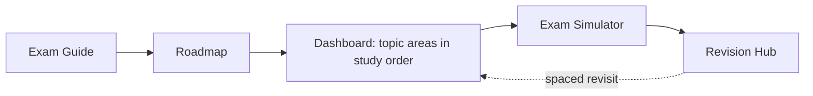

# Symfony 8 Expert Certification Prep

Community preparation resource aligned with the Symfony 8.0 certification
syllabus. Coverage is validated through the traceability matrix and
automated checks. It targets both the **Advanced** and **Expert** levels,
with theory, internals, diagrams, runnable Symfony 8 / PHP 8.4 code,
exercises, certification traps, and last-minute revision.

!!! abstract "What this is"
    A study resource meant to be used **alongside the official Symfony
    documentation** it links to, not as a replacement for it. It began as a
    rewrite of the
    community [ThomasBerends preparation list](https://github.com/ThomasBerends/symfony-certification-preparation-list)
    (a list of links, targeting Symfony 7) and was rebuilt into full teaching
    content for Symfony 8.

## Learning Dashboard

New here? This table **is** the map: one row per official topic area, in the
order the [Roadmap](roadmap.md)'s dependency graph actually requires — not the
syllabus order — with every resource the platform has for that area one click
away. Columns explained below the table.

!!! tip "How to read this table"
    - **#** — recommended study order (from the [dependency graph](roadmap.md#dependency-graph)).
    - **Prerequisites** — area(s) to finish first; sourced from each area's own
      chapter metadata, not guessed.
    - **Status** — automated evidence from the
      [Traceability Matrix](https://github.com/jasseryah-mazars/Sf-8.0/blob/master/specs/TraceabilityMatrix.md):
      subtopics with a confirmed chapter, worked example, exercise, and quiz
      coverage. *Not* a claim that every remaining question is asked.
    - **Cours** — the chapter index (theory, deep dives, exercises, and
      certification questions live inside each chapter; there is no separate
      exercises-only page per area).
    - **TP** — the hands-on lab (guided, test-first exercise).
    - **Quiz** — the [Exam Simulator](exam-simulator.md), filterable to this
      area (same link for every row; it is one interactive tool for all
      topics).
    - **Flashcards**, **Exams**, **Révision** — the area's spaced-repetition
      deck, fixed-set chapter exam, and one-page cheat sheet.

### 🧱 Foundations

No Symfony yet — the language and the protocol everything else builds on.

| # | Area | Status | Prerequisites | Cours | TP | Quiz | Flashcards | Exams | Révision |
|---|---|---|---|---|---|---|---|---|---|
| 1 | [PHP & Web Security](php-web-security/index.md) | 9/9 PASS | — | [Cours](php-web-security/index.md) | [TP](labs/php-web-security.md) | [Quiz](exam-simulator.md) | [Cards](revision/flashcards/php-web-security.md) | [Exam](exams/php-web-security.md) | [Sheet](revision/sheets/php-web-security.md) |
| 2 | [HTTP](http/index.md) | 11/11 PASS | PHP & Web Security | [Cours](http/index.md) | [TP](labs/http.md) | [Quiz](exam-simulator.md) | [Cards](revision/flashcards/http.md) | [Exam](exams/http.md) | [Sheet](revision/sheets/http.md) |

### 🧠 Cœur Symfony (the mental model)

The kernel and the container — the two machines every other component plugs
into. Highest exam yield; never skip or skim these two.

| # | Area | Status | Prerequisites | Cours | TP | Quiz | Flashcards | Exams | Révision |
|---|---|---|---|---|---|---|---|---|---|
| 3 | [Symfony Architecture](architecture/index.md) | 12/17 PASS · 5 TO VERIFY | HTTP | [Cours](architecture/index.md) | [TP](labs/architecture.md) | [Quiz](exam-simulator.md) | [Cards](revision/flashcards/architecture.md) | [Exam](exams/architecture.md) | [Sheet](revision/sheets/architecture.md) |
| 4 | [Dependency Injection](dependency-injection/index.md) | 12/12 PASS | Symfony Architecture | [Cours](dependency-injection/index.md) | [TP](labs/dependency-injection.md) | [Quiz](exam-simulator.md) | [Cards](revision/flashcards/dependency-injection.md) | [Exam](exams/dependency-injection.md) | [Sheet](revision/sheets/dependency-injection.md) |

### 🧩 Composants applicatifs (the feature layer & breadth)

Everyday request handling, then the high-weight security block, then breadth.
Each area lists only its **real** prerequisites — several (Security, HTTP
Caching, Console) are technically unlocked earlier than they appear below;
they are sequenced later for exam-weight reasons explained in the
[Roadmap](roadmap.md).

| # | Area | Status | Prerequisites | Cours | TP | Quiz | Flashcards | Exams | Révision |
|---|---|---|---|---|---|---|---|---|---|
| 5 | [Controllers](controllers/index.md) | 15/15 PASS | Architecture, DI, HTTP | [Cours](controllers/index.md) | [TP](labs/controllers.md) | [Quiz](exam-simulator.md) | [Cards](revision/flashcards/controllers.md) | [Exam](exams/controllers.md) | [Sheet](revision/sheets/controllers.md) |
| 6 | [Routing](routing/index.md) | 13/13 PASS | Controllers, HTTP | [Cours](routing/index.md) | [TP](labs/routing.md) | [Quiz](exam-simulator.md) | [Cards](revision/flashcards/routing.md) | [Exam](exams/routing.md) | [Sheet](revision/sheets/routing.md) |
| 7 | [Templating (Twig)](twig/index.md) | 14/14 PASS | Controllers, PHP API | [Cours](twig/index.md) | [TP](labs/twig.md) | [Quiz](exam-simulator.md) | [Cards](revision/flashcards/twig.md) | [Exam](exams/twig.md) | [Sheet](revision/sheets/twig.md) |
| 8 | [Data Validation](validation/index.md) | 9/9 PASS | Dependency Injection | [Cours](validation/index.md) | [TP](labs/validation.md) | [Quiz](exam-simulator.md) | [Cards](revision/flashcards/validation.md) | [Exam](exams/validation.md) | [Sheet](revision/sheets/validation.md) |
| 9 | [Forms](forms/index.md) | 13/13 PASS | Twig, Validation | [Cours](forms/index.md) | [TP](labs/forms.md) | [Quiz](exam-simulator.md) | [Cards](revision/flashcards/forms.md) | [Exam](exams/forms.md) | [Sheet](revision/sheets/forms.md) |
| 10 | [Security](security/index.md) | 13/13 PASS | Symfony Architecture | [Cours](security/index.md) | [TP](labs/security.md) | [Quiz](exam-simulator.md) | [Cards](revision/flashcards/security.md) | [Exam](exams/security.md) | [Sheet](revision/sheets/security.md) |
| 11 | [HTTP Caching](http-caching/index.md) | 5/5 PASS | HTTP, Controllers | [Cours](http-caching/index.md) | [TP](labs/http-caching.md) | [Quiz](exam-simulator.md) | [Cards](revision/flashcards/http-caching.md) | [Exam](exams/http-caching.md) | [Sheet](revision/sheets/http-caching.md) |
| 12 | [Console](console/index.md) | 9/9 PASS | Dependency Injection | [Cours](console/index.md) | [TP](labs/console.md) | [Quiz](exam-simulator.md) | [Cards](revision/flashcards/console.md) | [Exam](exams/console.md) | [Sheet](revision/sheets/console.md) |
| 13 | [Messenger](messenger/index.md) | 7/7 PASS | DI, Console, Events | [Cours](messenger/index.md) | [TP](labs/miscellaneous.md) | [Quiz](exam-simulator.md) | [Cards](revision/flashcards/messenger.md) | [Exam](exams/messenger.md) | [Sheet](revision/sheets/messenger.md) |
| 14 | [Automated Tests](testing/index.md) | 12/12 PASS | Controllers, Routing, Forms | [Cours](testing/index.md) | [TP](labs/testing.md) | [Quiz](exam-simulator.md) | [Cards](revision/flashcards/testing.md) | [Exam](exams/testing.md) | [Sheet](revision/sheets/testing.md) |
| 15 | [Miscellaneous](miscellaneous/index.md) | 15/15 PASS | Architecture, DI | [Cours](miscellaneous/index.md) | [TP](labs/miscellaneous.md) | [Quiz](exam-simulator.md) | [Cards](revision/flashcards/miscellaneous.md) | [Exam](exams/miscellaneous.md) | [Sheet](revision/sheets/miscellaneous.md) |
| — | [Internationalization and localization](miscellaneous/intl.md) | 1/1 PASS | Miscellaneous | [Cours](miscellaneous/intl.md) | — | [Quiz](exam-simulator.md) | — | — | — |

<small>Internationalization is a single sub-topic inside the Miscellaneous
chapter set (no dedicated lab/flashcard/exam file exists for it yet) — its
"Cours" link goes straight to that section; the empty cells are honest gaps,
not broken links.</small>

### 🎓 Révision Certification

Not topic areas — the meta-tools that wrap around all fifteen: how the exam
works, the full study path, and every last-minute revision surface.

| Tool | What it's for |
|---|---|
| [Exam Guide](exam-guide/index.md) | Format, scoring, Advanced vs Expert, exam-day strategy |
| [Roadmap](roadmap.md) | The full dependency graph, 4 phases, 15 stages, checkpoints |
| [Exam Simulator](exam-simulator.md) | Interactive Practice/Exam modes, filterable by area & difficulty |
| [Chapter Exams](exams/index.md) | Fixed per-area sets, index page for all 15 |
| [Revision Hub](revision/index.md) | Cheat sheet, confusions, traps, codex, edge-cases, flashcards index, mock exams |
| [Glossary](glossary.md) | One-line definitions linking to the chapter that teaches each term |

### 🚫 Hors programme (excluded, not taught)

Named here **only** to mark the boundary — none of this is taught or
evaluated as substantive content. Two components exist in the nav as full
chapters *because* the syllabus explicitly names them as excluded and a
candidate should be able to recognize that on sight; each carries its own
"Excluded from Symfony 8 certification" notice.

| Topic | Where it's mentioned |
|---|---|
| Edge Side Includes (ESI) | [Excluded chapter](appendices/out-of-syllabus/esi.md) — reachable from HTTP Caching for completeness |
| PHPUnit Bridge | [Excluded chapter](appendices/out-of-syllabus/phpunit-bridge.md) — reachable from Automated Tests for completeness |
| Lock Component | [Excluded chapter](appendices/out-of-syllabus/lock.md) — reachable from Miscellaneous for completeness |
| Symfony UX, Symfony AI, Doctrine, Monolog, AssetMapper, Webpack Encore, PHP Polyfills, String/Uid/TypeInfo components, Amazon SQS, third-party Messenger transports | Boundary mentions only (distractors, scope notes) — see [Requirements.md](https://github.com/jasseryah-mazars/Sf-8.0/blob/master/specs/Requirements.md) FR-5 |

## Who it's for

- **The Practitioner** — 2–5 years of Symfony, targeting **Advanced**. You want
  structured coverage and confidence on edge cases.
- **The Expert candidate** — senior, targeting **Expert**. You want internals,
  trade-offs, and trap-spotting.

Both levels are the *same exam*, scored differently — see
[Advanced vs Expert](exam-guide/levels.md).

## How to use this platform

1. Read the **[Exam Guide](exam-guide/index.md)** so you know the format and scoring.
2. Follow the **[Learning Dashboard](#learning-dashboard)** above (or the fuller
   **[Roadmap](roadmap.md)**) — the optimized study order, deliberately *not*
   the syllabus order.
3. Work each topic area's chapters; attempt the exercises and inline questions
   *before* revealing answers.
4. Self-test with the **[Exam Simulator](exam-simulator.md)**.
5. In the final days, drill the **[Revision Hub](revision/index.md)** — pick a
   **[revision mode](revision/modes.md)** by the time you have.

!!! tip "Three ways to study (your coach picks by time)"
    - :material-flash: **Quick (5–15 min):** [Cheat Sheet](revision/cheat-sheet.md),
      [Flashcards](revision/flashcards/index.md), [Easily Confused](revision/confusions.md).
    - :material-book-open-page-variant: **Deep (45–90 min):** a topic area end-to-end
      (Deep Dive + exercises).
    - :material-timer: **Exam (90 min):** the timed [Mock Exam](revision/mock-exam.md).

!!! tip "Start here"
    New to the platform? Read the [Exam Format](exam-guide/format.md), then look
    at the [Learning Dashboard](#learning-dashboard) above and begin with
    **PHP & Web Security**. Short on time? Prioritize the **Critical** areas:
    Architecture, Dependency Injection, Security, and Messenger.

## Exam facts (Symfony 8)

| Fact | Value |
|---|---|
| Questions | 75, randomly selected |
| Duration | 90 minutes (~72 s/question) |
| Question types | Single choice, multiple choice, true/false |
| Levels | **Advanced** and **Expert** (determined by score) |
| PHP baseline | **PHP 8.4+** (Symfony 8 requirement) |
| Emphasis shift | Messenger **up-weighted**; HTTP Caching **down-weighted** |

## Scope

!!! info "In scope"
    The 15 official topic areas and all their sub-topics — see the
    [Learning Dashboard](#learning-dashboard) above for the full list with
    coverage status per area.

!!! warning "Out of scope — not taught here"
    See [Hors programme](#hors-programme-excluded-not-taught) above.

## Where to go next

- [Exam Guide](exam-guide/index.md) — format, scoring, Advanced vs Expert, strategy.
- [Roadmap](roadmap.md) — the ordered study path and dependency graph.
- [Revision Hub](revision/index.md) — modes, cheat sheets, flashcards, confusions,
  mock exam, traps, memory aids, quiz.

---

<small>MIT-licensed. Symfony is a trademark of Symfony SAS. This is an independent
community project, not affiliated with or endorsed by Symfony SAS.</small>

## Official References

- [Official Symfony Certification](https://certification.symfony.com/)
- [Certification syllabus](https://certification.symfony.com/exams/symfony.html)
- [Symfony documentation home](https://symfony.com/doc/8.0/)
