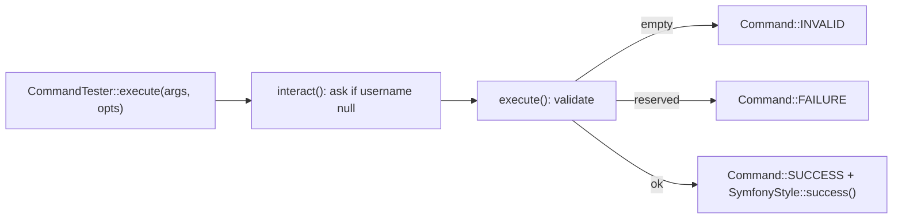

---
tags:
  - Labs
  - Console
---

# Lab: Custom Console Command — Tested with `CommandTester`

!!! abstract "Practical Lab"
    **Objective:** construire une commande `#[AsCommand]` personnalisée avec un argument, des options et
    une invite interactive, et la piloter entièrement depuis un `CommandTester` ·
    **Difficulty:** Facile ·
    **Theory:** [Custom commands](../console/custom-commands.md) ·
    [Arguments & options](../console/options-arguments.md) ·
    **Mode:** TDD

## 🧠 Pour les nuls

**C'est quoi ce lab ?** Écrire une commande console personnalisée et la tester entièrement sans jamais la lancer réellement dans un vrai terminal — via `CommandTester`.

**Pourquoi ça existe ?** Tester une commande à la main (la lancer, lire la sortie, vérifier le code retour) est lent et pas reproductible — `CommandTester` simule tout ça en PHP pur, dans une suite de tests automatisée.

**🏠 Analogie de la vraie vie :** Répéter une pièce de théâtre devant une caméra qui enregistre chaque réplique et chaque geste, pour vérifier après coup que tout s'est bien passé — sans avoir besoin d'un vrai public à chaque répétition.

**Symfony dans la vraie vie :** `$tester->execute(['--limite' => 10])` puis `$tester->getDisplay()` te donne exactement ce qu'un utilisateur verrait dans son terminal, sans jamais ouvrir un vrai terminal.

**⚠️ Erreur fréquente :** renvoyer un entier arbitraire au lieu de `Command::SUCCESS`/`FAILURE` — les scripts qui enchaînent des commandes dépendent de ces codes précis pour savoir si ça a réussi.

**🧠 Comment le mémoriser :** "`CommandTester` fait jouer ta commande sans jamais ouvrir un vrai terminal."


## Objective

À l'issue de ce lab, vous saurez **écrire d'abord le test d'une commande console** puis implémenter la
commande pour le faire passer. Concrètement, vous serez capable de :

- instancier une commande dans une `Application` nue et l'envelopper dans un `CommandTester` ;
- passer des **arguments et options** via `CommandTester::execute()` ;
- vérifier le **code de sortie** via `getStatusCode()` (`Command::SUCCESS` / `FAILURE`) ;
- vérifier la sortie rendue avec `getDisplay()` ;
- fournir les réponses à une **question interactive** avec `setInputs()`.

## Prerequisites

- Chapitres : [Custom commands](../console/custom-commands.md) ·
  [Arguments & options](../console/options-arguments.md) ·
  [Input & output](../console/input-output.md)
- Compétences supposées acquises : `#[AsCommand]`, les constantes `Command::SUCCESS|FAILURE|INVALID`,
  `SymfonyStyle`, et les bases de PHPUnit (`assertSame`, `assertStringContainsString`).

## TD Instructions

Vous allez construire `app:create-user`, une commande qui « crée » un utilisateur (pas de persistance —
elle se contente de valider l'entrée et de rendre compte). Travaillez en **test-first**.

1. Créez la classe de test `App\Tests\Command\CreateUserCommandTest` étendant
   `PHPUnit\Framework\TestCase`. Ajoutez un petit helper qui construit une
   `Symfony\Component\Console\Application` nue, enregistre votre commande (pas encore écrite),
   et retourne un `CommandTester` pour celle-ci.
2. Écrivez un test de **succès** : exécutez avec `username = 'alice'`, `--role=editor`
   et `--admin`. Vérifiez que `getStatusCode()` vaut `Command::SUCCESS` et que
   `getDisplay()` contient la ligne de confirmation.
3. Écrivez un test d'**échec** : exécutez avec un nom d'utilisateur *réservé* (`root`). Vérifiez que le
   statut est `Command::FAILURE` et que la sortie mentionne que le nom est réservé.
4. Écrivez un test **interactif** : exécutez **sans** argument `username`, mais appelez
   `setInputs(['bob'])` au préalable pour que l'invite reçoive sa réponse. Vérifiez le succès et que la
   sortie salue `bob`.
5. Lancez la suite et regardez chaque test échouer (**Red**) — la commande n'existe pas encore.
6. Implémentez `App\Command\CreateUserCommand` avec `#[AsCommand]`. Déclarez
   l'argument/les options, demandez le username manquant dans `interact()`, validez dans
   `execute()`, et retournez la bonne constante `Command::*`. Faites passer les tests
   (**Green**), puis **refactorisez**.

!!! info "Constraints"
    Symfony 8 · PHP 8.4 · aucune bibliothèque hors du périmètre de la certification · suivez
    les bonnes pratiques (attributs, strict types, constantes typées, `SymfonyStyle`).

## Implementation Guide (partial)

Uniquement la forme générale — résistez à l'envie de lire d'abord l'[Ideal Solution](#ideal-solution).

- **Enregistrement :** `#[AsCommand(name: 'app:create-user', description: '…')]`. Dans une
  vraie application, l'autoconfiguration lui applique le tag `console.command` ; dans un test **unitaire**, vous
  faites simplement un `new` et la confiez à une `Application`.
- **Définition de l'input :** un argument `username` en `InputArgument::OPTIONAL` (optionnel pour pouvoir
  le demander à l'invite), un flag `--admin` en `InputOption::VALUE_NONE`, et une option
  `--role` en `InputOption::VALUE_REQUIRED` (défaut `'user'`).
- **Invite :** surchargez `interact()` ; si l'argument `username` est `null`, demandez-le
  avec `SymfonyStyle::ask()` et réécrivez-le via `$input->setArgument()`.
- **Résultat :** dans `execute()`, retournez `Command::INVALID` pour un nom vide,
  `Command::FAILURE` pour un nom réservé, sinon `Command::SUCCESS`. Jamais de
  `return 0;` — toujours la constante.



## TDD — write the test first

!!! note "Red → Green → Refactor"
    1. **Red :** écrivez le test ci-dessous ; lancez-le, regardez-le échouer (pas encore de commande).
    2. **Green :** écrivez la commande minimale pour le faire passer.
    3. **Refactor :** nettoyez avec le test comme filet de sécurité.

**Comportement (Given/When/Then) :**

- **Given** la commande, **When** exécutée avec `username=alice --role=editor --admin`,
  **Then** le code de sortie est `SUCCESS` et la sortie confirme la création.
- **Given** la commande, **When** exécutée avec le nom réservé `root`, **Then** le
  code de sortie est `FAILURE` et la sortie indique que le nom est réservé.
- **Given** la commande **sans** `username`, **When** l'invite reçoit la réponse
  `bob` via `setInputs()`, **Then** elle réussit et salue `bob`.

```php
<?php
declare(strict_types=1);

namespace App\Tests\Command;

use App\Command\CreateUserCommand;
use PHPUnit\Framework\TestCase;
use Symfony\Component\Console\Application;
use Symfony\Component\Console\Command\Command;
use Symfony\Component\Console\Tester\CommandTester;

final class CreateUserCommandTest extends TestCase
{
    private function tester(): CommandTester
    {
        $application = new Application();
        $application->add(new CreateUserCommand());

        return new CommandTester($application->find('app:create-user'));
    }

    public function testItCreatesAUserSuccessfully(): void
    {
        $tester = $this->tester();

        $status = $tester->execute([
            'username' => 'alice',
            '--role' => 'editor',
            '--admin' => true,
        ]);

        self::assertSame(Command::SUCCESS, $status);
        self::assertSame(Command::SUCCESS, $tester->getStatusCode());
        $tester->assertCommandIsSuccessful();
        self::assertStringContainsString('Created "alice" with role "editor" (admin)', $tester->getDisplay());
    }

    public function testItFailsForAReservedUsername(): void
    {
        $tester = $this->tester();

        $status = $tester->execute(['username' => 'root']);

        self::assertSame(Command::FAILURE, $status);
        self::assertStringContainsString('is reserved', $tester->getDisplay());
    }

    public function testItPromptsForAMissingUsername(): void
    {
        $tester = $this->tester();
        $tester->setInputs(['bob']);            // answer to the interactive prompt

        $status = $tester->execute([]);         // no username argument passed

        self::assertSame(Command::SUCCESS, $status);
        self::assertStringContainsString('Created "bob"', $tester->getDisplay());
    }
}
```

!!! tip "Setup hints"
    Lancez-le avec `vendor/bin/phpunit tests/Command/CreateUserCommandTest.php`. Aucun
    kernel n'est nécessaire — la classe de base `Symfony\Component\Console\Application` suffit à
    résoudre la commande par son nom. `CommandTester::execute()` s'exécute en mode **interactif par
    défaut**, donc `setInputs()` fournit les réponses qu'`interact()` consommera ; une
    exécution non interactive nécessiterait `['interactive' => false]`. Notez que les clés d'options
    portent le préfixe `--` (`'--role'`), alors que la clé d'argument ne le porte pas.

## Validation Steps

- [ ] `vendor/bin/phpunit tests/Command/CreateUserCommandTest.php` est vert (3 tests).
- [ ] `php bin/console app:create-user alice --role=editor --admin` affiche
      `Created "alice" with role "editor" (admin).` et sort avec `0` (`echo $?`).
- [ ] `php bin/console app:create-user root` affiche l'erreur « reserved » et sort avec `1`.
- [ ] `php bin/console app:create-user` (sans argument) demande `Username?` interactivement.
- [ ] `php bin/console list` affiche `app:create-user` avec sa description.

## Review — Common Mistakes

- **`return 0;` au lieu de `Command::SUCCESS`** → nombres magiques, intention fragile ; la
  correction est toujours la constante (`SUCCESS=0`, `FAILURE=1`, `INVALID=2`).
- **Demander à l'invite dans `execute()`** → l'invite se déclenche même quand l'argument *a été*
  fourni. Faites-le dans `interact()`, protégé par `null === $input->getArgument(...)`.
- **Oublier `setInputs()` avant un `execute()` interactif** → le tester se bloque
  ou lève une exception faute d'input. Mettez chaque réponse attendue en file, dans l'ordre.
- **Passer des options sans le préfixe `--`** à `execute()` → elles arrivent comme un
  input inconnu. Les clés d'arguments sont nues (`'username'`), les clés d'options sont préfixées (`'--role'`).
- **Vérifier une chaîne trop spécifique** (espacement/couleurs exacts d'un bloc `success()`)
  → vérifiez une sous-chaîne stable avec `assertStringContainsString`, pas `==`.

## Exam Connection

La certification vérifie que vous connaissez les **constantes de code de sortie et leurs valeurs
entières**, que la clé d'une option dans `CommandTester::execute()` conserve son préfixe `--`,
et que c'est `interact()` — et non `execute()` — qui est le bon endroit pour demander un input manquant.
`CommandTester` + `setInputs()` est la façon canonique dont Symfony attend que les commandes soient
testées, et `assertCommandIsSuccessful()` est le raccourci pour « le code de sortie était 0 ».

## Ideal Solution

??? success "Reference solution (compare only after you try)"
    ```php
    <?php
    declare(strict_types=1);

    namespace App\Command;

    use Symfony\Component\Console\Attribute\AsCommand;
    use Symfony\Component\Console\Command\Command;
    use Symfony\Component\Console\Input\InputArgument;
    use Symfony\Component\Console\Input\InputInterface;
    use Symfony\Component\Console\Input\InputOption;
    use Symfony\Component\Console\Output\OutputInterface;
    use Symfony\Component\Console\Style\SymfonyStyle;

    #[AsCommand(
        name: 'app:create-user',
        description: 'Creates a user account (demo: no persistence)',
    )]
    final class CreateUserCommand extends Command
    {
        /** Usernames nobody may claim. */
        private const array RESERVED = ['root', 'admin'];

        protected function configure(): void
        {
            $this
                ->addArgument('username', InputArgument::OPTIONAL, 'The username to create')
                ->addOption('admin', 'a', InputOption::VALUE_NONE, 'Grant administrator rights')
                ->addOption('role', 'r', InputOption::VALUE_REQUIRED, 'Account role', 'user');
        }

        protected function interact(InputInterface $input, OutputInterface $output): void
        {
            if (null !== $input->getArgument('username')) {
                return;
            }

            $io = new SymfonyStyle($input, $output);
            $input->setArgument('username', $io->ask('Username?'));
        }

        protected function execute(InputInterface $input, OutputInterface $output): int
        {
            $io = new SymfonyStyle($input, $output);

            $username = trim((string) $input->getArgument('username'));
            $role = (string) $input->getOption('role');
            $admin = (bool) $input->getOption('admin');

            if ('' === $username) {
                $io->error('Username cannot be empty.');

                return Command::INVALID;
            }

            if (\in_array(strtolower($username), self::RESERVED, true)) {
                $io->error(sprintf('The username "%s" is reserved.', $username));

                return Command::FAILURE;
            }

            $io->success(sprintf(
                'Created "%s" with role "%s"%s.',
                $username,
                $role,
                $admin ? ' (admin)' : '',
            ));

            return Command::SUCCESS;
        }
    }
    ```

## Alternative Approaches (optional)

- **Option A (simple, montrée ci-dessus) :** le classique `extends Command` avec
  `configure()` + `interact()` + `execute()`. Le plus facile à tester unitairement avec une
  `Application` nue, et `interact()` est l'emplacement idiomatique des invites.
- **Option B (moderne, invokable) :** abandonnez la classe de base et écrivez un `__invoke()`
  avec `#[Argument] ?string $username = null` et `#[Option] bool $admin = false` /
  `#[Option] string $role = 'user'`. Demandez l'input en ligne (`$username ??= $io->ask(...)`).
  Dans un vrai projet, vous le testez à l'identique via l'`Application` du FrameworkBundle
  après `self::bootKernel()` — le framework enveloppe l'invokable et
  l'enregistre, donc `CommandTester` voit la même commande.
- **Option C (façon examen) :** remplacez `--role` par une option `--verified` en
  `VALUE_NEGATABLE` (défaut `true`) et vérifiez à la fois `--verified` et `--no-verified` dans le
  tester — un piège favori qui teste que `NEGATABLE` (mode `16`) génère le
  jumeau `--no-…`.

---

<small>Theory: [Custom commands](../console/custom-commands.md) ·
[Arguments & options](../console/options-arguments.md) · Labs: [all labs](index.md)</small>
