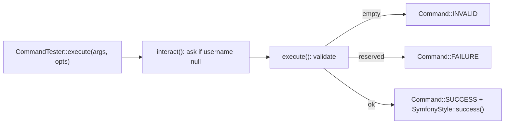

---
tags:
  - Labs
  - Console
---

# Lab: Custom Console Command — Tested with `CommandTester`

!!! abstract "Practical Lab"
    **Objective:** build a custom `#[AsCommand]` command with an argument, options and
    an interactive prompt, and drive it entirely from a `CommandTester` ·
    **Difficulty:** Easy ·
    **Theory:** [Custom commands](../console/custom-commands.md) ·
    [Arguments & options](../console/options-arguments.md) ·
    **Mode:** TDD

## 🧠 Pour les nuls

**C'est quoi ce lab ?** Écrire une commande console personnalisée et la tester entièrement sans jamais la lancer réellement dans un vrai terminal — via `CommandTester`.

**Pourquoi ça existe ?** Tester une commande à la main (la lancer, lire la sortie, vérifier le code retour) est lent et pas reproductible — `CommandTester` simule tout ça en PHP pur, dans une suite de tests automatisée.

**🏠 Analogie de la vraie vie :** Répéter une pièce de théâtre devant une caméra qui enregistre chaque réplique et chaque geste, pour vérifier après coup que tout s'est bien passé — sans avoir besoin d'un vrai public à chaque répétition.

**Symfony dans la vraie vie :** `$tester->execute(['--limite' => 10])` puis `$tester->getDisplay()` te donne exactement ce qu'un utilisateur verrait dans son terminal, sans jamais ouvrir un vrai terminal.

**⚠️ Erreur fréquente :** renvoyer un entier arbitraire au lieu de `Command::SUCCESS`/`FAILURE` — les scripts qui enchaînent des commandes dépendent de ces codes précis pour savoir si ça a réussi.

**🧠 Comment le mémoriser :** "`CommandTester` fait jouer ta commande sans jamais ouvrir un vrai terminal."

## Objective

After this lab you can **write a console command test first** and then implement the
command to make it pass. Concretely, you will be able to:

- instantiate a command in a bare `Application` and wrap it in a `CommandTester`;
- pass **arguments and options** through `CommandTester::execute()`;
- assert on the **exit code** via `getStatusCode()` (`Command::SUCCESS` / `FAILURE`);
- assert on rendered output with `getDisplay()`;
- feed answers to an **interactive question** with `setInputs()`.

## Prerequisites

- Chapters: [Custom commands](../console/custom-commands.md) ·
  [Arguments & options](../console/options-arguments.md) ·
  [Input & output](../console/input-output.md)
- Assumed skills: `#[AsCommand]`, the `Command::SUCCESS|FAILURE|INVALID` constants,
  `SymfonyStyle`, and basic PHPUnit (`assertSame`, `assertStringContainsString`).

## TD Instructions

You will build `app:create-user`, a command that "creates" a user (no persistence —
it just validates input and reports). Work **test-first**.

1. Create the test class `App\Tests\Command\CreateUserCommandTest` extending
   `PHPUnit\Framework\TestCase`. Add a small helper that builds a bare
   `Symfony\Component\Console\Application`, registers your (not-yet-written) command,
   and returns a `CommandTester` for it.
2. Write a **success** test: execute with `username = 'alice'`, `--role=editor`
   and `--admin`. Assert `getStatusCode()` equals `Command::SUCCESS` and that
   `getDisplay()` contains the confirmation line.
3. Write a **failure** test: execute with a *reserved* username (`root`). Assert the
   status is `Command::FAILURE` and the output mentions that the name is reserved.
4. Write an **interactive** test: execute with **no** `username` argument, but call
   `setInputs(['bob'])` first so the prompt is answered. Assert success and that the
   output greets `bob`.
5. Run the suite and watch every test fail (**Red**) — the command does not exist yet.
6. Implement `App\Command\CreateUserCommand` with `#[AsCommand]`. Declare the
   argument/options, prompt for a missing username in `interact()`, validate in
   `execute()`, and return the right `Command::*` constant. Make the tests pass
   (**Green**), then **refactor**.

!!! info "Constraints"
    Symfony 8 · PHP 8.4 · no libraries outside the certification scope · follow
    best practices (attributes, strict types, typed constants, `SymfonyStyle`).

## Implementation Guide (partial)

High-level shape only — resist reading the [Ideal Solution](#ideal-solution) first.

- **Registration:** `#[AsCommand(name: 'app:create-user', description: '…')]`. In a
  real app autoconfiguration tags it `console.command`; in a **unit** test you simply
  `new` it and hand it to an `Application`.
- **Input definition:** one `InputArgument::OPTIONAL` `username` (optional so you can
  prompt for it), one `InputOption::VALUE_NONE` `--admin` flag, and one
  `InputOption::VALUE_REQUIRED` `--role` (default `'user'`).
- **Prompting:** override `interact()`; if the `username` argument is `null`, ask for
  it with `SymfonyStyle::ask()` and write it back via `$input->setArgument()`.
- **Result:** in `execute()` return `Command::INVALID` for an empty name,
  `Command::FAILURE` for a reserved name, otherwise `Command::SUCCESS`. Never
  `return 0;` — always the constant.



## TDD — write the test first

!!! note "Red → Green → Refactor"
    1. **Red:** write the failing test below; run it, watch it fail (no command yet).
    2. **Green:** write the minimum command to pass.
    3. **Refactor:** clean up with the test as your safety net.

**Behaviour (Given/When/Then):**

- **Given** the command, **When** run with `username=alice --role=editor --admin`,
  **Then** the exit code is `SUCCESS` and the output confirms the creation.
- **Given** the command, **When** run with the reserved username `root`, **Then** the
  exit code is `FAILURE` and the output says the name is reserved.
- **Given** the command with **no** `username`, **When** the prompt is answered with
  `bob` via `setInputs()`, **Then** it succeeds and greets `bob`.

```php
<?php
declare(strict_types=1);

namespace App\Tests\Command;

use App\Command\CreateUserCommand;
use PHPUnit\Framework\TestCase;
use Symfony\Component\Console\Application;
use Symfony\Component\Console\Command\Command;
use Symfony\Component\Console\Tester\CommandTester;

final class CreateUserCommandTest extends TestCase
{
    private function tester(): CommandTester
    {
        $application = new Application();
        $application->add(new CreateUserCommand());

        return new CommandTester($application->find('app:create-user'));
    }

    public function testItCreatesAUserSuccessfully(): void
    {
        $tester = $this->tester();

        $status = $tester->execute([
            'username' => 'alice',
            '--role' => 'editor',
            '--admin' => true,
        ]);

        self::assertSame(Command::SUCCESS, $status);
        self::assertSame(Command::SUCCESS, $tester->getStatusCode());
        $tester->assertCommandIsSuccessful();
        self::assertStringContainsString('Created "alice" with role "editor" (admin)', $tester->getDisplay());
    }

    public function testItFailsForAReservedUsername(): void
    {
        $tester = $this->tester();

        $status = $tester->execute(['username' => 'root']);

        self::assertSame(Command::FAILURE, $status);
        self::assertStringContainsString('is reserved', $tester->getDisplay());
    }

    public function testItPromptsForAMissingUsername(): void
    {
        $tester = $this->tester();
        $tester->setInputs(['bob']);            // answer to the interactive prompt

        $status = $tester->execute([]);         // no username argument passed

        self::assertSame(Command::SUCCESS, $status);
        self::assertStringContainsString('Created "bob"', $tester->getDisplay());
    }
}
```

!!! tip "Setup hints"
    Run it with `vendor/bin/phpunit tests/Command/CreateUserCommandTest.php`. No
    kernel is needed — the base `Symfony\Component\Console\Application` is enough to
    resolve the command by name. `CommandTester::execute()` runs **interactively by
    default**, so `setInputs()` supplies the answers `interact()` will consume; a
    non-interactive run would need `['interactive' => false]`. Note the option keys
    carry the `--` prefix (`'--role'`), while the argument key does not.

## Validation Steps

- [ ] `vendor/bin/phpunit tests/Command/CreateUserCommandTest.php` is green (3 tests).
- [ ] `php bin/console app:create-user alice --role=editor --admin` prints
      `Created "alice" with role "editor" (admin).` and exits `0` (`echo $?`).
- [ ] `php bin/console app:create-user root` prints the "reserved" error and exits `1`.
- [ ] `php bin/console app:create-user` (no argument) prompts `Username?` interactively.
- [ ] `php bin/console list` shows `app:create-user` with its description.

## Review — Common Mistakes

- **`return 0;` instead of `Command::SUCCESS`** → magic numbers, brittle intent; the
  fix is always the constant (`SUCCESS=0`, `FAILURE=1`, `INVALID=2`).
- **Prompting inside `execute()`** → the prompt fires even when the argument *was*
  provided. Do it in `interact()`, guarded by `null === $input->getArgument(...)`.
- **Forgetting `setInputs()` before an interactive `execute()`** → the tester blocks
  or throws on missing input. Queue every expected answer, in order.
- **Passing options without the `--` prefix** to `execute()` → they land as unknown
  input. Argument keys are bare (`'username'`), option keys are prefixed (`'--role'`).
- **Asserting on an over-specific string** (exact spacing/colors of a `success()`
  block) → assert on a stable substring with `assertStringContainsString`, not `==`.

## Exam Connection

The certification tests that you know the **exit-code constants and their integer
values**, that an option's key in `CommandTester::execute()` keeps its `--` prefix,
and that `interact()` — not `execute()` — is where you prompt for missing input.
`CommandTester` + `setInputs()` is the canonical way Symfony expects commands to be
tested, and `assertCommandIsSuccessful()` is the shortcut for "exit code was 0".

## Ideal Solution

??? success "Reference solution (compare only after you try)"
    ```php
    <?php
    declare(strict_types=1);

    namespace App\Command;

    use Symfony\Component\Console\Attribute\AsCommand;
    use Symfony\Component\Console\Command\Command;
    use Symfony\Component\Console\Input\InputArgument;
    use Symfony\Component\Console\Input\InputInterface;
    use Symfony\Component\Console\Input\InputOption;
    use Symfony\Component\Console\Output\OutputInterface;
    use Symfony\Component\Console\Style\SymfonyStyle;

    #[AsCommand(
        name: 'app:create-user',
        description: 'Creates a user account (demo: no persistence)',
    )]
    final class CreateUserCommand extends Command
    {
        /** Usernames nobody may claim. */
        private const array RESERVED = ['root', 'admin'];

        protected function configure(): void
        {
            $this
                ->addArgument('username', InputArgument::OPTIONAL, 'The username to create')
                ->addOption('admin', 'a', InputOption::VALUE_NONE, 'Grant administrator rights')
                ->addOption('role', 'r', InputOption::VALUE_REQUIRED, 'Account role', 'user');
        }

        protected function interact(InputInterface $input, OutputInterface $output): void
        {
            if (null !== $input->getArgument('username')) {
                return;
            }

            $io = new SymfonyStyle($input, $output);
            $input->setArgument('username', $io->ask('Username?'));
        }

        protected function execute(InputInterface $input, OutputInterface $output): int
        {
            $io = new SymfonyStyle($input, $output);

            $username = trim((string) $input->getArgument('username'));
            $role = (string) $input->getOption('role');
            $admin = (bool) $input->getOption('admin');

            if ('' === $username) {
                $io->error('Username cannot be empty.');

                return Command::INVALID;
            }

            if (\in_array(strtolower($username), self::RESERVED, true)) {
                $io->error(sprintf('The username "%s" is reserved.', $username));

                return Command::FAILURE;
            }

            $io->success(sprintf(
                'Created "%s" with role "%s"%s.',
                $username,
                $role,
                $admin ? ' (admin)' : '',
            ));

            return Command::SUCCESS;
        }
    }
    ```

## Alternative Approaches (optional)

- **Option A (simple, shown above):** classic `extends Command` with
  `configure()` + `interact()` + `execute()`. Easiest to unit-test with a bare
  `Application`, and `interact()` is the idiomatic home for prompts.
- **Option B (modern, invokable):** drop the base class and write an `__invoke()`
  with `#[Argument] ?string $username = null` and `#[Option] bool $admin = false` /
  `#[Option] string $role = 'user'`. Prompt inline (`$username ??= $io->ask(...)`).
  In a real project you test it identically through the FrameworkBundle
  `Application` after `self::bootKernel()` — the framework wraps the invokable and
  registers it, so `CommandTester` sees the same command.
- **Option C (exam-style):** swap `--role` for a `VALUE_NEGATABLE` `--verified`
  option (default `true`) and assert both `--verified` and `--no-verified` in the
  tester — a favourite trap testing that `NEGATABLE` (mode `16`) generates the
  `--no-…` twin.

---

<small>Theory: [Custom commands](../console/custom-commands.md) ·
[Arguments & options](../console/options-arguments.md) · Labs: [all labs](index.md)</small>
