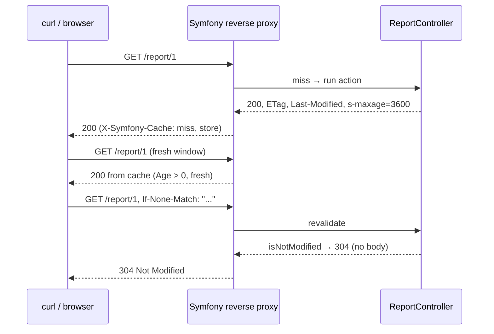

---
tags:
  - Labs
  - HTTP Caching
---

# Lab: HTTP Caching — Make a Controller Response Cacheable and Prove It

<!--
Manual-verification lab (config/headers) with a small TDD appendix on the
Response cache API. Symfony 8 / PHP 8.4. All complete <?php snippets compile.
-->

!!! abstract "Practical Lab"
    **Objective:** rendre la response d'un controller cacheable via l'**expiration**
    (`setSharedMaxAge` / `#[Cache]`) *et* la **validation** (`setEtag` /
    `setLastModified` + `isNotModified`), puis vérifier le comportement avec `curl`. ·
    **Difficulty:** Medium ·
    **Theory:** [Expiration](../http-caching/expiration.md) ·
    [Validation](../http-caching/validation.md) ·
    **Mode:** Vérification manuelle (+ annexe TDD)

## Objective

À l'issue de ce lab, vous saurez prendre une `Response` ordinaire et :

- déclarer sa **fraîcheur** pour qu'un cache partagé la serve sans solliciter l'origine
  (`s-maxage`, `max-age`, `stale-while-revalidate`), à la fois via l'API manuelle de la
  `Response` et via l'attribut `#[Cache]` ;
- attacher des **validateurs** (`ETag`, `Last-Modified`) et court-circuiter avec
  `Response::isNotModified()` pour qu'un client à jour reçoive un `304` sans corps ;
- **prouver** tout cela depuis le shell avec `curl -I` et des requests conditionnelles
  (`If-None-Match`, `If-Modified-Since`), en lisant `Cache-Control`, `ETag`, `Age`
  et `X-Symfony-Cache`.

## Prerequisites

- Chapitres : [Expiration](../http-caching/expiration.md) ·
  [Validation](../http-caching/validation.md) ·
  [Cache Types](../http-caching/cache-types.md)
- Compétences supposées acquises : écrire un controller avec `#[Route]`, lancer le serveur de dev
  (`symfony serve` ou `php -S`), lire des headers HTTP bruts.

## TD Instructions

Vous allez mettre en cache un endpoint en lecture seule `GET /report/{id}` qui retourne un petit document
JSON dont le seul « signal de changement » est le timestamp `updatedAt` du rapport.

1. Créez une action de controller `ReportController::show(int $id, Request $request)`
   routée sur `/report/{id}` (contraignez `{id}` à `\d+`, `methods: ['GET']`).
2. Chargez le rapport (n'importe quelle source ; un petit repository en mémoire suffit — **pas de
   Doctrine**). Levez un 404 s'il est introuvable.
3. Construisez d'abord une `JsonResponse` **vide** — vous devez poser les validateurs *avant*
   de produire le payload, pour qu'une request inchangée ne coûte aucun rendu.
4. **Validation.** Définissez `Last-Modified` à partir de `report.getUpdatedAt()` et un
   `ETag` fort dérivé à moindre coût de ce timestamp plus l'id (`sha1(...)`).
5. **Expiration.** En un seul appel `setCache([...])`, marquez la response `public`
   avec `s_maxage = 3600`, `max_age = 0` (les navigateurs revalident), et
   `stale_while_revalidate = 60`.
6. **Court-circuit.** Appelez `$response->isNotModified($request)` ; si `true`,
   faites `return $response` immédiatement (c'est déjà un 304 sans corps).
7. Seulement après ce contrôle, remplissez le corps avec `$response->setData([...])` et retournez.
8. Écrivez la **même action avec l'attribut `#[Cache]`** à la place de l'API manuelle
   (expressions `lastModified: 'report.getUpdatedAt()'` et
   `etag: 'report.getUpdatedAt().format("U")'`). Notez ce que l'attribut fait que
   la version manuelle ne fait pas (le 304 se déclenche *avant* le corps du controller).
9. Activez le reverse proxy intégré de Symfony pour pouvoir observer `Age` et
   `X-Symfony-Cache` :

    ```yaml
    # config/packages/framework.yaml
    framework:
        http_cache: true
    ```

!!! info "Constraints"
    Symfony 8 · PHP 8.4 · aucune bibliothèque hors du périmètre de la certification (pas de
    Doctrine/UX) · types stricts, `readonly` là où c'est pertinent, attributs pour le routing.

## Implementation Guide (partial)

- Controller : `Symfony\Bundle\FrameworkBundle\Controller\AbstractController`,
  route via `Symfony\Component\Routing\Attribute\Route`.
- Response : `Symfony\Component\HttpFoundation\JsonResponse` (étend `Response`),
  donc `setEtag()`, `setLastModified()`, `setCache()` et `isNotModified()` sont tous
  disponibles ; utilisez `setData()` en dernier.
- `setCache(array $options)` **valide ses clés** — une clé inconnue lève une
  `InvalidArgumentException`. Les clés sont en snake_case : `public`, `s_maxage`,
  `max_age`, `stale_while_revalidate` (et non les noms camelCase de l'attribut).
- Attribut : `Symfony\Component\HttpKernel\Attribute\Cache` ; ses options sont en
  camelCase (`smaxage`, `maxage`, `staleWhileRevalidate`, `lastModified`, `etag`).
- Reverse proxy : `framework.http_cache: true` enveloppe le kernel dans
  `Symfony\Bundle\FrameworkBundle\HttpCache\HttpCache`, qui émet `Age` et
  `X-Symfony-Cache`.



## Validation Steps

Lancez le serveur de dev (`symfony serve -d` ou `php -S 127.0.0.1:8000 -t public`), puis :

- [ ] **Headers de base.** `curl -I` affiche l'expiration + les validateurs :

    ```console
    $ curl -sI http://127.0.0.1:8000/report/1
    HTTP/1.1 200 OK
    Cache-Control: max-age=0, public, s-maxage=3600, stale-while-revalidate=60
    ETag: "6f1e...c2"
    Last-Modified: Wed, 01 Jul 2026 09:00:00 GMT
    Content-Type: application/json
    ```

- [ ] **304 via ETag.** Copiez la valeur exacte de l'`ETag` (avec les guillemets) dans une
  request conditionnelle ; attendez-vous à un `304` sans corps :

    ```console
    $ curl -sI -H 'If-None-Match: "6f1e...c2"' http://127.0.0.1:8000/report/1
    HTTP/1.1 304 Not Modified
    ETag: "6f1e...c2"
    ```

- [ ] **304 via Last-Modified.** Renvoyez la date telle quelle :

    ```console
    $ curl -sI -H 'If-Modified-Since: Wed, 01 Jul 2026 09:00:00 GMT' \
        http://127.0.0.1:8000/report/1
    HTTP/1.1 304 Not Modified
    ```

- [ ] **Validateur périmé → 200.** Un mauvais `If-None-Match` re-sert le corps complet :

    ```console
    $ curl -sI -H 'If-None-Match: "stale"' http://127.0.0.1:8000/report/1
    HTTP/1.1 200 OK
    ```

- [ ] **Fraîcheur côté reverse proxy.** Avec `http_cache: true`, la *deuxième* request
  identique est servie par le proxy — `Age` grimpe et `X-Symfony-Cache` signale un
  hit frais (exécutez dans l'environnement prod, `APP_ENV=prod`) :

    ```console
    $ curl -sI http://127.0.0.1:8000/report/1   # first: miss + store
    $ curl -sI http://127.0.0.1:8000/report/1   # second:
    HTTP/1.1 200 OK
    Age: 4
    X-Symfony-Cache: GET /report/1: fresh
    ```

## Review — Common Mistakes

- Construire le payload JSON **avant** `isNotModified()` → vous payez le coût de rendu
  que le 304 existe justement pour éviter. Posez les validateurs d'abord, vérifiez, *puis* `setData()`.
- Oublier de faire `return $response` après un `isNotModified()` à `true` → la méthode
  continue de s'exécuter et ré-émet un 200. `isNotModified()` mute la response en 304
  mais ne l'envoie **pas**.
- Passer des clés camelCase à `setCache()` (par ex. `sMaxage`) → `InvalidArgumentException`.
  L'API manuelle utilise le snake_case (`s_maxage`) ; seul l'attribut `#[Cache]` est en
  camelCase.
- Espérer que le CDN survive au cache navigateur avec `max-age` seul — il faut
  `s_maxage` pour l'étage partagé.
- Utiliser `new \DateTime()` comme `Last-Modified` → il ne correspond jamais, la validation
  devient donc du poids mort. Utilisez le vrai `updatedAt` de la ressource.
- Pas d'`Age` / `X-Symfony-Cache` dans la sortie → le reverse proxy est désactivé (env dev ou
  `http_cache: false`) ; ces headers viennent de `HttpCache`, pas de votre controller.

## Exam Connection

La certification teste exactement les points d'articulation que ce lab exerce : le fait que
`setSharedMaxAge()` (et `s_maxage`) marque implicitement la response `public` ; que
`isNotModified()` **mute** la response en 304 et supprime le corps mais que vous devez
quand même la `return` ; que les **expressions** etag/lastModified de `#[Cache]` s'exécutent sur
`kernel.controller_arguments` et court-circuitent *avant* le corps du controller (et que
l'expression de l'ETag est **hachée en SHA-256**) ; ainsi que la précédence des validateurs quand
`If-None-Match` et `If-Modified-Since` sont tous deux présents (l'ETag gagne).

## Ideal Solution

??? success "Reference solution — manual Response API (compare only after you try)"

    ```php
    <?php
    declare(strict_types=1);

    namespace App\Entity;

    final class Report
    {
        public function __construct(
            private readonly int $id,
            private readonly string $title,
            private readonly \DateTimeImmutable $updatedAt,
        ) {
        }

        public function getId(): int
        {
            return $this->id;
        }

        public function getTitle(): string
        {
            return $this->title;
        }

        public function getUpdatedAt(): \DateTimeImmutable
        {
            return $this->updatedAt;
        }
    }
    ```

    ```php
    <?php
    declare(strict_types=1);

    namespace App\Repository;

    use App\Entity\Report;

    final class ReportRepository
    {
        /** @var array<int, Report> */
        private array $reports;

        public function __construct()
        {
            $this->reports = [
                1 => new Report(1, 'Quarterly figures', new \DateTimeImmutable('2026-07-01 09:00:00')),
            ];
        }

        public function find(int $id): ?Report
        {
            return $this->reports[$id] ?? null;
        }
    }
    ```

    ```php
    <?php
    declare(strict_types=1);

    namespace App\Controller;

    use App\Repository\ReportRepository;
    use Symfony\Bundle\FrameworkBundle\Controller\AbstractController;
    use Symfony\Component\HttpFoundation\JsonResponse;
    use Symfony\Component\HttpFoundation\Request;
    use Symfony\Component\HttpFoundation\Response;
    use Symfony\Component\Routing\Attribute\Route;

    final class ReportController extends AbstractController
    {
        #[Route('/report/{id}', name: 'report_show', methods: ['GET'], requirements: ['id' => '\d+'])]
        public function show(int $id, Request $request, ReportRepository $reports): Response
        {
            $report = $reports->find($id) ?? throw $this->createNotFoundException();

            $response = new JsonResponse();

            // --- Validation: fingerprints computed cheaply, BEFORE any rendering.
            $response->setLastModified($report->getUpdatedAt());          // \DateTimeInterface
            $response->setEtag(sha1($report->getUpdatedAt()->format(\DateTimeInterface::ATOM).$id));

            // --- Expiration: CDN keeps it fresh 1 h; the browser must revalidate.
            $response->setCache([
                'public'                 => true,   // shareable by a CDN / reverse proxy
                's_maxage'               => 3600,   // shared TTL (1 h)
                'max_age'                => 0,      // browser: revalidate every time
                'stale_while_revalidate' => 60,     // hide latency while refreshing
            ]);

            // --- Short-circuit: 304 with no body when the client is already current.
            if ($response->isNotModified($request)) {
                return $response;
            }

            // Only reached when the resource actually changed.
            $response->setData(['id' => $report->getId(), 'title' => $report->getTitle()]);

            return $response;
        }
    }
    ```

## TDD Appendix — unit-test the `Response` cache API

Le câblage du controller est vérifié manuellement ci-dessus, mais la **décision de cache** est un
comportement pur de la `Response` : elle est donc testable unitairement, sans kernel ni HTTP.

!!! note "Red → Green → Refactor"
    1. **Red :** vérifiez qu'une `Response` portant un validateur correspondant se transforme en
       304 pour une `Request` conditionnelle.
    2. **Green :** le comportement vit déjà dans `Response::isNotModified()` — le
       test fige le contrat sur lequel votre controller s'appuie.
    3. **Refactor :** étendez avec les cas Last-Modified et ETag périmé.

**Behaviour (Given/When/Then):**

- **Given** une `Response` avec `ETag: "v3"` **When** une `Request` porte
  `If-None-Match: "v3"` **Then** `isNotModified()` retourne `true`, le statut est
  `304`, et le corps est supprimé.

```php
<?php
declare(strict_types=1);

namespace App\Tests\HttpCaching;

use PHPUnit\Framework\Attributes\Test;
use PHPUnit\Framework\TestCase;
use Symfony\Component\HttpFoundation\Request;
use Symfony\Component\HttpFoundation\Response;

final class ResponseCacheTest extends TestCase
{
    #[Test]
    public function matchingEtagReturns304AndStripsBody(): void
    {
        $response = new Response('the full rendered body', Response::HTTP_OK);
        $response->setEtag('v3');            // emits ETag: "v3"
        $response->setSharedMaxAge(3600);

        $request = Request::create('/report/1');
        $request->headers->set('If-None-Match', '"v3"');

        self::assertTrue($response->isNotModified($request));
        self::assertSame(Response::HTTP_NOT_MODIFIED, $response->getStatusCode());
        self::assertSame('', $response->getContent());          // body stripped
        self::assertFalse($response->headers->has('Content-Type'));
    }

    #[Test]
    public function matchingLastModifiedReturns304(): void
    {
        $response = new Response('the full rendered body');
        $response->setLastModified(new \DateTimeImmutable('2026-07-01 09:00:00'));

        $request = Request::create('/report/1');
        // Reuse the response's own header string -> guaranteed identical GMT date.
        $request->headers->set('If-Modified-Since', (string) $response->headers->get('Last-Modified'));

        self::assertTrue($response->isNotModified($request));
        self::assertSame(Response::HTTP_NOT_MODIFIED, $response->getStatusCode());
    }

    #[Test]
    public function staleEtagReturns200(): void
    {
        $response = new Response('the full rendered body', Response::HTTP_OK);
        $response->setEtag('v4');            // resource changed

        $request = Request::create('/report/1');
        $request->headers->set('If-None-Match', '"v3"');

        self::assertFalse($response->isNotModified($request));
        self::assertSame(Response::HTTP_OK, $response->getStatusCode());
    }
}
```

!!! tip "Setup hints"
    Lancez-le avec `vendor/bin/phpunit tests/HttpCaching/ResponseCacheTest.php`. Aucune
    fixture ni mock n'est nécessaire — `Request::create()` construit une vraie request et
    `Response::isNotModified()` fait la comparaison en mémoire. Alimentez
    `If-None-Match` avec l'ETag **entre guillemets** (`'"v3"'`) ; pour `If-Modified-Since`,
    réutilisez la chaîne du header `Last-Modified` de la response elle-même pour que le format GMT
    corresponde exactement.

## Alternative Approaches (optional)

- **Option A (simple) — expiration seule.** `#[Cache(public: true, smaxage: 3600)]`
  quand la durée de vie est prévisible et que vous acceptez de servir des données légèrement périmées.
- **Option B (avancée) — `#[Cache]` avec expressions de validation.** Le 304 se déclenche
  *avant* le corps du controller (évalué sur `kernel.controller_arguments`) :

    ```php
    <?php
    declare(strict_types=1);

    namespace App\Controller;

    use App\Entity\Report;
    use Symfony\Bundle\FrameworkBundle\Controller\AbstractController;
    use Symfony\Component\HttpFoundation\JsonResponse;
    use Symfony\Component\HttpKernel\Attribute\Cache;
    use Symfony\Component\Routing\Attribute\Route;

    final class ReportAttributeController extends AbstractController
    {
        #[Route('/report/{id}', name: 'report_show', methods: ['GET'], requirements: ['id' => '\d+'])]
        #[Cache(
            public: true,
            smaxage: 3600,
            maxage: 0,
            staleWhileRevalidate: 60,
            lastModified: 'report.getUpdatedAt()',
            etag: 'report.getUpdatedAt().format("U")',
        )]
        public function show(Report $report): JsonResponse
        {
            return $this->json(['id' => $report->getId(), 'title' => $report->getTitle()]);
        }
    }
    ```

    Transformer `{id}` en `Report` ici demande un value resolver (l'
    `EntityValueResolver` de Doctrine, hors périmètre, ou un
    [`ValueResolverInterface`](controllers.md) personnalisé) ; la solution de référence principale
    utilise l'API manuelle précisément pour n'avoir besoin d'aucun resolver.
- **Option C (exam-style) — combiner les deux, `no-cache` + ETag.** Retirez `s-maxage`,
  envoyez `Cache-Control: no-cache` plus un `ETag` : chaque request revalide, mais la
  réponse est un 304 sans corps très économique plutôt qu'un re-téléchargement complet.

---

<small>Theory: [Expiration](../http-caching/expiration.md) ·
[Validation](../http-caching/validation.md) · Labs: [all labs](index.md)</small>
