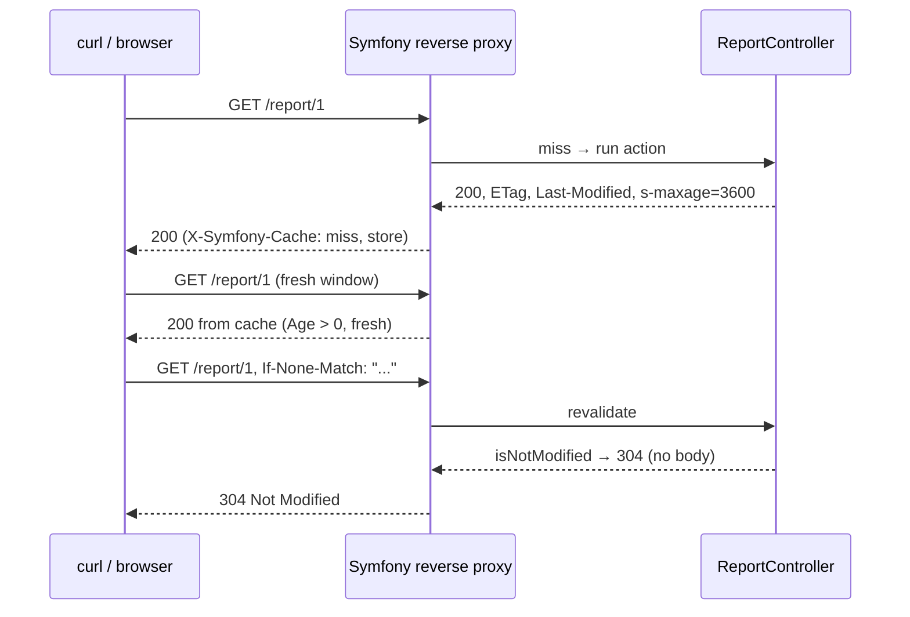

# Lab: HTTP Caching — Make a Controller Response Cacheable and Prove It

<!--
Manual-verification lab (config/headers) with a small TDD appendix on the
Response cache API. Symfony 8 / PHP 8.4. All complete <?php snippets compile.
-->

!!! abstract "Practical Lab"
    **Objective:** make a controller response cacheable through **expiration**
    (`setSharedMaxAge` / `#[Cache]`) *and* **validation** (`setEtag` /
    `setLastModified` + `isNotModified`), then verify the behaviour with `curl`. ·
    **Difficulty:** Medium ·
    **Theory:** [Expiration](../http-caching/expiration.md) ·
    [Validation](../http-caching/validation.md) ·
    **Mode:** Manual verification (+ TDD appendix)

## Objective

After this lab you can take a plain `Response` and:

- declare its **freshness** so a shared cache serves it without hitting the origin
  (`s-maxage`, `max-age`, `stale-while-revalidate`), via both the manual
  `Response` API and the `#[Cache]` attribute;
- attach **validators** (`ETag`, `Last-Modified`) and short-circuit with
  `Response::isNotModified()` so an up-to-date client gets a bodyless `304`;
- **prove** all of it from the shell with `curl -I` and conditional requests
  (`If-None-Match`, `If-Modified-Since`), reading `Cache-Control`, `ETag`, `Age`
  and `X-Symfony-Cache`.

## Prerequisites

- Chapters: [Expiration](../http-caching/expiration.md) ·
  [Validation](../http-caching/validation.md) ·
  [Cache Types](../http-caching/cache-types.md)
- Assumed skills: writing a controller with `#[Route]`, running the dev server
  (`symfony serve` or `php -S`), reading raw HTTP headers.

## TD Instructions

You will cache a read-only endpoint `GET /report/{id}` that returns a small JSON
document whose only "change signal" is the report's `updatedAt` timestamp.

1. Create a controller action `ReportController::show(int $id, Request $request)`
   routed at `/report/{id}` (constrain `{id}` to `\d+`, `methods: ['GET']`).
2. Load the report (any source; a tiny in-memory repository is fine — **no
   Doctrine**). Throw a 404 when it is missing.
3. Build an **empty** `JsonResponse` first — you must set the validators *before*
   producing the payload, so an unchanged request costs no rendering.
4. **Validation.** Set `Last-Modified` from `report.getUpdatedAt()` and a strong
   `ETag` derived cheaply from that timestamp plus the id (`sha1(...)`).
5. **Expiration.** With one `setCache([...])` call, mark the response `public`
   with `s_maxage = 3600`, `max_age = 0` (browsers revalidate), and
   `stale_while_revalidate = 60`.
6. **Short-circuit.** Call `$response->isNotModified($request)`; on `true`,
   `return $response` immediately (it is already a 304 with no body).
7. Only past that check, fill the body with `$response->setData([...])` and return.
8. Write the **same action with the `#[Cache]` attribute** instead of the manual
   API (expressions `lastModified: 'report.getUpdatedAt()'` and
   `etag: 'report.getUpdatedAt().format("U")'`). Note what the attribute does that
   the manual version does not (the 304 fires *before* the controller body).
9. Enable Symfony's built-in reverse proxy so you can observe `Age` and
   `X-Symfony-Cache`:

    ```yaml
    # config/packages/framework.yaml
    framework:
        http_cache: true
    ```

!!! info "Constraints"
    Symfony 8 · PHP 8.4 · no libraries outside the certification scope (no
    Doctrine/UX) · strict types, `readonly` where apt, attributes for routing.

## Implementation Guide (partial)

- Controller: `Symfony\Bundle\FrameworkBundle\Controller\AbstractController`,
  route via `Symfony\Component\Routing\Attribute\Route`.
- Response: `Symfony\Component\HttpFoundation\JsonResponse` (extends `Response`),
  so `setEtag()`, `setLastModified()`, `setCache()` and `isNotModified()` are all
  available; use `setData()` last.
- `setCache(array $options)` **validates its keys** — an unknown key throws
  `InvalidArgumentException`. Keys are snake_case: `public`, `s_maxage`,
  `max_age`, `stale_while_revalidate` (not the camelCase attribute names).
- Attribute: `Symfony\Component\HttpKernel\Attribute\Cache`; its options are
  camelCase (`smaxage`, `maxage`, `staleWhileRevalidate`, `lastModified`, `etag`).
- Reverse proxy: `framework.http_cache: true` wraps the kernel in
  `Symfony\Bundle\FrameworkBundle\HttpCache\HttpCache`, which emits `Age` and
  `X-Symfony-Cache`.



## Validation Steps

Run the dev server (`symfony serve -d` or `php -S 127.0.0.1:8000 -t public`), then:

- [ ] **Baseline headers.** `curl -I` shows the expiration + validators:

    ```console
    $ curl -sI http://127.0.0.1:8000/report/1
    HTTP/1.1 200 OK
    Cache-Control: max-age=0, public, s-maxage=3600, stale-while-revalidate=60
    ETag: "6f1e...c2"
    Last-Modified: Wed, 01 Jul 2026 09:00:00 GMT
    Content-Type: application/json
    ```

- [ ] **304 via ETag.** Copy the exact `ETag` value (with quotes) into a
  conditional request; expect a bodyless `304`:

    ```console
    $ curl -sI -H 'If-None-Match: "6f1e...c2"' http://127.0.0.1:8000/report/1
    HTTP/1.1 304 Not Modified
    ETag: "6f1e...c2"
    ```

- [ ] **304 via Last-Modified.** Send the date back verbatim:

    ```console
    $ curl -sI -H 'If-Modified-Since: Wed, 01 Jul 2026 09:00:00 GMT' \
        http://127.0.0.1:8000/report/1
    HTTP/1.1 304 Not Modified
    ```

- [ ] **Stale validator → 200.** A wrong `If-None-Match` re-serves the full body:

    ```console
    $ curl -sI -H 'If-None-Match: "stale"' http://127.0.0.1:8000/report/1
    HTTP/1.1 200 OK
    ```

- [ ] **Reverse proxy freshness.** With `http_cache: true`, the *second* identical
  request is served from the proxy — `Age` climbs and `X-Symfony-Cache` reports a
  fresh hit (run against the prod env, `APP_ENV=prod`):

    ```console
    $ curl -sI http://127.0.0.1:8000/report/1   # first: miss + store
    $ curl -sI http://127.0.0.1:8000/report/1   # second:
    HTTP/1.1 200 OK
    Age: 4
    X-Symfony-Cache: GET /report/1: fresh
    ```

## Review — Common Mistakes

- Building the JSON payload **before** `isNotModified()` → you pay the render cost
  the 304 exists to avoid. Set validators first, check, *then* `setData()`.
- Forgetting to `return $response` after a `true` `isNotModified()` → the method
  keeps running and re-emits a 200. `isNotModified()` mutates the response to 304
  but does **not** send it.
- Passing camelCase keys to `setCache()` (e.g. `sMaxage`) → `InvalidArgumentException`.
  The manual API uses snake_case (`s_maxage`); only the `#[Cache]` attribute is
  camelCase.
- Expecting the CDN to outlive the browser cache with `max-age` alone — you need
  `s_maxage` for the shared tier.
- Using `new \DateTime()` as `Last-Modified` → it never matches, so validation is
  dead weight. Use the resource's real `updatedAt`.
- No `Age` / `X-Symfony-Cache` in the output → the reverse proxy is off (dev env or
  `http_cache: false`); those headers come from `HttpCache`, not your controller.

## Exam Connection

The certification probes the exact seams this lab exercises: that
`setSharedMaxAge()` (and `s_maxage`) implicitly marks the response `public`; that
`isNotModified()` **mutates** the response to 304 and strips the body yet you must
still `return` it; that `#[Cache]` etag/lastModified **expressions** run on
`kernel.controller_arguments` and short-circuit *before* the controller body (and
the ETag expression is **SHA-256 hashed**); and the precedence of validators when
both `If-None-Match` and `If-Modified-Since` are present (ETag wins).

## Ideal Solution

??? success "Reference solution — manual Response API (compare only after you try)"

    ```php
    <?php
    declare(strict_types=1);

    namespace App\Entity;

    final class Report
    {
        public function __construct(
            private readonly int $id,
            private readonly string $title,
            private readonly \DateTimeImmutable $updatedAt,
        ) {
        }

        public function getId(): int
        {
            return $this->id;
        }

        public function getTitle(): string
        {
            return $this->title;
        }

        public function getUpdatedAt(): \DateTimeImmutable
        {
            return $this->updatedAt;
        }
    }
    ```

    ```php
    <?php
    declare(strict_types=1);

    namespace App\Repository;

    use App\Entity\Report;

    final class ReportRepository
    {
        /** @var array<int, Report> */
        private array $reports;

        public function __construct()
        {
            $this->reports = [
                1 => new Report(1, 'Quarterly figures', new \DateTimeImmutable('2026-07-01 09:00:00')),
            ];
        }

        public function find(int $id): ?Report
        {
            return $this->reports[$id] ?? null;
        }
    }
    ```

    ```php
    <?php
    declare(strict_types=1);

    namespace App\Controller;

    use App\Repository\ReportRepository;
    use Symfony\Bundle\FrameworkBundle\Controller\AbstractController;
    use Symfony\Component\HttpFoundation\JsonResponse;
    use Symfony\Component\HttpFoundation\Request;
    use Symfony\Component\HttpFoundation\Response;
    use Symfony\Component\Routing\Attribute\Route;

    final class ReportController extends AbstractController
    {
        #[Route('/report/{id}', name: 'report_show', methods: ['GET'], requirements: ['id' => '\d+'])]
        public function show(int $id, Request $request, ReportRepository $reports): Response
        {
            $report = $reports->find($id) ?? throw $this->createNotFoundException();

            $response = new JsonResponse();

            // --- Validation: fingerprints computed cheaply, BEFORE any rendering.
            $response->setLastModified($report->getUpdatedAt());          // \DateTimeInterface
            $response->setEtag(sha1($report->getUpdatedAt()->format(\DateTimeInterface::ATOM).$id));

            // --- Expiration: CDN keeps it fresh 1 h; the browser must revalidate.
            $response->setCache([
                'public'                 => true,   // shareable by a CDN / reverse proxy
                's_maxage'               => 3600,   // shared TTL (1 h)
                'max_age'                => 0,      // browser: revalidate every time
                'stale_while_revalidate' => 60,     // hide latency while refreshing
            ]);

            // --- Short-circuit: 304 with no body when the client is already current.
            if ($response->isNotModified($request)) {
                return $response;
            }

            // Only reached when the resource actually changed.
            $response->setData(['id' => $report->getId(), 'title' => $report->getTitle()]);

            return $response;
        }
    }
    ```

## TDD Appendix — unit-test the `Response` cache API

The controller wiring is verified manually above, but the **cache decision** is
pure `Response` behaviour, so it is unit-testable with no kernel and no HTTP.

!!! note "Red → Green → Refactor"
    1. **Red:** assert that a `Response` carrying a matching validator turns into a
       304 for a conditional `Request`.
    2. **Green:** the behaviour already lives in `Response::isNotModified()` — the
       test pins the contract your controller relies on.
    3. **Refactor:** extend with the Last-Modified and stale-ETag cases.

**Behaviour (Given/When/Then):**

- **Given** a `Response` with `ETag: "v3"` **When** a `Request` carries
  `If-None-Match: "v3"` **Then** `isNotModified()` returns `true`, the status is
  `304`, and the body is stripped.

```php
<?php
declare(strict_types=1);

namespace App\Tests\HttpCaching;

use PHPUnit\Framework\Attributes\Test;
use PHPUnit\Framework\TestCase;
use Symfony\Component\HttpFoundation\Request;
use Symfony\Component\HttpFoundation\Response;

final class ResponseCacheTest extends TestCase
{
    #[Test]
    public function matchingEtagReturns304AndStripsBody(): void
    {
        $response = new Response('the full rendered body', Response::HTTP_OK);
        $response->setEtag('v3');            // emits ETag: "v3"
        $response->setSharedMaxAge(3600);

        $request = Request::create('/report/1');
        $request->headers->set('If-None-Match', '"v3"');

        self::assertTrue($response->isNotModified($request));
        self::assertSame(Response::HTTP_NOT_MODIFIED, $response->getStatusCode());
        self::assertSame('', $response->getContent());          // body stripped
        self::assertFalse($response->headers->has('Content-Type'));
    }

    #[Test]
    public function matchingLastModifiedReturns304(): void
    {
        $response = new Response('the full rendered body');
        $response->setLastModified(new \DateTimeImmutable('2026-07-01 09:00:00'));

        $request = Request::create('/report/1');
        // Reuse the response's own header string -> guaranteed identical GMT date.
        $request->headers->set('If-Modified-Since', (string) $response->headers->get('Last-Modified'));

        self::assertTrue($response->isNotModified($request));
        self::assertSame(Response::HTTP_NOT_MODIFIED, $response->getStatusCode());
    }

    #[Test]
    public function staleEtagReturns200(): void
    {
        $response = new Response('the full rendered body', Response::HTTP_OK);
        $response->setEtag('v4');            // resource changed

        $request = Request::create('/report/1');
        $request->headers->set('If-None-Match', '"v3"');

        self::assertFalse($response->isNotModified($request));
        self::assertSame(Response::HTTP_OK, $response->getStatusCode());
    }
}
```

!!! tip "Setup hints"
    Run it with `vendor/bin/phpunit tests/HttpCaching/ResponseCacheTest.php`. No
    fixtures or mocks are needed — `Request::create()` builds a real request and
    `Response::isNotModified()` does the comparison in memory. Feed
    `If-None-Match` with the **quoted** ETag (`'"v3"'`); for `If-Modified-Since`,
    reuse the response's own `Last-Modified` header string so the GMT format
    matches exactly.

## Alternative Approaches (optional)

- **Option A (simple) — expiration only.** `#[Cache(public: true, smaxage: 3600)]`
  when the lifetime is predictable and you accept serving slightly stale data.
- **Option B (advanced) — `#[Cache]` with validation expressions.** The 304 fires
  *before* the controller body (evaluated on `kernel.controller_arguments`):

    ```php
    <?php
    declare(strict_types=1);

    namespace App\Controller;

    use App\Entity\Report;
    use Symfony\Bundle\FrameworkBundle\Controller\AbstractController;
    use Symfony\Component\HttpFoundation\JsonResponse;
    use Symfony\Component\HttpKernel\Attribute\Cache;
    use Symfony\Component\Routing\Attribute\Route;

    final class ReportAttributeController extends AbstractController
    {
        #[Route('/report/{id}', name: 'report_show', methods: ['GET'], requirements: ['id' => '\d+'])]
        #[Cache(
            public: true,
            smaxage: 3600,
            maxage: 0,
            staleWhileRevalidate: 60,
            lastModified: 'report.getUpdatedAt()',
            etag: 'report.getUpdatedAt().format("U")',
        )]
        public function show(Report $report): JsonResponse
        {
            return $this->json(['id' => $report->getId(), 'title' => $report->getTitle()]);
        }
    }
    ```

    Turning `{id}` into a `Report` here needs a value resolver (Doctrine's
    `EntityValueResolver`, out of scope, or a custom
    [`ValueResolverInterface`](controllers.md)); the flagship reference solution
    uses the manual API precisely so it needs no resolver.
- **Option C (exam-style) — combine both, `no-cache` + ETag.** Drop `s-maxage`,
  send `Cache-Control: no-cache` plus an `ETag`: every request revalidates but the
  answer is a cheap bodyless 304 rather than a full re-download.

---

<small>Theory: [Expiration](../http-caching/expiration.md) ·
[Validation](../http-caching/validation.md) · Labs: [all labs](index.md)</small>
