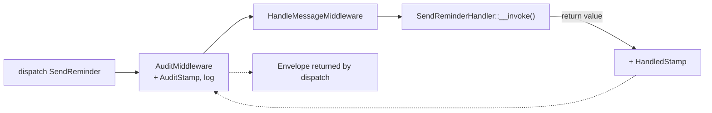

---
tags:
  - Labs
  - Miscellaneous
---

# Lab: Messenger — A Message, a Handler and a Custom Middleware

!!! abstract "Practical Lab"
    **Objective:** construire un message Messenger + un handler `#[AsMessageHandler]` et un
    `MiddlewareInterface` personnalisé qui appose un stamp et journalise chaque envelope, puis prouver que
    tout fonctionne en câblant un vrai `MessageBus` dans un test ·
    **Difficulty:** Advanced ·
    **Theory:** [Messenger](../messenger/index.md) ·
    **Mode:** TDD

## Objective

À l'issue de ce lab, vous saurez, à partir de zéro et sans le kernel du framework :

- Modéliser un **message** (un simple DTO immuable) et un **handler** découvert par
  `#[AsMessageHandler]`.
- Écrire un **middleware personnalisé** qui décore l'`Envelope` avec votre propre
  **stamp** et le journalise, puis délègue avec `$stack->next()->handle(...)`.
- Assembler un `MessageBus` nu (votre middleware + un `HandleMessageMiddleware` alimenté par
  un `HandlersLocator`), **dispatcher** un message, et faire des assertions sur l'`Envelope`
  retournée — l'**effet de bord** du handler, votre `AuditStamp`, et le
  `HandledStamp` du framework.
- Raisonner sur l'**ordre des middlewares** — la chaîne en poupées russes
  `before → next() → after`.

## Prerequisites

- Chapitres : [Messenger](../messenger/index.md),
  [Events](../architecture/events.md), [Clock](../miscellaneous/clock.md),
  [Automated Tests](../testing/index.md)
- Compétences supposées acquises : `TestCase` PHPUnit, `LoggerInterface` PSR-3, objets immuables.

## TD Instructions

1. Créez le message `App\Message\SendReminder` — un DTO `final readonly` portant un
   unique `int $userId`. Ce doit être un objet simple et sérialisable (aucun service).
2. Créez le handler `App\MessageHandler\SendReminderHandler`. Marquez-le avec
   `#[AsMessageHandler]` et donnez-lui une méthode `__invoke(SendReminder $message)`.
   Pour rendre l'effet de bord observable, injectez un petit collaborateur
   (`App\Service\ReminderJournal`) qui enregistre les ids des utilisateurs traités, et faites **retourner** une
   chaîne pour pouvoir la relire depuis le `HandledStamp`.
3. Créez votre stamp personnalisé `App\Messenger\Stamp\AuditStamp` implémentant
   `StampInterface`. Les stamps sont des porteurs de métadonnées — rendez-le `readonly`, avec un
   trace id et un `\DateTimeImmutable`.
4. Créez le middleware `App\Messenger\Middleware\AuditMiddleware` implémentant
   `MiddlewareInterface`. Dans `handle()` : si l'envelope n'a **pas** d'`AuditStamp`,
   ajoutez-en un (utilisez une `ClockInterface` injectée pour le timestamp) et journalisez-le une seule fois ;
   puis déléguez **toujours** via `$stack->next()->handle($envelope, $stack)` et
   retournez le résultat.
5. **Écrivez le test en premier** (voir ci-dessous). Construisez un `MessageBus` à partir de votre middleware
   plus un `HandleMessageMiddleware` adossé à un `HandlersLocator` qui mappe la
   classe du message vers votre handler. Dispatchez et faites vos assertions.
6. Ajoutez un second test prouvant l'**ordre** : un middleware enregistreur qui ajoute
   `before` / `after` autour de `next()`, avec un handler qui ajoute `handled` —
   vérifiez que la séquence est `['before', 'handled', 'after']`.
7. Déroulez red → green → refactor.

!!! info "Constraints"
    Symfony 8 · PHP 8.4 · aucune bibliothèque hors du périmètre de la certification · respect
    des bonnes pratiques (attributs, types stricts, readonly là où c'est pertinent).

## Implementation Guide (partial)

Des repères de haut niveau uniquement — appuyez-vous dessus, ne copiez pas une solution complète :

- **Message :** une `final readonly class` avec des propriétés promues dans le constructeur.
- **Handler :** `#[AsMessageHandler]` sur une classe avec `__invoke(SendReminder $m)`.
  La valeur de retour devient le résultat du `HandledStamp`.
- **Stamp :** `implements Symfony\Component\Messenger\Stamp\StampInterface`
  (une pure interface marqueur — aucune méthode à implémenter).
- **Middleware :** `implements MiddlewareInterface` ; la signature est
  `handle(Envelope $envelope, StackInterface $stack): Envelope`. Ajoutez un stamp avec
  l'appel **immuable** `$envelope = $envelope->with($stamp)`, lisez avec
  `$envelope->last(AuditStamp::class)`, puis `return $stack->next()->handle($envelope, $stack)`.
- **Le bus dans le test :** `new MessageBus([$yourMiddleware, new HandleMessageMiddleware(new HandlersLocator([SendReminder::class => [$handler]]))])`.
  Une entrée de `HandlersLocator` est n'importe quel **callable** — votre handler invokable *en est* un.
- **Clock :** injectez `Symfony\Component\Clock\ClockInterface` ; dans le test, utilisez
  `Symfony\Component\Clock\MockClock` pour un timestamp déterministe.



## TDD — write the test first

!!! note "Red → Green → Refactor"
    1. **Red :** écrivez le test en échec ci-dessous ; lancez-le — il échoue car le message,
       le handler, le stamp et le middleware n'existent pas encore.
    2. **Green :** créez les quatre classes pour que le bus dispatche et que les assertions passent.
    3. **Refactor :** nettoyez (nommage, la garde « un seul stamp ») avec le test comme filet.

**Behaviour (Given/When/Then):**

- **Given** un `MessageBus` composé d'`AuditMiddleware` et de
  `HandleMessageMiddleware`, **When** je `dispatch(new SendReminder(42))`, **Then**
  le handler s'exécute (le journal enregistre `42`), l'`Envelope` retournée porte mon
  `AuditStamp` (horodaté par la clock injectée) et un `HandledStamp` dont le
  résultat est `reminded:42`, et le middleware a journalisé exactement une fois.
- **Given** un middleware enregistreur enveloppant `next()`, **When** un message est
  dispatché, **Then** la trace est `before → handled → after` (ordre en poupées russes).

```php
<?php
declare(strict_types=1);

namespace App\Tests\Messenger;

use App\Message\SendReminder;
use App\MessageHandler\SendReminderHandler;
use App\Messenger\Middleware\AuditMiddleware;
use App\Messenger\Stamp\AuditStamp;
use App\Service\ReminderJournal;
use PHPUnit\Framework\TestCase;
use Psr\Log\AbstractLogger;
use Symfony\Component\Clock\MockClock;
use Symfony\Component\Messenger\Envelope;
use Symfony\Component\Messenger\Handler\HandlersLocator;
use Symfony\Component\Messenger\MessageBus;
use Symfony\Component\Messenger\Middleware\HandleMessageMiddleware;
use Symfony\Component\Messenger\Middleware\MiddlewareInterface;
use Symfony\Component\Messenger\Middleware\StackInterface;
use Symfony\Component\Messenger\Stamp\HandledStamp;

final class AuditMiddlewareTest extends TestCase
{
    public function testHandlerRunsAndEnvelopeCarriesStamps(): void
    {
        // Arrange
        $journal = new ReminderJournal();
        $logger = $this->collectingLogger();
        $clock = new MockClock('2026-07-06 09:00:00');

        $bus = new MessageBus([
            new AuditMiddleware($logger, $clock),
            new HandleMessageMiddleware(new HandlersLocator([
                SendReminder::class => [new SendReminderHandler($journal)],
            ])),
        ]);

        // Act
        $envelope = $bus->dispatch(new SendReminder(userId: 42));

        // Assert — the side effect happened: the handler really ran
        self::assertSame([42], $journal->sent);

        // Assert — our middleware stamped the envelope using the clock we control
        $audit = $envelope->last(AuditStamp::class);
        self::assertInstanceOf(AuditStamp::class, $audit);
        self::assertNotSame('', $audit->traceId);
        self::assertSame('2026-07-06', $audit->stampedAt->format('Y-m-d'));

        // Assert — HandleMessageMiddleware recorded the handler's return value
        $handled = $envelope->last(HandledStamp::class);
        self::assertInstanceOf(HandledStamp::class, $handled);
        self::assertSame('reminded:42', $handled->getResult());

        // Assert — the middleware logged exactly once
        self::assertCount(1, $logger->records);
    }

    public function testMiddlewareWrapsHandlingRussianDoll(): void
    {
        $trace = new \ArrayObject();

        $recorder = new class($trace) implements MiddlewareInterface {
            public function __construct(private readonly \ArrayObject $trace) {}

            public function handle(Envelope $envelope, StackInterface $stack): Envelope
            {
                $this->trace->append('before');
                $envelope = $stack->next()->handle($envelope, $stack);
                $this->trace->append('after');

                return $envelope;
            }
        };

        $handle = new HandleMessageMiddleware(new HandlersLocator([
            SendReminder::class => [
                static function (SendReminder $m) use ($trace): void {
                    $trace->append('handled');
                },
            ],
        ]));

        $bus = new MessageBus([$recorder, $handle]);
        $bus->dispatch(new SendReminder(userId: 7));

        // Proves the russian-doll ordering: before → next() → after
        self::assertSame(['before', 'handled', 'after'], $trace->getArrayCopy());
    }

    public function testStampIsAddedOnlyOnceAcrossReDispatch(): void
    {
        $middleware = new AuditMiddleware($this->collectingLogger(), new MockClock());
        $bus = new MessageBus([
            $middleware,
            new HandleMessageMiddleware(new HandlersLocator([
                SendReminder::class => [static fn (SendReminder $m) => null],
            ])),
        ]);

        $first = $bus->dispatch(new SendReminder(userId: 1));
        $stampedAgain = $bus->dispatch($first); // re-dispatch the already-stamped envelope

        self::assertCount(1, $stampedAgain->all(AuditStamp::class));
    }

    private function collectingLogger(): AbstractLogger
    {
        return new class extends AbstractLogger {
            /** @var list<array{mixed, string, array}> */
            public array $records = [];

            public function log($level, string|\Stringable $message, array $context = []): void
            {
                $this->records[] = [$level, (string) $message, $context];
            }
        };
    }
}
```

!!! tip "Setup hints"
    Lancez-le : `vendor/bin/phpunit tests/Messenger/AuditMiddlewareTest.php`. Aucun kernel
    ni container n'est nécessaire — vous construisez le bus à la main. `HandlersLocator` prend
    `[messageClass => iterable<callable>]` ; le handler invokable compte comme un
    callable, tout comme une simple closure (pratique pour le test d'ordre). Utilisez
    `MockClock` pour que l'assertion sur le timestamp soit déterministe. Le logger collecteur
    est un `AbstractLogger` jetable — vous n'implémentez que la seule méthode `log()`.

## Review — Common Mistakes

- **Muter l'envelope en place.** `Envelope` est immuable ; `with()` retourne une
  *nouvelle* envelope. Oublier `$envelope = $envelope->with($stamp)` (perdre la
  réassignation) fait disparaître silencieusement le stamp → l'assertion sur `AuditStamp` échoue.
- **Ne pas appeler `$stack->next()`.** Si votre middleware retourne trop tôt sans
  déléguer, `HandleMessageMiddleware` ne s'exécute jamais, aucun handler ne se déclenche, et il n'y a
  pas de `HandledStamp`. Le bus est une chaîne — chaque middleware doit passer le relais.
- **Enregistrer le handler sous la mauvaise clé.** `HandlersLocator` mappe par le nom de la classe du
  **message**, pas celui du handler. Une incohérence produit une
  `NoHandlerForMessageException` (sauf avec `allowNoHandlers: true`).
- **Attendre que `dispatch()` retourne la valeur du handler.** Il retourne
  l'`Envelope` ; lisez le résultat via `$envelope->last(HandledStamp::class)->getResult()`.
- **Message non sérialisable.** Mettre un service, une closure ou une entité dans le DTO
  casse les transports asynchrones plus tard. Gardez des messages en pures données.

## Exam Connection

La certification teste exactement les mécanismes que vous venez d'exercer : `dispatch()`
retourne une **`Envelope`** (jamais la valeur de retour du handler), `HandleMessageMiddleware`
est ce qui invoque réellement le handler et attache le **`HandledStamp`**, et un
middleware est une **poupée russe** qui peut agir avant *et* après `$stack->next()`.
Câbler à la main un `MessageBus` avec un `HandlersLocator` est le modèle mental derrière le
`messenger.bus.default` autoconfiguré — le connaître vous protège des pièges classiques
(le résultat lu depuis le stamp, les stamps personnalisés comme marqueurs `StampInterface`, l'ordre
des middlewares).

## Ideal Solution

??? success "Reference solution (compare only after you try)"
    ```php
    <?php
    declare(strict_types=1);

    // ---- src/Message/SendReminder.php ------------------------------------
    namespace App\Message;

    final readonly class SendReminder
    {
        public function __construct(public int $userId) {}
    }
    ```

    ```php
    <?php
    declare(strict_types=1);

    // ---- src/Messenger/Stamp/AuditStamp.php ------------------------------
    namespace App\Messenger\Stamp;

    use Symfony\Component\Messenger\Stamp\StampInterface;

    final readonly class AuditStamp implements StampInterface
    {
        public function __construct(
            public string $traceId,
            public \DateTimeImmutable $stampedAt,
        ) {}
    }
    ```

    ```php
    <?php
    declare(strict_types=1);

    // ---- src/Messenger/Middleware/AuditMiddleware.php --------------------
    namespace App\Messenger\Middleware;

    use App\Messenger\Stamp\AuditStamp;
    use Psr\Log\LoggerInterface;
    use Symfony\Component\Clock\ClockInterface;
    use Symfony\Component\Messenger\Envelope;
    use Symfony\Component\Messenger\Middleware\MiddlewareInterface;
    use Symfony\Component\Messenger\Middleware\StackInterface;

    final class AuditMiddleware implements MiddlewareInterface
    {
        public function __construct(
            private readonly LoggerInterface $logger,
            private readonly ClockInterface $clock,
        ) {}

        public function handle(Envelope $envelope, StackInterface $stack): Envelope
        {
            // Add our stamp once; re-dispatched envelopes keep the original trace.
            if (null === $envelope->last(AuditStamp::class)) {
                $stamp = new AuditStamp(bin2hex(random_bytes(8)), $this->clock->now());
                $envelope = $envelope->with($stamp);

                $this->logger->info('Message audited', [
                    'trace' => $stamp->traceId,
                    'message' => $envelope->getMessage()::class,
                ]);
            }

            // Russian-doll: delegate to the rest of the stack, return its result.
            return $stack->next()->handle($envelope, $stack);
        }
    }
    ```

    ```php
    <?php
    declare(strict_types=1);

    // ---- src/MessageHandler/SendReminderHandler.php ----------------------
    namespace App\MessageHandler;

    use App\Message\SendReminder;
    use App\Service\ReminderJournal;
    use Symfony\Component\Messenger\Attribute\AsMessageHandler;

    #[AsMessageHandler]
    final class SendReminderHandler
    {
        public function __construct(private readonly ReminderJournal $journal) {}

        public function __invoke(SendReminder $message): string
        {
            $this->journal->record($message->userId);

            return sprintf('reminded:%d', $message->userId);
        }
    }
    ```

    ```php
    <?php
    declare(strict_types=1);

    // ---- src/Service/ReminderJournal.php ---------------------------------
    namespace App\Service;

    final class ReminderJournal
    {
        /** @var list<int> */
        public array $sent = [];

        public function record(int $userId): void
        {
            $this->sent[] = $userId;
        }
    }
    ```

    Dans une vraie application, le câblage est automatique : `#[AsMessageHandler]` enregistre le
    handler, et vous rattachez le middleware à un bus dans `config/packages/messenger.yaml` :

    ```yaml
    # config/packages/messenger.yaml
    framework:
        messenger:
            buses:
                messenger.bus.default:
                    middleware:
                        - 'App\Messenger\Middleware\AuditMiddleware'
    ```

## Alternative Approaches (optional)

- **Option A (simple) :** un middleware qui ne fait que journaliser, sans stamp — bien pour le traçage, mais
  vous perdez la possibilité de *relire* des métadonnées depuis l'envelope en aval.
- **Option B (avancée) :** agir *après* le traitement — capturez
  `$result = $stack->next()->handle(...)`, lisez son `HandledStamp`, et journalisez le
  résultat/la durée. C'est ainsi que fonctionnent les middlewares de chronométrage et de transaction.
- **Option C (exam-style) :** ajoutez un `BusNameStamp` dans le middleware et vérifiez-le,
  pour ancrer l'idée que les stamps sont le moyen par lequel les bus/transports font passer des métadonnées dans le
  pipeline ; ou basculez sur `allowNoHandlers: true` et observez qu'aucun `HandledStamp`
  n'est ajouté.

---

<small>Theory: [Messenger](../messenger/index.md) · Labs: [all labs](index.md)</small>
