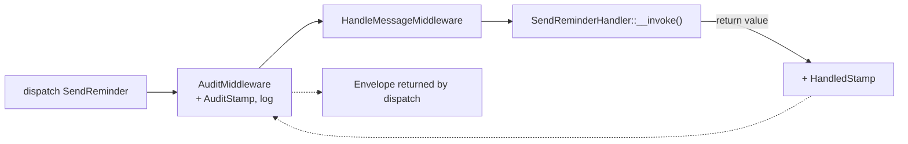

---
tags:
  - Labs
  - Miscellaneous
---

# Lab: Messenger — A Message, a Handler and a Custom Middleware

!!! abstract "Practical Lab"
    **Objective:** build a Messenger message + `#[AsMessageHandler]` handler and a
    custom `MiddlewareInterface` that stamps and logs every envelope, then prove it
    all works by wiring a real `MessageBus` in a test ·
    **Difficulty:** Advanced ·
    **Theory:** [Messenger](../messenger/index.md) ·
    **Mode:** TDD

## 🧠 Pour les nuls

**C'est quoi ce lab ?** Construire un message Messenger complet — l'objet, son handler, et un middleware personnalisé qui journalise chaque passage — pour comprendre comment ces trois pièces s'assemblent.

**Pourquoi ça existe ?** Lire la théorie du bus/middleware/handler reste abstrait tant qu'on n'a pas soi-même câblé les trois pièces ensemble et vu un message les traverser réellement.

**🏠 Analogie de la vraie vie :** Construire soi-même une petite chaîne postale miniature — la lettre (message), le bureau de tri (middleware), et le destinataire (handler) — pour comprendre comment une vraie poste fonctionne à plus grande échelle.

**Symfony dans la vraie vie :** Ton middleware personnalisé s'exécute pour **chaque** message envoyé sur le bus, avant et après le reste du pipeline — exactement comme `SendMessageMiddleware` le fait déjà pour le routage vers un transport.

**⚠️ Erreur fréquente :** oublier d'appeler `$stack->next()->handle(...)` dans le middleware — ça bloque silencieusement le message, qui n'atteint jamais son handler.

**🧠 Comment le mémoriser :** "Un middleware qui n'appelle pas `next()` est un barrage — le message ne passe jamais."

## Objective

After this lab you can, from scratch and without the framework kernel:

- Model a **message** (a plain, immutable DTO) and a **handler** discovered by
  `#[AsMessageHandler]`.
- Write a **custom middleware** that decorates the `Envelope` with your own
  **stamp** and logs it, then delegates with `$stack->next()->handle(...)`.
- Assemble a bare `MessageBus` (your middleware + `HandleMessageMiddleware` fed by
  a `HandlersLocator`), **dispatch** a message, and assert on the returned
  `Envelope` — the handler's **side effect**, your `AuditStamp`, and the framework's
  `HandledStamp`.
- Reason about **middleware ordering** — the russian-doll `before → next() → after`
  chain.

## Prerequisites

- Chapters: [Messenger](../messenger/index.md),
  [Events](../architecture/events.md), [Clock](../miscellaneous/clock.md),
  [Automated Tests](../testing/index.md)
- Assumed skills: PHPUnit `TestCase`, PSR-3 `LoggerInterface`, immutable objects.

## TD Instructions

1. Create the message `App\Message\SendReminder` — a `final readonly` DTO holding a
   single `int $userId`. It must be a plain, serializable object (no services).
2. Create the handler `App\MessageHandler\SendReminderHandler`. Mark it with
   `#[AsMessageHandler]` and give it an `__invoke(SendReminder $message)` method.
   To make the side effect observable, inject a tiny collaborator
   (`App\Service\ReminderJournal`) that records handled user ids, and **return** a
   string so we can read it back from the `HandledStamp`.
3. Create your custom stamp `App\Messenger\Stamp\AuditStamp` implementing
   `StampInterface`. Stamps are metadata carriers — make it `readonly`, holding a
   trace id and a `\DateTimeImmutable`.
4. Create the middleware `App\Messenger\Middleware\AuditMiddleware` implementing
   `MiddlewareInterface`. In `handle()`: if the envelope has **no** `AuditStamp`,
   add one (use an injected `ClockInterface` for the timestamp) and log it once;
   then **always** delegate via `$stack->next()->handle($envelope, $stack)` and
   return the result.
5. **Write the test first** (see below). Build a `MessageBus` from your middleware
   plus a `HandleMessageMiddleware` backed by a `HandlersLocator` that maps the
   message class to your handler. Dispatch and assert.
6. Add a second test proving **ordering**: a recorder middleware that appends
   `before` / `after` around `next()`, with a handler that appends `handled` —
   assert the sequence is `['before', 'handled', 'after']`.
7. Run red → green → refactor.

!!! info "Constraints"
    Symfony 8 · PHP 8.4 · no libraries outside the certification scope · follow
    best practices (attributes, strict types, readonly where apt).

## Implementation Guide (partial)

High-level pointers only — reach for these, don't copy a full solution:

- **Message:** a `final readonly class` with promoted constructor properties.
- **Handler:** `#[AsMessageHandler]` on a class with `__invoke(SendReminder $m)`.
  The return value becomes the `HandledStamp` result.
- **Stamp:** `implements Symfony\Component\Messenger\Stamp\StampInterface`
  (a pure marker interface — no methods to implement).
- **Middleware:** `implements MiddlewareInterface`; signature is
  `handle(Envelope $envelope, StackInterface $stack): Envelope`. Add a stamp with
  the **immutable** `$envelope = $envelope->with($stamp)`, read with
  `$envelope->last(AuditStamp::class)`, then `return $stack->next()->handle($envelope, $stack)`.
- **Bus in the test:** `new MessageBus([$yourMiddleware, new HandleMessageMiddleware(new HandlersLocator([SendReminder::class => [$handler]]))])`.
  A `HandlersLocator` entry is any **callable** — your invokable handler *is* one.
- **Clock:** inject `Symfony\Component\Clock\ClockInterface`; in the test use
  `Symfony\Component\Clock\MockClock` for a deterministic timestamp.



## TDD — write the test first

!!! note "Red → Green → Refactor"
    1. **Red:** write the failing test below; run it — it fails because the message,
       handler, stamp and middleware don't exist yet.
    2. **Green:** create the four classes so the bus dispatches and the assertions pass.
    3. **Refactor:** clean up (naming, the "stamp only once" guard) with the test as a net.

**Behaviour (Given/When/Then):**

- **Given** a `MessageBus` composed of `AuditMiddleware` and
  `HandleMessageMiddleware`, **When** I `dispatch(new SendReminder(42))`, **Then**
  the handler runs (the journal records `42`), the returned `Envelope` carries my
  `AuditStamp` (timestamped by the injected clock) and a `HandledStamp` whose
  result is `reminded:42`, and the middleware logged exactly once.
- **Given** a recorder middleware wrapping `next()`, **When** a message is
  dispatched, **Then** the trace is `before → handled → after` (russian-doll order).

```php
<?php
declare(strict_types=1);

namespace App\Tests\Messenger;

use App\Message\SendReminder;
use App\MessageHandler\SendReminderHandler;
use App\Messenger\Middleware\AuditMiddleware;
use App\Messenger\Stamp\AuditStamp;
use App\Service\ReminderJournal;
use PHPUnit\Framework\TestCase;
use Psr\Log\AbstractLogger;
use Symfony\Component\Clock\MockClock;
use Symfony\Component\Messenger\Envelope;
use Symfony\Component\Messenger\Handler\HandlersLocator;
use Symfony\Component\Messenger\MessageBus;
use Symfony\Component\Messenger\Middleware\HandleMessageMiddleware;
use Symfony\Component\Messenger\Middleware\MiddlewareInterface;
use Symfony\Component\Messenger\Middleware\StackInterface;
use Symfony\Component\Messenger\Stamp\HandledStamp;

final class AuditMiddlewareTest extends TestCase
{
    public function testHandlerRunsAndEnvelopeCarriesStamps(): void
    {
        // Arrange
        $journal = new ReminderJournal();
        $logger = $this->collectingLogger();
        $clock = new MockClock('2026-07-06 09:00:00');

        $bus = new MessageBus([
            new AuditMiddleware($logger, $clock),
            new HandleMessageMiddleware(new HandlersLocator([
                SendReminder::class => [new SendReminderHandler($journal)],
            ])),
        ]);

        // Act
        $envelope = $bus->dispatch(new SendReminder(userId: 42));

        // Assert — the side effect happened: the handler really ran
        self::assertSame([42], $journal->sent);

        // Assert — our middleware stamped the envelope using the clock we control
        $audit = $envelope->last(AuditStamp::class);
        self::assertInstanceOf(AuditStamp::class, $audit);
        self::assertNotSame('', $audit->traceId);
        self::assertSame('2026-07-06', $audit->stampedAt->format('Y-m-d'));

        // Assert — HandleMessageMiddleware recorded the handler's return value
        $handled = $envelope->last(HandledStamp::class);
        self::assertInstanceOf(HandledStamp::class, $handled);
        self::assertSame('reminded:42', $handled->getResult());

        // Assert — the middleware logged exactly once
        self::assertCount(1, $logger->records);
    }

    public function testMiddlewareWrapsHandlingRussianDoll(): void
    {
        $trace = new \ArrayObject();

        $recorder = new class($trace) implements MiddlewareInterface {
            public function __construct(private readonly \ArrayObject $trace) {}

            public function handle(Envelope $envelope, StackInterface $stack): Envelope
            {
                $this->trace->append('before');
                $envelope = $stack->next()->handle($envelope, $stack);
                $this->trace->append('after');

                return $envelope;
            }
        };

        $handle = new HandleMessageMiddleware(new HandlersLocator([
            SendReminder::class => [
                static function (SendReminder $m) use ($trace): void {
                    $trace->append('handled');
                },
            ],
        ]));

        $bus = new MessageBus([$recorder, $handle]);
        $bus->dispatch(new SendReminder(userId: 7));

        // Proves the russian-doll ordering: before → next() → after
        self::assertSame(['before', 'handled', 'after'], $trace->getArrayCopy());
    }

    public function testStampIsAddedOnlyOnceAcrossReDispatch(): void
    {
        $middleware = new AuditMiddleware($this->collectingLogger(), new MockClock());
        $bus = new MessageBus([
            $middleware,
            new HandleMessageMiddleware(new HandlersLocator([
                SendReminder::class => [static fn (SendReminder $m) => null],
            ])),
        ]);

        $first = $bus->dispatch(new SendReminder(userId: 1));
        $stampedAgain = $bus->dispatch($first); // re-dispatch the already-stamped envelope

        self::assertCount(1, $stampedAgain->all(AuditStamp::class));
    }

    private function collectingLogger(): AbstractLogger
    {
        return new class extends AbstractLogger {
            /** @var list<array{mixed, string, array}> */
            public array $records = [];

            public function log($level, string|\Stringable $message, array $context = []): void
            {
                $this->records[] = [$level, (string) $message, $context];
            }
        };
    }
}
```

!!! tip "Setup hints"
    Run it: `vendor/bin/phpunit tests/Messenger/AuditMiddlewareTest.php`. No kernel
    or container is needed — you construct the bus by hand. `HandlersLocator` takes
    `[messageClass => iterable<callable>]`; the invokable handler counts as a
    callable, and so does a plain closure (handy for the ordering test). Use
    `MockClock` so the timestamp assertion is deterministic. The collecting logger
    is a throwaway `AbstractLogger` — you only implement the single `log()` method.

## Review — Common Mistakes

- **Mutating the envelope in place.** `Envelope` is immutable; `with()` returns a
  *new* one. Forgetting `$envelope = $envelope->with($stamp)` (dropping the
  reassignment) silently loses the stamp → the `AuditStamp` assertion fails.
- **Not calling `$stack->next()`.** If your middleware returns early without
  delegating, `HandleMessageMiddleware` never runs, no handler fires, and there is
  no `HandledStamp`. The bus is a chain — every middleware must pass the baton.
- **Registering the handler under the wrong key.** `HandlersLocator` maps by the
  **message** class name, not the handler's. A mismatch yields
  `NoHandlerForMessageException` (unless `allowNoHandlers: true`).
- **Expecting `dispatch()` to return the handler's value.** It returns the
  `Envelope`; read the result via `$envelope->last(HandledStamp::class)->getResult()`.
- **Non-serializable message.** Putting a service, closure or entity in the DTO
  breaks async transports later. Keep messages plain data.

## Exam Connection

The certification probes the exact mechanics you just exercised: `dispatch()`
returns an **`Envelope`** (never the handler's return value), `HandleMessageMiddleware`
is what actually invokes the handler and attaches the **`HandledStamp`**, and a
middleware is a **russian-doll** that can act before *and* after `$stack->next()`.
Hand-wiring a `MessageBus` with `HandlersLocator` is the mental model behind the
autoconfigured `messenger.bus.default` — knowing it defends against the classic
traps (result-from-stamp, custom stamps as `StampInterface` markers, middleware
ordering).

## Ideal Solution

??? success "Reference solution (compare only after you try)"
    ```php
    <?php
    declare(strict_types=1);

    // ---- src/Message/SendReminder.php ------------------------------------
    namespace App\Message;

    final readonly class SendReminder
    {
        public function __construct(public int $userId) {}
    }
    ```

    ```php
    <?php
    declare(strict_types=1);

    // ---- src/Messenger/Stamp/AuditStamp.php ------------------------------
    namespace App\Messenger\Stamp;

    use Symfony\Component\Messenger\Stamp\StampInterface;

    final readonly class AuditStamp implements StampInterface
    {
        public function __construct(
            public string $traceId,
            public \DateTimeImmutable $stampedAt,
        ) {}
    }
    ```

    ```php
    <?php
    declare(strict_types=1);

    // ---- src/Messenger/Middleware/AuditMiddleware.php --------------------
    namespace App\Messenger\Middleware;

    use App\Messenger\Stamp\AuditStamp;
    use Psr\Log\LoggerInterface;
    use Symfony\Component\Clock\ClockInterface;
    use Symfony\Component\Messenger\Envelope;
    use Symfony\Component\Messenger\Middleware\MiddlewareInterface;
    use Symfony\Component\Messenger\Middleware\StackInterface;

    final class AuditMiddleware implements MiddlewareInterface
    {
        public function __construct(
            private readonly LoggerInterface $logger,
            private readonly ClockInterface $clock,
        ) {}

        public function handle(Envelope $envelope, StackInterface $stack): Envelope
        {
            // Add our stamp once; re-dispatched envelopes keep the original trace.
            if (null === $envelope->last(AuditStamp::class)) {
                $stamp = new AuditStamp(bin2hex(random_bytes(8)), $this->clock->now());
                $envelope = $envelope->with($stamp);

                $this->logger->info('Message audited', [
                    'trace' => $stamp->traceId,
                    'message' => $envelope->getMessage()::class,
                ]);
            }

            // Russian-doll: delegate to the rest of the stack, return its result.
            return $stack->next()->handle($envelope, $stack);
        }
    }
    ```

    ```php
    <?php
    declare(strict_types=1);

    // ---- src/MessageHandler/SendReminderHandler.php ----------------------
    namespace App\MessageHandler;

    use App\Message\SendReminder;
    use App\Service\ReminderJournal;
    use Symfony\Component\Messenger\Attribute\AsMessageHandler;

    #[AsMessageHandler]
    final class SendReminderHandler
    {
        public function __construct(private readonly ReminderJournal $journal) {}

        public function __invoke(SendReminder $message): string
        {
            $this->journal->record($message->userId);

            return sprintf('reminded:%d', $message->userId);
        }
    }
    ```

    ```php
    <?php
    declare(strict_types=1);

    // ---- src/Service/ReminderJournal.php ---------------------------------
    namespace App\Service;

    final class ReminderJournal
    {
        /** @var list<int> */
        public array $sent = [];

        public function record(int $userId): void
        {
            $this->sent[] = $userId;
        }
    }
    ```

    In a real app the wiring is automatic: `#[AsMessageHandler]` registers the
    handler, and you tag the middleware onto a bus in `config/packages/messenger.yaml`:

    ```yaml
    # config/packages/messenger.yaml
    framework:
        messenger:
            buses:
                messenger.bus.default:
                    middleware:
                        - 'App\Messenger\Middleware\AuditMiddleware'
    ```

## Alternative Approaches (optional)

- **Option A (simple):** log-only middleware with no stamp — good for tracing, but
  you lose the ability to *read back* metadata from the envelope downstream.
- **Option B (advanced):** act *after* handling — capture
  `$result = $stack->next()->handle(...)`, read its `HandledStamp`, and log the
  outcome/duration. This is how timing and transaction middleware work.
- **Option C (exam-style):** add a `BusNameStamp` in the middleware and assert it,
  reinforcing that stamps are how buses/transports pass metadata through the
  pipeline; or flip to `allowNoHandlers: true` and observe that no `HandledStamp`
  is added.

---

<small>Theory: [Messenger](../messenger/index.md) · Labs: [all labs](index.md)</small>
