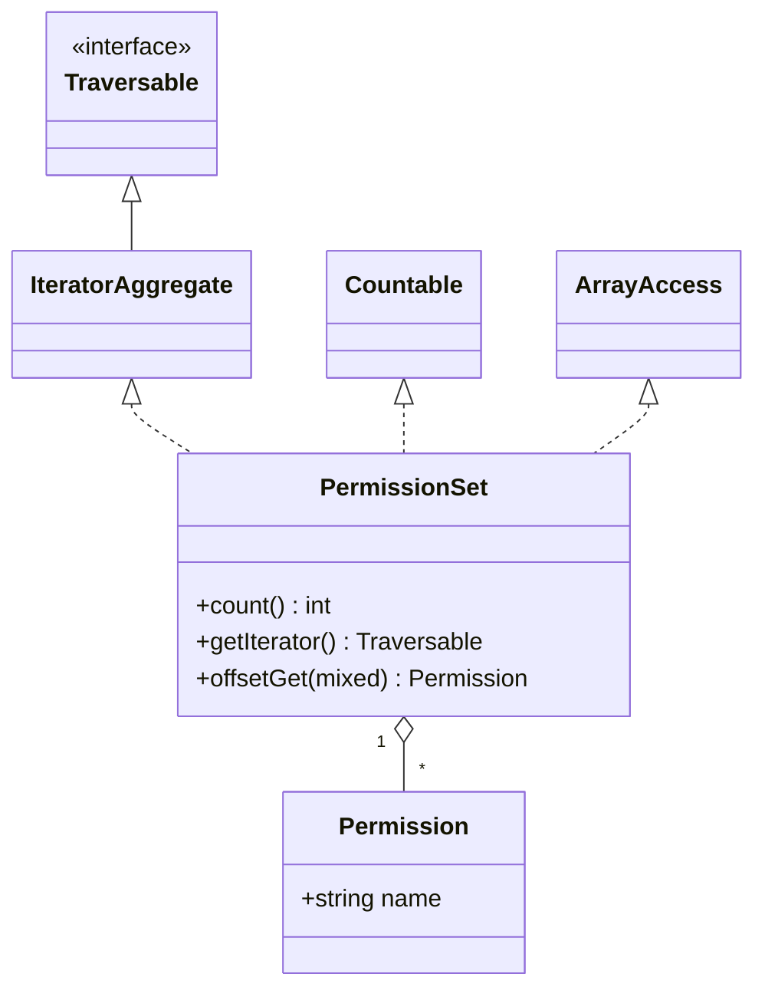

---
tags:
  - Labs
  - PHP & Web Security
---

# Lab : collection typée SPL — un `PermissionSet` immuable

<!--
PRACTICAL LAB — TDD mode (code behaviour). Pure PHP 8.4 + PHPUnit, no Symfony.
Concept: a typed, immutable collection of readonly value objects implementing
IteratorAggregate + Countable + ArrayAccess.
-->

!!! abstract "Practical Lab"
    **Objective:** construire une collection typée et immuable de value objects `readonly` qui se comporte comme un tableau natif (`foreach`, `count()`, `$set[$i]`) en implémentant les interfaces SPL ·
    **Difficulty:** Medium ·
    **Theory:** [SPL](../php-web-security/spl.md) · [OOP](../php-web-security/oop.md) ·
    **Mode:** TDD

## Objective

À l'issue de ce lab, vous saurez construire à la main une collection métier que
PHP traite comme un citoyen de première classe : itérable avec `foreach`, utilisable
avec `count()` et indexable avec `$set[$i]` — tout en restant **immuable** et
**type-safe**. Concrètement, vous allez implémenter :

- un value object `readonly` (`Permission`) qui rejette les données invalides dès la construction ;
- une collection `PermissionSet` implémentant `IteratorAggregate`, `Countable`
  et `ArrayAccess`, qui préserve l'ordre d'insertion, expose un accès en lecture, et
  refuse à la fois la mutation en place et les éléments du mauvais type.

Vous menez le tout **test-first** : red, green, refactor.

## Prerequisites

- Chapitres : [SPL](../php-web-security/spl.md), [OOP](../php-web-security/oop.md),
  [Interfaces](../php-web-security/interfaces.md)
- Compétences supposées acquises : les bases de PHPUnit (`TestCase`, `expectException`),
  la promotion de propriétés dans le constructeur, les propriétés `readonly`,
  les variadiques et l'opérateur de décomposition (spread).

## TD Instructions

1. Créez le value object `App\Security\Access\Permission` : une classe
   `final readonly` contenant un unique `string $name`. Rejetez dans le constructeur
   tout nom vide ou composé uniquement d'espaces avec une `\InvalidArgumentException`.
   Ajoutez une méthode `equals(self): bool` et implémentez `\Stringable`.
2. Créez `App\Security\Access\PermissionSet` implémentant `\IteratorAggregate`,
   `\Countable` et `\ArrayAccess`. Stockez les éléments dans une `list<Permission>` privée.
3. Acceptez les éléments via un constructeur **variadique typé**
   (`Permission ...$permissions`) afin que PHP lui-même rejette les éléments du mauvais type.
4. Implémentez `count()`, `getIterator()` (déléguez à un `ArrayIterator`) et les
   quatre méthodes d'`ArrayAccess`. L'itération et l'indexation doivent respecter
   l'**ordre d'insertion**.
5. Rendez la collection **immuable** : `offsetSet()` et `offsetUnset()` doivent lever
   une `\LogicException`. Ajoutez une méthode `withPermission()` qui retourne un
   *nouveau* set.
6. Faites-le maintenant à la façon de l'examen : **écrivez d'abord les tests
   ci-dessous en échec**, regardez-les passer au rouge, puis écrivez le code des
   étapes 1 à 5 pour les faire passer au vert, puis refactorisez.

!!! info "Constraints"
    PHP 8.4 · PHPUnit uniquement (pas de Symfony, pas de Doctrine, pas de bibliothèques tierces) ·
    types stricts · value object `readonly` · génériques documentés via docblocks
    (`@implements`, `list<T>`). Suivez les bonnes pratiques : contrôle de type par
    paramètre variadique, types de retour covariants, `never` sur les mutateurs.

## Implementation Guide (partial)

Des repères de haut niveau — pas le code complet.

- **Les interfaces à privilégier :** `IteratorAggregate` (déléguez au lieu d'écrire à la
  main les cinq méthodes d'`Iterator`), `Countable`, `ArrayAccess`. `Traversable` est le
  marqueur interne que les deux interfaces d'itération étendent — vous ne l'implémentez
  jamais directement.
- **Itération :** `getIterator(): \Traversable` retournant `new \ArrayIterator($this->permissions)`
  vous offre gratuitement un `foreach` respectant l'ordre d'insertion.
- **La sûreté de type dès l'entrée :** un paramètre variadique `Permission ...$permissions`
  signifie que passer quoi que ce soit d'autre lève une `\TypeError` avant même l'exécution
  du corps — c'*est* votre garde-fou contre les éléments invalides. Normalisez les clés avec
  `array_values()` pour conserver une `list<Permission>` propre (0,1,2,…).
- **Lecture vs. écriture :** `offsetGet()` peut *rétrécir* son type de retour de `mixed` à
  `Permission` (la covariance est autorisée). Les deux méthodes d'écriture retournent
  `never` et lèvent une exception — c'est ainsi que vous encodez l'immuabilité au travers
  d'`ArrayAccess`.
- **Génériques :** PHP n'a pas de génériques à l'exécution ; documentez-les pour les
  analyseurs statiques avec `/** @implements \IteratorAggregate<int, Permission> */` et
  `list<Permission>`.



## TDD — write the test first

!!! note "Red → Green → Refactor"
    1. **Red :** écrivez le test en échec ci-dessous ; lancez-le, regardez-le échouer (les classes n'existent pas encore).
    2. **Green :** écrivez le minimum de `Permission` + `PermissionSet` pour le faire passer.
    3. **Refactor :** extrayez `withPermission()`, peaufinez les messages d'exception — le test est votre filet de sécurité.

**Comportement (Given/When/Then) :**

- **Given** un set construit à partir de deux objets `Permission`, **When** j'appelle
  `count()`, **Then** il retourne `2`.
- **Given** le même set, **When** je le parcours avec `foreach`, **Then** les éléments
  reviennent dans l'ordre d'insertion avec des clés entières séquentielles.
- **Given** le même set, **When** je lis `isset($set[1])` / `$set[1]`, **Then**
  `offsetExists`/`offsetGet` répondent correctement, et un offset inconnu lève une
  `\OutOfRangeException`.
- **Given** le même set, **When** je tente `$set[0] = …` ou `unset($set[0])`,
  **Then** une `\LogicException` est levée (immuable).
- **Given** un appel au constructeur, **When** je passe autre chose qu'une `Permission`,
  **Then** une `\TypeError` est levée ; **et** un nom de permission vide lève une
  `\InvalidArgumentException`.

```php
<?php
declare(strict_types=1);

namespace App\Tests\Security\Access;

use App\Security\Access\Permission;
use App\Security\Access\PermissionSet;
use PHPUnit\Framework\TestCase;

final class PermissionSetTest extends TestCase
{
    public function testCountReturnsNumberOfElements(): void
    {
        $set = new PermissionSet(new Permission('user.view'), new Permission('user.edit'));

        self::assertCount(2, $set);          // uses Countable::count()
        self::assertSame(2, $set->count());
    }

    public function testIterationPreservesInsertionOrder(): void
    {
        $set = new PermissionSet(new Permission('a'), new Permission('b'), new Permission('c'));

        $seen = [];
        foreach ($set as $index => $permission) {
            $seen[$index] = (string) $permission;
        }

        self::assertSame([0 => 'a', 1 => 'b', 2 => 'c'], $seen);
    }

    public function testOffsetExistsAndOffsetGet(): void
    {
        $set = new PermissionSet(new Permission('user.view'), new Permission('user.edit'));

        self::assertTrue(isset($set[0]));
        self::assertFalse(isset($set[9]));
        self::assertSame('user.edit', $set[1]->name);
    }

    public function testOffsetGetOnUnknownOffsetThrows(): void
    {
        $set = new PermissionSet(new Permission('user.view'));

        $this->expectException(\OutOfRangeException::class);
        $set[9]; // @phpstan-ignore-line — intentional out-of-range read
    }

    public function testOffsetSetIsRejectedBecauseCollectionIsImmutable(): void
    {
        $set = new PermissionSet(new Permission('user.view'));

        $this->expectException(\LogicException::class);
        $set[0] = new Permission('user.delete');
    }

    public function testOffsetUnsetIsRejectedBecauseCollectionIsImmutable(): void
    {
        $set = new PermissionSet(new Permission('user.view'));

        $this->expectException(\LogicException::class);
        unset($set[0]);
    }

    public function testConstructorRejectsElementsOfTheWrongType(): void
    {
        $this->expectException(\TypeError::class);
        /** @phpstan-ignore-next-line — deliberately wrong element type */
        new PermissionSet('not-a-permission');
    }

    public function testBlankPermissionNameIsRejected(): void
    {
        $this->expectException(\InvalidArgumentException::class);
        new Permission('   ');
    }

    public function testWithPermissionReturnsANewImmutableSet(): void
    {
        $set = new PermissionSet(new Permission('user.view'));
        $bigger = $set->withPermission(new Permission('user.edit'));

        self::assertCount(1, $set);      // original untouched
        self::assertCount(2, $bigger);
        self::assertNotSame($set, $bigger);
    }
}
```

!!! tip "Setup hints"
    Lancez uniquement ce fichier : `vendor/bin/phpunit tests/Security/Access/PermissionSetTest.php`.
    Pas besoin de mocks ni de fixtures — le value object est peu coûteux à construire.
    Activez les assertions en local avec `php -d zend.assertions=1`. Si PHPUnit n'est pas
    installé, `composer require --dev phpunit/phpunit` (dev uniquement ; toujours dans le
    périmètre de la certification).

## Validation Steps

- [ ] `vendor/bin/phpunit` — les neuf tests au vert.
- [ ] `php -l src/Security/Access/Permission.php` et
      `php -l src/Security/Access/PermissionSet.php` — « No syntax errors detected ».
- [ ] Vérification rapide dans un REPL : `foreach (new PermissionSet(new Permission('x')) as $p) { echo $p; }`
      affiche `x` ; `count(...)` retourne `1` ; `$set[0] = ...` lève une `LogicException`.

## Review — Common Mistakes

- **Écrire à la main les cinq méthodes d'`Iterator`** (`current/key/next/rewind/valid`)
  alors qu'`IteratorAggregate::getIterator()` + `ArrayIterator` fait le travail → plus de
  code, plus de bugs, et un piège au `rewind`. Déléguez plutôt.
- **Typer `offsetGet(): mixed`** et retourner `null` pour une clé absente → l'interface
  *autorise* le rétrécissement vers `Permission` (covariance) ; retourner `null` masque
  silencieusement des bugs. Levez une `\OutOfRangeException` pour les offsets inconnus.
- **`offsetSet`/`offsetUnset` retournant `void` et mutant l'état** → brise l'immuabilité.
  Déclarez-les `never` et levez une exception ; exposez un `withPermission()` en copy-on-write.
- **Valider le type des éléments à la main** (`if (!$x instanceof Permission)`) → laissez
  le type du paramètre variadique s'en charger ; la `\TypeError` est automatique et précise.
- **Oublier `array_values()`** → après un filtrage vous pouvez vous retrouver avec un
  tableau à trous (`[0 => …, 2 => …]`), ce qui casse l'itération à clés séquentielles et
  le contrat `list<T>`.
- **`readonly` sur une classe non finale, ou réassigner une propriété promue `readonly`** →
  `\Error` à l'exécution. Les value objects sont `final readonly`.

## Exam Connection

La certification vérifie que vous savez **quelle interface SPL active quelle
syntaxe** ainsi que leurs signatures de méthodes exactes :

- `Countable::count(): int` alimente `count($obj)`.
- `IteratorAggregate::getIterator(): Traversable` alimente `foreach` par délégation ;
  `Iterator` l'alimente en mode autonome. `Traversable` est un marqueur non implémentable.
- `ArrayAccess` alimente `$obj[$k]` via `offsetExists/offsetGet/offsetSet/offsetUnset`.

Le piège classique : croire qu'il faut implémenter `Iterator` (les cinq méthodes) pour
être compatible `foreach`, ou que `Traversable` peut être implémenté directement. Savoir
qu'un **générateur est un `Iterator` à usage unique** (`getIterator()` peut faire un
`yield`) et qu'`ArrayAccess::offsetGet` peut rétrécir son type de retour par covariance,
c'est exactement le niveau de profondeur attendu ici.

## Ideal Solution

??? success "Reference solution (compare only after you try)"
    ```php
    <?php
    declare(strict_types=1);

    namespace App\Security\Access;

    /**
     * A single named permission, e.g. "user.edit".
     * Immutable value object: two permissions are equal iff their names match.
     */
    final readonly class Permission implements \Stringable
    {
        public function __construct(public string $name)
        {
            if ('' === trim($name)) {
                throw new \InvalidArgumentException('Permission name must not be blank.');
            }
        }

        public function equals(self $other): bool
        {
            return $this->name === $other->name;
        }

        public function __toString(): string
        {
            return $this->name;
        }
    }
    ```

    ```php
    <?php
    declare(strict_types=1);

    namespace App\Security\Access;

    /**
     * An immutable, typed collection of {@see Permission} value objects.
     * Preserves insertion order; supports count(), foreach and $set[$i] reads.
     *
     * @implements \IteratorAggregate<int, Permission>
     * @implements \ArrayAccess<int, Permission>
     */
    final class PermissionSet implements \IteratorAggregate, \Countable, \ArrayAccess
    {
        /** @var list<Permission> */
        private array $permissions;

        public function __construct(Permission ...$permissions)
        {
            // The variadic type rejects wrong-typed elements with a \TypeError.
            $this->permissions = array_values($permissions);
        }

        public function count(): int
        {
            return \count($this->permissions);
        }

        /** @return \Traversable<int, Permission> */
        public function getIterator(): \Traversable
        {
            return new \ArrayIterator($this->permissions);
        }

        public function offsetExists(mixed $offset): bool
        {
            return \is_int($offset) && isset($this->permissions[$offset]);
        }

        public function offsetGet(mixed $offset): Permission
        {
            return $this->permissions[$offset]
                ?? throw new \OutOfRangeException(sprintf('No permission at offset %s.', var_export($offset, true)));
        }

        public function offsetSet(mixed $offset, mixed $value): never
        {
            throw new \LogicException('PermissionSet is immutable; derive a new set with withPermission().');
        }

        public function offsetUnset(mixed $offset): never
        {
            throw new \LogicException('PermissionSet is immutable; it cannot be mutated in place.');
        }

        public function withPermission(Permission $permission): self
        {
            return new self(...[...$this->permissions, $permission]);
        }
    }
    ```

## Alternative Approaches (optional)

- **Option A (simple) :** implémentez `\Iterator` directement avec un curseur interne.
  Plus de code et un piège au `rewind()` ; à réserver aux parcours sur mesure.
- **Option B (avancée) :** déléguez `getIterator()` à un **générateur**
  (`foreach ($this->permissions as $p) { yield $p; }`) pour des sources paresseuses ou
  en flux — rappelez-vous qu'un générateur est à usage unique et ne peut pas être rembobiné.
- **Option C (façon examen) :** adossez le set à `SplObjectStorage` pour dédupliquer par
  identité d'objet, ou à `SplFixedArray` pour une variante à capacité fixe et plus économe
  en mémoire — sachez quand la sémantique par identité vs. par liste est le bon outil.

---

<small>Theory: [SPL](../php-web-security/spl.md) · [OOP](../php-web-security/oop.md) · Labs: [all labs](index.md)</small>
