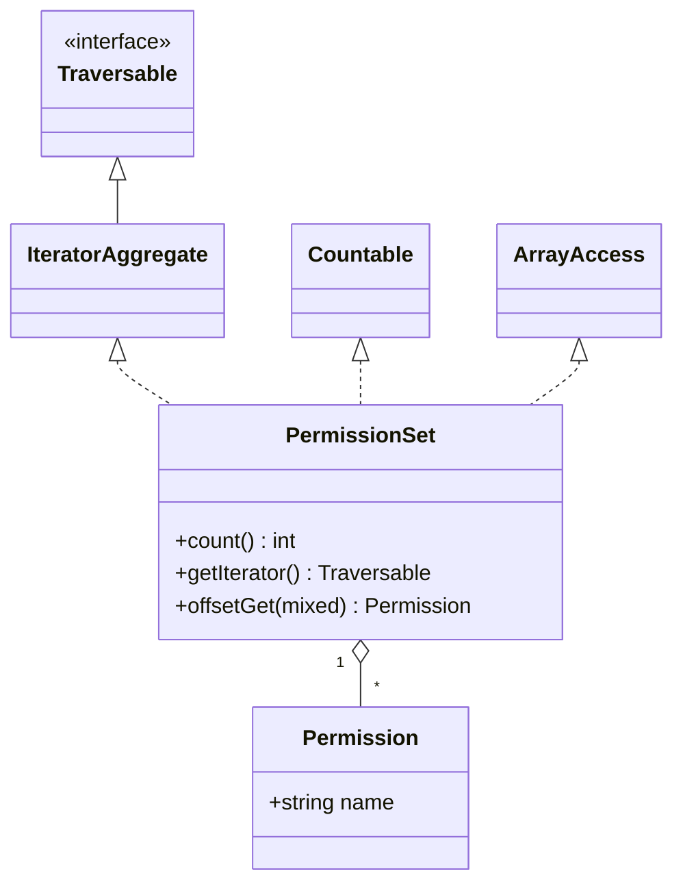

# Lab: SPL typed collection — an immutable `PermissionSet`

<!--
PRACTICAL LAB — TDD mode (code behaviour). Pure PHP 8.4 + PHPUnit, no Symfony.
Concept: a typed, immutable collection of readonly value objects implementing
IteratorAggregate + Countable + ArrayAccess.
-->

!!! abstract "Practical Lab"
    **Objective:** build a typed, immutable collection of readonly value objects that behaves like a native array (`foreach`, `count()`, `$set[$i]`) by implementing the SPL interfaces ·
    **Difficulty:** Medium ·
    **Theory:** [SPL](../php-web-security/spl.md) · [OOP](../php-web-security/oop.md) ·
    **Mode:** TDD

## Objective

After this lab you can hand-build a domain collection that PHP treats as a
first-class citizen: iterable with `foreach`, usable with `count()`, and
subscriptable with `$set[$i]` — while staying **immutable** and **type-safe**.
Concretely you will implement:

- a `readonly` value object (`Permission`) that rejects invalid data at construction;
- a `PermissionSet` collection implementing `IteratorAggregate`, `Countable`
  and `ArrayAccess` that preserves insertion order, exposes read access, and
  refuses both in-place mutation and elements of the wrong type.

You drive the whole thing **test-first**: red, green, refactor.

## Prerequisites

- Chapters: [SPL](../php-web-security/spl.md), [OOP](../php-web-security/oop.md),
  [Interfaces](../php-web-security/interfaces.md)
- Assumed skills: PHPUnit basics (`TestCase`, `expectException`), constructor
  property promotion, `readonly` properties, variadics and the spread operator.

## TD Instructions

1. Create the value object `App\Security\Access\Permission`: a `final readonly`
   class holding a single `string $name`. Reject a blank/whitespace-only name in
   the constructor with `\InvalidArgumentException`. Add an `equals(self): bool`
   and implement `\Stringable`.
2. Create `App\Security\Access\PermissionSet` implementing `\IteratorAggregate`,
   `\Countable` and `\ArrayAccess`. Store the elements in a private `list<Permission>`.
3. Accept elements through a **variadic typed** constructor
   (`Permission ...$permissions`) so PHP itself rejects wrong-typed elements.
4. Implement `count()`, `getIterator()` (delegate to an `ArrayIterator`) and the
   four `ArrayAccess` methods. Iteration and indexing must follow **insertion order**.
5. Make the collection **immutable**: `offsetSet()` and `offsetUnset()` must throw
   `\LogicException`. Add a `withPermission()` method that returns a *new* set.
6. Now do it the exam way: **write the failing tests below first**, watch them go
   red, then write the code from steps 1–5 to turn them green, then refactor.

!!! info "Constraints"
    PHP 8.4 · PHPUnit only (no Symfony, no Doctrine, no third-party libs) ·
    strict types · `readonly` value object · generics documented via docblocks
    (`@implements`, `list<T>`). Follow best practices: variadic type enforcement,
    covariant return types, `never` on the mutators.

## Implementation Guide (partial)

High-level pointers — not the full code.

- **Interfaces to reach for:** `IteratorAggregate` (delegate, don't hand-write five
  `Iterator` methods), `Countable`, `ArrayAccess`. `Traversable` is the internal
  marker both iterator interfaces extend — you never implement it directly.
- **Iteration:** `getIterator(): \Traversable` returning `new \ArrayIterator($this->permissions)`
  gives you insertion-ordered `foreach` for free.
- **Type safety at the door:** a variadic `Permission ...$permissions` parameter
  means passing anything else raises a `\TypeError` before your body runs — that
  *is* your element-rejection guard. Normalise keys with `array_values()` to keep
  a clean `list<Permission>` (0,1,2,…).
- **Read vs. write:** `offsetGet()` can *narrow* its return type from `mixed` to
  `Permission` (covariance is allowed). The two write methods return `never` and
  throw — that is how you encode immutability through `ArrayAccess`.
- **Generics:** PHP has no runtime generics; document them for static analysers
  with `/** @implements \IteratorAggregate<int, Permission> */` and `list<Permission>`.



## TDD — write the test first

!!! note "Red → Green → Refactor"
    1. **Red:** write the failing test below; run it, watch it fail (classes don't exist yet).
    2. **Green:** write the minimum `Permission` + `PermissionSet` to pass.
    3. **Refactor:** extract `withPermission()`, tidy exception messages — the test is your safety net.

**Behaviour (Given/When/Then):**

- **Given** a set built from two `Permission` objects, **When** I call `count()`,
  **Then** it returns `2`.
- **Given** the same set, **When** I `foreach` it, **Then** elements come back in
  insertion order with sequential integer keys.
- **Given** the same set, **When** I read `isset($set[1])` / `$set[1]`, **Then**
  `offsetExists`/`offsetGet` answer correctly, and an unknown offset throws
  `\OutOfRangeException`.
- **Given** the same set, **When** I try `$set[0] = …` or `unset($set[0])`,
  **Then** a `\LogicException` is thrown (immutable).
- **Given** a constructor call, **When** I pass a non-`Permission`, **Then** a
  `\TypeError` is thrown; **and** a blank permission name throws
  `\InvalidArgumentException`.

```php
<?php
declare(strict_types=1);

namespace App\Tests\Security\Access;

use App\Security\Access\Permission;
use App\Security\Access\PermissionSet;
use PHPUnit\Framework\TestCase;

final class PermissionSetTest extends TestCase
{
    public function testCountReturnsNumberOfElements(): void
    {
        $set = new PermissionSet(new Permission('user.view'), new Permission('user.edit'));

        self::assertCount(2, $set);          // uses Countable::count()
        self::assertSame(2, $set->count());
    }

    public function testIterationPreservesInsertionOrder(): void
    {
        $set = new PermissionSet(new Permission('a'), new Permission('b'), new Permission('c'));

        $seen = [];
        foreach ($set as $index => $permission) {
            $seen[$index] = (string) $permission;
        }

        self::assertSame([0 => 'a', 1 => 'b', 2 => 'c'], $seen);
    }

    public function testOffsetExistsAndOffsetGet(): void
    {
        $set = new PermissionSet(new Permission('user.view'), new Permission('user.edit'));

        self::assertTrue(isset($set[0]));
        self::assertFalse(isset($set[9]));
        self::assertSame('user.edit', $set[1]->name);
    }

    public function testOffsetGetOnUnknownOffsetThrows(): void
    {
        $set = new PermissionSet(new Permission('user.view'));

        $this->expectException(\OutOfRangeException::class);
        $set[9]; // @phpstan-ignore-line — intentional out-of-range read
    }

    public function testOffsetSetIsRejectedBecauseCollectionIsImmutable(): void
    {
        $set = new PermissionSet(new Permission('user.view'));

        $this->expectException(\LogicException::class);
        $set[0] = new Permission('user.delete');
    }

    public function testOffsetUnsetIsRejectedBecauseCollectionIsImmutable(): void
    {
        $set = new PermissionSet(new Permission('user.view'));

        $this->expectException(\LogicException::class);
        unset($set[0]);
    }

    public function testConstructorRejectsElementsOfTheWrongType(): void
    {
        $this->expectException(\TypeError::class);
        /** @phpstan-ignore-next-line — deliberately wrong element type */
        new PermissionSet('not-a-permission');
    }

    public function testBlankPermissionNameIsRejected(): void
    {
        $this->expectException(\InvalidArgumentException::class);
        new Permission('   ');
    }

    public function testWithPermissionReturnsANewImmutableSet(): void
    {
        $set = new PermissionSet(new Permission('user.view'));
        $bigger = $set->withPermission(new Permission('user.edit'));

        self::assertCount(1, $set);      // original untouched
        self::assertCount(2, $bigger);
        self::assertNotSame($set, $bigger);
    }
}
```

!!! tip "Setup hints"
    Run only this file: `vendor/bin/phpunit tests/Security/Access/PermissionSetTest.php`.
    No mocks or fixtures needed — the value object is cheap to build. Enable
    assertions locally with `php -d zend.assertions=1`. If PHPUnit isn't installed,
    `composer require --dev phpunit/phpunit` (dev-only; still inside cert scope).

## Validation Steps

- [ ] `vendor/bin/phpunit` — all nine tests green.
- [ ] `php -l src/Security/Access/Permission.php` and
      `php -l src/Security/Access/PermissionSet.php` — "No syntax errors detected".
- [ ] Sanity check in a REPL: `foreach (new PermissionSet(new Permission('x')) as $p) { echo $p; }`
      prints `x`; `count(...)` returns `1`; `$set[0] = ...` throws `LogicException`.

## Review — Common Mistakes

- **Hand-writing `Iterator`'s five methods** (`current/key/next/rewind/valid`) when
  `IteratorAggregate::getIterator()` + `ArrayIterator` does the job → more code,
  more bugs, and a rewind trap. Delegate instead.
- **Typing `offsetGet(): mixed`** and returning `null` for a missing key → the
  interface *allows* narrowing to `Permission` (covariance); returning `null`
  silently hides bugs. Throw `\OutOfRangeException` for unknown offsets.
- **`offsetSet`/`offsetUnset` returning `void` and mutating** → breaks immutability.
  Declare them `never` and throw; expose a copy-on-write `withPermission()`.
- **Validating element type by hand** (`if (!$x instanceof Permission)`) → let the
  variadic parameter type do it; the `\TypeError` is automatic and precise.
- **Forgetting `array_values()`** → after filtering you can end up with a gappy
  array (`[0 => …, 2 => …]`), breaking sequential-key iteration and `list<T>`.
- **`readonly` on a non-final class or reassigning a promoted `readonly` prop** →
  `\Error` at runtime. Value objects are `final readonly`.

## Exam Connection

The certification probes whether you know **which SPL interface enables which
syntax** and their exact method signatures:

- `Countable::count(): int` powers `count($obj)`.
- `IteratorAggregate::getIterator(): Traversable` powers `foreach` by delegation;
  `Iterator` powers it self-driven. `Traversable` is a non-implementable marker.
- `ArrayAccess` powers `$obj[$k]` via `offsetExists/offsetGet/offsetSet/offsetUnset`.

The classic trap: assuming you must implement `Iterator` (all five methods) to be
`foreach`-able, or that `Traversable` can be implemented directly. Knowing that a
**generator is a single-use `Iterator`** (`getIterator()` may `yield`) and that
`ArrayAccess::offsetGet` may covariantly narrow its return type is exactly the
depth expected here.

## Ideal Solution

??? success "Reference solution (compare only after you try)"
    ```php
    <?php
    declare(strict_types=1);

    namespace App\Security\Access;

    /**
     * A single named permission, e.g. "user.edit".
     * Immutable value object: two permissions are equal iff their names match.
     */
    final readonly class Permission implements \Stringable
    {
        public function __construct(public string $name)
        {
            if ('' === trim($name)) {
                throw new \InvalidArgumentException('Permission name must not be blank.');
            }
        }

        public function equals(self $other): bool
        {
            return $this->name === $other->name;
        }

        public function __toString(): string
        {
            return $this->name;
        }
    }
    ```

    ```php
    <?php
    declare(strict_types=1);

    namespace App\Security\Access;

    /**
     * An immutable, typed collection of {@see Permission} value objects.
     * Preserves insertion order; supports count(), foreach and $set[$i] reads.
     *
     * @implements \IteratorAggregate<int, Permission>
     * @implements \ArrayAccess<int, Permission>
     */
    final class PermissionSet implements \IteratorAggregate, \Countable, \ArrayAccess
    {
        /** @var list<Permission> */
        private array $permissions;

        public function __construct(Permission ...$permissions)
        {
            // The variadic type rejects wrong-typed elements with a \TypeError.
            $this->permissions = array_values($permissions);
        }

        public function count(): int
        {
            return \count($this->permissions);
        }

        /** @return \Traversable<int, Permission> */
        public function getIterator(): \Traversable
        {
            return new \ArrayIterator($this->permissions);
        }

        public function offsetExists(mixed $offset): bool
        {
            return \is_int($offset) && isset($this->permissions[$offset]);
        }

        public function offsetGet(mixed $offset): Permission
        {
            return $this->permissions[$offset]
                ?? throw new \OutOfRangeException(sprintf('No permission at offset %s.', var_export($offset, true)));
        }

        public function offsetSet(mixed $offset, mixed $value): never
        {
            throw new \LogicException('PermissionSet is immutable; derive a new set with withPermission().');
        }

        public function offsetUnset(mixed $offset): never
        {
            throw new \LogicException('PermissionSet is immutable; it cannot be mutated in place.');
        }

        public function withPermission(Permission $permission): self
        {
            return new self(...[...$this->permissions, $permission]);
        }
    }
    ```

## Alternative Approaches (optional)

- **Option A (simple):** implement `\Iterator` directly with an internal cursor.
  More code and a `rewind()` pitfall; use only when you need bespoke traversal.
- **Option B (advanced):** delegate `getIterator()` to a **generator**
  (`foreach ($this->permissions as $p) { yield $p; }`) for lazy/streamed sources —
  remember a generator is single-use and cannot be rewound.
- **Option C (exam-style):** back the set with `SplObjectStorage` to deduplicate by
  object identity, or `SplFixedArray` for a fixed-capacity, lower-memory variant —
  know when identity-keyed vs. list semantics are the right tool.

---

<small>Theory: [SPL](../php-web-security/spl.md) · [OOP](../php-web-security/oop.md) · Labs: [all labs](index.md)</small>
