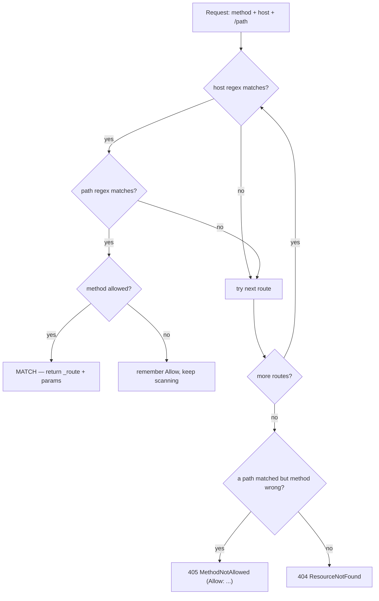

---
tags:
  - Labs
  - Routing
---

# Lab : Route Matching — prédire et vérifier avec `debug:router`

!!! abstract "Practical Lab"
    **Objective:** déclarer un jeu de routes réaliste (requirements, defaults,
    correspondance par host et par méthode) et prédire de façon fiable quelle route
    une URL+méthode donnée atteint — et s'il s'agit d'un **404** ou d'un **405** —
    puis le confirmer avec la console. ·
    **Difficulty:** Medium ·
    **Theory:** [Configuration](../routing/configuration.md) ·
    **Mode:** Manual verification + Conceptual simulation

## 🧠 Pour les nuls

**C'est quoi ce lab ?** T'entraîner à prédire, sur papier, quelle route va matcher une URL donnée — puis vérifier ta prédiction avec les vrais outils Symfony.

**Pourquoi ça existe ?** L'examen pose souvent des questions du type "quelle route matche cette URL ?" — ce lab entraîne exactement ce réflexe, en le vérifiant immédiatement avec le vrai comportement du routeur.

**🏠 Analogie de la vraie vie :** Un examen de code de la route où tu dois d'abord prédire ce que fait un panneau avant de vérifier la réponse au dos de la carte — l'entraînement à prédire est ce qui fixe la règle en mémoire.

**Symfony dans la vraie vie :** `php bin/console router:match /produits/42 --method=POST` te dit exactement quelle route matche (ou pourquoi aucune ne matche) — la vérité terrain contre laquelle comparer ta prédiction.

**⚠️ Erreur fréquente :** oublier qu'une bonne URL avec la mauvaise méthode HTTP donne un 405, pas un 404 — une confusion fréquente que ce lab t'entraîne à éviter.

**🧠 Comment le mémoriser :** "Prédis d'abord, vérifie ensuite avec `router:match` — jamais l'inverse."


## Objective

À l'issue de ce lab, vous saurez, face à une `RouteCollection` et pour n'importe
quelle request entrante, nommer la route qui l'emporte, lister les paramètres
qu'elle capture, et classer correctement les échecs :

- l'ordre **first-match-wins** (`{page}` numérique vs `{slug}` textuel),
- les **requirements** comme partie intégrante de la regex compilée (violation ⇒ *pas de correspondance*, pas un 400),
- les **defaults optionnels en fin de chemin**,
- la désambiguïsation par **host** sur un chemin identique,
- une méthode non autorisée ⇒ **405** avec une liste `Allow`, vs un chemin inconnu ⇒ **404**.

Vous vérifiez ensuite chaque prédiction avec `debug:router` et `router:match`.

## Prerequisites

- Chapitres : [Configuration](../routing/configuration.md) ·
  [Requirements](../routing/requirements.md) ·
  [Methods](../routing/methods.md) ·
  [Debugging](../routing/debugging.md)
- Compétences supposées acquises : définir `#[Route]` sur un controller ; utiliser `bin/console`.

## TD Instructions

Vous allez construire un jeu de routes fixe, puis raisonner dessus avant de toucher au shell.

1. Dans `src/Controller/BlogController.php`, déclarez ces routes **dans cet ordre
   exact** (l'ordre fait partie de l'exercice) :
    1. `admin_home` — `GET /`, restreinte au host `admin.example.com`.
    2. `public_home` — `GET /` (tout host).
    3. `blog_list` — `GET /blog`.
    4. `blog_archive` — `GET /blog/archive/{year}/{month}` avec les requirements
       inline `year<\d{4}>`, `month<\d{2}>`, et `month` **optionnel** (`?` final).
    5. `blog_paginated` — `GET /blog/{page}` avec `page<\d+>`.
    6. `blog_show` — `GET /blog/{slug}` (sans requirement).
2. Dans `src/Controller/ApiController.php`, déclarez :
    1. `api_posts_list` — `GET /api/posts`.
    2. `api_posts_create` — `POST /api/posts`.
    3. `api_post_show` — `GET /api/posts/{id}` avec `id<\d+>`.
3. **Avant de rien exécuter**, répondez sur papier à chaque ligne du tableau de
   *simulation conceptuelle* ci-dessous.
4. Déroulez les *Validation Steps* et confrontez chaque prédiction à la sortie de
   la console. Tout écart révèle une lacune dans votre modèle mental — corrigez le
   modèle, pas le corrigé.
5. *(Avancé, optionnel)* Reproduisez tout le matcher dans un test PHPUnit avec
   `RouteCollection` + `UrlMatcher` + `RequestContext` (appendice en fin de page).

!!! info "Constraints"
    Symfony 8 · PHP 8.4 · aucune bibliothèque hors du périmètre de la certification ·
    suivez les bonnes pratiques (attributs, types stricts, `final`, requirements inline).

## Implementation Guide (partial)

- L'attribut est `Symfony\Component\Routing\Attribute\Route`. Préférez les
  **requirements inline** (`{page<\d+>}`, `{year<\d{4}>}`) au tableau `requirements:` ;
  ils se lisent au plus près du placeholder.
- Rendez `month` optionnel avec un `?` final : `{month<\d{2}>?}`. Seuls les
  placeholders **en fin de chemin** peuvent être optionnels.
- `host:` est un argument de premier rang de `#[Route]`. L'ordre de déclaration
  départage les égalités : le `/` contraint par host doit donc venir **avant** le
  `/` fourre-tout.
- Restreignez les verbes avec `methods: ['GET']` / `['POST']`. Ne branchez pas sur
  la méthode à l'intérieur d'une même action — donnez à chaque verbe sa propre route.



## Conceptual Simulation

Contexte par défaut : scheme `http`, méthode `GET`, host `example.com` **sauf mention
contraire sur la ligne**. Pour chaque request, prédisez le **nom de la route gagnante
+ les paramètres capturés**, ou le **statut** (404 vs 405) et la liste `Allow` pour un 405.

| # | Requête | Votre prédiction |
|---|---|---|
| 1 | `GET /blog/42` | ? |
| 2 | `GET /blog/hello-world` | ? |
| 3 | `GET /blog` | ? |
| 4 | `GET /blog/archive/2024` | ? |
| 5 | `GET /blog/archive/2024/06` | ? |
| 6 | `GET /api/posts` | ? |
| 7 | `PUT /api/posts` | ? |
| 8 | `DELETE /api/posts/5` | ? |
| 9 | `GET /api/posts/abc` | ? |
| 10 | `GET /` sur le host `admin.example.com` | ? |
| 11 | `GET /` sur le host `example.com` | ? |
| 12 | `HEAD /blog` | ? |

??? success "Answers (open only after you've written all 12)"
    | # | Résultat | Why |
    |---|---|---|
    | 1 | `blog_paginated`, `page=42` | `blog_paginated` est déclarée **avant** `blog_show` ; `42` satisfait `\d+`, donc la route du slug n'est jamais atteinte. |
    | 2 | `blog_show`, `slug=hello-world` | `hello-world` échoue face à `page<\d+>`, donc `blog_paginated` ne correspond pas ; le `{slug}` sans contrainte l'attrape. |
    | 3 | `blog_list` | Chemin statique, correspondance exacte. |
    | 4 | `blog_archive`, `year=2024`, `month=null` | `month` est un default optionnel en fin de chemin ; la regex compilée autorise l'absence du segment. |
    | 5 | `blog_archive`, `year=2024`, `month=06` | Les deux segments sont présents et passent `\d{4}` / `\d{2}`. |
    | 6 | `api_posts_list` | Le chemin et `GET` correspondent tous les deux. |
    | 7 | **405**, `Allow: GET, POST` | Le chemin `/api/posts` correspond à deux routes mais aucune n'autorise `PUT`. Comme un chemin a correspondu, c'est une `MethodNotAllowedException`, **pas** un 404. |
    | 8 | **405**, `Allow: GET` | `/api/posts/{id}` correspond (`5` est `\d+`) mais seul `GET` est autorisé. |
    | 9 | **404** | `abc` viole `id<\d+>`, donc `api_post_show` **ne correspond pas du tout**. Aucune route n'a correspondu au chemin ⇒ `ResourceNotFoundException`, pas un 405. |
    | 10 | `admin_home` | La regex de host correspond et `admin_home` est déclarée avant `public_home` ; la route contrainte par host l'emporte. |
    | 11 | `public_home` | Le host d'`admin_home` ne correspond pas, donc le balayage continue jusqu'au `/` fourre-tout. |
    | 12 | `blog_list` | `HEAD` est traité comme `GET` par le matcher, donc une route limitée à `GET` correspond. `HEAD` n'est en revanche **pas** ajouté aux listes `Allow`. |

!!! danger "The two traps that decide rows 1, 9 and 11"
    - **L'ordre :** inversez `blog_paginated` et `blog_show`, ou `admin_home` et
      `public_home`, et les lignes 1 et 11 changent. Le matching est **first-match-wins
      dans l'ordre de déclaration**.
    - **404 vs 405 :** une violation de requirement retire la route du matching
      purement et simplement (⇒ 404). Un mauvais verbe sur un chemin qui *a*
      correspondu est un 405. Même URL, résultat différent selon la *raison* de l'échec.

## Validation Steps

- [ ] `php bin/console debug:router` liste les neuf routes avec les colonnes
      Method/Host/Path attendues (la ligne contrainte par host affiche `admin.example.com`).

    ```console
    $ php bin/console debug:router
     ---------------- -------- -------- ------------------- ---------------------------------------
      Name             Method   Scheme   Host                Path
     ---------------- -------- -------- ------------------- ---------------------------------------
      admin_home       GET      ANY      admin.example.com   /
      public_home      GET      ANY      ANY                 /
      blog_list        GET      ANY      ANY                 /blog
      blog_archive     GET      ANY      ANY                 /blog/archive/{year}/{month}
      blog_paginated   GET      ANY      ANY                 /blog/{page}
      blog_show        GET      ANY      ANY                 /blog/{slug}
      api_posts_list   GET      ANY      ANY                 /api/posts
      api_posts_create POST     ANY      ANY                 /api/posts
      api_post_show    GET      ANY      ANY                 /api/posts/{id}
     ---------------- -------- -------- ------------------- ---------------------------------------
    ```

- [ ] Ligne 1 — la route numérique l'emporte, pas le slug :

    ```console
    $ php bin/console router:match /blog/42
     [OK] Route "blog_paginated" matches
    ```

- [ ] Ligne 2 — un segment non numérique retombe sur le slug :

    ```console
    $ php bin/console router:match /blog/hello-world
     [OK] Route "blog_show" matches
    ```

- [ ] Ligne 7 — un mauvais verbe sur un chemin connu est un **405**, et la trace
      nomme les routes rejetées avec la raison « method … does not match » :

    ```console
    $ php bin/console router:match /api/posts --method=POST
     [OK] Route "api_posts_create" matches

    $ php bin/console router:match /api/posts --method=PUT
     None of the routes match the path "/api/posts" with method "PUT"
     # trace: api_posts_list / api_posts_create rejected — "Method 'PUT' does not match ..."
    ```

- [ ] Ligne 9 — une violation de requirement est un **404** (aucune route ne correspond), pas un 405 :

    ```console
    $ php bin/console router:match /api/posts/abc
     None of the routes match the path "/api/posts/abc"
    ```

- [ ] Lignes 10/11 — le host tranche pour `/` :

    ```console
    $ php bin/console router:match / --host=admin.example.com
     [OK] Route "admin_home" matches

    $ php bin/console router:match / --host=example.com
     [OK] Route "public_home" matches
    ```

- [ ] Inspectez une route pour confirmer que la regex compilée intègre bien votre requirement :

    ```console
    $ php bin/console debug:router blog_paginated
     # Path Regex  #^/blog/(?P<page>\d+)$#sD
    ```

- [ ] Le panneau **Routing** du profiler affiche la `_route` correspondante et ses
      paramètres pour une vraie request passée par le navigateur.

!!! warning "Prod cache"
    En `prod`, le matcher compilé (`{cache_dir}/url_matching_routes.php`) n'est **pas**
    rafraîchi automatiquement. Après un changement de routes, lancez
    `php bin/console cache:clear`, sinon la sortie de votre `router:match` et
    l'application seront en désaccord.

## Review — Common Mistakes

- **Déclarer `blog_show` avant `blog_paginated`** → `/blog/42` capture
  `slug="42"` ; la route numérique devient du code mort. Correction : le spécifique
  avant le générique.
- **Attendre un 400 pour `/api/posts/abc`** → les requirements relèvent du *matching*,
  pas de la *validation*. Une violation produit un 404, jamais un 400.
- **Attendre un 404 pour `PUT /api/posts`** → le chemin a correspondu, c'est donc un
  405 avec `Allow: GET, POST`. Seul un chemin sans correspondance est un 404.
- **Placer `public_home` avant `admin_home`** → le `/` fourre-tout avale le host
  admin ; la route contrainte par host ne s'exécute jamais.
- **Ajouter `^`/`$` à un requirement** (`{id<^\d+$>}`) → les requirements sont déjà
  ancrés au token ; les ancres supplémentaires cassent la regex compilée.
- **Rendre optionnel un placeholder qui n'est pas en fin de chemin** (`/{a?}/{b}`) →
  seuls les placeholders finaux peuvent être optionnels ; le matcher ne peut pas
  localiser un segment manquant au milieu.
- **Changer les routes en prod sans vider le cache** → l'ancien matcher compilé
  persiste.

## Exam Connection

La certification adore la question « quelle route l'emporte / quel statut » :
précédence numérique vs slug (ordre de déclaration), violation de requirement ⇒
**404** (pas 400/405), mauvais verbe ⇒ **405 avec `Allow`** (pas 404), équivalence
`GET ⇒ HEAD`, désambiguïsation par host sur des chemins identiques, et defaults
optionnels réservés à la fin du chemin. Savoir que `router:match` s'appuie sur un
`TraceableUrlMatcher` (il *explique* les rejets) est une question récurrente sur
les commandes de debugging.

## Ideal Solution

??? success "Reference controllers (compare only after you try)"
    ```php
    <?php
    declare(strict_types=1);

    namespace App\Controller;

    use Symfony\Bundle\FrameworkBundle\Controller\AbstractController;
    use Symfony\Component\HttpFoundation\Response;
    use Symfony\Component\Routing\Attribute\Route;

    final class BlogController extends AbstractController
    {
        // Host-constrained "/" — declared BEFORE public_home so it wins on that host.
        #[Route('/', name: 'admin_home', host: 'admin.example.com', methods: ['GET'])]
        public function adminHome(): Response
        {
            return new Response('admin dashboard');
        }

        // Catch-all "/" for every other host.
        #[Route('/', name: 'public_home', methods: ['GET'])]
        public function publicHome(): Response
        {
            return new Response('public home');
        }

        #[Route('/blog', name: 'blog_list', methods: ['GET'])]
        public function list(): Response
        {
            return new Response('blog list');
        }

        // Optional trailing {month}; both segments constrained inline.
        #[Route('/blog/archive/{year<\d{4}>}/{month<\d{2}>?}', name: 'blog_archive', methods: ['GET'])]
        public function archive(int $year, ?string $month = null): Response
        {
            return new Response(sprintf('archive %d/%s', $year, $month ?? 'all'));
        }

        // Numeric page — BEFORE blog_show so /blog/42 never matches the slug route.
        #[Route('/blog/{page<\d+>}', name: 'blog_paginated', methods: ['GET'])]
        public function paginated(int $page): Response
        {
            return new Response(sprintf('page %d', $page));
        }

        // Textual slug — the single-segment fallback.
        #[Route('/blog/{slug}', name: 'blog_show', methods: ['GET'])]
        public function show(string $slug): Response
        {
            return new Response(sprintf('post %s', $slug));
        }
    }
    ```

    ```php
    <?php
    declare(strict_types=1);

    namespace App\Controller;

    use Symfony\Bundle\FrameworkBundle\Controller\AbstractController;
    use Symfony\Component\HttpFoundation\JsonResponse;
    use Symfony\Component\Routing\Attribute\Route;

    final class ApiController extends AbstractController
    {
        #[Route('/api/posts', name: 'api_posts_list', methods: ['GET'])]
        public function listPosts(): JsonResponse
        {
            return new JsonResponse([]);
        }

        #[Route('/api/posts', name: 'api_posts_create', methods: ['POST'])]
        public function createPost(): JsonResponse
        {
            return new JsonResponse(null, JsonResponse::HTTP_CREATED);
        }

        #[Route('/api/posts/{id<\d+>}', name: 'api_post_show', methods: ['GET'])]
        public function showPost(int $id): JsonResponse
        {
            return new JsonResponse(['id' => $id]);
        }
    }
    ```

## Appendix — Advanced: reproduce the matcher in a test

<!-- TDD appendix: routing is config, but the matcher itself IS testable behaviour. -->

!!! note "Why a test here"
    Vous vérifiez normalement les routes avec la console. Mais construire vous-même
    une `RouteCollection` et piloter `UrlMatcher` prouve que vous avez compris la
    précédence et les exceptions 404-vs-405. C'est le seul endroit où le routing se
    comporte comme du code testable unitairement — l'ordre de déclaration dans la
    collection est votre `Given`.

**Given/When/Then :** *Given* le jeu de routes ci-dessus, *when* j'appelle `match()`
sur un chemin sous un `RequestContext`, *then* j'obtiens la `_route` et les
paramètres attendus — ou une `MethodNotAllowedException` (405) /
`ResourceNotFoundException` (404).

```php
<?php
declare(strict_types=1);

namespace App\Tests\Routing;

use PHPUnit\Framework\TestCase;
use Symfony\Component\Routing\Exception\MethodNotAllowedException;
use Symfony\Component\Routing\Exception\ResourceNotFoundException;
use Symfony\Component\Routing\Matcher\UrlMatcher;
use Symfony\Component\Routing\RequestContext;
use Symfony\Component\Routing\Route;
use Symfony\Component\Routing\RouteCollection;

final class RouteMatchingTest extends TestCase
{
    private function collection(): RouteCollection
    {
        $routes = new RouteCollection();

        // Order matters: first match wins. Host-constrained route first.
        $routes->add('admin_home', new Route('/', host: 'admin.example.com', methods: ['GET']));
        $routes->add('public_home', new Route('/', methods: ['GET']));
        $routes->add('blog_list', new Route('/blog', methods: ['GET']));
        $routes->add('blog_paginated', new Route('/blog/{page}', requirements: ['page' => '\d+'], methods: ['GET']));
        $routes->add('blog_show', new Route('/blog/{slug}', methods: ['GET']));
        $routes->add('api_posts_list', new Route('/api/posts', methods: ['GET']));
        $routes->add('api_posts_create', new Route('/api/posts', methods: ['POST']));
        $routes->add('api_post_show', new Route('/api/posts/{id}', requirements: ['id' => '\d+'], methods: ['GET']));

        return $routes;
    }

    private function matcher(string $method = 'GET', string $host = 'example.com'): UrlMatcher
    {
        return new UrlMatcher($this->collection(), new RequestContext(method: $method, host: $host));
    }

    public function testNumericSegmentPrefersTheDigitRoute(): void
    {
        $result = $this->matcher()->match('/blog/42');

        self::assertSame('blog_paginated', $result['_route']);
        self::assertSame('42', $result['page']);
    }

    public function testNonNumericSegmentFallsBackToSlug(): void
    {
        $result = $this->matcher()->match('/blog/hello-world');

        self::assertSame('blog_show', $result['_route']);
        self::assertSame('hello-world', $result['slug']);
    }

    public function testWrongMethodOnKnownPathIs405(): void
    {
        $this->expectException(MethodNotAllowedException::class);

        try {
            $this->matcher('PUT')->match('/api/posts');
        } catch (MethodNotAllowedException $e) {
            self::assertSame(['GET', 'POST'], $e->getAllowedMethods());
            throw $e;
        }
    }

    public function testViolatingRequirementIs404(): void
    {
        $this->expectException(ResourceNotFoundException::class);

        // "abc" fails \d+ and no other route matches -> 404, not 405.
        $this->matcher()->match('/api/posts/abc');
    }

    public function testHostConstraintDisambiguatesSamePath(): void
    {
        self::assertSame('admin_home', $this->matcher('GET', 'admin.example.com')->match('/')['_route']);
        self::assertSame('public_home', $this->matcher('GET', 'example.com')->match('/')['_route']);
    }
}
```

!!! tip "Run it"
    `vendor/bin/phpunit tests/Routing/RouteMatchingTest.php`. Notez que `match()`
    retourne des valeurs de paramètres de type **string** (`'42'`, pas `42`) — le cast
    en int intervient plus tard, dans le résolveur d'arguments du controller, pas dans
    le matcher.

## Alternative Approaches (optional)

- **Option A (simple) :** vérifiez chaque ligne avec `router:match` et sautez
  l'appendice — suffisant pour les questions de configuration de l'examen.
- **Option B (avancée) :** le test `UrlMatcher` ci-dessus — idéal pour intérioriser
  la précédence et les types d'exceptions.
- **Option C (façon examen) :** écrivez à la main la regex compilée de
  `blog_paginated` (`#^/blog/(?P<page>\d+)$#sD`) et confirmez-la avec
  `debug:router blog_paginated`.

---

<small>Theory: [Configuration](../routing/configuration.md) · [Requirements](../routing/requirements.md) · [Methods](../routing/methods.md) · [Debugging](../routing/debugging.md) · Labs: [all labs](index.md)</small>
