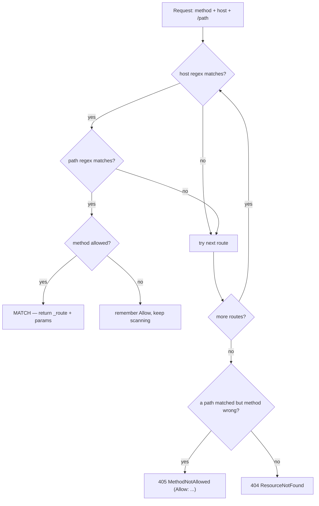

---
tags:
  - Labs
  - Routing
---

# Lab: Route Matching — Predict & Verify with `debug:router`

!!! abstract "Practical Lab"
    **Objective:** declare a realistic route set (requirements, defaults, host and
    method matching) and reliably predict which route a given URL+method hits — and
    whether it is a **404** or a **405** — then confirm it with the console. ·
    **Difficulty:** Medium ·
    **Theory:** [Configuration](../routing/configuration.md) ·
    **Mode:** Manual verification + Conceptual simulation

## 🧠 Pour les nuls

**C'est quoi ce lab ?** T'entraîner à prédire, sur papier, quelle route va matcher une URL donnée — puis vérifier ta prédiction avec les vrais outils Symfony.

**Pourquoi ça existe ?** L'examen pose souvent des questions du type "quelle route matche cette URL ?" — ce lab entraîne exactement ce réflexe, en le vérifiant immédiatement avec le vrai comportement du routeur.

**🏠 Analogie de la vraie vie :** Un examen de code de la route où tu dois d'abord prédire ce que fait un panneau avant de vérifier la réponse au dos de la carte — l'entraînement à prédire est ce qui fixe la règle en mémoire.

**Symfony dans la vraie vie :** `php bin/console router:match /produits/42 --method=POST` te dit exactement quelle route matche (ou pourquoi aucune ne matche) — la vérité terrain contre laquelle comparer ta prédiction.

**⚠️ Erreur fréquente :** oublier qu'une bonne URL avec la mauvaise méthode HTTP donne un 405, pas un 404 — une confusion fréquente que ce lab t'entraîne à éviter.

**🧠 Comment le mémoriser :** "Prédis d'abord, vérifie ensuite avec `router:match` — jamais l'inverse."

## Objective

After this lab you can look at a `RouteCollection` and, for any incoming request,
name the route that wins, list the parameters it captures, and correctly classify
the misses:

- **first-match-wins** ordering (numeric `{page}` vs textual `{slug}`),
- **requirements** as part of the compiled regex (violation ⇒ *no match*, not a 400),
- **optional trailing defaults**,
- **host** disambiguation on an identical path,
- **method** mismatch ⇒ **405** with an `Allow` list, vs an unknown path ⇒ **404**.

You then verify every prediction with `debug:router` and `router:match`.

## Prerequisites

- Chapters: [Configuration](../routing/configuration.md) ·
  [Requirements](../routing/requirements.md) ·
  [Methods](../routing/methods.md) ·
  [Debugging](../routing/debugging.md)
- Assumed skills: defining `#[Route]` on a controller; running `bin/console`.

## TD Instructions

You will build one fixed route set, then reason about it before touching the shell.

1. In `src/Controller/BlogController.php`, declare these routes **in this exact
   order** (order is part of the exercise):
    1. `admin_home` — `GET /`, restricted to host `admin.example.com`.
    2. `public_home` — `GET /` (any host).
    3. `blog_list` — `GET /blog`.
    4. `blog_archive` — `GET /blog/archive/{year}/{month}` with inline requirements
       `year<\d{4}>`, `month<\d{2}>`, and `month` **optional** (trailing `?`).
    5. `blog_paginated` — `GET /blog/{page}` with `page<\d+>`.
    6. `blog_show` — `GET /blog/{slug}` (no requirement).
2. In `src/Controller/ApiController.php`, declare:
    1. `api_posts_list` — `GET /api/posts`.
    2. `api_posts_create` — `POST /api/posts`.
    3. `api_post_show` — `GET /api/posts/{id}` with `id<\d+>`.
3. **Before running anything**, answer every row of the *Conceptual Simulation*
   table below on paper.
4. Run the *Validation Steps* and reconcile each prediction with the console
   output. Any mismatch is a gap in your mental model — fix the model, not the
   answer key.
5. *(Advanced, optional)* Reproduce the whole matcher in a PHPUnit test using
   `RouteCollection` + `UrlMatcher` + `RequestContext` (appendix at the end).

!!! info "Constraints"
    Symfony 8 · PHP 8.4 · no libraries outside the certification scope · follow
    best practices (attributes, strict types, `final`, inline requirements).

## Implementation Guide (partial)

- The attribute is `Symfony\Component\Routing\Attribute\Route`. Prefer **inline
  requirements** (`{page<\d+>}`, `{year<\d{4}>}`) over the `requirements:` array;
  they read next to the placeholder.
- Make `month` optional with a trailing `?`: `{month<\d{2}>?}`. Only **trailing**
  placeholders can be optional.
- `host:` is a first-class `#[Route]` argument. Declaration order decides ties, so
  the host-constrained `/` must come **before** the catch-all `/`.
- Restrict verbs with `methods: ['GET']` / `['POST']`. Do not branch on the method
  inside one action — give each verb its own route.



## Conceptual Simulation

Context defaults: scheme `http`, method `GET`, host `example.com` **unless a row
says otherwise**. For each request, predict the winning **route name + captured
params**, or the **status** (404 vs 405) and the `Allow` list for a 405.

| # | Request | Your prediction |
|---|---|---|
| 1 | `GET /blog/42` | ? |
| 2 | `GET /blog/hello-world` | ? |
| 3 | `GET /blog` | ? |
| 4 | `GET /blog/archive/2024` | ? |
| 5 | `GET /blog/archive/2024/06` | ? |
| 6 | `GET /api/posts` | ? |
| 7 | `PUT /api/posts` | ? |
| 8 | `DELETE /api/posts/5` | ? |
| 9 | `GET /api/posts/abc` | ? |
| 10 | `GET /` on host `admin.example.com` | ? |
| 11 | `GET /` on host `example.com` | ? |
| 12 | `HEAD /blog` | ? |

??? success "Answers (open only after you've written all 12)"
    | # | Result | Why |
    |---|---|---|
    | 1 | `blog_paginated`, `page=42` | `blog_paginated` is declared **before** `blog_show`; `42` satisfies `\d+`, so the slug route is never reached. |
    | 2 | `blog_show`, `slug=hello-world` | `hello-world` fails `page<\d+>`, so `blog_paginated` does not match; the unconstrained `{slug}` catches it. |
    | 3 | `blog_list` | Static path, exact match. |
    | 4 | `blog_archive`, `year=2024`, `month=null` | `month` is an optional trailing default; the compiled regex allows the segment to be absent. |
    | 5 | `blog_archive`, `year=2024`, `month=06` | Both segments present and pass `\d{4}` / `\d{2}`. |
    | 6 | `api_posts_list` | Path + `GET` both match. |
    | 7 | **405**, `Allow: GET, POST` | Path `/api/posts` matches two routes but neither allows `PUT`. Because a path matched, it's a `MethodNotAllowedException`, **not** a 404. |
    | 8 | **405**, `Allow: GET` | `/api/posts/{id}` matches (`5` is `\d+`) but only `GET` is allowed. |
    | 9 | **404** | `abc` violates `id<\d+>`, so `api_post_show` **does not match at all**. No route matched the path ⇒ `ResourceNotFoundException`, not a 405. |
    | 10 | `admin_home` | Host regex matches and `admin_home` is declared before `public_home`; the host-constrained route wins. |
    | 11 | `public_home` | `admin_home`'s host doesn't match, so scanning continues to the catch-all `/`. |
    | 12 | `blog_list` | `HEAD` is treated as `GET` by the matcher, so a `GET`-only route matches. `HEAD` is **not** added to `Allow` lists, though. |

!!! danger "The two traps that decide rows 1, 9 and 11"
    - **Ordering:** swap `blog_paginated` and `blog_show`, or `admin_home` and
      `public_home`, and rows 1 and 11 change. Matching is **first-match-wins in
      declaration order**.
    - **404 vs 405:** a requirement violation removes the route from matching
      entirely (⇒ 404). A wrong verb on a path that *did* match is a 405. Same URL,
      different outcome depending on *why* it missed.

## Validation Steps

- [ ] `php bin/console debug:router` lists all nine routes with the expected
      Method/Host/Path columns (host-constrained row shows `admin.example.com`).

    ```console
    $ php bin/console debug:router
     ---------------- -------- -------- ------------------- ---------------------------------------
      Name             Method   Scheme   Host                Path
     ---------------- -------- -------- ------------------- ---------------------------------------
      admin_home       GET      ANY      admin.example.com   /
      public_home      GET      ANY      ANY                 /
      blog_list        GET      ANY      ANY                 /blog
      blog_archive     GET      ANY      ANY                 /blog/archive/{year}/{month}
      blog_paginated   GET      ANY      ANY                 /blog/{page}
      blog_show        GET      ANY      ANY                 /blog/{slug}
      api_posts_list   GET      ANY      ANY                 /api/posts
      api_posts_create POST     ANY      ANY                 /api/posts
      api_post_show    GET      ANY      ANY                 /api/posts/{id}
     ---------------- -------- -------- ------------------- ---------------------------------------
    ```

- [ ] Row 1 — the digit route wins, not the slug:

    ```console
    $ php bin/console router:match /blog/42
     [OK] Route "blog_paginated" matches
    ```

- [ ] Row 2 — a non-numeric segment falls through to the slug:

    ```console
    $ php bin/console router:match /blog/hello-world
     [OK] Route "blog_show" matches
    ```

- [ ] Row 7 — wrong verb on a known path is a **405**, and the trace names the
      rejected routes with the reason "method … does not match":

    ```console
    $ php bin/console router:match /api/posts --method=POST
     [OK] Route "api_posts_create" matches

    $ php bin/console router:match /api/posts --method=PUT
     None of the routes match the path "/api/posts" with method "PUT"
     # trace: api_posts_list / api_posts_create rejected — "Method 'PUT' does not match ..."
    ```

- [ ] Row 9 — a requirement violation is a **404** (no route even matches), not a 405:

    ```console
    $ php bin/console router:match /api/posts/abc
     None of the routes match the path "/api/posts/abc"
    ```

- [ ] Rows 10/11 — host decides `/`:

    ```console
    $ php bin/console router:match / --host=admin.example.com
     [OK] Route "admin_home" matches

    $ php bin/console router:match / --host=example.com
     [OK] Route "public_home" matches
    ```

- [ ] Inspect one route to confirm the compiled regex baked in your requirement:

    ```console
    $ php bin/console debug:router blog_paginated
     # Path Regex  #^/blog/(?P<page>\d+)$#sD
    ```

- [ ] Profiler **Routing** panel shows the matched `_route` and its parameters for
      a real request through the browser.

!!! warning "Prod cache"
    In `prod` the compiled matcher (`{cache_dir}/url_matching_routes.php`) is **not**
    auto-refreshed. After changing routes, run `php bin/console cache:clear` or your
    `router:match` output and the app will disagree.

## Review — Common Mistakes

- **Declaring `blog_show` before `blog_paginated`** → `/blog/42` captures
  `slug="42"`; the numeric route is dead code. Fix: specific before general.
- **Expecting a 400 for `/api/posts/abc`** → requirements are *matching*, not
  *validation*. A violation yields a 404, never a 400.
- **Expecting a 404 for `PUT /api/posts`** → the path matched, so it's a 405 with
  `Allow: GET, POST`. Only an unmatched path is a 404.
- **Putting `public_home` before `admin_home`** → the catch-all `/` swallows the
  admin host; the host-constrained route never runs.
- **Adding `^`/`$` to a requirement** (`{id<^\d+$>}`) → requirements are already
  anchored to the token; the extra anchors break the compiled regex.
- **Making a non-trailing placeholder optional** (`/{a?}/{b}`) → only trailing
  placeholders may be optional; the matcher can't locate a missing middle segment.
- **Changing routes in prod and not clearing the cache** → the old compiled matcher
  persists.

## Exam Connection

The certification loves the "which route wins / what status" question: numeric vs
slug precedence (declaration order), requirement violation ⇒ **404** (not 400/405),
wrong verb ⇒ **405 with `Allow`** (not 404), `GET ⇒ HEAD` equivalence, host
disambiguation on identical paths, and trailing-only optional defaults. Knowing
that `router:match` uses a `TraceableUrlMatcher` (it *explains* rejections) is a
common debugging-command question.

## Ideal Solution

??? success "Reference controllers (compare only after you try)"
    ```php
    <?php
    declare(strict_types=1);

    namespace App\Controller;

    use Symfony\Bundle\FrameworkBundle\Controller\AbstractController;
    use Symfony\Component\HttpFoundation\Response;
    use Symfony\Component\Routing\Attribute\Route;

    final class BlogController extends AbstractController
    {
        // Host-constrained "/" — declared BEFORE public_home so it wins on that host.
        #[Route('/', name: 'admin_home', host: 'admin.example.com', methods: ['GET'])]
        public function adminHome(): Response
        {
            return new Response('admin dashboard');
        }

        // Catch-all "/" for every other host.
        #[Route('/', name: 'public_home', methods: ['GET'])]
        public function publicHome(): Response
        {
            return new Response('public home');
        }

        #[Route('/blog', name: 'blog_list', methods: ['GET'])]
        public function list(): Response
        {
            return new Response('blog list');
        }

        // Optional trailing {month}; both segments constrained inline.
        #[Route('/blog/archive/{year<\d{4}>}/{month<\d{2}>?}', name: 'blog_archive', methods: ['GET'])]
        public function archive(int $year, ?string $month = null): Response
        {
            return new Response(sprintf('archive %d/%s', $year, $month ?? 'all'));
        }

        // Numeric page — BEFORE blog_show so /blog/42 never matches the slug route.
        #[Route('/blog/{page<\d+>}', name: 'blog_paginated', methods: ['GET'])]
        public function paginated(int $page): Response
        {
            return new Response(sprintf('page %d', $page));
        }

        // Textual slug — the single-segment fallback.
        #[Route('/blog/{slug}', name: 'blog_show', methods: ['GET'])]
        public function show(string $slug): Response
        {
            return new Response(sprintf('post %s', $slug));
        }
    }
    ```

    ```php
    <?php
    declare(strict_types=1);

    namespace App\Controller;

    use Symfony\Bundle\FrameworkBundle\Controller\AbstractController;
    use Symfony\Component\HttpFoundation\JsonResponse;
    use Symfony\Component\Routing\Attribute\Route;

    final class ApiController extends AbstractController
    {
        #[Route('/api/posts', name: 'api_posts_list', methods: ['GET'])]
        public function listPosts(): JsonResponse
        {
            return new JsonResponse([]);
        }

        #[Route('/api/posts', name: 'api_posts_create', methods: ['POST'])]
        public function createPost(): JsonResponse
        {
            return new JsonResponse(null, JsonResponse::HTTP_CREATED);
        }

        #[Route('/api/posts/{id<\d+>}', name: 'api_post_show', methods: ['GET'])]
        public function showPost(int $id): JsonResponse
        {
            return new JsonResponse(['id' => $id]);
        }
    }
    ```

## Appendix — Advanced: reproduce the matcher in a test

<!-- TDD appendix: routing is config, but the matcher itself IS testable behaviour. -->

!!! note "Why a test here"
    You normally verify routes with the console. But building a `RouteCollection`
    and driving `UrlMatcher` yourself proves you understand precedence and the
    404-vs-405 exceptions. This is the one place routing behaves like unit-testable
    code — declaration order in the collection is your `Given`.

**Given/When/Then:** *Given* the route set above, *when* I `match()` a path under a
`RequestContext`, *then* I get the expected `_route`/params — or a
`MethodNotAllowedException` (405) / `ResourceNotFoundException` (404).

```php
<?php
declare(strict_types=1);

namespace App\Tests\Routing;

use PHPUnit\Framework\TestCase;
use Symfony\Component\Routing\Exception\MethodNotAllowedException;
use Symfony\Component\Routing\Exception\ResourceNotFoundException;
use Symfony\Component\Routing\Matcher\UrlMatcher;
use Symfony\Component\Routing\RequestContext;
use Symfony\Component\Routing\Route;
use Symfony\Component\Routing\RouteCollection;

final class RouteMatchingTest extends TestCase
{
    private function collection(): RouteCollection
    {
        $routes = new RouteCollection();

        // Order matters: first match wins. Host-constrained route first.
        $routes->add('admin_home', new Route('/', host: 'admin.example.com', methods: ['GET']));
        $routes->add('public_home', new Route('/', methods: ['GET']));
        $routes->add('blog_list', new Route('/blog', methods: ['GET']));
        $routes->add('blog_paginated', new Route('/blog/{page}', requirements: ['page' => '\d+'], methods: ['GET']));
        $routes->add('blog_show', new Route('/blog/{slug}', methods: ['GET']));
        $routes->add('api_posts_list', new Route('/api/posts', methods: ['GET']));
        $routes->add('api_posts_create', new Route('/api/posts', methods: ['POST']));
        $routes->add('api_post_show', new Route('/api/posts/{id}', requirements: ['id' => '\d+'], methods: ['GET']));

        return $routes;
    }

    private function matcher(string $method = 'GET', string $host = 'example.com'): UrlMatcher
    {
        return new UrlMatcher($this->collection(), new RequestContext(method: $method, host: $host));
    }

    public function testNumericSegmentPrefersTheDigitRoute(): void
    {
        $result = $this->matcher()->match('/blog/42');

        self::assertSame('blog_paginated', $result['_route']);
        self::assertSame('42', $result['page']);
    }

    public function testNonNumericSegmentFallsBackToSlug(): void
    {
        $result = $this->matcher()->match('/blog/hello-world');

        self::assertSame('blog_show', $result['_route']);
        self::assertSame('hello-world', $result['slug']);
    }

    public function testWrongMethodOnKnownPathIs405(): void
    {
        $this->expectException(MethodNotAllowedException::class);

        try {
            $this->matcher('PUT')->match('/api/posts');
        } catch (MethodNotAllowedException $e) {
            self::assertSame(['GET', 'POST'], $e->getAllowedMethods());
            throw $e;
        }
    }

    public function testViolatingRequirementIs404(): void
    {
        $this->expectException(ResourceNotFoundException::class);

        // "abc" fails \d+ and no other route matches -> 404, not 405.
        $this->matcher()->match('/api/posts/abc');
    }

    public function testHostConstraintDisambiguatesSamePath(): void
    {
        self::assertSame('admin_home', $this->matcher('GET', 'admin.example.com')->match('/')['_route']);
        self::assertSame('public_home', $this->matcher('GET', 'example.com')->match('/')['_route']);
    }
}
```

!!! tip "Run it"
    `vendor/bin/phpunit tests/Routing/RouteMatchingTest.php`. Note that `match()`
    returns **string** parameter values (`'42'`, not `42`) — the int cast happens
    later, in the controller argument resolver, not in the matcher.

## Alternative Approaches (optional)

- **Option A (simple):** verify each row with `router:match` and skip the appendix
  — enough for the exam's config questions.
- **Option B (advanced):** the `UrlMatcher` test above — best for internalising
  precedence and the exception types.
- **Option C (exam-style):** hand-write the `blog_paginated` compiled regex
  (`#^/blog/(?P<page>\d+)$#sD`) and confirm it with `debug:router blog_paginated`.

---

<small>Theory: [Configuration](../routing/configuration.md) · [Requirements](../routing/requirements.md) · [Methods](../routing/methods.md) · [Debugging](../routing/debugging.md) · Labs: [all labs](index.md)</small>
