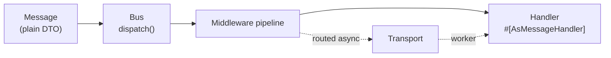

# Composant Messenger

!!! tip "In a nutshell"
    Messenger envoie de simples objets PHP (des **messages**) à travers un bus
    vers des handlers, pour qu'un travail lent puisse s'exécuter plus tard
    dans un worker en arrière-plan plutôt que pendant la request. Les trois
    rôles que vous écrivez sont le **message** (un DTO), le **handler**
    (`#[AsMessageHandler]`), et le **bus** (`MessageBusInterface::dispatch()`,
    qui renvoie toujours une `Envelope`, jamais la valeur brute du handler).

!!! example "Real-world analogy"
    Messenger est un **bureau de poste**. `dispatch()` dépose une lettre dans
    la boîte — vous recevez un reçu (l'`Envelope`), pas une réponse. Le
    **transport** est la salle de tri où les lettres attendent ; le
    **worker** est le facteur qui les distribue plus tard ; le **handler**
    est le destinataire qui agit enfin sur la lettre. Vous n'attendez pas au
    guichet une réponse — cela se passe plus tard, ailleurs (ou jamais du
    tout, pour un courrier "fire-and-forget").

!!! abstract "Learning objectives"
    À la fin de ce chapitre, vous saurez :

    - [ ] Nommer les trois rôles (message, handler, bus) et les FQCN qui les portent.
    - [ ] Modéliser un message + handler avec `#[AsMessageHandler]`.
    - [ ] Expliquer pourquoi `dispatch()` ne renvoie jamais la valeur du handler directement.

    **Syllabus:** `Messenger → Messenger component` ·
    **Level:** Expert ·
    **Est. time:** 20 min ·
    **Prerequisites:** [DI & Tags](../dependency-injection/index.md)

    **Examen Symfony 8 :** OUI

---

## Pour les nuls

### L'idée en une phrase
Messenger envoie des objets PHP tout simples à travers un "bus" jusqu'à un handler — le travail lent peut ainsi s'exécuter plus tard, en arrière-plan, au lieu de bloquer la requête.

### Imagine dans la vraie vie
Messenger est un **bureau de poste**. `dispatch()` dépose une lettre dans la boîte — tu reçois un reçu (l'`Envelope`), pas une réponse. Le **transport** est la salle de tri où les lettres attendent ; le **worker** est le facteur qui les distribue plus tard ; le **handler** est le destinataire qui agit enfin sur la lettre.

### Dans Symfony
Envoyer un email de bienvenue après une inscription peut se faire via Messenger : la requête HTTP répond immédiatement à l'utilisateur, pendant qu'un worker en arrière-plan envoie réellement l'email quelques secondes plus tard.

### Exemple simple
```php
$bus->dispatch(new EnvoyerEmailBienvenue($utilisateur->getId()));
// la requête HTTP répond tout de suite, l'email part plus tard
```

### Comment le mémoriser 🧠
`dispatch()` ne renvoie **jamais** la valeur du handler directement — toujours un `Envelope`, comme un reçu postal ne contient jamais la réponse du destinataire, seulement la preuve du dépôt.

## Theory

Messenger permet d'envoyer des **messages** à travers un **bus de messages** ;
le bus les fait passer dans une pile de **middleware** puis appelle finalement
un ou plusieurs **handlers**. Un message est n'importe quel objet PHP simple
(un DTO) — rien n'est couplé à HTTP. Le même message peut être traité
**synchroniquement** dans le même process ou **asynchroniquement** par un
**worker** en arrière-plan qui consomme depuis un **transport** (une file
d'attente).

| Rôle | Ce que c'est |
|---|---|
| **Message** | Un objet PHP simple et sérialisable portant une intention/donnée |
| **Handler** | Un service callable/invocable qui agit sur un type de message |
| **Bus** | `MessageBusInterface::dispatch()` — le point d'entrée qui renvoie une `Envelope` |

Tout ce qui transite par le bus est enveloppé dans une **`Envelope`** décorée
de **stamps** (des métadonnées : quel transport, quand livrer, résultats,
compteur de retry…) — couvert en détail dans [Middleware](middleware.fr.md).

```php
use Symfony\Component\Messenger\Attribute\AsMessageHandler;
use Symfony\Component\Messenger\MessageBusInterface;

final readonly class SmsNotification           // Message : un DTO simple
{
    public function __construct(public string $content) {}
}

#[AsMessageHandler]
final class SmsNotificationHandler             // Handler : agit sur un type de message
{
    public function __invoke(SmsNotification $message): void { /* ... */ }
}

// Bus : dispatch() enveloppe le DTO dans une Envelope (les stamps portent les métadonnées)
$envelope = $bus->dispatch(new SmsNotification('hello'));
```

!!! question "Predict first"
    Vous appelez `dispatch()` sur un message. Est-ce que `dispatch()` renvoie
    la valeur de retour du handler, `void`, ou autre chose ?

??? note "Reveal"
    Autre chose : une **`Envelope`**. La valeur de retour du handler (le cas
    échéant) est enveloppée dans un `HandledStamp` *à l'intérieur* de cette
    enveloppe — `dispatch()` lui-même ne la rend jamais directement. Voir
    [Messages & Handlers](messages-handlers.fr.md) pour savoir comment la lire.

## Deep Dive — how it works internally

### The core classes

| Rôle | FQCN |
|---|---|
| Contrat du bus | `Symfony\Component\Messenger\MessageBusInterface` |
| Bus par défaut | `Symfony\Component\Messenger\MessageBus` |
| Envelope | `Symfony\Component\Messenger\Envelope` |
| Marqueur de stamp | `Symfony\Component\Messenger\Stamp\StampInterface` |
| Attribut de handler | `Symfony\Component\Messenger\Attribute\AsMessageHandler` |
| Contrat de middleware | `Symfony\Component\Messenger\Middleware\MiddlewareInterface` |
| Contrat de transport | `Symfony\Component\Messenger\Transport\TransportInterface` |
| Worker | `Symfony\Component\Messenger\Worker` |

Ces sept classes sont la carte du reste de cette étape : `MessageBus` et
`Envelope` sont couverts en profondeur dans
[Messages & Handlers](messages-handlers.fr.md) ; `MiddlewareInterface` et les
stamps dans [Middleware](middleware.fr.md) ; `TransportInterface` dans
[Transports](transports.fr.md) ; `Worker` dans [Workers](workers.fr.md).



!!! note "Source reference"
    `Symfony\Component\Messenger\MessageBusInterface` et l'organisation des
    classes du composant —
    [symfony/symfony `8.0`](https://github.com/symfony/symfony/tree/8.0/src/Symfony/Component/Messenger).

### Null behavior

`dispatch()` ne renvoie **jamais** `null` — c'est toujours une `Envelope`,
même pour un handler qui renvoie `void`. Ce qui peut être `null`, c'est ce que
vous *lisez ensuite* dans cette enveloppe (un stamp qui n'a jamais été
ajouté). Voir [Messages & Handlers](messages-handlers.fr.md) pour les deux
`null` différents qui se cachent derrière
`$envelope->last(HandledStamp::class)?->getResult()`.

```php
$envelope = $bus->dispatch(new SmsNotification('hi')); // toujours une Envelope, jamais null
```

!!! note "Null in real life"
    Vous recevez toujours un reçu quand vous déposez une lettre dans la
    boîte — le reçu lui-même n'est jamais "manquant". Que la *réponse* de la
    lettre existe est une question séparée, qui trouve sa réponse plus tard.

## Configuration & code

=== "PHP Attributes"

    ```php
    <?php
    declare(strict_types=1);

    namespace App\Message;

    final readonly class SendReminder
    {
        public function __construct(public int $userId) {}
    }
    ```

    ```php
    <?php
    declare(strict_types=1);

    namespace App\MessageHandler;

    use App\Message\SendReminder;
    use Symfony\Component\Messenger\Attribute\AsMessageHandler;

    #[AsMessageHandler]
    final class SendReminderHandler
    {
        public function __invoke(SendReminder $message): void
        {
            // ... fait le travail
        }
    }
    ```

=== "Console"

    ```console
    $ php bin/console debug:messenger
    ```

## Best practices & anti-patterns

| ✅ Do | ❌ Avoid |
|---|---|
| Garder les messages petits, sérialisables, des DTO immuables | Passer des entités ou des closures dans un message |
| Une classe handler par type de message | Entasser une logique non liée dans un seul handler |
| Dépendre de `MessageBusInterface` (le contrat) | Type-hinter le `MessageBus` concret |
| Laisser l'autoconfiguration découvrir `#[AsMessageHandler]` | Taguer manuellement chaque service handler |

## When (not) to use it / alternatives

Utilisez Messenger quand un travail peut être **modélisé comme un message
distinct** — même si vous ne le routez jamais vers un transport asynchrone,
le bus vous donne quand même une séparation testable et découplée entre "ce
qui s'est passé" et "ce qui doit s'exécuter". Pour un appel unique, toujours
synchrone, sans besoin de cette séparation, appeler un service directement
est plus simple et n'a pas de coût de dispatch.

!!! danger "Certification traps"
    - `dispatch()` renvoie une **`Envelope`**, jamais la valeur du handler
      directement — c'est un distracteur fréquent à l'examen.
    - La classe de message elle-même n'a besoin **d'aucune interface ni
      classe de base** — n'importe quel objet simple fonctionne.
    - `#[AsMessageHandler]` est ce qui fait d'une classe un handler ; il n'y a
      pas d'étape de tagging manuel séparée sous `autoconfigure: true`.

!!! warning "Common mistakes"
    - Oublier `#[AsMessageHandler]` (ou son `use`), donc aucun handler n'est
      trouvé — `NoHandlerForMessageException` (voir
      [Messages & Handlers](messages-handlers.fr.md)).
    - S'attendre à ce que le type de retour de `dispatch()` varie selon le
      handler — c'est toujours `Envelope`.

## Exercises

1. **(Advanced)** Écrivez une classe de message et un handler pour celle-ci, et envoyez-la.
2. **(Expert)** Expliquez, sans exécuter de code, pourquoi `dispatch()` ne peut
   pas simplement renvoyer la valeur du handler comme le ferait un appel de
   méthode normal.

??? success "Solutions"

    **1.** Voir l'onglet "PHP Attributes" ci-dessus : un DTO simple, un
    service `#[AsMessageHandler]`, puis `$bus->dispatch(new SendReminder($id))`.

    **2.** Un bus peut avoir **zéro, un, ou plusieurs** handlers pour un
    message (par ex. un event bus), et le message peut être routé vers un
    transport asynchrone où aucun handler ne s'exécute dans le process
    actuel. Il n'y a pas de valeur de retour unique "la" à renvoyer
    synchroniquement, donc le bus renvoie toujours l'`Envelope` et vous
    laisse inspecter ce qui s'est réellement passé via ses stamps.

## Certification questions

*Question d'entraînement inspirée du syllabus — jamais une question officielle de l'examen.*

??? question "Q1. Que renvoie `MessageBusInterface::dispatch()` ?"
    - [ ] A. La valeur de retour du handler
    - [x] B. Une `Envelope` ✅
    - [ ] C. `void`
    - [ ] D. Un objet type `Promise`/`Future`

    **Why:** `dispatch()` renvoie toujours l'`Envelope` (éventuellement
    stampée) ; le résultat d'un handler vit dans un `HandledStamp` à
    l'intérieur.
    **Ref:** [Messenger](https://symfony.com/doc/8.0/messenger.html).

??? question "Q2. Que doit implémenter une classe de message Messenger ?"
    - [x] A. Rien — n'importe quel objet PHP simple et sérialisable convient ✅
    - [ ] B. `MessageInterface`
    - [ ] C. `Symfony\Component\Messenger\Message`
    - [ ] D. `Stringable`

    **Why:** Messenger n'a délibérément aucune interface marqueur pour les
    messages ; un DTO simple suffit.
    **Ref:** [Messenger — Creating a Message Handler](https://symfony.com/doc/8.0/messenger.html#creating-a-message-handler).

??? question "Q3. Quel attribut marque un service comme handler de message en Symfony 8 ?"
    - [x] A. `#[AsMessageHandler]` ✅
    - [ ] B. `#[AsHandler]`
    - [ ] C. `#[MessageHandler]`
    - [ ] D. `#[Handles]`

    **Why:** `#[AsMessageHandler]` est ce que l'autoconfiguration recherche
    pour taguer et câbler un handler.
    **Ref:** [Messenger](https://symfony.com/doc/8.0/messenger.html#creating-a-message-handler).

## Key takeaways

- Trois rôles : message (DTO), handler (`#[AsMessageHandler]`), bus
  (`MessageBusInterface::dispatch()`).
- `dispatch()` renvoie toujours une `Envelope`, jamais la valeur brute du handler.
- Un message n'a besoin d'aucune interface ni classe de base — n'importe quel objet simple fonctionne.
- Les sept FQCN essentiels ci-dessus correspondent aux chapitres suivants de cette étape.

## Last-minute revision

!!! tip "Cheat sheet"
    - `#[AsMessageHandler]` sur un service `__invoke(MessageType $m)`.
    - `dispatch($msg): Envelope` — jamais `null`, jamais la valeur brute du handler.
    - Message = objet simple, aucune interface requise.
    - FQCN essentiels : `MessageBusInterface`, `Envelope`, `StampInterface`,
      `AsMessageHandler`, `MiddlewareInterface`, `TransportInterface`, `Worker`.

## Connections

- **Depends on:** [DI & Tags](../dependency-injection/index.md) — les
  handlers sont découverts via l'autoconfiguration + les locators tagués, pas
  un câblage manuel.
- **Reused in:** chaque autre chapitre de cette étape s'appuie sur le
  vocabulaire message/handler/bus défini ici.
- **Confused with:** [Architecture → Events](../architecture/index.md) — le
  *dispatcher* d'événements exécute des listeners synchroniquement dans le
  même process ; le *bus* de messages peut différer le travail vers un tout
  autre process.

## Official References

- [Official docs — Messenger](https://symfony.com/doc/8.0/messenger.html)
- [Symfony source — Messenger component](https://github.com/symfony/symfony/tree/8.0/src/Symfony/Component/Messenger)

## Video references

!!! tip "Watch & learn"
    Ce sont des chaînes vidéo officielles, mises à jour en continu — cherchez-y
    "Symfony Messenger" pour renforcer ce chapitre. Nous lions des chaînes
    stables plutôt que des vidéos individuelles pour que les références ne
    deviennent jamais obsolètes.

    - [SymfonyCasts screencasts](https://symfonycasts.com/tracks/symfony) — tutoriels scénarisés, en code.
    - [Symfony official YouTube](https://www.youtube.com/@SymfonyOfficial) — conférences et keynotes SymfonyCon.
    - [Official docs for this topic](https://symfony.com/doc/8.0/messenger.html) — certaines pages de doc Symfony embarquent un screencast.

## Confidence check

Je suis prêt quand je peux :

- [ ] expliquer **pourquoi** un bus découple "ce qui s'est passé" de "ce qui s'exécute, quand, et où"
- [ ] câbler un message + `#[AsMessageHandler]` en Symfony 8
- [ ] déboguer un message sans handler trouvé
- [ ] repérer le piège : `dispatch()` renvoie une `Envelope`, jamais la valeur brute du handler
- [ ] nommer les sept FQCN essentiels et à quel chapitre suivant chacun appartient

---

<small>Related: [Messages & Handlers](messages-handlers.fr.md) · [Middleware](middleware.fr.md) · [DI & Tags](../dependency-injection/index.md)</small>
