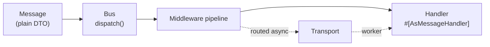

# Messenger Component

!!! tip "In a nutshell"
    Messenger sends plain PHP objects (messages) through a bus to handlers,
    so slow work can run later in a background worker instead of during the
    request. The three roles you write are **message** (a DTO), **handler**
    (`#[AsMessageHandler]`), and the **bus** (`MessageBusInterface::dispatch()`,
    which always returns an `Envelope`, never the handler's raw value).

!!! example "Real-world analogy"
    Messenger is a **post office**. `dispatch()` is dropping a letter in the
    box — you get a receipt (the `Envelope`), not a reply. The **transport**
    is the sorting room where letters wait; the **worker** is the courier who
    later delivers them; the **handler** is the recipient who finally acts on
    the letter. You don't wait at the counter for a reply — that happens
    later, elsewhere (or nowhere at all, for fire-and-forget mail).

!!! abstract "Learning objectives"
    By the end of this chapter you can:

    - [ ] Name the three roles (message, handler, bus) and the core FQCNs behind them.
    - [ ] Model a message + handler with `#[AsMessageHandler]`.
    - [ ] Explain why `dispatch()` never returns the handler's value directly.

    **Syllabus:** `Messenger → Messenger component` ·
    **Level:** Expert ·
    **Est. time:** 20 min ·
    **Prerequisites:** [DI & Tags](../dependency-injection/index.md)

---

## Theory

Messenger lets you send **messages** through a **message bus**; the bus runs
them through a **middleware** stack and finally calls one or more
**handlers**. A message is any plain PHP object (a DTO) — nothing is coupled
to HTTP. The same message can be handled **synchronously** in-process or
**asynchronously** by a background **worker** consuming from a **transport**
(queue).

| Role | What it is |
|---|---|
| **Message** | A plain, serializable PHP object carrying intent/data |
| **Handler** | A callable/invokable service that acts on one message type |
| **Bus** | `MessageBusInterface::dispatch()` — entry point that returns an `Envelope` |

Everything travelling through the bus is wrapped in an **`Envelope`**
decorated with **stamps** (metadata: which transport, when to deliver,
results, retry count…) — covered fully in [Middleware](middleware.md).

```php
use Symfony\Component\Messenger\Attribute\AsMessageHandler;
use Symfony\Component\Messenger\MessageBusInterface;

final readonly class SmsNotification           // Message: a plain DTO
{
    public function __construct(public string $content) {}
}

#[AsMessageHandler]
final class SmsNotificationHandler             // Handler: acts on one message type
{
    public function __invoke(SmsNotification $message): void { /* ... */ }
}

// Bus: dispatch() wraps the DTO in an Envelope (stamps carry the metadata)
$envelope = $bus->dispatch(new SmsNotification('hello'));
```

!!! question "Predict first"
    You `dispatch()` a message. Does `dispatch()` return the handler's return
    value, `void`, or something else entirely?

??? note "Reveal"
    Something else: an **`Envelope`**. The handler's return value (if any) is
    wrapped in a `HandledStamp` *inside* that envelope — `dispatch()` itself
    never hands it back directly. See [Messages & Handlers](messages-handlers.md)
    for how to read it.

## Deep Dive — how it works internally

### The core classes

| Role | FQCN |
|---|---|
| Bus contract | `Symfony\Component\Messenger\MessageBusInterface` |
| Default bus | `Symfony\Component\Messenger\MessageBus` |
| Envelope | `Symfony\Component\Messenger\Envelope` |
| Stamp marker | `Symfony\Component\Messenger\Stamp\StampInterface` |
| Handler attribute | `Symfony\Component\Messenger\Attribute\AsMessageHandler` |
| Middleware contract | `Symfony\Component\Messenger\Middleware\MiddlewareInterface` |
| Transport contract | `Symfony\Component\Messenger\Transport\TransportInterface` |
| Worker | `Symfony\Component\Messenger\Worker` |

These seven classes are the map for the rest of this stage: `MessageBus` and
`Envelope` are covered in depth in [Messages & Handlers](messages-handlers.md);
`MiddlewareInterface` and stamps in [Middleware](middleware.md);
`TransportInterface` in [Transports](transports.md); `Worker` in
[Workers](workers.md).



!!! note "Source reference"
    `Symfony\Component\Messenger\MessageBusInterface` and the component's
    class layout —
    [symfony/symfony `8.0`](https://github.com/symfony/symfony/tree/8.0/src/Symfony/Component/Messenger).

### Null behavior

`dispatch()` **never** returns `null` — it always returns an `Envelope`,
even for a handler that returns `void`. What can be `null` is what you *read
out of* that envelope afterward (a stamp that was never added). See
[Messages & Handlers](messages-handlers.md) for the two different nulls
hiding behind `$envelope->last(HandledStamp::class)?->getResult()`.

```php
$envelope = $bus->dispatch(new SmsNotification('hi')); // always an Envelope, never null
```

!!! note "Null in real life"
    You always get a receipt for dropping a letter in the box — the receipt
    itself is never "missing." Whether the letter's *reply* exists is a
    separate question, answered later.

## Configuration & code

=== "PHP Attributes"

    ```php
    <?php
    declare(strict_types=1);

    namespace App\Message;

    final readonly class SendReminder
    {
        public function __construct(public int $userId) {}
    }
    ```

    ```php
    <?php
    declare(strict_types=1);

    namespace App\MessageHandler;

    use App\Message\SendReminder;
    use Symfony\Component\Messenger\Attribute\AsMessageHandler;

    #[AsMessageHandler]
    final class SendReminderHandler
    {
        public function __invoke(SendReminder $message): void
        {
            // ... do the work
        }
    }
    ```

=== "Console"

    ```console
    $ php bin/console debug:messenger
    ```

## Best practices & anti-patterns

| ✅ Do | ❌ Avoid |
|---|---|
| Keep messages small, serializable, immutable DTOs | Passing entities or closures in a message |
| One handler class per message type | Cramming unrelated logic into one handler |
| Depend on `MessageBusInterface` (the contract) | Type-hinting the concrete `MessageBus` |
| Let autoconfiguration discover `#[AsMessageHandler]` | Manually tagging every handler service |

## When (not) to use it / alternatives

Use Messenger when work can be **modeled as a discrete message** — even if
you never route it to an async transport, the bus still gives you a
decoupled, testable seam between "what happened" and "what should run."
For a single, always-synchronous call with no need for that seam, calling a
service directly is simpler and has no dispatch overhead.

!!! danger "Certification traps"
    - `dispatch()` returns an **`Envelope`**, never the handler's value
      directly — that is a frequent exam distractor.
    - The message class itself needs **no interface and no base class** —
      any plain object works.
    - `#[AsMessageHandler]` is what makes a class a handler; there is no
      separate manual tagging step under `autoconfigure: true`.

!!! warning "Common mistakes"
    - Forgetting `#[AsMessageHandler]` (or the `use` import), so no handler
      is found — `NoHandlerForMessageException` (see
      [Messages & Handlers](messages-handlers.md)).
    - Expecting `dispatch()`'s return type to vary by handler — it is always
      `Envelope`.

## Exercises

1. **(Advanced)** Write a message class and a handler for it, and dispatch it.
2. **(Expert)** Explain, without running any code, why `dispatch()` cannot
   simply return the handler's value the way a normal method call would.

??? success "Solutions"

    **1.** See the "PHP Attributes" tab above: a plain DTO message, a
    `#[AsMessageHandler]` service, then `$bus->dispatch(new SendReminder($id))`.

    **2.** A bus may have **zero, one, or many** handlers for a message
    (e.g. an event bus), and the message may be routed to an async transport
    where no handler runs at all in the current process. There is no single
    "the" return value to hand back synchronously, so the bus always returns
    the `Envelope` and lets you inspect what actually happened via its stamps.

## Certification questions

??? question "Q1. What does `MessageBusInterface::dispatch()` return?"
    - [ ] A. The handler's return value
    - [x] B. An `Envelope` ✅
    - [ ] C. `void`
    - [ ] D. A `Promise`/`Future`-like object

    **Why:** `dispatch()` always returns the (possibly stamped) `Envelope`;
    a handler's result lives in a `HandledStamp` inside it.
    **Ref:** [Messenger](https://symfony.com/doc/8.0/messenger.html).

??? question "Q2. What must a Messenger message class implement?"
    - [x] A. Nothing — any plain, serializable PHP object works ✅
    - [ ] B. `MessageInterface`
    - [ ] C. `Symfony\Component\Messenger\Message`
    - [ ] D. `Stringable`

    **Why:** Messenger deliberately has no message marker interface; a plain
    DTO is enough. **Ref:** [Messenger — Creating a Message Handler](https://symfony.com/doc/8.0/messenger.html#creating-a-message-handler).

??? question "Q3. Which attribute marks a service as a message handler in Symfony 8?"
    - [x] A. `#[AsMessageHandler]` ✅
    - [ ] B. `#[AsHandler]`
    - [ ] C. `#[MessageHandler]`
    - [ ] D. `#[Handles]`

    **Why:** `#[AsMessageHandler]` is what autoconfiguration looks for to
    tag and wire a handler. **Ref:** [Messenger](https://symfony.com/doc/8.0/messenger.html#creating-a-message-handler).

## Key takeaways

- Three roles: message (DTO), handler (`#[AsMessageHandler]`), bus
  (`MessageBusInterface::dispatch()`).
- `dispatch()` always returns an `Envelope`, never the handler's raw value.
- A message needs no interface or base class — any plain object works.
- The seven core FQCNs above map to the rest of this stage's chapters.

## Last-minute revision

!!! tip "Cheat sheet"
    - `#[AsMessageHandler]` on an `__invoke(MessageType $m)` service.
    - `dispatch($msg): Envelope` — never `null`, never the raw handler value.
    - Message = plain object, no interface required.
    - Core FQCNs: `MessageBusInterface`, `Envelope`, `StampInterface`,
      `AsMessageHandler`, `MiddlewareInterface`, `TransportInterface`, `Worker`.

## Connections

- **Depends on:** [DI & Tags](../dependency-injection/index.md) — handlers
  are discovered through autoconfiguration + tagged locators, not manual wiring.
- **Reused in:** every other chapter in this stage builds on the
  message/handler/bus vocabulary defined here.
- **Confused with:** [Architecture → Events](../architecture/index.md) — the
  event *dispatcher* runs listeners synchronously in-process; the message
  *bus* can defer work to another process entirely.

## Official References

- [Official docs — Messenger](https://symfony.com/doc/8.0/messenger.html)
- [Symfony source — Messenger component](https://github.com/symfony/symfony/tree/8.0/src/Symfony/Component/Messenger)

## Video references

!!! tip "Watch & learn"
    These are official, continuously-updated video channels — search them for
    "Symfony Messenger" to reinforce this chapter. We link stable channels rather than
    individual videos so the references never rot.

    - [SymfonyCasts screencasts](https://symfonycasts.com/tracks/symfony) — scripted, code-along tutorials.
    - [Symfony official YouTube](https://www.youtube.com/@SymfonyOfficial) — SymfonyCon conference talks & keynotes.
    - [Official docs for this topic](https://symfony.com/doc/8.0/messenger.html) — some Symfony doc pages embed a screencast.

## Confidence check

I'm ready when I can:

- [ ] explain **why** a bus decouples "what happened" from "what runs, when, and where"
- [ ] wire a message + `#[AsMessageHandler]` in Symfony 8
- [ ] debug a message with no handler found
- [ ] spot the trap: `dispatch()` returns an `Envelope`, never the handler's raw value
- [ ] name the seven core FQCNs and which later chapter each belongs to

---

<small>Related: [Messages & Handlers](messages-handlers.md) · [Middleware](middleware.md) · [DI & Tags](../dependency-injection/index.md)</small>
