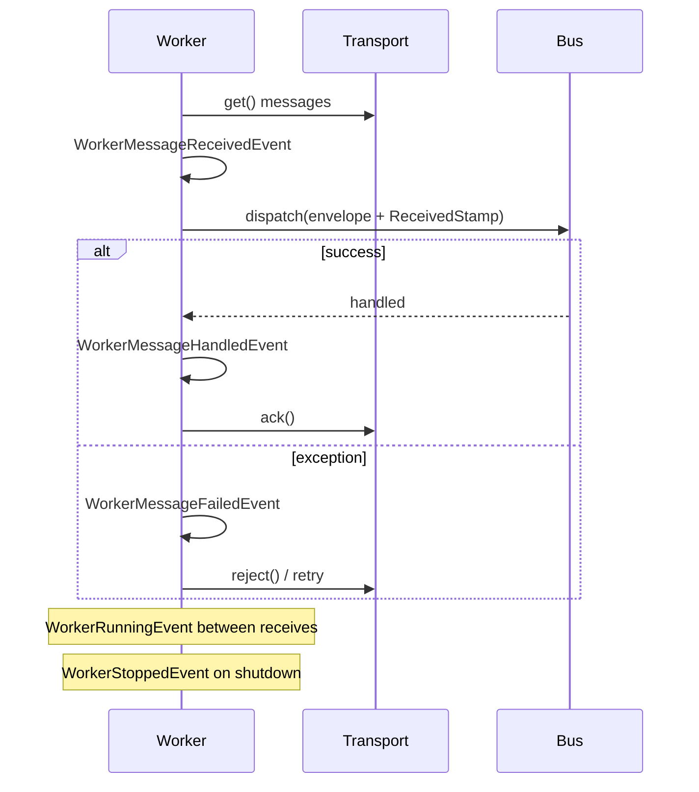
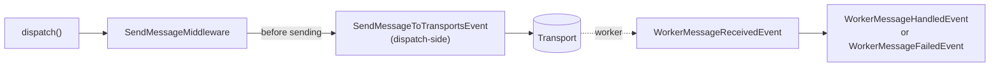

# Events

!!! tip "In a nutshell"
    Le worker déclenche six événements autour de sa boucle
    réception/dispatch/ack (`WorkerStartedEvent` jusqu'à `WorkerStoppedEvent`),
    tous dans `Symfony\Component\Messenger\Event\`. Il existe aussi un
    événement **côté envoi**, déclenché *avant* qu'aucun worker ne soit
    impliqué : `SendMessageToTransportsEvent`, levé par
    `SendMessageMiddleware` juste avant de remettre l'enveloppe à ses
    transports — celui à utiliser si vous devez réécrire une enveloppe
    avant qu'elle ne soit réellement envoyée.

!!! example "Real-world analogy"
    Les événements du worker sont des points de contrôle le long de la
    tournée du coursier : pointer à l'arrivée (`WorkerStartedEvent`),
    ramasser un colis (`WorkerMessageReceivedEvent`), une livraison réussie
    ou ratée (`WorkerMessageHandledEvent`/`WorkerMessageFailedEvent`), chaque
    tour de la tournée (`WorkerRunningEvent`), et pointer à la sortie
    (`WorkerStoppedEvent`). `SendMessageToTransportsEvent` est différent :
    ça se passe au **bureau de tri**, juste avant qu'une lettre ne soit même
    mise sur un camion — aucun coursier impliqué encore.

!!! abstract "Learning objectives"
    À la fin de ce chapitre, vous saurez :

    - [ ] Nommer les six événements du cycle de vie du worker, dans l'ordre.
    - [ ] Expliquer à quoi sert `SendMessageToTransportsEvent` et pourquoi il se déclenche avant tout événement de worker.
    - [ ] Écrire un listener qui réagit à un échec de handler.

    **Syllabus:** `Messenger → Events` ·
    **Level:** Expert ·
    **Est. time:** 20 min ·
    **Prerequisites:** [Workers](workers.fr.md), [Architecture → Events](../architecture/index.md)

    **Examen Symfony 8 :** OUI

---

## Pour les nuls

### L'idée en une phrase
Le worker déclenche six événements tout au long de sa boucle — et un septième événement bien distinct se déclenche côté envoi, avant même qu'un worker n'entre en jeu.

### Imagine dans la vraie vie
Les événements du worker sont des points de contrôle le long de la tournée du coursier : pointer à l'arrivée, ramasser un colis, une livraison réussie ou ratée, chaque tour de la tournée, et pointer à la sortie. `SendMessageToTransportsEvent` est différent : ça se passe au **bureau de tri**, juste avant qu'une lettre ne soit même mise sur un camion — aucun coursier impliqué encore.

### Dans Symfony
Ajouter un `DelayStamp` à chaque message sortant selon sa priorité doit se faire sur `SendMessageToTransportsEvent` — écouter un événement `Worker*` serait bien trop tard, le message est déjà envoyé.

### Exemple simple
```php
#[AsEventListener]
public function __invoke(SendMessageToTransportsEvent $event): void {
    $event->setEnvelope($event->getEnvelope()->with(new DelayStamp(5000)));
}
```

### Comment le mémoriser 🧠
Tous les événements `Worker*` se déclenchent **uniquement** à l'intérieur d'un processus `messenger:consume` — ils ne se déclenchent **jamais** pour un message traité de façon synchrone.

## Theory

Chaque étape de la boucle du [worker](workers.fr.md) déclenche un événement
(namespace `Symfony\Component\Messenger\Event\`) :

| Event | Fires when |
|---|---|
| `WorkerStartedEvent` | Le worker commence à tourner |
| `WorkerMessageReceivedEvent` | Un message est retiré d'un transport, avant dispatch |
| `WorkerMessageHandledEvent` | Un handler a terminé avec succès |
| `WorkerMessageFailedEvent` | Un handler a levé une exception |
| `WorkerRunningEvent` | Chaque itération de la boucle du worker |
| `WorkerStoppedEvent` | Le worker s'arrête |
| `WorkerRateLimitedEvent` | Un rate limiter a retardé le traitement du message |



!!! question "Predict first"
    Vous devez ajouter un stamp à chaque message asynchrone sortant juste
    avant qu'il n'atteigne son transport — sans aucun worker impliqué (le
    message n'a même pas encore été envoyé). Quel événement écoute cela, et
    pourquoi un événement `Worker*` n'est-il pas le bon choix ?

??? note "Reveal"
    `SendMessageToTransportsEvent`. Chaque événement `Worker*` se déclenche
    côté **consommation**, à l'intérieur d'un process `messenger:consume` —
    bien trop tard pour affecter ce qui est envoyé, et sans rapport pour des
    messages qui ne passent jamais par un worker du tout (les synchrones).

## Deep Dive — how it works internally

### The dispatch-side event

`SendMessageToTransportsEvent` est levé par `SendMessageMiddleware` (voir
[Middleware](middleware.fr.md)) juste avant qu'il ne remette l'enveloppe aux
émetteurs configurés — sur le process **d'envoi**, avant qu'aucun transport
ou worker ne soit impliqué. Un listener peut appeler `setEnvelope()` pour
réécrire l'enveloppe (par ex. ajouter un stamp) avant qu'elle n'atteigne
réellement le transport.

```php
use Symfony\Component\Messenger\Event\SendMessageToTransportsEvent;

#[AsEventListener]
final class TagOutgoingMessage
{
    public function __invoke(SendMessageToTransportsEvent $event): void
    {
        // levé par SendMessageMiddleware, avant que l'enveloppe n'atteigne un transport
        $event->getSenders();  // les noms de transport vers lesquels il va être envoyé
    }
}
```

### Listening for a worker failure

```php
use Symfony\Component\EventDispatcher\Attribute\AsEventListener;
use Symfony\Component\Messenger\Event\WorkerMessageFailedEvent;

#[AsEventListener]
final class LogFailedMessage
{
    public function __invoke(WorkerMessageFailedEvent $event): void
    {
        // levé par le Worker quand le traitement d'un message reçu a levé une exception
        $event->getThrowable(); // l'exception du handler
    }
}
```

Tous les événements `Worker*` étendent `AbstractWorkerMessageEvent`,
exposant `getEnvelope()`, `getReceiverName()`, et
`addStamps(StampInterface ...$stamps)` ; `WorkerMessageFailedEvent` expose en
plus `getThrowable()`, `willRetry()`, et `setForRetry()`.

!!! note "Source reference"
    `Symfony\Component\Messenger\Event\AbstractWorkerMessageEvent` et
    `SendMessageToTransportsEvent` —
    [symfony/symfony `8.0`](https://github.com/symfony/symfony/blob/8.0/src/Symfony/Component/Messenger/Event/SendMessageToTransportsEvent.php).



### Null behavior

`WorkerMessageFailedEvent::willRetry()` renvoie un simple `bool` — il ne
renvoie jamais `null`, même avant qu'un listener n'appelle `setForRetry()`.
Un listener qui n'appelle jamais `setForRetry()` laisse simplement inchangée
la propre décision de retry du worker (issue de
[Retries & Failures](retries-failures.fr.md)) ; il n'y a pas d'état
"indécis" à vérifier.

!!! note "Null in real life"
    Demander "est-ce que ceci sera retenté ?" reçoit toujours une réponse
    oui-ou-non de l'événement — il n'y a pas de haussement d'épaules. Si
    personne ne le surcharge, la réponse est simplement ce que la stratégie
    de retry a déjà décidé.

## Configuration & code

=== "Dispatch-side listener"

    ```php
    <?php
    declare(strict_types=1);

    namespace App\EventListener;

    use Symfony\Component\EventDispatcher\Attribute\AsEventListener;
    use Symfony\Component\Messenger\Event\SendMessageToTransportsEvent;
    use Symfony\Component\Messenger\Stamp\DelayStamp;

    #[AsEventListener]
    final class DelayLowPriorityMessages
    {
        public function __invoke(SendMessageToTransportsEvent $event): void
        {
            $envelope = $event->getEnvelope()->with(new DelayStamp(5_000));
            $event->setEnvelope($envelope);
        }
    }
    ```

=== "Worker-side listener"

    ```php
    <?php
    declare(strict_types=1);

    namespace App\EventListener;

    use Symfony\Component\EventDispatcher\Attribute\AsEventListener;
    use Symfony\Component\Messenger\Event\WorkerMessageFailedEvent;

    #[AsEventListener]
    final class AlertOnFailure
    {
        public function __invoke(WorkerMessageFailedEvent $event): void
        {
            if (!$event->willRetry()) {
                // cette tentative est la dernière — alerter maintenant, pas après chaque retry
            }
        }
    }
    ```

## Best practices & anti-patterns

| ✅ Do | ❌ Avoid |
|---|---|
| Utiliser `SendMessageToTransportsEvent` pour réécrire une enveloppe avant envoi | Essayer de modifier un message depuis un événement `Worker*` avant qu'il ne soit envoyé |
| Garder les listeners rapides — ils tournent sur le chemin chaud de dispatch/consommation | Des I/O lents dans un listener `WorkerMessageReceivedEvent` |
| Vérifier `willRetry()` avant d'alerter sur chaque tentative échouée | Déclencher une alerte on-call pour chaque échec retentable |
| Dépendre de l'API partagée d'`AbstractWorkerMessageEvent` quand possible | Dupliquer la logique `getEnvelope()` par type d'événement |

## When (not) to use it / alternatives

Utilisez ces événements pour de l'observabilité transversale (logging,
métriques, alertes) ou pour muter une enveloppe génériquement avant son
envoi. Pour une logique spécifique à un type de message, un
[middleware](middleware.fr.md) custom ou le handler lui-même est
généralement mieux adapté que de brancher à l'intérieur d'un listener
d'événement partagé.

!!! danger "Certification traps"
    - `SendMessageToTransportsEvent` se déclenche côté **envoi**, avant tout
      transport ou worker — pas un événement `Worker*`.
    - Tous les événements `Worker*` se déclenchent à l'intérieur d'un
      process **worker** `messenger:consume` — ils ne se déclenchent jamais
      pour des messages traités synchroniquement.
    - `WorkerMessageFailedEvent::willRetry()`/`setForRetry()` permettent à un
      listener d'**influencer** la décision de retry, pas juste de
      l'observer.
    - Les six événements de worker sont distincts : confondre `Handled` et
      `Failed` (ou `Started` et `Running`) est un distracteur d'examen
      fréquent.

!!! warning "Common mistakes"
    - Écouter un événement `Worker*` pour modifier un message avant qu'il ne
      soit envoyé — trop tard ; utilisez `SendMessageToTransportsEvent` à la
      place.
    - Supposer que les événements de worker se déclenchent pour des messages
      routés vers `sync://` — ils ne se déclenchent qu'à l'intérieur d'un
      vrai process worker.

## Exercises

1. **(Advanced)** Écrivez un listener qui tague chaque message sortant avec
   un stamp avant qu'il n'atteigne son transport, sans toucher aux points
   d'appel.
2. **(Expert)** Expliquez pourquoi `WorkerRunningEvent` se déclenche même
   quand le worker n'a aucun message à traiter à ce moment-là.

??? success "Solutions"

    **1.** Voir l'onglet "Dispatch-side listener" : écoutez
    `SendMessageToTransportsEvent`, appelez `$event->getEnvelope()->with(...)`,
    puis `$event->setEnvelope($envelope)`.

    **2.** `WorkerRunningEvent` marque chaque itération de la boucle du
    worker, pas chaque message — il se déclenche qu'un message ait été
    disponible ou non, ce qui le rend justement utile pour de la maintenance
    périodique (health checks, métriques) indépendante du volume de
    messages.

## Certification questions

*Question d'entraînement inspirée du syllabus — jamais une question officielle de l'examen.*

??? question "Q1. Quel événement se déclenche côté envoi, avant qu'aucun transport ne soit impliqué ?"
    - [x] A. `SendMessageToTransportsEvent` ✅
    - [ ] B. `WorkerMessageReceivedEvent`
    - [ ] C. `WorkerRunningEvent`
    - [ ] D. `WorkerStartedEvent`

    **Why:** il est levé par `SendMessageMiddleware` à l'envoi, avant que
    l'enveloppe n'atteigne un transport ou un worker.
    **Ref:** [Symfony source — SendMessageToTransportsEvent](https://github.com/symfony/symfony/blob/8.0/src/Symfony/Component/Messenger/Event/SendMessageToTransportsEvent.php).

??? question "Q2. Pendant `messenger:consume`, quel événement est dispatché quand un handler lève une exception ?"
    - [x] A. `WorkerMessageFailedEvent` ✅
    - [ ] B. `WorkerMessageHandledEvent`
    - [ ] C. `WorkerRunningEvent`
    - [ ] D. `SendMessageToTransportsEvent`

    **Why:** une exception levée dans un handler produit
    `WorkerMessageFailedEvent`, exposant `getThrowable()`.
    **Ref:** [Symfony source — Worker events](https://github.com/symfony/symfony/tree/8.0/src/Symfony/Component/Messenger/Event).

??? question "Q3. Vous devez taguer chaque message asynchrone sortant juste avant qu'il n'atteigne son transport. Quel événement, et pourquoi pas un événement `Worker*` ?"
    - [x] A. `SendMessageToTransportsEvent` — il se déclenche à l'envoi, avant tout transport ; les événements `Worker*` se déclenchent trop tard, côté consommation ✅
    - [ ] B. `WorkerMessageReceivedEvent` — il se déclenche le plus tôt globalement
    - [ ] C. `WorkerRunningEvent` — il couvre chaque message
    - [ ] D. `WorkerMessageHandledEvent` — taguer après traitement fonctionne aussi

    **Why:** les événements `Worker*` n'existent qu'à l'intérieur d'un
    process worker consommateur, après que le message a déjà été envoyé —
    trop tard pour l'affecter, et sans rapport pour les messages
    synchrones qui n'atteignent jamais un worker.
    **Ref:** [Symfony source — SendMessageToTransportsEvent](https://github.com/symfony/symfony/blob/8.0/src/Symfony/Component/Messenger/Event/SendMessageToTransportsEvent.php).

## Key takeaways

- Six événements de worker (`Started`/`MessageReceived`/`MessageHandled`/
  `MessageFailed`/`Running`/`Stopped`), plus `WorkerRateLimitedEvent`, se
  déclenchent à l'intérieur d'un process `messenger:consume`.
- `SendMessageToTransportsEvent` est celui qui sort du lot : côté envoi,
  avant tout worker, et réécrivable via `setEnvelope()`.
- `WorkerMessageFailedEvent` expose `getThrowable()`/`willRetry()`/`setForRetry()`.
- Tous les événements `Worker*` partagent `getEnvelope()`/`getReceiverName()`/`addStamps()`
  via `AbstractWorkerMessageEvent`.

## Last-minute revision

!!! tip "Cheat sheet"
    - Événements de worker : `Started → MessageReceived → (MessageHandled | MessageFailed)`,
      `Running` par itération de boucle, `Stopped` à l'arrêt, `RateLimited` quand throttlé.
    - `SendMessageToTransportsEvent` — côté envoi, avant envoi, `setEnvelope()` pour réécrire.
    - `WorkerMessageFailedEvent` : `getThrowable()`, `willRetry()`, `setForRetry()`.
    - Base partagée : `AbstractWorkerMessageEvent` (`getEnvelope`, `getReceiverName`, `addStamps`).

## Connections

- **Depends on:** [Workers](workers.fr.md) — la boucle autour de laquelle ces
  événements se déclenchent ; [Architecture → Events](../architecture/index.md) —
  la même mécanique `EventDispatcher` s'applique ici.
- **Reused in:** [Retries & Failures](retries-failures.fr.md) —
  `WorkerMessageFailedEvent::willRetry()` reflète la décision de retry de ce chapitre.
- **Confused with:** [Middleware](middleware.fr.md) — le middleware tourne
  synchroniquement en ligne dans le pipeline ; les événements sont un point
  d'observation/extension séparé et optionnel autour de lui.

## Official References

- [Official docs — Messenger events](https://symfony.com/doc/8.0/messenger.html#messenger-events)
- [Symfony source — Messenger events](https://github.com/symfony/symfony/tree/8.0/src/Symfony/Component/Messenger/Event)
- [Symfony source — SendMessageToTransportsEvent](https://github.com/symfony/symfony/blob/8.0/src/Symfony/Component/Messenger/Event/SendMessageToTransportsEvent.php)

## Video references

!!! tip "Watch & learn"
    Ce sont des chaînes vidéo officielles, mises à jour en continu — cherchez-y
    "Symfony Messenger events" pour renforcer ce chapitre. Nous lions des
    chaînes stables plutôt que des vidéos individuelles pour que les
    références ne deviennent jamais obsolètes.

    - [SymfonyCasts screencasts](https://symfonycasts.com/tracks/symfony) — tutoriels scénarisés, en code.
    - [Symfony official YouTube](https://www.youtube.com/@SymfonyOfficial) — conférences et keynotes SymfonyCon.
    - [Official docs for this topic](https://symfony.com/doc/8.0/messenger.html#messenger-events) — certaines pages de doc Symfony embarquent un screencast.

## Confidence check

Je suis prêt quand je peux :

- [ ] nommer les six événements de worker dans l'ordre et ce que chacun marque
- [ ] utiliser `SendMessageToTransportsEvent` pour réécrire une enveloppe avant envoi
- [ ] déboguer un listener qui a essayé de modifier un message trop tard
- [ ] repérer le piège : les événements `Worker*` ne se déclenchent jamais pour des messages synchrones
- [ ] expliquer comment `WorkerMessageFailedEvent` peut influencer la décision de retry

---

<small>Related: [Workers](workers.fr.md) · [Retries & Failures](retries-failures.fr.md) · [Architecture → Events](../architecture/index.md)</small>
