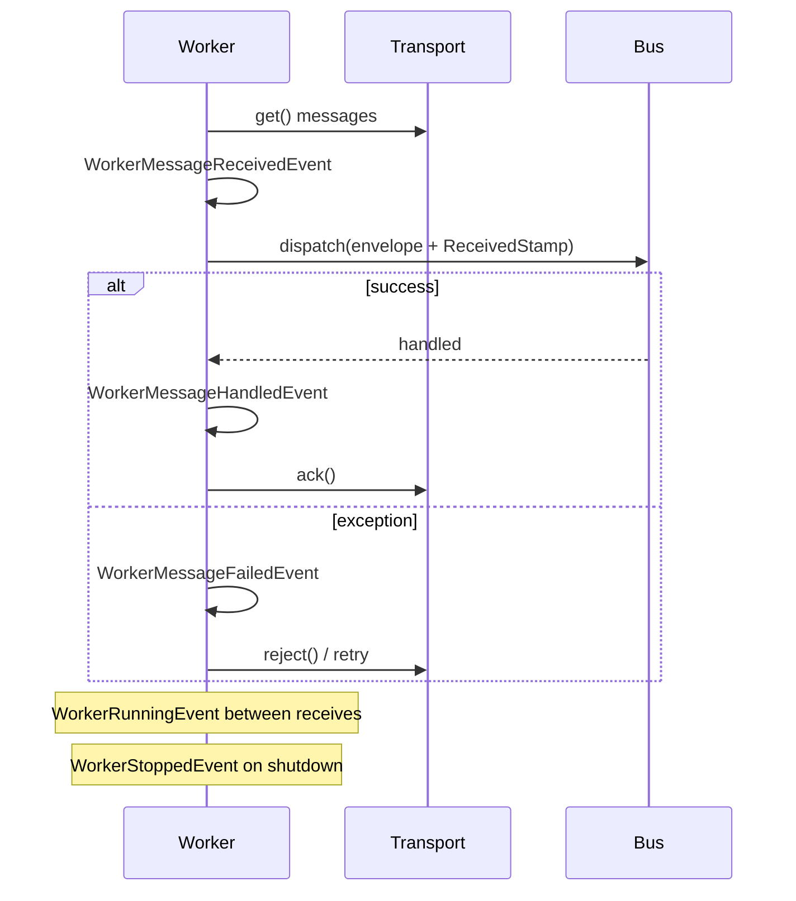
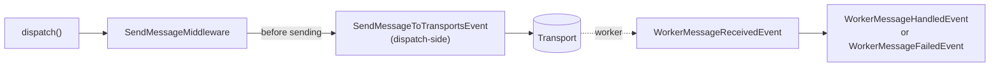

# Events

!!! tip "In a nutshell"
    The worker fires six events around its receive/dispatch/ack loop
    (`WorkerStartedEvent` through `WorkerStoppedEvent`), all in
    `Symfony\Component\Messenger\Event\`. There is also a **dispatch-side**
    event fired *before* any worker is involved: `SendMessageToTransportsEvent`,
    raised by `SendMessageMiddleware` right before handing the envelope to
    its transports — the one to reach for if you need to rewrite an envelope
    before it is actually sent.

!!! example "Real-world analogy"
    Worker events are checkpoints along the courier's round: clocking in
    (`WorkerStartedEvent`), picking up a parcel (`WorkerMessageReceivedEvent`),
    a successful or failed delivery
    (`WorkerMessageHandledEvent`/`WorkerMessageFailedEvent`), each lap of the
    round (`WorkerRunningEvent`), and clocking out
    (`WorkerStoppedEvent`). `SendMessageToTransportsEvent` is different: it
    happens at the **sorting office**, the moment before a letter is even
    put on a truck — no courier involved yet.

!!! abstract "Learning objectives"
    By the end of this chapter you can:

    - [ ] Name the six worker lifecycle events, in order.
    - [ ] Explain what `SendMessageToTransportsEvent` is for and why it fires earlier than any worker event.
    - [ ] Write a listener that reacts to a handler failure.

    **Syllabus:** `Messenger → Events` ·
    **Level:** Expert ·
    **Est. time:** 20 min ·
    **Prerequisites:** [Workers](workers.md), [Architecture → Events](../architecture/index.md)

---

## Theory

Every step of the [worker](workers.md) loop fires an event (namespace
`Symfony\Component\Messenger\Event\`):

| Event | Fires when |
|---|---|
| `WorkerStartedEvent` | The worker begins running |
| `WorkerMessageReceivedEvent` | A message is pulled off a transport, before dispatch |
| `WorkerMessageHandledEvent` | A handler finished successfully |
| `WorkerMessageFailedEvent` | A handler threw |
| `WorkerRunningEvent` | Each iteration of the worker loop |
| `WorkerStoppedEvent` | The worker shuts down |
| `WorkerRateLimitedEvent` | A rate limiter delayed message processing |



!!! question "Predict first"
    You need to add a stamp to every outgoing async message right before it
    reaches its transport — with no worker involved (the message hasn't
    even been sent yet). Which event listens for that, and why isn't a
    `Worker*` event the right choice?

??? note "Reveal"
    `SendMessageToTransportsEvent`. Every `Worker*` event fires on the
    **consuming** side, inside a `messenger:consume` process — far too late
    to affect what gets sent, and irrelevant for messages that never go
    through a worker at all (synchronous ones).

## Deep Dive — how it works internally

### The dispatch-side event

`SendMessageToTransportsEvent` is raised by `SendMessageMiddleware` (see
[Middleware](middleware.md)) right before it hands the envelope to the
configured senders — on the **dispatching** process, before any transport
or worker is involved. A listener can call `setEnvelope()` to rewrite the
envelope (e.g. add a stamp) before it actually reaches the transport.

```php
use Symfony\Component\Messenger\Event\SendMessageToTransportsEvent;

#[AsEventListener]
final class TagOutgoingMessage
{
    public function __invoke(SendMessageToTransportsEvent $event): void
    {
        // fired by SendMessageMiddleware, before the envelope reaches a transport
        $event->getSenders();  // the transport names it is about to be sent to
    }
}
```

### Listening for a worker failure

```php
use Symfony\Component\EventDispatcher\Attribute\AsEventListener;
use Symfony\Component\Messenger\Event\WorkerMessageFailedEvent;

#[AsEventListener]
final class LogFailedMessage
{
    public function __invoke(WorkerMessageFailedEvent $event): void
    {
        // fired by the Worker when handling a received message threw
        $event->getThrowable(); // the handler exception
    }
}
```

All `Worker*` events extend `AbstractWorkerMessageEvent`, exposing
`getEnvelope()`, `getReceiverName()`, and `addStamps(StampInterface ...$stamps)`;
`WorkerMessageFailedEvent` additionally exposes `getThrowable()`,
`willRetry()`, and `setForRetry()`.

!!! note "Source reference"
    `Symfony\Component\Messenger\Event\AbstractWorkerMessageEvent` and
    `SendMessageToTransportsEvent` —
    [symfony/symfony `8.0`](https://github.com/symfony/symfony/blob/8.0/src/Symfony/Component/Messenger/Event/SendMessageToTransportsEvent.php).



### Null behavior

`WorkerMessageFailedEvent::willRetry()` returns a plain `bool` — it never
returns `null`, even before a listener calls `setForRetry()`. A listener
that never calls `setForRetry()` simply leaves the worker's own retry
decision (from [Retries & Failures](retries-failures.md)) unchanged; there
is no "undecided" state to check for.

!!! note "Null in real life"
    Asking "will this be retried?" always gets a yes-or-no answer from the
    event — there is no shrug. If nobody overrides it, the answer is just
    whatever the retry strategy already decided.

## Configuration & code

=== "Dispatch-side listener"

    ```php
    <?php
    declare(strict_types=1);

    namespace App\EventListener;

    use Symfony\Component\EventDispatcher\Attribute\AsEventListener;
    use Symfony\Component\Messenger\Event\SendMessageToTransportsEvent;
    use Symfony\Component\Messenger\Stamp\DelayStamp;

    #[AsEventListener]
    final class DelayLowPriorityMessages
    {
        public function __invoke(SendMessageToTransportsEvent $event): void
        {
            $envelope = $event->getEnvelope()->with(new DelayStamp(5_000));
            $event->setEnvelope($envelope);
        }
    }
    ```

=== "Worker-side listener"

    ```php
    <?php
    declare(strict_types=1);

    namespace App\EventListener;

    use Symfony\Component\EventDispatcher\Attribute\AsEventListener;
    use Symfony\Component\Messenger\Event\WorkerMessageFailedEvent;

    #[AsEventListener]
    final class AlertOnFailure
    {
        public function __invoke(WorkerMessageFailedEvent $event): void
        {
            if (!$event->willRetry()) {
                // this attempt is the last one — alert now, not after every retry
            }
        }
    }
    ```

## Best practices & anti-patterns

| ✅ Do | ❌ Avoid |
|---|---|
| Use `SendMessageToTransportsEvent` to rewrite an envelope pre-send | Trying to modify a message from a `Worker*` event before it's sent |
| Keep listeners fast — they run in the hot dispatch/consume path | Slow I/O inside a `WorkerMessageReceivedEvent` listener |
| Check `willRetry()` before alerting on every failed attempt | Paging on-call for every retryable failure |
| Depend on `AbstractWorkerMessageEvent`'s shared API where possible | Duplicating `getEnvelope()` logic per event type |

## When (not) to use it / alternatives

Reach for these events for cross-cutting observability (logging, metrics,
alerting) or to mutate an envelope generically before it ships. For logic
specific to one message type, a custom [middleware](middleware.md) or the
handler itself is usually a better fit than branching inside a shared event
listener.

!!! danger "Certification traps"
    - `SendMessageToTransportsEvent` fires on the **dispatching** side,
      before any transport or worker — not a `Worker*` event.
    - All `Worker*` events fire inside a `messenger:consume` **worker**
      process — they never fire for synchronously-handled messages.
    - `WorkerMessageFailedEvent::willRetry()`/`setForRetry()` let a listener
      **influence** the retry decision, not just observe it.
    - The six worker events are distinct: mixing up `Handled` and `Failed`
      (or `Started` and `Running`) is a common exam distractor.

!!! warning "Common mistakes"
    - Listening for a `Worker*` event to modify a message before it's sent —
      too late; use `SendMessageToTransportsEvent` instead.
    - Assuming worker events fire for `sync://`-routed messages — they only
      fire inside an actual worker process.

## Exercises

1. **(Advanced)** Write a listener that tags every outgoing message with a
   stamp before it reaches its transport, without touching call sites.
2. **(Expert)** Explain why `WorkerRunningEvent` fires even when the worker
   has no message to process at that moment.

??? success "Solutions"

    **1.** See the "Dispatch-side listener" tab: listen for
    `SendMessageToTransportsEvent`, call `$event->getEnvelope()->with(...)`,
    then `$event->setEnvelope($envelope)`.

    **2.** `WorkerRunningEvent` marks each iteration of the worker's loop,
    not each message — it fires whether or not a message was available,
    which is exactly what makes it useful for periodic housekeeping
    (health checks, metrics) independent of message volume.

## Certification questions

??? question "Q1. Which event fires on the dispatching side, before any transport is involved?"
    - [x] A. `SendMessageToTransportsEvent` ✅
    - [ ] B. `WorkerMessageReceivedEvent`
    - [ ] C. `WorkerRunningEvent`
    - [ ] D. `WorkerStartedEvent`

    **Why:** it is raised by `SendMessageMiddleware` on dispatch, before the
    envelope reaches any transport or worker.
    **Ref:** [Symfony source — SendMessageToTransportsEvent](https://github.com/symfony/symfony/blob/8.0/src/Symfony/Component/Messenger/Event/SendMessageToTransportsEvent.php).

??? question "Q2. During `messenger:consume`, which event is dispatched when a handler throws?"
    - [x] A. `WorkerMessageFailedEvent` ✅
    - [ ] B. `WorkerMessageHandledEvent`
    - [ ] C. `WorkerRunningEvent`
    - [ ] D. `SendMessageToTransportsEvent`

    **Why:** a thrown exception in a handler produces
    `WorkerMessageFailedEvent`, exposing `getThrowable()`.
    **Ref:** [Symfony source — Worker events](https://github.com/symfony/symfony/tree/8.0/src/Symfony/Component/Messenger/Event).

??? question "Q3. You need to tag every outgoing async message right before it reaches its transport. Which event, and why not a `Worker*` event?"
    - [x] A. `SendMessageToTransportsEvent` — it fires on dispatch, before any transport; `Worker*` events fire too late, on the consuming side ✅
    - [ ] B. `WorkerMessageReceivedEvent` — it fires earliest overall
    - [ ] C. `WorkerRunningEvent` — it covers every message
    - [ ] D. `WorkerMessageHandledEvent` — tagging after handling still works

    **Why:** `Worker*` events only exist inside a consuming worker process,
    after the message has already been sent — too late to affect it, and
    irrelevant for synchronous messages that never reach a worker at all.
    **Ref:** [Symfony source — SendMessageToTransportsEvent](https://github.com/symfony/symfony/blob/8.0/src/Symfony/Component/Messenger/Event/SendMessageToTransportsEvent.php).

## Key takeaways

- Six worker events (`Started`/`MessageReceived`/`MessageHandled`/
  `MessageFailed`/`Running`/`Stopped`), plus `WorkerRateLimitedEvent`, fire
  inside a `messenger:consume` process.
- `SendMessageToTransportsEvent` is the odd one out: dispatch-side, before
  any worker, and rewritable via `setEnvelope()`.
- `WorkerMessageFailedEvent` exposes `getThrowable()`/`willRetry()`/`setForRetry()`.
- All `Worker*` events share `getEnvelope()`/`getReceiverName()`/`addStamps()`
  via `AbstractWorkerMessageEvent`.

## Last-minute revision

!!! tip "Cheat sheet"
    - Worker events: `Started → MessageReceived → (MessageHandled | MessageFailed)`,
      `Running` per loop iteration, `Stopped` on shutdown, `RateLimited` when throttled.
    - `SendMessageToTransportsEvent` — dispatch-side, pre-send, `setEnvelope()` to rewrite.
    - `WorkerMessageFailedEvent`: `getThrowable()`, `willRetry()`, `setForRetry()`.
    - Shared base: `AbstractWorkerMessageEvent` (`getEnvelope`, `getReceiverName`, `addStamps`).

## Connections

- **Depends on:** [Workers](workers.md) — the loop these events fire around;
  [Architecture → Events](../architecture/index.md) — the same
  `EventDispatcher` mechanics apply here.
- **Reused in:** [Retries & Failures](retries-failures.md) —
  `WorkerMessageFailedEvent::willRetry()` reflects that chapter's retry decision.
- **Confused with:** [Middleware](middleware.md) — middleware runs
  synchronously inline in the pipeline; events are a separate, optional
  observation/extension point around it.

## Official References

- [Official docs — Messenger events](https://symfony.com/doc/8.0/messenger.html#messenger-events)
- [Symfony source — Messenger events](https://github.com/symfony/symfony/tree/8.0/src/Symfony/Component/Messenger/Event)
- [Symfony source — SendMessageToTransportsEvent](https://github.com/symfony/symfony/blob/8.0/src/Symfony/Component/Messenger/Event/SendMessageToTransportsEvent.php)

## Video references

!!! tip "Watch & learn"
    These are official, continuously-updated video channels — search them for
    "Symfony Messenger events" to reinforce this chapter. We link stable channels rather than
    individual videos so the references never rot.

    - [SymfonyCasts screencasts](https://symfonycasts.com/tracks/symfony) — scripted, code-along tutorials.
    - [Symfony official YouTube](https://www.youtube.com/@SymfonyOfficial) — SymfonyCon conference talks & keynotes.
    - [Official docs for this topic](https://symfony.com/doc/8.0/messenger.html#messenger-events) — some Symfony doc pages embed a screencast.

## Confidence check

I'm ready when I can:

- [ ] name the six worker events in order and what each marks
- [ ] use `SendMessageToTransportsEvent` to rewrite an envelope before it sends
- [ ] debug a listener that tried to modify a message too late
- [ ] spot the trap: `Worker*` events never fire for synchronous messages
- [ ] explain how `WorkerMessageFailedEvent` can influence the retry decision

---

<small>Related: [Workers](workers.md) · [Retries & Failures](retries-failures.md) · [Architecture → Events](../architecture/index.md)</small>
