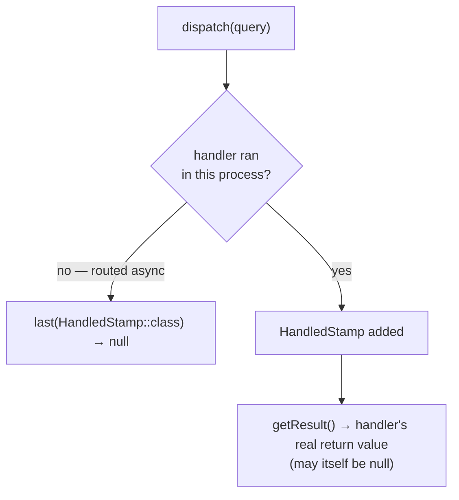

# Messages & Handlers

!!! tip "In a nutshell"
    Un **command bus** a un seul handler et aucune valeur de retour ; un
    **query bus** a exactement un handler et son résultat se lit depuis un
    `HandledStamp`, jamais depuis `dispatch()` directement ; un **event bus**
    peut avoir zéro à plusieurs handlers. `DispatchAfterCurrentBusStamp`
    diffère un message envoyé *à l'intérieur* d'un handler jusqu'à ce que le
    message courant se termine avec succès.

!!! example "Real-world analogy"
    Pensez à trois bacs de bureau différents. Un bac **commande** contient
    une tâche à exécuter par exactement un employé — aucune réponse
    attendue. Un bac **requête** contient une demande dont la réponse de
    l'employé est agrafée au dossier pour que vous la lisiez plus tard (le
    `HandledStamp`). Un bac **événement** est un panneau d'affichage public —
    zéro, un, ou plusieurs collègues peuvent y jeter un œil et agir, et
    personne n'y est obligé.

!!! abstract "Learning objectives"
    À la fin de ce chapitre, vous saurez :

    - [ ] Distinguer les bus commande, requête et événement et leur contrat sur le nombre de handlers.
    - [ ] Lire un résultat de requête en toute sécurité depuis une `Envelope` envoyée.
    - [ ] Utiliser `DispatchAfterCurrentBusStamp` pour différer un message jusqu'après un commit.

    **Syllabus:** `Messenger → Messages and handlers` ·
    **Level:** Expert ·
    **Est. time:** 25 min ·
    **Prerequisites:** [Messenger Component](component.fr.md)

    **Examen Symfony 8 :** OUI

---

## Pour les nuls

### L'idée en une phrase
Il existe trois "styles" de bus par convention : commande (un seul handler, pas de réponse), requête (un seul handler, réponse lue à part), événement (zéro à plusieurs handlers).

### Imagine dans la vraie vie
Trois bacs de bureau différents. Un bac **commande** contient une tâche pour exactement un employé — aucune réponse attendue. Un bac **requête** contient une demande dont la réponse de l'employé est agrafée au dossier pour que tu la lises plus tard. Un bac **événement** est un panneau d'affichage public — zéro, un, ou plusieurs collègues peuvent y jeter un œil et agir.

### Dans Symfony
Un `GetInvoiceTotal` (requête) sur un query bus renvoie son résultat via `$envelope->last(HandledStamp::class)?->getResult()` — jamais directement depuis `dispatch()`, même si un seul handler existe.

### Exemple simple
```php
$envelope = $queryBus->dispatch(new GetInvoiceTotal(orderId: 7));
$total = $envelope->last(HandledStamp::class)?->getResult();
```

### Comment le mémoriser 🧠
Ce découpage commande/requête/événement est une **convention de nommage**, pas une règle imposée par le composant lui-même — Messenger ne connaît pas ces trois catégories en interne.

## Theory

Messenger fournit **un seul** bus par défaut (`messenger.bus.default`), mais
vous pouvez en définir plusieurs — chacun un `MessageBus` indépendant avec sa
**propre liste de middleware**. La convention (non imposée par le composant)
nomme trois types selon leur contrat sur le nombre de handlers :

| Type de bus | Handlers | Valeur de retour |
|---|---|---|
| **Command bus** | Exactement un, souvent async | Aucune attendue |
| **Query bus** | Exactement un | Lue via `HandledStamp` |
| **Event bus** | Zéro à plusieurs | Fire-and-forget |

```yaml
# config/packages/messenger.yaml
framework:
    messenger:
        default_bus: command.bus
        buses:
            command.bus:
                middleware: [doctrine_transaction]  # sa propre liste de middleware
            query.bus: ~               # un handler ; résultat lu via HandledStamp
            event.bus:
                default_middleware:
                    allow_no_handlers: true          # fire-and-forget
```

!!! question "Predict first"
    Vous envoyez un message de requête sur un query bus et appelez
    immédiatement `$envelope->last(HandledStamp::class)->getResult()`. Si le
    handler a réellement renvoyé `null`, que donne `getResult()` — versus si
    le message n'a jamais du tout été traité ?

??? note "Reveal"
    Les deux peuvent ressembler à `null`, mais pour des raisons différentes :
    un handler qui a renvoyé `null` produit quand même un `HandledStamp`,
    donc `getResult()` vaut `null` **par conception**. Si le message a été
    routé vers un transport **asynchrone** à la place, `last(HandledStamp::class)`
    lui-même vaut `null` (aucun stamp n'existe encore) — appeler
    `?->getResult()` dessus donne aussi `null`, mais parce que rien n'a
    tourné ici du tout. Ne confondez pas les deux.

## Deep Dive — how it works internally

### Reading a query result

```php
use Symfony\Component\Messenger\MessageBusInterface;
use Symfony\Component\Messenger\Stamp\HandledStamp;

/** @var MessageBusInterface $queryBus */
$envelope = $queryBus->dispatch(new GetInvoiceTotal(orderId: 7));
$total = $envelope->last(HandledStamp::class)?->getResult();
```

`last(HandledStamp::class)` renvoie le `HandledStamp` **le plus récent** (il y
en a un par handler qui a tourné) ou `null` si aucun n'a tourné dans ce
process. `getResult()` sur ce stamp est la vraie valeur de retour du handler,
qui peut elle-même légitimement être `null`.



### `DispatchAfterCurrentBusStamp`

Ajouter `DispatchAfterCurrentBusStamp` à un message envoyé *à l'intérieur*
d'un handler diffère sa livraison jusqu'à ce que le message **courant**
termine son traitement **avec succès**. Cela évite d'envoyer un événement
"email de confirmation" avant que la transaction de base de données
englobante ne soit commitée.

```php
use Symfony\Component\Messenger\Envelope;
use Symfony\Component\Messenger\Stamp\DispatchAfterCurrentBusStamp;

// À l'intérieur d'un handler : diffère jusqu'à ce que le message courant se termine avec succès
$this->eventBus->dispatch(
    (new Envelope(new OrderPlacedEvent($orderId)))
        ->with(new DispatchAfterCurrentBusStamp())
);
```

!!! note "Source reference"
    `Symfony\Component\Messenger\Stamp\DispatchAfterCurrentBusStamp` et
    `Symfony\Component\Messenger\Middleware\DispatchAfterCurrentBusMiddleware` —
    [symfony/symfony `8.0`](https://github.com/symfony/symfony/blob/8.0/src/Symfony/Component/Messenger/Stamp/DispatchAfterCurrentBusStamp.php).

### Handler discovery

`#[AsMessageHandler]` autoconfigure un service pour que
`HandlersLocatorInterface` le trouve pour son type de paramètre. Un handler
manquant lève `NoHandlerForMessageException` — pas un no-op silencieux —
parce que Messenger traite "personne ne peut gérer ceci" comme une erreur de
configuration sur un command/query bus (un event bus s'en exclut
explicitement via `allow_no_handlers: true`).

### Null behavior

Trois situations "pas de valeur" distinctes existent ici, et l'examen teste
la capacité à les distinguer : (1) `dispatch()` lui-même ne renvoie jamais
`null` — toujours une `Envelope` ; (2) `last(HandledStamp::class)` vaut
`null` quand **aucun handler n'a tourné dans ce process** (routé en async, ou
pas encore traité) ; (3) `getResult()` sur un stamp existant vaut `null`
quand **le handler a réellement renvoyé rien**.

```php
$envelope = $bus->dispatch(new GetInvoiceTotal(orderId: 7)); // jamais null
$stamp = $envelope->last(HandledStamp::class);                // null : aucun handler n'a tourné ici
$total = $stamp?->getResult();                                // null peut AUSSI signifier "a renvoyé null"
```

!!! note "Null in real life"
    Un reçu de livraison avec la ligne "réponse" laissée vide (un handler qui
    n'a rien renvoyé) n'est pas la même chose qu'un reçu pour une lettre qui
    n'a même pas encore été livrée (aucun handler n'a tourné ici du tout) —
    les deux ont l'air vides, mais un seul signifie "redemande plus tard".

## Configuration & code

=== "Command / query buses"

    ```yaml
    # config/packages/messenger.yaml
    framework:
        messenger:
            default_bus: command.bus
            buses:
                command.bus: ~
                query.bus: ~
    ```

=== "Reading a query result"

    ```php
    <?php
    declare(strict_types=1);

    use Symfony\Component\Messenger\MessageBusInterface;
    use Symfony\Component\Messenger\Stamp\HandledStamp;

    final class InvoiceController
    {
        public function __construct(private MessageBusInterface $queryBus) {}

        public function total(int $orderId): int
        {
            $envelope = $this->queryBus->dispatch(new GetInvoiceTotal($orderId));

            return $envelope->last(HandledStamp::class)?->getResult() ?? 0;
        }
    }
    ```

## Best practices & anti-patterns

| ✅ Do | ❌ Avoid |
|---|---|
| Donner à chaque type de bus sa propre liste de middleware | Un seul bus avec une sémantique commande/requête/événement mélangée |
| Lire les résultats de requête via `HandledStamp` | S'attendre à ce que `dispatch()` renvoie la valeur |
| `DispatchAfterCurrentBusStamp` pour des événements post-commit | Envoyer des événements en plein milieu d'une transaction |
| `allow_no_handlers: true` uniquement sur les event bus | Faire taire `NoHandlerForMessageException` globalement |

## When (not) to use it / alternatives

N'utilisez un query bus que quand le découplage vaut l'indirection — pour une
valeur que vous pourriez tout aussi facilement obtenir en appelant une
méthode de service, un appel direct est plus simple. Le découpage
commande/requête/événement se justifie une fois que différents
comportements de bus (transactions, retries, middleware) diffèrent
réellement selon le type.

!!! danger "Certification traps"
    - `dispatch()` renvoie une **`Envelope`**, jamais la valeur du handler
      directement, quel que soit le type de bus.
    - Un résultat de requête se lit via
      `$envelope->last(HandledStamp::class)->getResult()`, pas renvoyé par `dispatch()`.
    - Un handler manquant lève `NoHandlerForMessageException` par défaut ;
      seul un event bus avec `allow_no_handlers: true` tolère zéro handler.
    - `last(HandledStamp::class)` valant `null` signifie "aucun handler n'a
      tourné ici" — pas "le handler a renvoyé null".

!!! warning "Common mistakes"
    - Traiter le découpage commande/requête/événement comme imposé par le
      composant — c'est une convention de nommage, pas une règle stricte.
    - Oublier le `?->` null-safe en lisant `HandledStamp` sur un message qui
      pourrait être routé en async.

## Exercises

1. **(Expert)** Étant donné un message de requête, écrivez le code qui l'envoie
   et extrait la valeur de retour du handler.
2. **(Expert)** Expliquez pourquoi un email "commande passée" envoyé à
   l'intérieur d'un handler de commande devrait porter
   `DispatchAfterCurrentBusStamp`.

??? success "Solutions"

    **1.**
    ```php
    $envelope = $queryBus->dispatch(new GetInvoiceTotal(orderId: 7));
    $total = $envelope->last(HandledStamp::class)?->getResult();
    ```

    **2.** L'email ne devrait être envoyé que si la commande persiste
    réellement. Avec le stamp, le message est envoyé **après** que le
    handler courant se termine avec succès, donc un rollback empêche un
    email de confirmation trompeur de jamais partir.

## Certification questions

*Question d'entraînement inspirée du syllabus — jamais une question officielle de l'examen.*

??? question "Q1. Quelles affirmations sur les bus Messenger sont correctes ? (choisissez 2)"
    - [x] A. Chaque bus est un `MessageBus` indépendant avec sa propre liste de middleware ✅
    - [x] B. Le découpage commande/requête/événement est une convention, pas imposé par le composant ✅
    - [ ] C. Tous les bus partagent une liste de middleware globale
    - [ ] D. Un event bus exige au moins un handler par défaut

    **Why:** les bus sont configurés indépendamment (leur propre middleware),
    et Messenger n'impose pas de sémantique commande/requête/événement en dur.
    **Ref:** [Messenger — Multiple buses](https://symfony.com/doc/8.0/messenger.html#messenger-multiple-buses).

??? question "Q2. Comment récupérer la valeur de retour d'un handler synchrone après `dispatch()` ?"
    - [x] A. `$envelope->last(HandledStamp::class)?->getResult()` ✅
    - [ ] B. La valeur de retour directe de `dispatch()`
    - [ ] C. `$envelope->getResult()`
    - [ ] D. Un second appel `handle()`

    **Why:** le résultat est enveloppé dans un `HandledStamp` à l'intérieur
    de l'`Envelope` renvoyée, pas renvoyé directement.
    **Ref:** [Messenger — Handling messages synchronously](https://symfony.com/doc/8.0/messenger.html#getting-results-from-the-handled-message).

??? question "Q3. Un message envoyé lève `NoHandlerForMessageException`. Quelle est la cause la plus probable ?"
    - [x] A. Le service handler manque `#[AsMessageHandler]` (ou son `use`) ✅
    - [ ] B. La classe de message n'est pas `readonly`
    - [ ] C. Le DSN du transport est mal configuré
    - [ ] D. Le bus a trop de middlewares

    **Why:** sans l'attribut (ou un tagging explicite), l'autoconfiguration
    n'enregistre jamais le service comme handler pour ce type de message.
    **Ref:** [Messenger — Creating a handler](https://symfony.com/doc/8.0/messenger.html#creating-a-message-handler).

## Key takeaways

- Command bus : 1 handler, pas de valeur de retour. Query bus : 1 handler,
  résultat via `HandledStamp`. Event bus : 0 à N handlers.
- `dispatch()` ne renvoie jamais la valeur du handler directement, quel que
  soit le type de bus.
- `DispatchAfterCurrentBusStamp` diffère un dispatch imbriqué jusqu'à ce que
  le message courant réussisse — la correction standard pour "événement
  émis avant le commit".
- Un handler manquant est une erreur dure (`NoHandlerForMessageException`)
  sauf si le bus autorise explicitement zéro handler.

## Last-minute revision

!!! tip "Cheat sheet"
    - Commande : 1 handler, pas de résultat. Requête : 1 handler, résultat via
      `->last(HandledStamp::class)?->getResult()`. Événement : 0 à N handlers.
    - `DispatchAfterCurrentBusStamp` — diffère jusqu'à ce que le message courant réussisse.
    - Aucun handler → `NoHandlerForMessageException` sauf `allow_no_handlers: true`.
    - Les bus ont des listes de middleware **indépendantes**.

## Connections

- **Depends on:** [Messenger Component](component.fr.md) — le vocabulaire message/handler/bus.
- **Reused in:** [Middleware](middleware.fr.md) — le pipeline que ces bus font
  traverser aux messages ; [Events](events.fr.md) — `WorkerMessageHandledEvent`
  se déclenche après qu'un handler réussit.
- **Confused with:** [Middleware](middleware.fr.md) — les bus configurent
  *quel* middleware tourne ; le middleware est *comment* dispatch traite
  réellement un message.

## Official References

- [Official docs — Messenger: multiple buses](https://symfony.com/doc/8.0/messenger.html#messenger-multiple-buses)
- [Official docs — Getting results from a handled message](https://symfony.com/doc/8.0/messenger.html#getting-results-from-the-handled-message)
- [Symfony source — DispatchAfterCurrentBusStamp](https://github.com/symfony/symfony/blob/8.0/src/Symfony/Component/Messenger/Stamp/DispatchAfterCurrentBusStamp.php)

## Video references

!!! tip "Watch & learn"
    Ce sont des chaînes vidéo officielles, mises à jour en continu — cherchez-y
    "Symfony Messenger" pour renforcer ce chapitre. Nous lions des chaînes
    stables plutôt que des vidéos individuelles pour que les références ne
    deviennent jamais obsolètes.

    - [SymfonyCasts screencasts](https://symfonycasts.com/tracks/symfony) — tutoriels scénarisés, en code.
    - [Symfony official YouTube](https://www.youtube.com/@SymfonyOfficial) — conférences et keynotes SymfonyCon.
    - [Official docs for this topic](https://symfony.com/doc/8.0/messenger.html#messenger-multiple-buses) — certaines pages de doc Symfony embarquent un screencast.

## Confidence check

Je suis prêt quand je peux :

- [ ] expliquer **pourquoi** les bus commande/requête/événement ont besoin de middlewares différents
- [ ] lire un résultat de requête en toute sécurité, en distinguant "pas traité ici" de "a renvoyé null"
- [ ] déboguer `NoHandlerForMessageException`
- [ ] repérer le piège : `dispatch()` ne renvoie jamais la valeur du handler, sur aucun bus
- [ ] utiliser `DispatchAfterCurrentBusStamp` pour corriger un dispatch d'événement avant commit

---

<small>Related: [Messenger Component](component.fr.md) · [Middleware](middleware.fr.md) · [Events](events.fr.md)</small>
