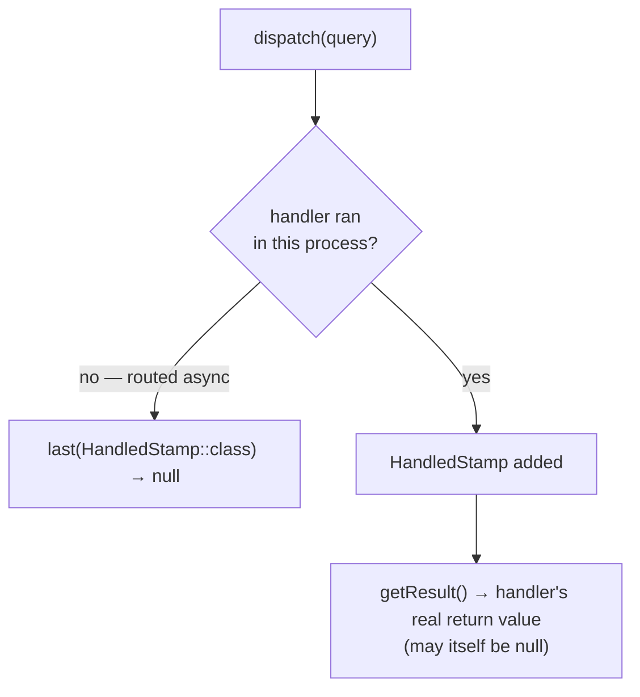

# Messages & Handlers

!!! tip "In a nutshell"
    A **command bus** has one handler and no return value; a **query bus**
    has exactly one handler and its result is read from a `HandledStamp`,
    never from `dispatch()` directly; an **event bus** may have zero-to-many
    handlers. `DispatchAfterCurrentBusStamp` defers a message dispatched
    *inside* a handler until the current message finishes successfully.

!!! example "Real-world analogy"
    Think of three different office trays. A **command** tray holds a task
    for exactly one clerk to execute — no reply expected. A **query** tray
    holds a request where the clerk's answer gets stapled to the folder for
    you to read later (the `HandledStamp`). An **event** tray is a public
    notice board — zero, one, or many colleagues might glance at it and act,
    and nobody is required to.

!!! abstract "Learning objectives"
    By the end of this chapter you can:

    - [ ] Distinguish command, query and event buses and their handler-count contract.
    - [ ] Read a query result safely from a dispatched `Envelope`.
    - [ ] Use `DispatchAfterCurrentBusStamp` to defer a message until after a commit.

    **Syllabus:** `Messenger → Messages and handlers` ·
    **Level:** Expert ·
    **Est. time:** 25 min ·
    **Prerequisites:** [Messenger Component](component.md)

---

## Theory

Messenger ships **one** default bus (`messenger.bus.default`), but you can
define several — each an independent `MessageBus` with its **own
middleware list**. Convention (not enforced by the component) names three
kinds by handler-count contract:

| Bus kind | Handlers | Return value |
|---|---|---|
| **Command bus** | Exactly one, often async | None expected |
| **Query bus** | Exactly one | Read via `HandledStamp` |
| **Event bus** | Zero to many | Fire-and-forget |

```yaml
# config/packages/messenger.yaml
framework:
    messenger:
        default_bus: command.bus
        buses:
            command.bus:
                middleware: [doctrine_transaction]  # own middleware list
            query.bus: ~               # one handler; result read via HandledStamp
            event.bus:
                default_middleware:
                    allow_no_handlers: true          # fire-and-forget
```

!!! question "Predict first"
    You dispatch a query message on a query bus and immediately call
    `$envelope->last(HandledStamp::class)->getResult()`. If the handler
    genuinely returned `null`, what does `getResult()` give you — versus if
    the message was never handled at all?

??? note "Reveal"
    Both can look like `null`, but for different reasons: a handler that
    returned `null` still produces a `HandledStamp`, so `getResult()` is
    `null` **by design**. If the message was routed to an **async**
    transport instead, `last(HandledStamp::class)` itself is `null` (no
    stamp exists yet) — calling `?->getResult()` on that also yields `null`,
    but because nothing ran here at all. Don't conflate the two.

## Deep Dive — how it works internally

### Reading a query result

```php
use Symfony\Component\Messenger\MessageBusInterface;
use Symfony\Component\Messenger\Stamp\HandledStamp;

/** @var MessageBusInterface $queryBus */
$envelope = $queryBus->dispatch(new GetInvoiceTotal(orderId: 7));
$total = $envelope->last(HandledStamp::class)?->getResult();
```

`last(HandledStamp::class)` returns the **most recent** `HandledStamp`
(there is one per handler that ran) or `null` if none ran in this process.
`getResult()` on that stamp is the handler's actual return value, which may
itself legitimately be `null`.



### `DispatchAfterCurrentBusStamp`

Adding `DispatchAfterCurrentBusStamp` to a message dispatched *inside* a
handler defers its delivery until the **current** message finishes handling
**successfully**. This prevents dispatching an "email confirmation" event
before the surrounding database transaction commits.

```php
use Symfony\Component\Messenger\Envelope;
use Symfony\Component\Messenger\Stamp\DispatchAfterCurrentBusStamp;

// Inside a handler: defer until the current message finishes successfully
$this->eventBus->dispatch(
    (new Envelope(new OrderPlacedEvent($orderId)))
        ->with(new DispatchAfterCurrentBusStamp())
);
```

!!! note "Source reference"
    `Symfony\Component\Messenger\Stamp\DispatchAfterCurrentBusStamp` and
    `Symfony\Component\Messenger\Middleware\DispatchAfterCurrentBusMiddleware` —
    [symfony/symfony `8.0`](https://github.com/symfony/symfony/blob/8.0/src/Symfony/Component/Messenger/Stamp/DispatchAfterCurrentBusStamp.php).

### Handler discovery

`#[AsMessageHandler]` autoconfigures a service so `HandlersLocatorInterface`
finds it for its parameter type. A missing handler throws
`NoHandlerForMessageException` — not a silent no-op — because Messenger
treats "nobody can handle this" as a configuration error on a command/query
bus (an event bus explicitly opts out via `allow_no_handlers: true`).

### Null behavior

Three distinct "no value" situations exist here, and the exam tests telling
them apart: (1) `dispatch()` itself never returns `null` — always an
`Envelope`; (2) `last(HandledStamp::class)` is `null` when **no handler ran
in this process** (routed async, or not handled yet); (3) `getResult()` on
an existing stamp is `null` when **the handler genuinely returned nothing**.

```php
$envelope = $bus->dispatch(new GetInvoiceTotal(orderId: 7)); // never null
$stamp = $envelope->last(HandledStamp::class);                // null: no handler ran here
$total = $stamp?->getResult();                                // null may ALSO mean "returned null"
```

!!! note "Null in real life"
    A delivery receipt with the "reply" line left blank (a handler that
    returned nothing) is not the same as a receipt for a letter that hasn't
    even been delivered yet (no handler ran here at all) — both look blank,
    but only one means "ask again later."

## Configuration & code

=== "Command / query buses"

    ```yaml
    # config/packages/messenger.yaml
    framework:
        messenger:
            default_bus: command.bus
            buses:
                command.bus: ~
                query.bus: ~
    ```

=== "Reading a query result"

    ```php
    <?php
    declare(strict_types=1);

    use Symfony\Component\Messenger\MessageBusInterface;
    use Symfony\Component\Messenger\Stamp\HandledStamp;

    final class InvoiceController
    {
        public function __construct(private MessageBusInterface $queryBus) {}

        public function total(int $orderId): int
        {
            $envelope = $this->queryBus->dispatch(new GetInvoiceTotal($orderId));

            return $envelope->last(HandledStamp::class)?->getResult() ?? 0;
        }
    }
    ```

## Best practices & anti-patterns

| ✅ Do | ❌ Avoid |
|---|---|
| Give each bus kind its own middleware list | One bus with mixed command/query/event semantics |
| Read query results via `HandledStamp` | Expecting `dispatch()` to return the value |
| `DispatchAfterCurrentBusStamp` for post-commit events | Dispatching events mid-transaction |
| `allow_no_handlers: true` only on event buses | Silencing `NoHandlerForMessageException` globally |

## When (not) to use it / alternatives

Use a query bus only when the decoupling is worth the indirection — for a
value you could just as easily get from calling a service method, a direct
call is simpler. The command/query/event split earns its keep once
different bus behaviors (transactions, retries, middleware) genuinely
differ per kind.

!!! danger "Certification traps"
    - `dispatch()` returns an **`Envelope`**, never the handler's value
      directly, on any bus kind.
    - A query result is read via
      `$envelope->last(HandledStamp::class)->getResult()`, not returned by
      `dispatch()`.
    - A missing handler throws `NoHandlerForMessageException` by default;
      only an event bus with `allow_no_handlers: true` tolerates zero handlers.
    - `last(HandledStamp::class)` being `null` means "no handler ran here" —
      not "the handler returned null."

!!! warning "Common mistakes"
    - Treating the command/query/event split as enforced by the component —
      it's a naming convention, not a hard rule.
    - Forgetting the nullsafe `?->` when reading `HandledStamp` on a message
      that might be routed async.

## Exercises

1. **(Expert)** Given a query message, write the code that dispatches it and
   extracts the handler's return value.
2. **(Expert)** Explain why an "order placed" email dispatched inside an
   order handler should carry `DispatchAfterCurrentBusStamp`.

??? success "Solutions"

    **1.**
    ```php
    $envelope = $queryBus->dispatch(new GetInvoiceTotal(orderId: 7));
    $total = $envelope->last(HandledStamp::class)?->getResult();
    ```

    **2.** The email should only be sent if the order actually persists.
    With the stamp, the message is dispatched **after** the current handler
    finishes successfully, so a rollback prevents a misleading confirmation
    email from ever going out.

## Certification questions

??? question "Q1. Which statements about Messenger buses are correct? (choose 2)"
    - [x] A. Each bus is an independent `MessageBus` with its own middleware list ✅
    - [x] B. The command/query/event split is a convention, not enforced by the component ✅
    - [ ] C. All buses share one global middleware list
    - [ ] D. An event bus requires at least one handler by default

    **Why:** buses are configured independently (own middleware), and
    Messenger does not hard-code command/query/event semantics — you name
    and configure buses however you like.
    **Ref:** [Messenger — Multiple buses](https://symfony.com/doc/current/messenger.html#messenger-multiple-buses).

??? question "Q2. How do you retrieve a synchronous handler's return value after `dispatch()`?"
    - [x] A. `$envelope->last(HandledStamp::class)?->getResult()` ✅
    - [ ] B. The direct return value of `dispatch()`
    - [ ] C. `$envelope->getResult()`
    - [ ] D. A second `handle()` call

    **Why:** the result is wrapped in a `HandledStamp` inside the returned
    `Envelope`, not returned directly.
    **Ref:** [Messenger — Handling messages synchronously](https://symfony.com/doc/current/messenger.html#getting-results-from-the-handled-message).

??? question "Q3. A dispatched message throws `NoHandlerForMessageException`. What is the most likely cause?"
    - [x] A. The handler service is missing `#[AsMessageHandler]` (or its `use` import) ✅
    - [ ] B. The message class is not `readonly`
    - [ ] C. The transport DSN is misconfigured
    - [ ] D. The bus has too many middlewares

    **Why:** without the attribute (or explicit tagging), autoconfiguration
    never registers the service as a handler for that message type.
    **Ref:** [Messenger — Creating a handler](https://symfony.com/doc/current/messenger.html#creating-a-message-handler).

## Key takeaways

- Command bus: 1 handler, no return value. Query bus: 1 handler, result via
  `HandledStamp`. Event bus: 0–N handlers.
- `dispatch()` never returns the handler's value directly, on any bus kind.
- `DispatchAfterCurrentBusStamp` defers a nested dispatch until the current
  message succeeds — the standard fix for "event fired before commit."
- A missing handler is a hard error (`NoHandlerForMessageException`) unless
  the bus explicitly allows zero handlers.

## Last-minute revision

!!! tip "Cheat sheet"
    - Command: 1 handler, no result. Query: 1 handler, result via
      `->last(HandledStamp::class)?->getResult()`. Event: 0–N handlers.
    - `DispatchAfterCurrentBusStamp` — defer until current message succeeds.
    - No handler → `NoHandlerForMessageException` unless `allow_no_handlers: true`.
    - Buses have **independent** middleware lists.

## Connections

- **Depends on:** [Messenger Component](component.md) — the message/handler/bus vocabulary.
- **Reused in:** [Middleware](middleware.md) — the pipeline these buses run
  messages through; [Events](events.md) — `WorkerMessageHandledEvent` fires
  after a handler succeeds.
- **Confused with:** [Middleware](middleware.md) — buses configure *which*
  middleware runs; middleware is *how* dispatch actually processes a message.

## Official References

- [Official docs — Messenger: multiple buses](https://symfony.com/doc/current/messenger.html#messenger-multiple-buses)
- [Official docs — Getting results from a handled message](https://symfony.com/doc/current/messenger.html#getting-results-from-the-handled-message)
- [Symfony source — DispatchAfterCurrentBusStamp](https://github.com/symfony/symfony/blob/8.0/src/Symfony/Component/Messenger/Stamp/DispatchAfterCurrentBusStamp.php)

## Video references

!!! tip "Watch & learn"
    These are official, continuously-updated video channels — search them for
    "Symfony Messenger" to reinforce this chapter. We link stable channels rather than
    individual videos so the references never rot.

    - [SymfonyCasts screencasts](https://symfonycasts.com/tracks/symfony) — scripted, code-along tutorials.
    - [Symfony official YouTube](https://www.youtube.com/@SymfonyOfficial) — SymfonyCon conference talks & keynotes.
    - [Official docs for this topic](https://symfony.com/doc/current/messenger.html#messenger-multiple-buses) — some Symfony doc pages embed a screencast.

## Confidence check

I'm ready when I can:

- [ ] explain **why** command/query/event buses need different middleware
- [ ] read a query result safely, distinguishing "not handled here" from "returned null"
- [ ] debug `NoHandlerForMessageException`
- [ ] spot the trap: `dispatch()` never returns the handler's value on any bus
- [ ] use `DispatchAfterCurrentBusStamp` to fix a pre-commit event dispatch

---

<small>Related: [Messenger Component](component.md) · [Middleware](middleware.md) · [Events](events.md)</small>
