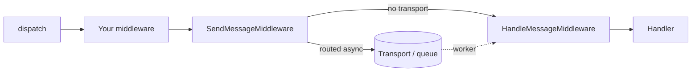

# Middleware

!!! tip "In a nutshell"
    `MessageBus::dispatch()` pousse l'`Envelope` à travers une **pile de
    middleware** ordonnée — une chaîne "poupée russe" où chaque middleware
    appelle `$stack->next()->handle()`. Deux middlewares intégrés font le
    vrai travail près de la fin : `SendMessageMiddleware` (route vers un
    transport et **arrête** le pipeline si c'est le cas) et
    `HandleMessageMiddleware` (appelle le ou les handlers).

!!! example "Real-world analogy"
    Le middleware, c'est la sécurité de l'aéroport : votre sac (l'enveloppe)
    passe par une file de points de contrôle, chacun capable de l'inspecter
    ou de le tamponner **à l'aller** et de nouveau **au retour**
    (poupée russe). Un point de contrôle (`SendMessageMiddleware`) peut
    carrément retirer votre sac et le mettre sur un autre vol (le transport)
    — une fois que ça arrive, il n'atteint plus jamais les points de
    contrôle ou la porte (le handler) sur *ce* trajet.

!!! abstract "Learning objectives"
    À la fin de ce chapitre, vous saurez :

    - [ ] Expliquer la chaîne de middleware "poupée russe" et écrire un middleware custom.
    - [ ] Nommer ce que font `SendMessageMiddleware` et `HandleMessageMiddleware`, dans l'ordre.
    - [ ] Lire et écrire des stamps sur une `Envelope` immuable.

    **Syllabus:** `Messenger → Middleware` ·
    **Level:** Expert ·
    **Est. time:** 25 min ·
    **Prerequisites:** [Messenger Component](component.fr.md)

    **Examen Symfony 8 :** OUI

---

## Pour les nuls

### L'idée en une phrase
Chaque middleware peut agir avant **et** après le reste du pipeline — comme une poupée russe, on entre dans chaque couche puis on en ressort dans l'ordre inverse.

### Imagine dans la vraie vie
Le middleware, c'est la sécurité de l'aéroport : ton sac (l'enveloppe) passe par une file de points de contrôle, chacun capable de l'inspecter ou de le tamponner **à l'aller** et de nouveau **au retour** (poupée russe).

### Dans Symfony
Un middleware custom de logging placé en premier dans la chaîne peut logger "requête entrante" avant `$stack->next()->handle(...)`, puis "requête terminée" juste après — même si un middleware plus profond a routé le message vers un transport asynchrone.

### Exemple simple
```php
public function handle(Envelope $envelope, StackInterface $stack): Envelope
{
    // avant
    $envelope = $stack->next()->handle($envelope, $stack);
    // après (même si le message a été routé en asynchrone plus loin)
    return $envelope;
}
```

### Comment le mémoriser 🧠
`sync://` fait quand même tourner le **pipeline complet de middleware** — ce n'est pas "pas de bus", c'est juste un transport qui ne dévie jamais vers `HandleMessageMiddleware`.

## Theory

`MessageBus::dispatch()` enveloppe le message dans une `Envelope` (sauf s'il
en est déjà une) et le pousse à travers une **pile de middleware ordonnée**.
Chaque middleware appelle `$stack->next()->handle($envelope, $stack)` : la
pile est une chaîne **poupée russe**, donc un middleware peut agir **avant**
*et* **après** que le reste du pipeline tourne.

```php
use Symfony\Component\Messenger\Envelope;
use Symfony\Component\Messenger\Middleware\MiddlewareInterface;
use Symfony\Component\Messenger\Middleware\StackInterface;

final class AuditMiddleware implements MiddlewareInterface
{
    public function handle(Envelope $envelope, StackInterface $stack): Envelope
    {
        // le code ici tourne AVANT le reste du pipeline
        $envelope = $stack->next()->handle($envelope, $stack);
        // le code ici tourne APRÈS (poupée russe, au retour)
        return $envelope;
    }
}
```

!!! question "Predict first"
    Votre middleware custom place du code avant et après
    `$stack->next()->handle(...)`. Un message est routé vers un transport
    par un middleware plus tardif. Votre code "après" tourne-t-il quand même ?

??? note "Reveal"
    **Oui.** `SendMessageMiddleware` empêche le *handler* de tourner (il
    n'appelle pas plus loin dans `HandleMessageMiddleware`), mais il remonte
    quand même normalement la pile — chaque middleware positionné *avant*
    lui dans la chaîne voit quand même son code "après" s'exécuter au retour.

## Deep Dive — how it works internally



Les deux middlewares intégrés pivots tournent près de la fin de la pile par défaut :

1. **`SendMessageMiddleware`** — si le message est **routé vers un
   transport**, il ajoute un `SentStamp`, sérialise et envoie l'enveloppe,
   puis **arrête** le pipeline (le handler n'est *pas* appelé dans ce
   process). S'il est routé uniquement vers `sync` (ou pas routé du tout),
   il laisse passer.
2. **`HandleMessageMiddleware`** — localise les handlers pour le type de
   message et les invoque, ajoutant un `HandledStamp` par handler avec la
   valeur de retour.

```php
use Symfony\Component\Messenger\Stamp\HandledStamp;
use Symfony\Component\Messenger\Stamp\SentStamp;

$envelope = $bus->dispatch(new SendReminder(userId: 42));

// Routé en async : SendMessageMiddleware l'a mis en file et a arrêté le pipeline
$envelope->last(SentStamp::class);    // SentStamp — preuve qu'il a été envoyé à un transport
$envelope->last(HandledStamp::class); // null — HandleMessageMiddleware n'a jamais tourné ici

// Routé vers sync (ou pas routé) : HandleMessageMiddleware appelle le handler,
// donc last(HandledStamp::class)->getResult() contient la valeur de retour à la place
```

!!! note "Source reference"
    `Symfony\Component\Messenger\Middleware\SendMessageMiddleware` et
    `HandleMessageMiddleware` —
    [symfony/symfony `8.0`](https://github.com/symfony/symfony/blob/8.0/src/Symfony/Component/Messenger/Middleware/SendMessageMiddleware.php).

### Envelopes & stamps

Une `Envelope` est **immuable** : `with()` renvoie une *nouvelle* enveloppe
avec un stamp ajouté ; `last(StampClass::class)` lit le stamp le plus récent
d'un type sur l'enveloppe sur laquelle elle est appelée.

```php
use Symfony\Component\Messenger\Envelope;
use Symfony\Component\Messenger\Stamp\DelayStamp;

$envelope = new Envelope(new SendReminder(userId: 42));
$delayed = $envelope->with(new DelayStamp(5_000)); // with() renvoie une NOUVELLE enveloppe
$envelope->last(DelayStamp::class);                // null — l'originale est inchangée
$delayed->last(DelayStamp::class);                 // l'instance DelayStamp
```

| Stamp | Purpose |
|---|---|
| `Stamp\SentStamp` | Marque que le message a été envoyé à un transport (async) |
| `Stamp\HandledStamp` | Porte la valeur de retour d'un handler + son nom |
| `Stamp\DelayStamp` | Retarde la livraison de N **millisecondes** |
| `Stamp\ReceivedStamp` | Posé par le worker après réception depuis un transport |
| `Stamp\BusNameStamp` | Enregistre quel bus l'a envoyé |
| `Stamp\TransportMessageIdStamp` | Id de message attribué par le broker |
| `Stamp\DispatchAfterCurrentBusStamp` | Diffère l'envoi jusqu'à ce que le traitement courant se termine |
| `Stamp\HandlerFailedStamp` | Enveloppe les exceptions levées par les handlers |
| `Stamp\RedeliveryStamp` | Comptabilité de retry (nombre de tentatives, erreur) |

```php
<?php
declare(strict_types=1);

use Symfony\Component\Messenger\Envelope;
use Symfony\Component\Messenger\MessageBusInterface;
use Symfony\Component\Messenger\Stamp\DelayStamp;

/** @var MessageBusInterface $bus */
$envelope = $bus->dispatch(new SendReminder(userId: 42), [
    new DelayStamp(5_000), // livrer 5 s plus tard (millisecondes !)
]);
```

### Null behavior

`last(StampClass::class)` renvoie `null` quand **aucun stamp de ce type
n'existe sur cette enveloppe** — un manque simple et attendu, pas une
erreur. Un middleware qui s'attend à un stamp qu'un autre middleware est
censé ajouter (par ex. lire `SentStamp` avant que `SendMessageMiddleware`
n'ait tourné) verra `null` simplement parce que l'ordre compte : les stamps
n'existent qu'une fois que le middleware qui les ajoute a réellement
tourné.

```php
$envelope = new Envelope(new SendReminder(userId: 42));
$envelope->last(\Symfony\Component\Messenger\Stamp\SentStamp::class); // null — personne ne l'a encore envoyé
```

!!! note "Null in real life"
    Vérifier sur un passeport un tampon qu'un point de contrôle ultérieur
    n'a pas encore atteint revient toujours vide — ce n'est pas un
    passeport falsifié ou manquant, le voyage n'y est simplement pas encore
    arrivé.

!!! info "Expert note"
    La pile de middleware est **par bus**, pas globale (voir
    [Messages & Handlers](messages-handlers.fr.md)). L'ordre compte :
    `SendMessageMiddleware` doit se trouver **après** tout middleware de
    transaction, sinon vous mettez en file un travail référençant des lignes
    qui n'ont jamais été commitées.

## Configuration & code

=== "Custom middleware"

    ```php
    <?php
    declare(strict_types=1);

    namespace App\Messenger\Middleware;

    use Symfony\Component\Messenger\Envelope;
    use Symfony\Component\Messenger\Middleware\MiddlewareInterface;
    use Symfony\Component\Messenger\Middleware\StackInterface;

    final class AuditMiddleware implements MiddlewareInterface
    {
        public function handle(Envelope $envelope, StackInterface $stack): Envelope
        {
            return $stack->next()->handle($envelope, $stack);
        }
    }
    ```

=== "YAML — registering it"

    ```yaml
    # config/packages/messenger.yaml
    framework:
        messenger:
            buses:
                messenger.bus.default:
                    middleware:
                        - App\Messenger\Middleware\AuditMiddleware
    ```

## Best practices & anti-patterns

| ✅ Do | ❌ Avoid |
|---|---|
| Appeler `$stack->next()->handle(...)` exactement une fois | Oublier d'appeler `next()`, avalant silencieusement le message |
| Placer le middleware de transaction avant `SendMessageMiddleware` | Mettre en file un travail avant qu'une transaction DB ne commit |
| Lire les stamps avec `last()`, sans supposer l'ordre | Supposer que chaque stamp existe avant de vérifier |
| Garder les middlewares légers et rapides en effets de bord | Faire des I/O lents dans un middleware qui tourne à chaque dispatch |

## When (not) to use it / alternatives

Écrivez un middleware custom pour des préoccupations transversales qui
doivent s'appliquer à **chaque** message sur un bus (audit, ID de
corrélation, transactions). Pour une logique spécifique à un type de
message, mettez-la plutôt dans le handler de ce message — un middleware qui
branche sur la classe du message est une odeur de code.

!!! danger "Certification traps"
    - `SendMessageMiddleware` tourne **avant** `HandleMessageMiddleware` dans
      la pile par défaut, et **arrête** la chaîne de l'atteindre une fois
      qu'un message est routé vers un transport.
    - `sync://` fait quand même tourner le **pipeline de middleware complet**
      — ce n'est pas "pas de bus", il ne dévie simplement jamais de
      `HandleMessageMiddleware`.
    - `Envelope` est immuable : `with()` renvoie une **nouvelle** enveloppe ;
      l'originale est inchangée.
    - Le code placé **après** `$stack->next()->handle(...)` tourne quand même
      au retour, même si un middleware plus tardif a arrêté le handler.

!!! warning "Common mistakes"
    - Oublier d'appeler `$stack->next()->handle(...)`, ce qui fait
      silencieusement tomber le message du reste du pipeline.
    - Lire un stamp avant que le middleware qui l'ajoute n'ait tourné, et
      confondre le `null` résultant avec un bug.

## Exercises

1. **(Expert)** Écrivez un middleware qui logge avant et après que le reste
   du pipeline tourne, et enregistrez-le sur le bus par défaut.
2. **(Expert)** Un message est routé vers un transport asynchrone. Listez,
   dans l'ordre, lequel de `SendMessageMiddleware` et `HandleMessageMiddleware`
   tourne dans le process d'envoi, et quels stamps se retrouvent sur
   l'enveloppe.

??? success "Solutions"

    **1.** Voir l'onglet "Custom middleware" ci-dessus ; ajoutez-le à
    `messenger.buses.messenger.bus.default.middleware` en YAML.

    **2.** Seul `SendMessageMiddleware` tourne dans le process d'envoi — il
    ajoute un `SentStamp` et arrête la chaîne. `HandleMessageMiddleware`
    tourne plus tard, dans le process du **worker**, ajoutant un
    `HandledStamp` à cet endroit-là.

## Certification questions

*Question d'entraînement inspirée du syllabus — jamais une question officielle de l'examen.*

??? question "Q1. Quel middleware invoque le handler ?"
    - [ ] A. `SendMessageMiddleware`
    - [x] B. `HandleMessageMiddleware` ✅
    - [ ] C. `ValidationMiddleware`
    - [ ] D. `RoutableMessageMiddleware`

    **Why:** `HandleMessageMiddleware` résout les handlers et les appelle,
    ajoutant un `HandledStamp`. **Ref:** [Messenger middleware](https://symfony.com/doc/8.0/messenger.html#middleware).

??? question "Q2. Vrai ou Faux : router un message vers le transport `sync://` saute le pipeline de middleware."
    - [ ] A. Vrai
    - [x] B. Faux ✅

    **Why:** chaque transport, y compris `sync://`, fait quand même tourner
    la pile de middleware complète ; `sync://` ne fait simplement jamais
    dévier le message de `HandleMessageMiddleware`.
    **Ref:** [Messenger — Transports](https://symfony.com/doc/8.0/messenger.html#transports-async-queued-messages).

??? question "Q3. Dans un middleware custom, le code placé APRÈS `$stack->next()->handle($envelope, $stack)` s'exécute…"
    - [x] A. Au retour, après le reste du pipeline (poupée russe) ✅
    - [ ] B. Avant le reste du pipeline
    - [ ] C. Seulement si une exception a été levée
    - [ ] D. Jamais — c'est du code mort

    **Why:** la chaîne de middleware est une poupée russe : appeler `next()`
    plonge plus profond, et le code après s'exécute à mesure que la pile
    d'appels se déroule.
    **Ref:** [Messenger — Middleware](https://symfony.com/doc/8.0/messenger.html#middleware).

??? question "Q4. Que fait `$envelope->with(new DelayStamp(5000))` à la valeur de la variable `$envelope` originale ?"
    - [x] A. Rien — `Envelope` est immuable, `with()` renvoie une nouvelle instance ✅
    - [ ] B. La mute en place, ajoutant le stamp
    - [ ] C. Remplace son message
    - [ ] D. Lève une exception si un `DelayStamp` existe déjà

    **Why:** `with()` renvoie toujours une nouvelle `Envelope` ; vous devez
    capturer la valeur de retour pour voir le stamp ajouté.
    **Ref:** [Symfony source — Envelope](https://github.com/symfony/symfony/blob/8.0/src/Symfony/Component/Messenger/Envelope.php).

## Key takeaways

- La pile de middleware est une chaîne poupée russe : `$stack->next()->handle()`
  fait tourner le reste, et le code après tourne au retour.
- `SendMessageMiddleware` (route/envoie, peut arrêter la chaîne) et
  `HandleMessageMiddleware` (appelle les handlers) sont les deux middlewares
  intégrés pivots.
- `Envelope` est immuable ; `with()` renvoie une nouvelle instance, `last()`
  lit le stamp le plus récent d'un type (ou `null`).
- `sync://` fait quand même tourner le pipeline complet — il ne dévie
  simplement jamais du handler.

## Last-minute revision

!!! tip "Cheat sheet"
    - Chaîne : `$stack->next()->handle($envelope, $stack)` — poupée russe.
    - `SendMessageMiddleware` → peut ajouter `SentStamp` + arrêter. `HandleMessageMiddleware` → ajoute `HandledStamp`.
    - `Envelope::with()` = nouvelle instance. `Envelope::last(Class::class)` = stamp le plus récent ou `null`.
    - Unité de `DelayStamp` = **millisecondes**.

## Connections

- **Depends on:** [Messenger Component](component.fr.md) — le vocabulaire `Envelope`/bus.
- **Reused in:** [Transports](transports.fr.md) — `SendMessageMiddleware` est
  ce qui appelle réellement le transport ; [Retries & Failures](retries-failures.fr.md) —
  `HandlerFailedStamp`/`RedeliveryStamp` sont ajoutés par un autre middleware
  de cette même pile.
- **Confused with:** [Messages & Handlers](messages-handlers.fr.md) — les bus
  configurent *quel* middleware tourne ; ce chapitre décrit *comment* le
  pipeline lui-même s'exécute.

## Official References

- [Official docs — Messenger middleware](https://symfony.com/doc/8.0/messenger.html#middleware)
- [Symfony source — SendMessageMiddleware](https://github.com/symfony/symfony/blob/8.0/src/Symfony/Component/Messenger/Middleware/SendMessageMiddleware.php)
- [Symfony source — Envelope](https://github.com/symfony/symfony/blob/8.0/src/Symfony/Component/Messenger/Envelope.php)
- [Symfony source — Stamps](https://github.com/symfony/symfony/tree/8.0/src/Symfony/Component/Messenger/Stamp)

## Video references

!!! tip "Watch & learn"
    Ce sont des chaînes vidéo officielles, mises à jour en continu — cherchez-y
    "Symfony Messenger middleware" pour renforcer ce chapitre. Nous lions des
    chaînes stables plutôt que des vidéos individuelles pour que les
    références ne deviennent jamais obsolètes.

    - [SymfonyCasts screencasts](https://symfonycasts.com/tracks/symfony) — tutoriels scénarisés, en code.
    - [Symfony official YouTube](https://www.youtube.com/@SymfonyOfficial) — conférences et keynotes SymfonyCon.
    - [Official docs for this topic](https://symfony.com/doc/8.0/messenger.html#middleware) — certaines pages de doc Symfony embarquent un screencast.

## Confidence check

Je suis prêt quand je peux :

- [ ] expliquer **pourquoi** la chaîne de middleware s'appelle "poupée russe"
- [ ] écrire et enregistrer un middleware custom en Symfony 8
- [ ] déboguer un message qui n'atteint jamais son handler
- [ ] repérer le piège : `sync://` fait quand même tourner le pipeline complet
- [ ] lire/écrire des stamps sur une `Envelope` immuable correctement

---

<small>Related: [Messenger Component](component.fr.md) · [Transports](transports.fr.md) · [Retries & Failures](retries-failures.fr.md)</small>
