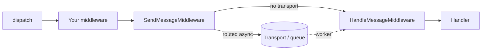

# Middleware

!!! tip "In a nutshell"
    `MessageBus::dispatch()` pushes the `Envelope` through an ordered
    **middleware stack** — a russian-doll chain where each middleware calls
    `$stack->next()->handle()`. Two built-ins do the real work near the end:
    `SendMessageMiddleware` (routes to a transport and **stops** the pipeline
    if it did) and `HandleMessageMiddleware` (calls the handler(s)).

!!! example "Real-world analogy"
    Middleware is airport security: your bag (the envelope) passes through a
    line of checkpoints, each one able to inspect or stamp it **on the way
    in** and again **on the way out** (russian-doll). One checkpoint
    (`SendMessageMiddleware`) can pull your bag aside entirely and put it on
    a different flight (the transport) — once that happens, it never reaches
    the checkpoints or the gate (the handler) on *this* trip.

!!! abstract "Learning objectives"
    By the end of this chapter you can:

    - [ ] Explain the russian-doll middleware chain and write a custom middleware.
    - [ ] Name what `SendMessageMiddleware` and `HandleMessageMiddleware` each do, in order.
    - [ ] Read and write stamps on an immutable `Envelope`.

    **Syllabus:** `Messenger → Middleware` ·
    **Level:** Expert ·
    **Est. time:** 25 min ·
    **Prerequisites:** [Messenger Component](component.md)

    **Examen Symfony 8 :** OUI

---

## Pour les nuls

### L'idée en une phrase
Chaque middleware peut agir avant **et** après le reste du pipeline — comme une poupée russe, on entre dans chaque couche puis on en ressort dans l'ordre inverse.

### Imagine dans la vraie vie
Le middleware, c'est la sécurité de l'aéroport : ton sac (l'enveloppe) passe par une file de points de contrôle, chacun capable de l'inspecter ou de le tamponner **à l'aller** et de nouveau **au retour** (poupée russe).

### Dans Symfony
Un middleware custom de logging placé en premier dans la chaîne peut logger "requête entrante" avant `$stack->next()->handle(...)`, puis "requête terminée" juste après — même si un middleware plus profond a routé le message vers un transport asynchrone.

### Exemple simple
```php
public function handle(Envelope $envelope, StackInterface $stack): Envelope
{
    // avant
    $envelope = $stack->next()->handle($envelope, $stack);
    // après (même si le message a été routé en asynchrone plus loin)
    return $envelope;
}
```

### Comment le mémoriser 🧠
`sync://` fait quand même tourner le **pipeline complet de middleware** — ce n'est pas "pas de bus", c'est juste un transport qui ne dévie jamais vers `HandleMessageMiddleware`.

## Theory

`MessageBus::dispatch()` wraps the message in an `Envelope` (unless it
already is one) and pushes it through an **ordered middleware stack**. Each
middleware calls `$stack->next()->handle($envelope, $stack)`: the stack is a
**russian-doll** chain, so a middleware can act **before** *and* **after**
the rest of the pipeline runs.

```php
use Symfony\Component\Messenger\Envelope;
use Symfony\Component\Messenger\Middleware\MiddlewareInterface;
use Symfony\Component\Messenger\Middleware\StackInterface;

final class AuditMiddleware implements MiddlewareInterface
{
    public function handle(Envelope $envelope, StackInterface $stack): Envelope
    {
        // code here runs BEFORE the rest of the pipeline
        $envelope = $stack->next()->handle($envelope, $stack);
        // code here runs AFTER (russian-doll, on the way back out)
        return $envelope;
    }
}
```

!!! question "Predict first"
    Your custom middleware puts code both before and after
    `$stack->next()->handle(...)`. A message is routed to a transport by a
    later middleware. Does your "after" code still run?

??? note "Reveal"
    **Yes.** `SendMessageMiddleware` stops the *handler* from running (it
    doesn't call further into `HandleMessageMiddleware`), but it still
    returns up through the stack normally — every middleware positioned
    *before* it in the chain still gets its "after" code executed on the
    way back out.

## Deep Dive — how it works internally



The two pivotal built-in middlewares run near the end of the default stack:

1. **`SendMessageMiddleware`** — if the message is **routed to a
   transport**, it adds a `SentStamp`, serializes and sends the envelope,
   then **stops** the pipeline (the handler is *not* called in this
   process). If routed only to `sync` (or not routed at all), it passes
   through.
2. **`HandleMessageMiddleware`** — locates handlers for the message type
   and invokes them, adding a `HandledStamp` per handler with the return
   value.

```php
use Symfony\Component\Messenger\Stamp\HandledStamp;
use Symfony\Component\Messenger\Stamp\SentStamp;

$envelope = $bus->dispatch(new SendReminder(userId: 42));

// Routed async: SendMessageMiddleware enqueued it and stopped the pipeline
$envelope->last(SentStamp::class);    // SentStamp — proof it was sent to a transport
$envelope->last(HandledStamp::class); // null — HandleMessageMiddleware never ran here

// Routed to sync (or not routed): HandleMessageMiddleware calls the handler,
// so last(HandledStamp::class)->getResult() holds the return value instead
```

!!! note "Source reference"
    `Symfony\Component\Messenger\Middleware\SendMessageMiddleware` and
    `HandleMessageMiddleware` —
    [symfony/symfony `8.0`](https://github.com/symfony/symfony/blob/8.0/src/Symfony/Component/Messenger/Middleware/SendMessageMiddleware.php).

### Envelopes & stamps

An `Envelope` is **immutable**: `with()` returns a *new* envelope with an
added stamp; `last(StampClass::class)` reads the most recent stamp of a
type on the envelope it's called on.

```php
use Symfony\Component\Messenger\Envelope;
use Symfony\Component\Messenger\Stamp\DelayStamp;

$envelope = new Envelope(new SendReminder(userId: 42));
$delayed = $envelope->with(new DelayStamp(5_000)); // with() returns a NEW envelope
$envelope->last(DelayStamp::class);                // null — original unchanged
$delayed->last(DelayStamp::class);                 // the DelayStamp instance
```

| Stamp | Purpose |
|---|---|
| `Stamp\SentStamp` | Marks the message was sent to a transport (async) |
| `Stamp\HandledStamp` | Carries a handler's return value + handler name |
| `Stamp\DelayStamp` | Delay delivery by N **milliseconds** |
| `Stamp\ReceivedStamp` | Set by the worker after receiving from a transport |
| `Stamp\BusNameStamp` | Records which bus dispatched it |
| `Stamp\TransportMessageIdStamp` | Broker-assigned message id |
| `Stamp\DispatchAfterCurrentBusStamp` | Defer dispatch until the current handling finishes |
| `Stamp\HandlerFailedStamp` | Wraps exceptions thrown by handlers |
| `Stamp\RedeliveryStamp` | Retry bookkeeping (attempt count, error) |

```php
<?php
declare(strict_types=1);

use Symfony\Component\Messenger\Envelope;
use Symfony\Component\Messenger\MessageBusInterface;
use Symfony\Component\Messenger\Stamp\DelayStamp;

/** @var MessageBusInterface $bus */
$envelope = $bus->dispatch(new SendReminder(userId: 42), [
    new DelayStamp(5_000), // deliver 5 s later (milliseconds!)
]);
```

### Null behavior

`last(StampClass::class)` returns `null` when **no stamp of that type
exists on this envelope** — a plain, expected miss, not an error. A
middleware that expects a stamp another middleware is supposed to add
(e.g. reading `SentStamp` before `SendMessageMiddleware` has run) will see
`null` simply because ordering matters: stamps only exist once the
middleware that adds them has actually executed.

```php
$envelope = new Envelope(new SendReminder(userId: 42));
$envelope->last(\Symfony\Component\Messenger\Stamp\SentStamp::class); // null — nothing sent it yet
```

!!! note "Null in real life"
    Checking a passport for a stamp that a later checkpoint hasn't reached
    yet always comes back blank — it isn't a forged or missing passport,
    the trip just hasn't gotten there yet.

!!! info "Expert note"
    The middleware stack is **per bus**, not global (see
    [Messages & Handlers](messages-handlers.md)). Ordering matters:
    `SendMessageMiddleware` must sit **after** any transaction middleware,
    or you enqueue work referencing rows that were never committed.

## Configuration & code

=== "Custom middleware"

    ```php
    <?php
    declare(strict_types=1);

    namespace App\Messenger\Middleware;

    use Symfony\Component\Messenger\Envelope;
    use Symfony\Component\Messenger\Middleware\MiddlewareInterface;
    use Symfony\Component\Messenger\Middleware\StackInterface;

    final class AuditMiddleware implements MiddlewareInterface
    {
        public function handle(Envelope $envelope, StackInterface $stack): Envelope
        {
            return $stack->next()->handle($envelope, $stack);
        }
    }
    ```

=== "YAML — registering it"

    ```yaml
    # config/packages/messenger.yaml
    framework:
        messenger:
            buses:
                messenger.bus.default:
                    middleware:
                        - App\Messenger\Middleware\AuditMiddleware
    ```

## Best practices & anti-patterns

| ✅ Do | ❌ Avoid |
|---|---|
| Call `$stack->next()->handle(...)` exactly once | Forgetting to call `next()`, silently swallowing the message |
| Put transaction middleware before `SendMessageMiddleware` | Enqueuing work before a DB transaction commits |
| Read stamps with `last()`, not by assuming order | Assuming every stamp exists before checking |
| Keep middleware side-effect-light and fast | Doing slow I/O in a middleware that runs on every dispatch |

## When (not) to use it / alternatives

Write a custom middleware for cross-cutting concerns that must apply to
**every** message on a bus (auditing, correlation IDs, transactions). For
logic specific to one message type, put it in that message's handler
instead — a middleware that branches on message class is a smell.

!!! danger "Certification traps"
    - `SendMessageMiddleware` runs **before** `HandleMessageMiddleware` in
      the default stack, and **stops** the chain from reaching it once a
      message is routed to a transport.
    - `sync://` still runs the **full middleware pipeline** — it is not
      "no bus," it just never routes away from `HandleMessageMiddleware`.
    - `Envelope` is immutable: `with()` returns a **new** envelope; the
      original is unchanged.
    - Code placed **after** `$stack->next()->handle(...)` still runs on the
      way back out, even if a later middleware stopped the handler.

!!! warning "Common mistakes"
    - Forgetting to call `$stack->next()->handle(...)`, which silently
      drops the message from the rest of the pipeline.
    - Reading a stamp before the middleware that adds it has run, and
      mistaking the resulting `null` for a bug.

## Exercises

1. **(Expert)** Write a middleware that logs before and after the rest of
   the pipeline runs, and register it on the default bus.
2. **(Expert)** A message is routed to an async transport. List, in order,
   which of `SendMessageMiddleware` and `HandleMessageMiddleware` run in the
   dispatching process, and which stamps end up on the envelope.

??? success "Solutions"

    **1.** See the "Custom middleware" tab above; add it to
    `messenger.buses.messenger.bus.default.middleware` in YAML.

    **2.** Only `SendMessageMiddleware` runs in the dispatching process — it
    adds a `SentStamp` and stops the chain. `HandleMessageMiddleware` runs
    later, in the **worker's** process, adding a `HandledStamp` there instead.

## Certification questions

*Question d'entraînement inspirée du syllabus — jamais une question officielle de l'examen.*

??? question "Q1. Which middleware invokes the handler?"
    - [ ] A. `SendMessageMiddleware`
    - [x] B. `HandleMessageMiddleware` ✅
    - [ ] C. `ValidationMiddleware`
    - [ ] D. `RoutableMessageMiddleware`

    **Why:** `HandleMessageMiddleware` resolves handlers and calls them,
    adding a `HandledStamp`. **Ref:** [Messenger middleware](https://symfony.com/doc/8.0/messenger.html#middleware).

??? question "Q2. True or False: routing a message to the `sync://` transport skips the middleware pipeline."
    - [ ] A. True
    - [x] B. False ✅

    **Why:** every transport, including `sync://`, still runs the full
    middleware stack; `sync://` just never diverts the message away from
    `HandleMessageMiddleware`. **Ref:** [Messenger — Transports](https://symfony.com/doc/8.0/messenger.html#transports-async-queued-messages).

??? question "Q3. In a custom middleware, code placed AFTER `$stack->next()->handle($envelope, $stack)` runs…"
    - [x] A. On the way back out, after the rest of the pipeline (russian-doll) ✅
    - [ ] B. Before the rest of the pipeline
    - [ ] C. Only if an exception was thrown
    - [ ] D. Never — it's dead code

    **Why:** the middleware chain is a russian-doll: calling `next()` dives
    deeper, and code after it executes as the call stack unwinds.
    **Ref:** [Messenger — Middleware](https://symfony.com/doc/8.0/messenger.html#middleware).

??? question "Q4. `$envelope->with(new DelayStamp(5000))` does what to the original `$envelope` variable's value?"
    - [x] A. Nothing — `Envelope` is immutable, `with()` returns a new instance ✅
    - [ ] B. Mutates it in place, adding the stamp
    - [ ] C. Replaces its message
    - [ ] D. Throws if a `DelayStamp` already exists

    **Why:** `with()` always returns a new `Envelope`; you must capture the
    return value to see the added stamp.
    **Ref:** [Symfony source — Envelope](https://github.com/symfony/symfony/blob/8.0/src/Symfony/Component/Messenger/Envelope.php).

## Key takeaways

- The middleware stack is a russian-doll chain: `$stack->next()->handle()`
  runs the rest, and code after it runs on the way back out.
- `SendMessageMiddleware` (routes/sends, may stop the chain) and
  `HandleMessageMiddleware` (calls handlers) are the two pivotal built-ins.
- `Envelope` is immutable; `with()` returns a new instance, `last()` reads
  the most recent stamp of a type (or `null`).
- `sync://` still runs the full pipeline — it just never diverts away from
  the handler.

## Last-minute revision

!!! tip "Cheat sheet"
    - Chain: `$stack->next()->handle($envelope, $stack)` — russian-doll.
    - `SendMessageMiddleware` → may add `SentStamp` + stop. `HandleMessageMiddleware` → adds `HandledStamp`.
    - `Envelope::with()` = new instance. `Envelope::last(Class::class)` = most recent stamp or `null`.
    - `DelayStamp` unit = **milliseconds**.

## Connections

- **Depends on:** [Messenger Component](component.md) — the `Envelope`/bus vocabulary.
- **Reused in:** [Transports](transports.md) — `SendMessageMiddleware` is
  what actually calls the transport; [Retries & Failures](retries-failures.md) —
  `HandlerFailedStamp`/`RedeliveryStamp` are added by other middleware in
  this same stack.
- **Confused with:** [Messages & Handlers](messages-handlers.md) — buses
  configure *which* middleware runs; this chapter is *how* the pipeline
  itself executes.

## Official References

- [Official docs — Messenger middleware](https://symfony.com/doc/8.0/messenger.html#middleware)
- [Symfony source — SendMessageMiddleware](https://github.com/symfony/symfony/blob/8.0/src/Symfony/Component/Messenger/Middleware/SendMessageMiddleware.php)
- [Symfony source — Envelope](https://github.com/symfony/symfony/blob/8.0/src/Symfony/Component/Messenger/Envelope.php)
- [Symfony source — Stamps](https://github.com/symfony/symfony/tree/8.0/src/Symfony/Component/Messenger/Stamp)

## Video references

!!! tip "Watch & learn"
    These are official, continuously-updated video channels — search them for
    "Symfony Messenger middleware" to reinforce this chapter. We link stable channels rather than
    individual videos so the references never rot.

    - [SymfonyCasts screencasts](https://symfonycasts.com/tracks/symfony) — scripted, code-along tutorials.
    - [Symfony official YouTube](https://www.youtube.com/@SymfonyOfficial) — SymfonyCon conference talks & keynotes.
    - [Official docs for this topic](https://symfony.com/doc/8.0/messenger.html#middleware) — some Symfony doc pages embed a screencast.

## Confidence check

I'm ready when I can:

- [ ] explain **why** the middleware chain is called "russian-doll"
- [ ] write and register a custom middleware in Symfony 8
- [ ] debug a message that never reaches its handler
- [ ] spot the trap: `sync://` still runs the full pipeline
- [ ] read/write stamps on an immutable `Envelope` correctly

---

<small>Related: [Messenger Component](component.md) · [Transports](transports.md) · [Retries & Failures](retries-failures.md)</small>
