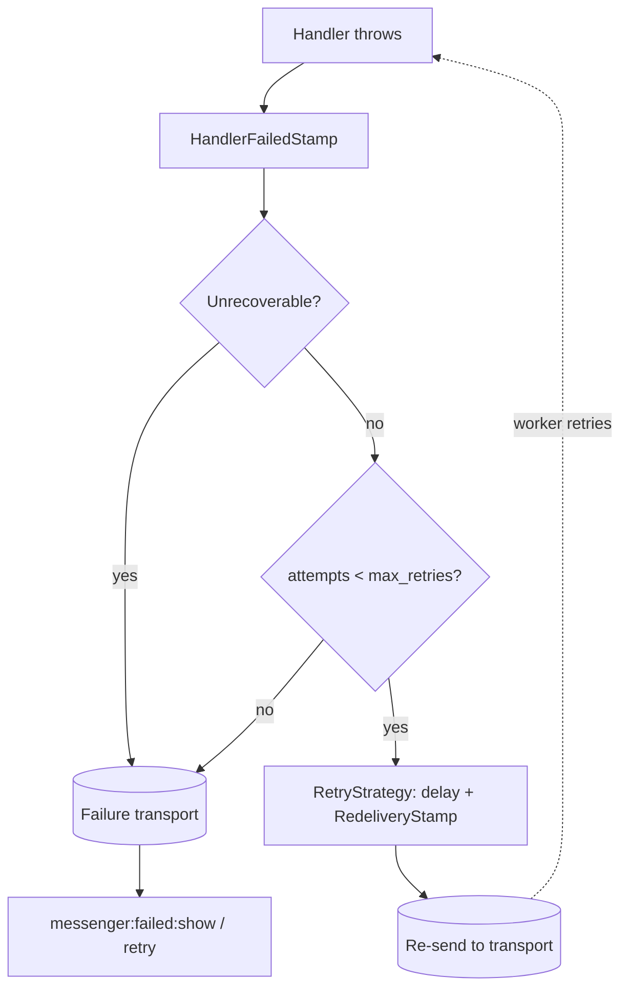

# Retries & Failures

!!! tip "In a nutshell"
    Quand un handler lève une exception, `HandleMessageMiddleware` enveloppe
    l'erreur dans un `HandlerFailedStamp` ; une `RetryStrategyInterface`
    (par défaut `MultiplierRetryStrategy`) décide de retenter ou non avec un
    backoff exponentiel. Une fois `max_retries` épuisé, l'enveloppe part vers
    le **transport d'échec**. Lever `UnrecoverableMessageHandlingException`
    saute complètement les retries.

!!! example "Real-world analogy"
    Une tentative de livraison ratée retourne dans le camion pour un nouvel
    essai, avec une attente plus longue avant chaque tentative suivante
    (backoff exponentiel) — sauf si l'adresse elle-même est invalide, auquel
    cas ça ne sert à rien de réessayer et le colis part directement au dépôt
    des retours (le transport d'échec). Après suffisamment de tentatives
    ratées sur une adresse corrigible, il y part aussi.

!!! abstract "Learning objectives"
    À la fin de ce chapitre, vous saurez :

    - [ ] Configurer le `retry_strategy` d'un transport (tentatives max, délai, backoff).
    - [ ] Expliquer ce qui se passe une fois les retries épuisés.
    - [ ] Sauter délibérément les retries avec `UnrecoverableMessageHandlingException`.

    **Syllabus:** `Messenger → Retries and failures` ·
    **Level:** Expert ·
    **Est. time:** 20 min ·
    **Prerequisites:** [Workers](workers.fr.md)

    **Examen Symfony 8 :** OUI

---

## Pour les nuls

### L'idée en une phrase
Quand un handler échoue, Messenger réessaie automatiquement avec un délai croissant — et abandonne au bout d'un nombre maximal de tentatives configuré.

### Imagine dans la vraie vie
Une tentative de livraison ratée retourne dans le camion pour un nouvel essai, avec une attente plus longue avant chaque tentative suivante (backoff exponentiel) — sauf si l'adresse elle-même est invalide, auquel cas ça ne sert à rien de réessayer et le colis part directement au dépôt des retours.

### Dans Symfony
Une erreur réseau temporaire (API tierce indisponible une seconde) mérite un retry automatique — mais une erreur de données invalides qui échouera **toujours** de la même façon doit lancer `UnrecoverableMessageHandlingException` pour éviter de gaspiller des tentatives inutiles.

### Exemple simple
```php
if ($message->montant <= 0) {
    throw new UnrecoverableMessageHandlingException('Montant invalide'); // pas de retry
}
```

### Comment le mémoriser 🧠
Le contrat de livraison de Messenger est **"au moins une fois"**, jamais "exactement une fois" — écris toujours des handlers **idempotents**, capables de tourner deux fois sans effet de bord dupliqué.

## Theory

Quand un handler lève une exception, `HandleMessageMiddleware` l'attrape et
l'enveloppe dans un `Stamp\HandlerFailedStamp`. La logique de retry du
worker — une `RetryStrategyInterface`, par défaut
`MultiplierRetryStrategy` — décide de **retenter** ou non : si oui, elle
renvoie l'enveloppe avec un `Stamp\RedeliveryStamp` et un délai. Une fois
`max_retries` épuisé, l'enveloppe est envoyée vers le **transport d'échec**
configuré, inspectable avec `messenger:failed:show` et rejouable avec
`messenger:failed:retry`.

```yaml
# config/packages/messenger.yaml
framework:
    messenger:
        failure_transport: failed   # inspecter avec messenger:failed:show / retry
        transports:
            async:
                dsn: '%env(MESSENGER_TRANSPORT_DSN)%'
                retry_strategy:     # défaut : MultiplierRetryStrategy
                    max_retries: 3  # épuisé → transport d'échec
                    delay: 1000     # ms ; chaque retry renvoyé avec un RedeliveryStamp
                    multiplier: 2   # backoff exponentiel (aussi la valeur par défaut du framework)
                    jitter: 0.1     # randomisation ±10% sur chaque délai (aussi la valeur par défaut)
```

!!! question "Predict first"
    Avec `delay: 1000`, `multiplier: 2`, et le `jitter: 0.1` par défaut, les
    délais avant les 1er, 2e et 3e essais de retry sont-ils exactement
    1000/2000/4000 ms ?

??? note "Reveal"
    **Non — approximativement**, à ±10% près de chacun. `jitter` (défaut
    `0.1`) randomise chaque délai calculé pour éviter un "troupeau
    tonnerre" de retries qui se déclenchent tous en même temps ; seul
    `jitter: 0` rend la progression 1000/2000/4000 exacte. Le délai **de
    base** multiplie quand même par `multiplier` à chaque retry — c'est un
    backoff exponentiel, pas un intervalle fixe répété `max_retries` fois.

## Deep Dive — how it works internally



Lever
`Symfony\Component\Messenger\Exception\UnrecoverableMessageHandlingException`
saute complètement les retries et va directement vers le transport
d'échec — utilisez-la quand l'erreur est **structurelle** (des données
invalides qui ne réussiront jamais), pas transitoire.

```php
use Symfony\Component\Messenger\Exception\UnrecoverableMessageHandlingException;

#[AsMessageHandler]
final class ChargeCardHandler
{
    public function __invoke(ChargeCard $message): void
    {
        if ($message->amount <= 0) {
            // pas de retry — va directement vers le transport d'échec
            throw new UnrecoverableMessageHandlingException('Invalid amount');
        }
    }
}
```

!!! note "Source reference"
    `Symfony\Component\Messenger\Retry\MultiplierRetryStrategy` et
    `Exception\UnrecoverableMessageHandlingException` —
    [symfony/symfony `8.0`](https://github.com/symfony/symfony/blob/8.0/src/Symfony/Component/Messenger/Retry/MultiplierRetryStrategy.php).

### Null behavior

Un message qui n'a **jamais échoué** ne porte aucun `RedeliveryStamp` du
tout — `$envelope->last(RedeliveryStamp::class)` vaut `null`, pas un stamp
avec un compteur de retry à zéro. Vérifier `?->getRetryCount()` est le
pattern sûr : `null` signifie naturellement "première tentative", jamais
"zéro retry enregistré".

```php
$count = $envelope->last(RedeliveryStamp::class)?->getRetryCount(); // null à la première tentative
```

!!! note "Null in real life"
    Un colis sans étiquette "retour à l'expéditeur, tentative 2" n'en est
    pas à son zéro-ième retry — il n'a simplement pas encore échoué.
    L'absence de l'étiquette *est* l'information.

## Configuration & code

=== "Retry strategy"

    ```yaml
    # config/packages/messenger.yaml
    framework:
        messenger:
            failure_transport: failed
            transports:
                async:
                    dsn: '%env(MESSENGER_TRANSPORT_DSN)%'
                    retry_strategy:
                        max_retries: 3
                        delay: 1000
                        multiplier: 2
                failed: 'doctrine://default?queue_name=failed'
    ```

=== "Console"

    ```console
    $ php bin/console messenger:failed:show
    $ php bin/console messenger:failed:retry
    $ php bin/console messenger:failed:remove <id>
    ```

## Best practices & anti-patterns

| ✅ Do | ❌ Avoid |
|---|---|
| Configurer un `failure_transport` et le surveiller | Perdre silencieusement des messages aux retries épuisés |
| Lever `UnrecoverableMessageHandlingException` pour les erreurs structurelles | Retenter un appel de handler qui ne réussira jamais |
| Ajuster `multiplier`/`delay` selon le mode d'échec attendu | Utiliser la même politique de retry agressive pour chaque transport |
| Rendre les handlers idempotents avant de s'appuyer sur les retries | Supposer qu'une livraison "au moins une fois" signifie "exactement une fois" |

## When (not) to use it / alternatives

Comptez sur les retries pour les échecs **transitoires** (un appel réseau
capricieux, une dépendance momentanément indisponible). Pour des échecs qui
sont certains de se reproduire à l'identique (mauvaise saisie, violation
d'une règle métier), allez directement au transport d'échec avec
`UnrecoverableMessageHandlingException` — les retenter ne fait que retarder
l'inévitable et gaspille du temps worker.

!!! danger "Certification traps"
    - Les délais suivent un **backoff exponentiel** (`delay × multiplier^attempt`),
      pas un intervalle fixe répété — et le `jitter: 0.1` par défaut du
      framework randomise chacun d'eux jusqu'à ±10% en plus.
    - Les retries épuisés partent vers le **transport d'échec**, pas le
      transport sync ni un abandon silencieux.
    - `UnrecoverableMessageHandlingException` saute complètement les retries
      — ce n'est pas juste "un retry en moins".
    - L'absence de `RedeliveryStamp` signifie "première tentative", jamais
      "0 retry enregistré" — protégez toujours avec `?->`.
    - Le contrat de livraison est **au moins une fois**, jamais "exactement
      une fois" — des handlers idempotents sont la responsabilité de
      l'application.

!!! warning "Common mistakes"
    - Supposer qu'un message est traité exactement une fois et écrire des
      handlers non idempotents.
    - Oublier de configurer un `failure_transport`, donc les messages
      épuisés n'ont nulle part d'utile où atterrir.

## Exercises

1. **(Expert)** Configurez `max_retries: 5` avec un multiplicateur `2×` sur
   un transport `async`.
2. **(Expert)** Un handler `SendReminder` a tourné deux fois en production
   pour le même message. Quelle est la cause la plus probable, et quelle
   garantie de livraison Messenger fait-il réellement ?

??? success "Solutions"

    **1.**
    ```yaml
    retry_strategy: { max_retries: 5, delay: 1000, multiplier: 2 }
    ```

    **2.** Deux programmes superviseurs ont tous deux consommé le même
    transport `doctrine://`, et le handler **n'était pas idempotent** — une
    première tentative lente a survécu à la fenêtre de visibilité, donc le
    message a été redélivré pendant que la tentative 1 tournait encore. Le
    contrat de Messenger est une livraison **au moins une fois**, pas
    exactement une fois ; les handlers doivent être idempotents pour être
    sûrs sous les retries.

## Certification questions

*Question d'entraînement inspirée du syllabus — jamais une question officielle de l'examen.*

??? question "Q1. Après qu'un message a épuisé ses retries configurés, où va-t-il ?"
    - [x] A. Le transport d'échec configuré ✅
    - [ ] B. Le transport sync
    - [ ] C. Seulement le log d'erreur PHP, sans autre trace
    - [ ] D. Il est silencieusement abandonné

    **Why:** `failure_transport` stocke les messages définitivement échoués
    pour inspection/retry. **Ref:** [Failure transport](https://symfony.com/doc/8.0/messenger.html#saving-retrying-failed-messages).

??? question "Q2. Comment faire en sorte qu'un handler en échec saute les retries et aille directement au transport d'échec ?"
    - [x] A. Lever `UnrecoverableMessageHandlingException` ✅
    - [ ] B. Renvoyer `false` depuis le handler
    - [ ] C. Ajouter un `DelayStamp(0)`
    - [ ] D. Fixer `max_retries: 0` globalement

    **Why:** cette exception marque explicitement l'échec comme non retentable.
    **Ref:** [Retries & failures](https://symfony.com/doc/8.0/messenger.html#retries-failures).

??? question "Q3. Avec `retry_strategy: { delay: 1000, multiplier: 2, jitter: 0 }`, quels sont les délais de base avant les retries 1, 2 et 3 ?"
    - [x] A. 1000 ms, 2000 ms, 4000 ms ✅
    - [ ] B. 1000 ms, 1000 ms, 1000 ms
    - [ ] C. 1000 ms, 3000 ms, 6000 ms
    - [ ] D. 2000 ms, 4000 ms, 8000 ms

    **Why:** chaque délai est le précédent multiplié par `multiplier` —
    backoff exponentiel démarrant depuis `delay`. `jitter: 0` est ce qui
    rend cette progression exacte ; le défaut du framework `jitter: 0.1`
    randomise chaque valeur jusqu'à ±10%.
    **Ref:** [Symfony source — MultiplierRetryStrategy](https://github.com/symfony/symfony/blob/8.0/src/Symfony/Component/Messenger/Retry/MultiplierRetryStrategy.php).

??? question "Q3b. Que fait l'option `retry_strategy` `jitter: 0.1` (le défaut du framework) ?"
    - [x] A. Randomise chaque délai calculé jusqu'à ±10%, pour éviter un troupeau tonnerre de retries ✅
    - [ ] B. Ajoute un 10% fixe à chaque délai, de façon déterministe
    - [ ] C. Retente 10% plus vite à chaque tentative
    - [ ] D. Rien à moins que `multiplier` ne soit aussi défini

    **Why:** `jitter` est un facteur de randomisation (0 à 1) appliqué au
    délai calculé ; il est actif par défaut (`0.1`), ce qui surprend qui a
    mémorisé "delay × multiplier" comme formule exacte sans lui.
    **Ref:** [Symfony source — MultiplierRetryStrategy](https://github.com/symfony/symfony/blob/8.0/src/Symfony/Component/Messenger/Retry/MultiplierRetryStrategy.php).

??? question "Q4. Quelle information un `RedeliveryStamp` porte-t-il sur un message retenté ?"
    - [x] A. Le nombre de tentatives et l'erreur précédente ✅
    - [ ] B. Le DSN du transport
    - [ ] C. La valeur de retour du handler
    - [ ] D. Rien — c'est un marqueur sans donnée

    **Why:** `RedeliveryStamp` est le stamp de comptabilité de retry,
    exposant `getRetryCount()` et l'exception enregistrée.
    **Ref:** [Symfony source — RedeliveryStamp](https://github.com/symfony/symfony/tree/8.0/src/Symfony/Component/Messenger/Stamp).

## Key takeaways

- Les retries suivent un backoff exponentiel : `delay × multiplier^attempt`.
- `HandlerFailedStamp` enveloppe l'exception ; `RedeliveryStamp` suit le
  nombre de retries ; les retries épuisés atterrissent dans le transport
  d'échec.
- `UnrecoverableMessageHandlingException` saute complètement les retries.
- Le contrat de livraison de Messenger est au moins une fois — les handlers
  doivent être idempotents.

## Last-minute revision

!!! tip "Cheat sheet"
    - `retry_strategy: { max_retries, delay, multiplier, jitter }` — backoff
      exponentiel, randomisation ±`jitter` (défaut `0.1` ; mettre `0` pour des délais exacts).
    - Épuisé → `failure_transport` ; inspecter avec `messenger:failed:show|retry|remove`.
    - `UnrecoverableMessageHandlingException` = pas de retry, direct au transport d'échec.
    - `RedeliveryStamp` absent = première tentative, pas "0 retry".
    - Garantie de livraison : **au moins une fois**, jamais exactement une fois.

## Connections

- **Depends on:** [Workers](workers.fr.md) — le `reject()` d'un worker est ce
  qui déclenche cette décision de retry.
- **Reused in:** [Middleware](middleware.fr.md) — `HandlerFailedStamp`/
  `RedeliveryStamp` sont des stamps sur la même `Envelope` couverte là-bas.
- **Confused with:** [Transports](transports.fr.md) — `retry_strategy` est
  configuré par transport, mais c'est son propre sous-sujet, pas une
  propriété de transport en général.

## Official References

- [Official docs — Retries & failures](https://symfony.com/doc/8.0/messenger.html#retries-failures)
- [Symfony source — MultiplierRetryStrategy](https://github.com/symfony/symfony/blob/8.0/src/Symfony/Component/Messenger/Retry/MultiplierRetryStrategy.php)
- [Symfony source — UnrecoverableMessageHandlingException](https://github.com/symfony/symfony/blob/8.0/src/Symfony/Component/Messenger/Exception/UnrecoverableMessageHandlingException.php)

## Video references

!!! tip "Watch & learn"
    Ce sont des chaînes vidéo officielles, mises à jour en continu — cherchez-y
    "Symfony Messenger retries" pour renforcer ce chapitre. Nous lions des
    chaînes stables plutôt que des vidéos individuelles pour que les
    références ne deviennent jamais obsolètes.

    - [SymfonyCasts screencasts](https://symfonycasts.com/tracks/symfony) — tutoriels scénarisés, en code.
    - [Symfony official YouTube](https://www.youtube.com/@SymfonyOfficial) — conférences et keynotes SymfonyCon.
    - [Official docs for this topic](https://symfony.com/doc/8.0/messenger.html#retries-failures) — certaines pages de doc Symfony embarquent un screencast.

## Confidence check

Je suis prêt quand je peux :

- [ ] expliquer **pourquoi** les retries utilisent un backoff exponentiel plutôt qu'un délai fixe
- [ ] configurer `retry_strategy` et un `failure_transport` en Symfony 8
- [ ] déboguer un message coincé à retenter alors qu'il devrait échouer immédiatement
- [ ] repérer le piège : livraison au moins une fois, pas exactement une fois
- [ ] lire un `RedeliveryStamp` en toute sécurité, y compris à la première tentative

---

<small>Related: [Workers](workers.fr.md) · [Middleware](middleware.fr.md) · [Transports](transports.fr.md)</small>
