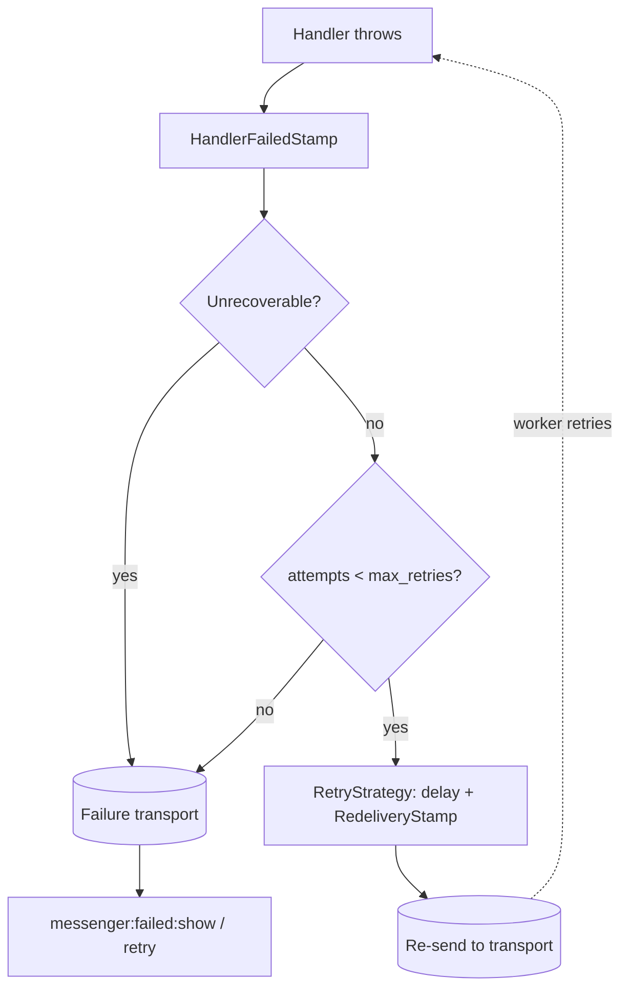

# Retries & Failures

!!! tip "In a nutshell"
    When a handler throws, `HandleMessageMiddleware` wraps the error in a
    `HandlerFailedStamp`; a `RetryStrategyInterface` (default
    `MultiplierRetryStrategy`) decides whether to retry with exponential
    backoff. Once `max_retries` is exhausted, the envelope goes to the
    **failure transport**. Throwing `UnrecoverableMessageHandlingException`
    skips retries entirely.

!!! example "Real-world analogy"
    A failed delivery attempt goes back on the truck for another try, with a
    longer wait before each next attempt (exponential backoff) — unless the
    address itself is invalid, in which case there is no point retrying and
    the parcel goes straight to the returns depot (the failure transport).
    After enough failed attempts on a fixable address, it goes to the
    returns depot too.

!!! abstract "Learning objectives"
    By the end of this chapter you can:

    - [ ] Configure a transport's `retry_strategy` (max attempts, delay, backoff).
    - [ ] Explain what happens once retries are exhausted.
    - [ ] Skip retries deliberately with `UnrecoverableMessageHandlingException`.

    **Syllabus:** `Messenger → Retries and failures` ·
    **Level:** Expert ·
    **Est. time:** 20 min ·
    **Prerequisites:** [Workers](workers.md)

---

## Theory

When a handler throws, `HandleMessageMiddleware` catches it and wraps it in
a `Stamp\HandlerFailedStamp`. The worker's retry logic — a
`RetryStrategyInterface`, defaulting to `MultiplierRetryStrategy` — decides
whether to **retry**: if so, it re-sends the envelope with a
`Stamp\RedeliveryStamp` and a delay. Once `max_retries` is exhausted, the
envelope is sent to the configured **failure transport**, inspectable with
`messenger:failed:show` and retriable with `messenger:failed:retry`.

```yaml
# config/packages/messenger.yaml
framework:
    messenger:
        failure_transport: failed   # inspect with messenger:failed:show / retry
        transports:
            async:
                dsn: '%env(MESSENGER_TRANSPORT_DSN)%'
                retry_strategy:     # default: MultiplierRetryStrategy
                    max_retries: 3  # exhausted → failure transport
                    delay: 1000     # ms; each retry re-sent with a RedeliveryStamp
                    multiplier: 2   # exponential backoff (this is also the framework default)
                    jitter: 0.1     # ±10% randomization on each delay (also the default)
```

!!! question "Predict first"
    With `delay: 1000`, `multiplier: 2`, and the default `jitter: 0.1`, are
    the delays before the 1st, 2nd, and 3rd retry attempts exactly
    1000/2000/4000 ms?

??? note "Reveal"
    **No — approximately**, within ±10% of each. `jitter` (default `0.1`)
    randomizes every computed delay to avoid a "thundering herd" of retries
    all firing at once; only `jitter: 0` makes the 1000/2000/4000 progression
    exact. The **base** delay still multiplies by `multiplier` each retry —
    this is exponential backoff, not a fixed
    interval repeated `max_retries` times.

## Deep Dive — how it works internally



Throwing `Symfony\Component\Messenger\Exception\UnrecoverableMessageHandlingException`
skips retries entirely and goes straight to the failure transport — use it
when the error is **structural** (invalid data that will never succeed),
not transient.

```php
use Symfony\Component\Messenger\Exception\UnrecoverableMessageHandlingException;

#[AsMessageHandler]
final class ChargeCardHandler
{
    public function __invoke(ChargeCard $message): void
    {
        if ($message->amount <= 0) {
            // no retry — goes straight to the failure transport
            throw new UnrecoverableMessageHandlingException('Invalid amount');
        }
    }
}
```

!!! note "Source reference"
    `Symfony\Component\Messenger\Retry\MultiplierRetryStrategy` and
    `Exception\UnrecoverableMessageHandlingException` —
    [symfony/symfony `8.0`](https://github.com/symfony/symfony/blob/8.0/src/Symfony/Component/Messenger/Retry/MultiplierRetryStrategy.php).

### Null behavior

A message that has **never failed** carries no `RedeliveryStamp` at all —
`$envelope->last(RedeliveryStamp::class)` is `null`, not a stamp with a
zero retry count. Checking `?->getRetryCount()` is the safe pattern: `null`
naturally means "first attempt," never "zero retries recorded."

```php
$count = $envelope->last(RedeliveryStamp::class)?->getRetryCount(); // null on first attempt
```

!!! note "Null in real life"
    A parcel with no "return to sender, attempt 2" label on it isn't on its
    zeroth retry — it simply hasn't failed yet. The absence of the label
    *is* the information.

## Configuration & code

=== "Retry strategy"

    ```yaml
    # config/packages/messenger.yaml
    framework:
        messenger:
            failure_transport: failed
            transports:
                async:
                    dsn: '%env(MESSENGER_TRANSPORT_DSN)%'
                    retry_strategy:
                        max_retries: 3
                        delay: 1000
                        multiplier: 2
                failed: 'doctrine://default?queue_name=failed'
    ```

=== "Console"

    ```console
    $ php bin/console messenger:failed:show
    $ php bin/console messenger:failed:retry
    $ php bin/console messenger:failed:remove <id>
    ```

## Best practices & anti-patterns

| ✅ Do | ❌ Avoid |
|---|---|
| Configure a `failure_transport` and monitor it | Silently losing messages on exhausted retries |
| Throw `UnrecoverableMessageHandlingException` for structural errors | Retrying a handler call that will never succeed |
| Tune `multiplier`/`delay` for the failure mode you expect | Using the same aggressive retry policy for every transport |
| Make handlers idempotent before relying on retries | Assuming "at-least-once" delivery means "exactly-once" |

## When (not) to use it / alternatives

Rely on retries for **transient** failures (a flaky network call, a
momentarily-down dependency). For failures that are certain to repeat
identically (bad input, a business-rule violation), skip straight to the
failure transport with `UnrecoverableMessageHandlingException` — retrying
those only delays the inevitable and wastes worker time.

!!! danger "Certification traps"
    - Delays follow **exponential backoff** (`delay × multiplier^attempt`),
      not a flat repeated interval — and the framework's default
      `jitter: 0.1` randomizes each one by up to ±10% on top of that.
    - Exhausted retries go to the **failure transport**, not the sync
      transport or a silent drop.
    - `UnrecoverableMessageHandlingException` skips retries entirely — it is
      not just "one fewer retry."
    - `RedeliveryStamp` absence means "first attempt," never "0 retries
      logged" — always guard with `?->`.
    - The delivery contract is **at-least-once**, never "exactly-once" —
      idempotent handlers are the application's responsibility.

!!! warning "Common mistakes"
    - Assuming a message is processed exactly once and writing
      non-idempotent handlers.
    - Forgetting to configure a `failure_transport`, so exhausted messages
      have nowhere useful to land.

## Exercises

1. **(Expert)** Configure `max_retries: 5` with a `2×` multiplier on an
   `async` transport.
2. **(Expert)** A `SendReminder` handler ran twice in production for the
   same message. What is the most likely cause, and what delivery guarantee
   does Messenger actually make?

??? success "Solutions"

    **1.**
    ```yaml
    retry_strategy: { max_retries: 5, delay: 1000, multiplier: 2 }
    ```

    **2.** Two supervisor programs both consumed the same `doctrine://`
    transport, and the handler was **not idempotent** — a slow first
    attempt outlived the visibility window, so the message was redelivered
    while attempt 1 was still running. Messenger's contract is
    **at-least-once** delivery, not exactly-once; handlers must be
    idempotent to be safe under retries.

## Certification questions

??? question "Q1. After a message exhausts its configured retries, where does it go?"
    - [x] A. The configured failure transport ✅
    - [ ] B. The sync transport
    - [ ] C. The PHP error log only, with no further trace
    - [ ] D. It is silently discarded

    **Why:** `failure_transport` stores permanently-failed messages for
    inspection/retry. **Ref:** [Failure transport](https://symfony.com/doc/8.0/messenger.html#saving-retrying-failed-messages).

??? question "Q2. How do you make a failing handler skip retries and go straight to the failure transport?"
    - [x] A. Throw `UnrecoverableMessageHandlingException` ✅
    - [ ] B. Return `false` from the handler
    - [ ] C. Add a `DelayStamp(0)`
    - [ ] D. Set `max_retries: 0` globally

    **Why:** that exception explicitly marks the failure as non-retryable.
    **Ref:** [Retries & failures](https://symfony.com/doc/8.0/messenger.html#retries-failures).

??? question "Q3. With `retry_strategy: { delay: 1000, multiplier: 2, jitter: 0 }`, what are the base delays before retries 1, 2, and 3?"
    - [x] A. 1000 ms, 2000 ms, 4000 ms ✅
    - [ ] B. 1000 ms, 1000 ms, 1000 ms
    - [ ] C. 1000 ms, 3000 ms, 6000 ms
    - [ ] D. 2000 ms, 4000 ms, 8000 ms

    **Why:** each delay is the previous one multiplied by `multiplier` —
    exponential backoff starting from `delay`. `jitter: 0` is what makes
    the progression this exact; the framework default `jitter: 0.1`
    randomizes each value by up to ±10%.
    **Ref:** [Symfony source — MultiplierRetryStrategy](https://github.com/symfony/symfony/blob/8.0/src/Symfony/Component/Messenger/Retry/MultiplierRetryStrategy.php).

??? question "Q3b. What does the `retry_strategy` option `jitter: 0.1` (the framework default) do?"
    - [x] A. Randomizes each computed delay by up to ±10%, to avoid a thundering herd of retries ✅
    - [ ] B. Adds a flat 10% to every delay, deterministically
    - [ ] C. Retries 10% faster on each attempt
    - [ ] D. Nothing unless `multiplier` is also set

    **Why:** `jitter` is a randomization factor (0 to 1) applied to the
    computed delay; it is on by default (`0.1`), which surprises anyone who
    memorized "delay × multiplier" as an exact formula without it.
    **Ref:** [Symfony source — MultiplierRetryStrategy](https://github.com/symfony/symfony/blob/8.0/src/Symfony/Component/Messenger/Retry/MultiplierRetryStrategy.php).

??? question "Q4. What information does a `RedeliveryStamp` carry on a retried message?"
    - [x] A. The retry attempt count and the previous error ✅
    - [ ] B. The transport's DSN
    - [ ] C. The handler's return value
    - [ ] D. Nothing — it is a marker with no data

    **Why:** `RedeliveryStamp` is the retry bookkeeping stamp, exposing
    `getRetryCount()` and the recorded exception.
    **Ref:** [Symfony source — RedeliveryStamp](https://github.com/symfony/symfony/tree/8.0/src/Symfony/Component/Messenger/Stamp).

## Key takeaways

- Retries follow exponential backoff: `delay × multiplier^attempt`.
- `HandlerFailedStamp` wraps the exception; `RedeliveryStamp` tracks retry
  count; exhausted retries land in the failure transport.
- `UnrecoverableMessageHandlingException` skips retries entirely.
- Messenger's delivery contract is at-least-once — handlers must be idempotent.

## Last-minute revision

!!! tip "Cheat sheet"
    - `retry_strategy: { max_retries, delay, multiplier, jitter }` — exponential
      backoff, ±`jitter` randomization (default `0.1`; set `0` for exact delays).
    - Exhausted → `failure_transport`; inspect with `messenger:failed:show|retry|remove`.
    - `UnrecoverableMessageHandlingException` = no retry, straight to failure transport.
    - `RedeliveryStamp` absent = first attempt, not "0 retries."
    - Delivery guarantee: **at-least-once**, never exactly-once.

## Connections

- **Depends on:** [Workers](workers.md) — a worker's `reject()` is what
  triggers this retry decision.
- **Reused in:** [Middleware](middleware.md) — `HandlerFailedStamp`/
  `RedeliveryStamp` are stamps on the same `Envelope` covered there.
- **Confused with:** [Transports](transports.md) — `retry_strategy` is
  configured per-transport, but it is its own subtopic, not a transport
  property in general.

## Official References

- [Official docs — Retries & failures](https://symfony.com/doc/8.0/messenger.html#retries-failures)
- [Symfony source — MultiplierRetryStrategy](https://github.com/symfony/symfony/blob/8.0/src/Symfony/Component/Messenger/Retry/MultiplierRetryStrategy.php)
- [Symfony source — UnrecoverableMessageHandlingException](https://github.com/symfony/symfony/blob/8.0/src/Symfony/Component/Messenger/Exception/UnrecoverableMessageHandlingException.php)

## Video references

!!! tip "Watch & learn"
    These are official, continuously-updated video channels — search them for
    "Symfony Messenger retries" to reinforce this chapter. We link stable channels rather than
    individual videos so the references never rot.

    - [SymfonyCasts screencasts](https://symfonycasts.com/tracks/symfony) — scripted, code-along tutorials.
    - [Symfony official YouTube](https://www.youtube.com/@SymfonyOfficial) — SymfonyCon conference talks & keynotes.
    - [Official docs for this topic](https://symfony.com/doc/8.0/messenger.html#retries-failures) — some Symfony doc pages embed a screencast.

## Confidence check

I'm ready when I can:

- [ ] explain **why** retries use exponential backoff instead of a fixed delay
- [ ] configure `retry_strategy` and a `failure_transport` in Symfony 8
- [ ] debug a message stuck retrying that should fail immediately
- [ ] spot the trap: at-least-once delivery, not exactly-once
- [ ] read a `RedeliveryStamp` safely, including on a first attempt

---

<small>Related: [Workers](workers.md) · [Middleware](middleware.md) · [Transports](transports.md)</small>
