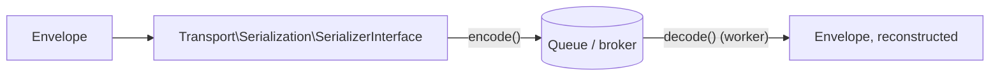

# Transports

!!! tip "In a nutshell"
    Un **transport** est un `TransportInterface` configuré par DSN (un
    récepteur + un émetteur) vers lequel un message peut être routé au lieu
    de faire tourner son handler immédiatement. Les schémas de DSN intégrés
    incluent `sync://`, `doctrine://`, `amqp://`, `redis://`, et
    `in-memory://` (pour les tests). Le sérialiseur d'enveloppe par défaut
    est le `serialize()` natif de PHP ; le Serializer de Symfony est
    l'alternative interopérable.

!!! example "Real-world analogy"
    Un transport est un service de livraison précis auquel vous pouvez
    confier une lettre — le coursier interne (`sync://`, livré
    immédiatement, même bâtiment), un service postal partagé
    (`doctrine://`/`amqp://`/`redis://`, mis en file, livré plus tard par
    quelqu'un d'autre), ou une boîte aux lettres d'entraînement qui ne quitte
    jamais la pièce (`in-memory://`, pour répéter sans rien envoyer
    réellement).

!!! abstract "Learning objectives"
    À la fin de ce chapitre, vous saurez :

    - [ ] Nommer les schémas de DSN de transport intégrés et à quoi sert chacun.
    - [ ] Router un message vers un transport et expliquer ce qui le sérialise.
    - [ ] Choisir `in-memory://` correctement pour les tests.

    **Syllabus:** `Messenger → Transports` ·
    **Level:** Expert ·
    **Est. time:** 20 min ·
    **Prerequisites:** [Middleware](middleware.fr.md)

    **Examen Symfony 8 :** OUI

---

## Pour les nuls

### L'idée en une phrase
Un transport est le service de livraison auquel tu confies un message — immédiat sur place, ou mis en file d'attente pour plus tard.

### Imagine dans la vraie vie
Un transport est un service de livraison précis auquel tu peux confier une lettre — le coursier interne (`sync://`, livré immédiatement, même bâtiment), un service postal partagé (`doctrine://`/`amqp://`/`redis://`, mis en file, livré plus tard par quelqu'un d'autre), ou une boîte aux lettres d'entraînement qui ne quitte jamais la pièce (`in-memory://`, pour les tests).

### Dans Symfony
Un message qui n'a **aucune** entrée de routage n'est pas une erreur — il est simplement traité **synchroniquement**, en place, exactement comme s'il était routé vers `sync://`.

### Exemple simple
```yaml
routing:
    'App\Message\EnvoyerEmailBienvenue': async
```

### Comment le mémoriser 🧠
Les transports **tiers** (Doctrine, Redis, AMQP, Amazon SQS) sont **explicitement exclus de l'examen** — attends-toi à des questions sur les contrats Messenger eux-mêmes, pas sur l'exploitation d'un broker précis.

## Theory

Un **transport** est défini par un **DSN** et implémente
`Symfony\Component\Messenger\Transport\TransportInterface` (une paire
récepteur + émetteur). `SendMessageMiddleware` (voir [Middleware](middleware.fr.md))
consulte la configuration de **routing** pour décider vers quel(s)
transport(s), le cas échéant, un message va.

| DSN scheme | Transport |
|---|---|
| `sync://` | En mémoire, traité immédiatement dans le même process |
| `doctrine://` | Une table de base de données faisant office de file |
| `amqp://` | Broker RabbitMQ / AMQP |
| `redis://` | Streams Redis |
| `in-memory://` | Transport de test, garde les messages en mémoire |

!!! question "Predict first"
    Vous routez un message vers `in-memory://` à l'intérieur d'un test
    fonctionnel. Le message est-il réellement "envoyé" quelque part, ou
    traité par un vrai handler ?

??? note "Reveal"
    Ni l'un ni l'autre, par défaut — `in-memory://` **stocke l'enveloppe en
    mémoire** sans la traiter, donc un test peut affirmer *ce qui aurait été
    envoyé* (`InMemoryTransport::getSent()`) sans aucune infrastructure
    réelle ni effet de bord.

## Deep Dive — how it works internally

### Third-party transports are out of scope

Les transports basés sur Doctrine, Redis et AMQP (et tout transport fourni
par un bundle tiers, comme Amazon SQS) sont **exclus de la certification
Symfony 8** — l'examen se concentre sur les contrats propres de Messenger
(`TransportInterface`, routing, sérialisation) et les transports `sync://`/
`in-memory://` fournis dans le cœur, pas sur l'exploitation d'un broker
précis.

### Routing and serialization

Le routing associe le FQCN d'un message à un ou plusieurs noms de
transport ; `SendMessageMiddleware` le consulte à chaque dispatch.

```yaml
# config/packages/messenger.yaml
framework:
    messenger:
        transports:
            async:
                dsn: '%env(MESSENGER_TRANSPORT_DSN)%'  # construit un TransportInterface
                # remplace le PhpSerializer par défaut (PHP serialize()) pour l'interopérabilité :
                serializer: messenger.transport.symfony_serializer
        routing:
            'App\Message\SendReminder': async
```

Par défaut, le **sérialiseur PHP**
(`Symfony\Component\Messenger\Transport\Serialization\PhpSerializer`)
`serialize()` l'enveloppe et ses stamps. Le sérialiseur de transport
**Symfony Serializer** (`messenger.transport.symfony_serializer`) est
recommandé quand le consommateur pourrait ne pas être en PHP, ou quand la
stabilité du payload entre déploiements compte plus que la vitesse brute de
`serialize()`.



!!! note "Source reference"
    `Symfony\Component\Messenger\Transport\TransportInterface` et
    `Transport\Serialization\SerializerInterface` —
    [symfony/symfony `8.0`](https://github.com/symfony/symfony/blob/8.0/src/Symfony/Component/Messenger/Transport/TransportInterface.php).

### Null behavior

Un message sans **aucune entrée de routage** pour sa classe n'est pas une
erreur en soi — il est simplement traité **synchroniquement**, dans le
process, comme si aucun transport n'existait (`SendMessageMiddleware` ne
trouve aucun émetteur correspondant et laisse passer vers
`HandleMessageMiddleware`). Ne confondez pas "non routé" avec "mal
configuré" — un message intentionnellement synchrone est un cas normal et
courant.

```php
// Aucune entrée de routing pour FooMessage -> traité synchroniquement, dans le process,
// exactement comme s'il avait été explicitement routé vers sync://.
$bus->dispatch(new FooMessage());
```

!!! note "Null in real life"
    Une lettre sans étiquette de service de livraison n'est pas du courrier
    perdu — ça veut juste dire la remettre à qui se trouve juste là, ce qui
    est exactement ce qui arrive quand un message n'a aucune entrée de
    routing.

## Configuration & code

=== "PHP Attributes"

    ```php
    <?php
    declare(strict_types=1);

    namespace App\Message;

    final readonly class SendReminder
    {
        public function __construct(public int $userId) {}
    }
    ```

=== "YAML"

    ```yaml
    # config/packages/messenger.yaml
    framework:
        messenger:
            transports:
                async:
                    dsn: '%env(MESSENGER_TRANSPORT_DSN)%'
                sync: 'sync://'
            routing:
                'App\Message\SendReminder': async
    ```

=== "Console"

    ```console
    $ php bin/console debug:messenger
    $ php bin/console messenger:setup-transports
    ```

## Best practices & anti-patterns

| ✅ Do | ❌ Avoid |
|---|---|
| Router le travail lent/à effets de bord vers un transport async | Faire du travail email/HTTP synchroniquement dans la request |
| Utiliser `in-memory://` dans les tests fonctionnels | Toucher un vrai broker dans la suite de tests |
| Lire le DSN depuis une variable d'environnement | Coder en dur les identifiants du broker en YAML |
| Choisir le Symfony Serializer pour l'interopérabilité cross-langage | Supposer que la sortie de `PhpSerializer` est portable |

## When (not) to use it / alternatives

Routez vers un transport async quand le travail peut tolérer d'être différé
et retenté. Pour un travail qui doit se terminer avant que la réponse ne
revienne, laissez le message non routé (ou routez explicitement vers
`sync://` pour la clarté) — il traverse quand même le pipeline de middleware
complet et la découverte de handler, juste dans le process.

!!! danger "Certification traps"
    - `sync://` fait quand même tourner le **pipeline de middleware
      complet** — ce n'est pas "pas de transport", c'est un transport
      explicite et immédiat.
    - Les transports tiers (Doctrine, Redis, AMQP, Amazon SQS, …) sont
      **exclus de la certification** — attendez-vous à des questions
      d'examen sur les contrats et les transports du cœur, pas sur
      l'exploitation d'un broker précis.
    - Le sérialiseur par défaut est **`PhpSerializer`**, pas le Symfony
      Serializer — il faut opter explicitement pour ce dernier.
    - Un message sans entrée de routing est traité **synchroniquement**, pas
      abandonné ou en erreur.

!!! warning "Common mistakes"
    - Supposer que chaque message doit être explicitement routé pour
      fonctionner du tout.
    - Utiliser un DSN de vrai broker dans les tests au lieu de `in-memory://`.

## Exercises

1. **(Advanced)** Configurez un transport `async` lisant son DSN depuis
   `MESSENGER_TRANSPORT_DSN` et routez `App\Message\SendReminder` vers lui.
2. **(Expert)** Expliquez ce qui se passe, étape par étape, quand une classe
   de message n'a aucune entrée sous `framework.messenger.routing`.

??? success "Solutions"

    **1.** Voir l'onglet YAML ci-dessus : `transports.async.dsn`, puis
    `routing: { 'App\Message\SendReminder': async }`.

    **2.** `SendMessageMiddleware` vérifie la configuration de routing, ne
    trouve aucun émetteur correspondant, et laisse passer l'enveloppe
    inchangée ; `HandleMessageMiddleware` appelle alors le handler
    directement, dans le process d'envoi — exactement comme s'il avait été
    routé vers `sync://`.

## Certification questions

*Question d'entraînement inspirée du syllabus — jamais une question officielle de l'examen.*

??? question "Q1. Quel transport intégré traite un message immédiatement dans le même process ?"
    - [x] A. `sync://` ✅
    - [ ] B. `doctrine://`
    - [ ] C. `in-memory://`
    - [ ] D. `amqp://`

    **Why:** `sync://` est le transport dans le process ; les autres mettent
    en file pour une consommation plus tardive, hors process.
    **Ref:** [Messenger — sync transport](https://symfony.com/doc/8.0/messenger.html#transports-async-queued-messages).

??? question "Q2. Quel sérialiseur un transport Messenger utilise-t-il par défaut ?"
    - [x] A. `Transport\Serialization\PhpSerializer` (le `serialize()` de PHP) ✅
    - [ ] B. Le Symfony Serializer
    - [ ] C. `json_encode`/`json_decode` directement
    - [ ] D. Aucune sérialisation — les objets passent par référence

    **Why:** le défaut est le `serialize()` natif de PHP ; le Symfony
    Serializer est un opt-in explicite pour l'interopérabilité.
    **Ref:** [Messenger — serializer](https://symfony.com/doc/8.0/messenger.html#serializing-messages).

??? question "Q3. Quel transport est prévu spécifiquement pour les tests fonctionnels ?"
    - [x] A. `in-memory://` ✅
    - [ ] B. `sync://`
    - [ ] C. `doctrine://`
    - [ ] D. `test://`

    **Why:** `in-memory://` stocke les enveloppes sans infrastructure
    externe, donc les tests peuvent affirmer ce qui aurait été envoyé.
    **Ref:** [Messenger — Testing](https://symfony.com/doc/8.0/messenger.html#testing).

## Key takeaways

- Un transport est un `TransportInterface` configuré par DSN ; le routing
  associe une classe de message à un ou plusieurs noms de transport.
- `sync://` fait quand même tourner le pipeline complet, juste dans le
  process ; les messages non routés se comportent implicitement pareil.
- Sérialiseur par défaut : `PhpSerializer` ; le Symfony Serializer est
  l'alternative interopérable.
- Les transports Doctrine/Redis/AMQP/Amazon SQS sont exclus de l'examen.

## Last-minute revision

!!! tip "Cheat sheet"
    - Schémas de DSN : `sync://`, `doctrine://`, `amqp://`, `redis://`, `in-memory://` (tests).
    - `framework.messenger.routing` : `FQCN: transport-name`.
    - Sérialiseur par défaut : `PhpSerializer` ; opt-in : `messenger.transport.symfony_serializer`.
    - Pas d'entrée de routing ⇒ traité synchroniquement, pas une erreur.
    - Transports tiers (Doctrine/Redis/AMQP/SQS) — **hors examen**.

## Connections

- **Depends on:** [Middleware](middleware.fr.md) — `SendMessageMiddleware` est
  ce qui route réellement vers un transport.
- **Reused in:** [Workers](workers.fr.md) — un worker consomme depuis
  exactement un transport par invocation `messenger:consume`.
- **Confused with:** [Retries & Failures](retries-failures.fr.md) — l'option
  `retry_strategy` d'un transport est configurée aux côtés de son DSN mais
  c'est son propre sujet.

## Official References

- [Official docs — Messenger transports](https://symfony.com/doc/8.0/messenger.html#transports-async-queued-messages)
- [Symfony source — TransportInterface](https://github.com/symfony/symfony/blob/8.0/src/Symfony/Component/Messenger/Transport/TransportInterface.php)

## Video references

!!! tip "Watch & learn"
    Ce sont des chaînes vidéo officielles, mises à jour en continu — cherchez-y
    "Symfony Messenger transports" pour renforcer ce chapitre. Nous lions des
    chaînes stables plutôt que des vidéos individuelles pour que les
    références ne deviennent jamais obsolètes.

    - [SymfonyCasts screencasts](https://symfonycasts.com/tracks/symfony) — tutoriels scénarisés, en code.
    - [Symfony official YouTube](https://www.youtube.com/@SymfonyOfficial) — conférences et keynotes SymfonyCon.
    - [Official docs for this topic](https://symfony.com/doc/8.0/messenger.html#transports-async-queued-messages) — certaines pages de doc Symfony embarquent un screencast.

## Confidence check

Je suis prêt quand je peux :

- [ ] expliquer **pourquoi** un DSN, pas un nom de classe, configure un transport
- [ ] router un message et choisir le bon sérialiseur en Symfony 8
- [ ] déboguer un message qui tourne synchroniquement alors qu'un traitement async était attendu
- [ ] repérer le piège : `sync://` fait tourner le pipeline complet ; non routé ≠ erreur
- [ ] nommer quels transports sont dans le périmètre de l'examen et lesquels non

---

<small>Related: [Middleware](middleware.fr.md) · [Workers](workers.fr.md) · [Retries & Failures](retries-failures.fr.md)</small>
