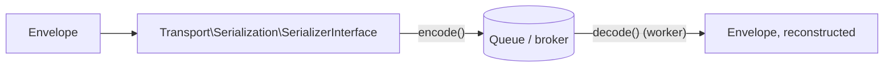

# Transports

!!! tip "In a nutshell"
    A **transport** is a DSN-configured `TransportInterface` (a receiver +
    sender) that a message can be routed to instead of running its handler
    immediately. Built-in DSN schemes include `sync://`, `doctrine://`,
    `amqp://`, `redis://`, and `in-memory://` (for tests). The default
    envelope serializer is PHP's own `serialize()`; the Symfony Serializer
    is the interoperable alternative.

!!! example "Real-world analogy"
    A transport is a specific delivery service you can hand a letter to —
    the in-house courier (`sync://`, delivered immediately, same building),
    a shared postal service (`doctrine://`/`amqp://`/`redis://`, queued,
    delivered later by someone else), or a practice mailbox that never
    leaves the room (`in-memory://`, for rehearsing without really sending
    anything).

!!! abstract "Learning objectives"
    By the end of this chapter you can:

    - [ ] Name the built-in transport DSN schemes and what each is for.
    - [ ] Route a message to a transport and explain what serializes it.
    - [ ] Choose `in-memory://` correctly for tests.

    **Syllabus:** `Messenger → Transports` ·
    **Level:** Expert ·
    **Est. time:** 20 min ·
    **Prerequisites:** [Middleware](middleware.md)

---

## Theory

A **transport** is defined by a **DSN** and implements
`Symfony\Component\Messenger\Transport\TransportInterface` (a receiver +
sender pair). `SendMessageMiddleware` (see [Middleware](middleware.md))
consults the **routing** configuration to decide which transport(s), if
any, a message goes to.

| DSN scheme | Transport |
|---|---|
| `sync://` | In-memory, handled immediately in the same process |
| `doctrine://` | A database table acting as a queue |
| `amqp://` | RabbitMQ / AMQP broker |
| `redis://` | Redis streams |
| `in-memory://` | Test transport, keeps messages in memory |

!!! question "Predict first"
    You route a message to `in-memory://` inside a functional test. Does the
    message actually get "sent" anywhere, or processed by a real handler?

??? note "Reveal"
    Neither, by default — `in-memory://` **stores the envelope in memory**
    without handling it, so a test can assert *what would have been sent*
    (`InMemoryTransport::getSent()`) without any real infrastructure or side
    effects.

## Deep Dive — how it works internally

### Third-party transports are out of scope

Doctrine, Redis and AMQP-backed transports (and any transport shipped by a
third-party bundle, such as Amazon SQS) are **excluded from the Symfony 8
certification** — the exam focuses on Messenger's own contracts
(`TransportInterface`, routing, serialization) and the `sync://`/
`in-memory://` transports that ship in core, not on operating a specific
broker.

### Routing and serialization

Routing maps a message's FQCN to one or more transport names; the
`SendMessageMiddleware` looks this up on every dispatch.

```yaml
# config/packages/messenger.yaml
framework:
    messenger:
        transports:
            async:
                dsn: '%env(MESSENGER_TRANSPORT_DSN)%'  # builds a TransportInterface
                # replace the default PhpSerializer (PHP serialize()) for interop:
                serializer: messenger.transport.symfony_serializer
        routing:
            'App\Message\SendReminder': async
```

By default the **PHP serializer**
(`Symfony\Component\Messenger\Transport\Serialization\PhpSerializer`)
`serialize()`s the envelope and its stamps. The **Symfony Serializer**
transport serializer (`messenger.transport.symfony_serializer`) is
recommended when the consumer might not be PHP, or when payload stability
across deploys matters more than raw `serialize()` speed.



!!! note "Source reference"
    `Symfony\Component\Messenger\Transport\TransportInterface` and
    `Transport\Serialization\SerializerInterface` —
    [symfony/symfony `8.0`](https://github.com/symfony/symfony/blob/8.0/src/Symfony/Component/Messenger/Transport/TransportInterface.php).

### Null behavior

A message with **no routing entry** for its class is not an error by
itself — it is simply handled **synchronously**, in-process, as if no
transport existed (`SendMessageMiddleware` finds no matching sender and
passes through to `HandleMessageMiddleware`). Do not confuse "not routed"
with "misconfigured" — an intentionally-synchronous message is a normal,
common case.

```php
// No routing entry for FooMessage -> handled synchronously, in-process,
// exactly like dispatching to sync:// explicitly.
$bus->dispatch(new FooMessage());
```

!!! note "Null in real life"
    A letter with no delivery-service label isn't lost mail — it just means
    hand it to whoever is standing right there, which is exactly what
    happens when a message has no routing entry.

## Configuration & code

=== "PHP Attributes"

    ```php
    <?php
    declare(strict_types=1);

    namespace App\Message;

    final readonly class SendReminder
    {
        public function __construct(public int $userId) {}
    }
    ```

=== "YAML"

    ```yaml
    # config/packages/messenger.yaml
    framework:
        messenger:
            transports:
                async:
                    dsn: '%env(MESSENGER_TRANSPORT_DSN)%'
                sync: 'sync://'
            routing:
                'App\Message\SendReminder': async
    ```

=== "Console"

    ```console
    $ php bin/console debug:messenger
    $ php bin/console messenger:setup-transports
    ```

## Best practices & anti-patterns

| ✅ Do | ❌ Avoid |
|---|---|
| Route slow/side-effecting work to an async transport | Doing email/HTTP work synchronously in the request |
| Use `in-memory://` in functional tests | Hitting a real broker in the test suite |
| Read the DSN from an env var | Hard-coding broker credentials in YAML |
| Pick the Symfony Serializer for cross-language interop | Assuming `PhpSerializer` output is portable |

## When (not) to use it / alternatives

Route to an async transport when the work can tolerate being deferred and
retried. For work that must complete before the response returns, leave the
message unrouted (or route to `sync://` explicitly for clarity) — it still
gets the full middleware pipeline and handler discovery, just in-process.

!!! danger "Certification traps"
    - `sync://` still runs the **full middleware pipeline** — it is not "no
      transport," it is an explicit, immediate one.
    - Third-party transports (Doctrine, Redis, AMQP, Amazon SQS, …) are
      **excluded from the certification** — expect exam questions on the
      contracts and core transports, not on operating a specific broker.
    - The default serializer is **`PhpSerializer`**, not the Symfony
      Serializer — you must opt in to the latter.
    - A message with no routing entry is handled **synchronously**, not
      dropped or errored.

!!! warning "Common mistakes"
    - Assuming every message must be explicitly routed to work at all.
    - Using a real broker DSN in tests instead of `in-memory://`.

## Exercises

1. **(Advanced)** Configure an `async` transport reading its DSN from
   `MESSENGER_TRANSPORT_DSN` and route `App\Message\SendReminder` to it.
2. **(Expert)** Explain what happens, step by step, when a message class has
   no entry under `framework.messenger.routing`.

??? success "Solutions"

    **1.** See the YAML tab above: `transports.async.dsn`, then
    `routing: { 'App\Message\SendReminder': async }`.

    **2.** `SendMessageMiddleware` checks the routing configuration, finds
    no matching sender, and passes the envelope through unchanged;
    `HandleMessageMiddleware` then calls the handler directly, in the
    dispatching process — exactly as if it had been routed to `sync://`.

## Certification questions

??? question "Q1. Which built-in transport handles a message immediately in the same process?"
    - [x] A. `sync://` ✅
    - [ ] B. `doctrine://`
    - [ ] C. `in-memory://`
    - [ ] D. `amqp://`

    **Why:** `sync://` is the in-process transport; the others queue for
    later, out-of-process consumption.
    **Ref:** [Messenger — sync transport](https://symfony.com/doc/current/messenger.html#transports-async-queued-messages).

??? question "Q2. Which serializer does a Messenger transport use by default?"
    - [x] A. `Transport\Serialization\PhpSerializer` (PHP's `serialize()`) ✅
    - [ ] B. The Symfony Serializer
    - [ ] C. `json_encode`/`json_decode` directly
    - [ ] D. No serialization — objects pass by reference

    **Why:** the default is PHP's native `serialize()`; the Symfony
    Serializer is an explicit opt-in for interop.
    **Ref:** [Messenger — serializer](https://symfony.com/doc/current/messenger.html#serializing-messages).

??? question "Q3. Which transport is intended specifically for functional tests?"
    - [x] A. `in-memory://` ✅
    - [ ] B. `sync://`
    - [ ] C. `doctrine://`
    - [ ] D. `test://`

    **Why:** `in-memory://` stores envelopes without external
    infrastructure, so tests can assert on what would have been sent.
    **Ref:** [Messenger — Testing](https://symfony.com/doc/current/messenger.html#testing).

## Key takeaways

- A transport is a DSN-configured `TransportInterface`; routing maps a
  message class to one or more transport names.
- `sync://` still runs the full pipeline, just in-process; unrouted
  messages behave the same way implicitly.
- Default serializer: `PhpSerializer`; Symfony Serializer is the
  interoperable alternative.
- Doctrine/Redis/AMQP/Amazon SQS transports are excluded from the exam.

## Last-minute revision

!!! tip "Cheat sheet"
    - DSN schemes: `sync://`, `doctrine://`, `amqp://`, `redis://`, `in-memory://` (tests).
    - `framework.messenger.routing`: `FQCN: transport-name`.
    - Default serializer: `PhpSerializer`; opt-in: `messenger.transport.symfony_serializer`.
    - No routing entry ⇒ handled synchronously, not an error.
    - Third-party transports (Doctrine/Redis/AMQP/SQS) — **out of scope**.

## Connections

- **Depends on:** [Middleware](middleware.md) — `SendMessageMiddleware` is
  what actually routes to a transport.
- **Reused in:** [Workers](workers.md) — a worker consumes from exactly one
  transport per `messenger:consume` invocation.
- **Confused with:** [Retries & Failures](retries-failures.md) — a
  transport's `retry_strategy` option is configured alongside its DSN but
  is its own topic.

## Official References

- [Official docs — Messenger transports](https://symfony.com/doc/current/messenger.html#transports-async-queued-messages)
- [Symfony source — TransportInterface](https://github.com/symfony/symfony/blob/8.0/src/Symfony/Component/Messenger/Transport/TransportInterface.php)

## Video references

!!! tip "Watch & learn"
    These are official, continuously-updated video channels — search them for
    "Symfony Messenger transports" to reinforce this chapter. We link stable channels rather than
    individual videos so the references never rot.

    - [SymfonyCasts screencasts](https://symfonycasts.com/tracks/symfony) — scripted, code-along tutorials.
    - [Symfony official YouTube](https://www.youtube.com/@SymfonyOfficial) — SymfonyCon conference talks & keynotes.
    - [Official docs for this topic](https://symfony.com/doc/current/messenger.html#transports-async-queued-messages) — some Symfony doc pages embed a screencast.

## Confidence check

I'm ready when I can:

- [ ] explain **why** a DSN, not a class name, configures a transport
- [ ] route a message and pick the right serializer in Symfony 8
- [ ] debug a message that runs synchronously when async was expected
- [ ] spot the trap: `sync://` runs the full pipeline; unrouted ≠ error
- [ ] name which transports are in scope for the exam and which are not

---

<small>Related: [Middleware](middleware.md) · [Workers](workers.md) · [Retries & Failures](retries-failures.md)</small>
