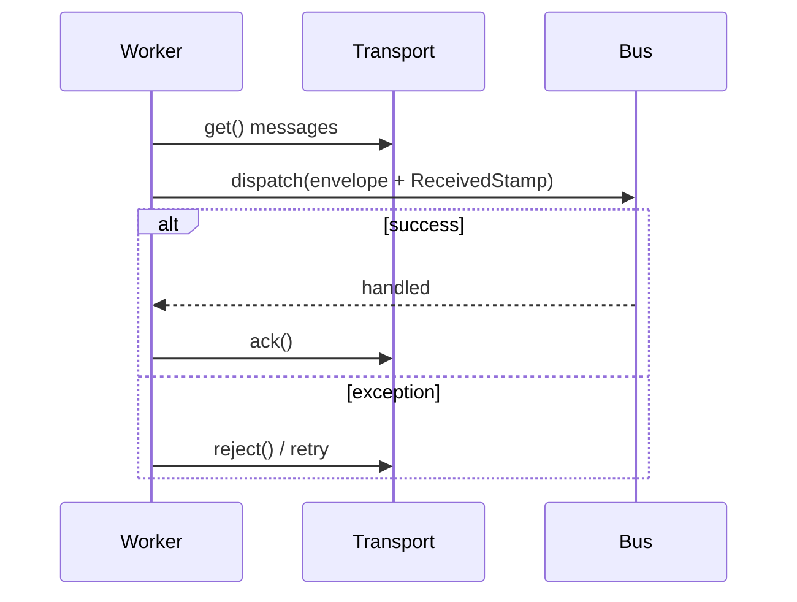

# Workers

!!! tip "In a nutshell"
    `messenger:consume <transport>` construit un `Worker` qui boucle :
    **réception → passage à travers le bus (avec `ReceivedStamp`) → ack en
    cas de succès / reject en cas d'échec**. Il ne s'arrête jamais tout seul
    — les outils de déploiement doivent le recycler avec
    `--limit`/`--time-limit` ou `messenger:stop-workers`, sinon il continue
    de tourner avec du vieux code indéfiniment.

!!! example "Real-world analogy"
    Un worker est un coursier qui fait sa tournée : ramasser une lettre à la
    salle de tri (receive), tenter la livraison (dispatch via le bus), puis
    soit la marquer livrée (ack) soit la remettre pour un autre essai
    (reject). Livré à lui-même, le coursier continue sa tournée pour
    toujours — quelqu'un doit le renvoyer chez lui en fin de service
    (`--time-limit`) ou lui dire par radio de s'arrêter
    (`messenger:stop-workers`) après qu'un nouveau planning (déploiement)
    commence.

!!! abstract "Learning objectives"
    À la fin de ce chapitre, vous saurez :

    - [ ] Retracer la boucle réception → dispatch → ack/reject de `messenger:consume`.
    - [ ] Recycler les workers en toute sécurité au travers d'un déploiement.
    - [ ] Expliquer ce que marque `ReceivedStamp` et quand il est ajouté.

    **Syllabus:** `Messenger → Workers` ·
    **Level:** Expert ·
    **Est. time:** 20 min ·
    **Prerequisites:** [Transports](transports.fr.md), [Console](../console/index.md)

    **Examen Symfony 8 :** OUI

---

## Pour les nuls

### L'idée en une phrase
Un worker est un processus de longue durée qui tourne en boucle — et il ne recharge **jamais** automatiquement ton code après un déploiement, il faut le redémarrer explicitement.

### Imagine dans la vraie vie
Un worker est un coursier qui fait sa tournée : ramasser une lettre à la salle de tri (receive), tenter la livraison (dispatch via le bus), puis soit la marquer livrée (ack) soit la remettre pour un autre essai (reject). Livré à lui-même, le coursier continue sa tournée pour toujours.

### Dans Symfony
Après un déploiement, un worker `messenger:consume` déjà lancé continue de tourner avec l'**ancien** code chargé en mémoire jusqu'à ce qu'il soit explicitement recyclé — c'est une source classique de bugs "pourquoi mon correctif n'est pas pris en compte ?".

### Exemple simple
```console
$ php bin/console messenger:consume async --time-limit=3600
$ php bin/console messenger:stop-workers  # arrêt propre, entre deux messages
```

### Comment le mémoriser 🧠
`messenger:stop-workers` est un arrêt **propre** — il ne tue jamais un message en cours de traitement, il pose juste un drapeau vérifié entre deux messages.

## Theory

`messenger:consume <transport>` construit un
`Symfony\Component\Messenger\Worker` qui boucle sur un ou plusieurs
transports : **recevoir** un message, **le pousser à travers le bus** (en le
taguant d'abord avec un `ReceivedStamp`), puis **ack** le transport en cas
de succès ou **reject** (déclenche le traitement de retry/échec) en cas
d'exception.

```console
# Démarre un Worker : réception → dispatch (avec ReceivedStamp) → boucle ack/reject
$ php bin/console messenger:consume async -vv --time-limit=3600
```

!!! question "Predict first"
    Vous déployez du nouveau code pendant qu'un worker `messenger:consume`
    d'avant le déploiement tourne encore. Prend-il automatiquement en compte
    le nouveau code pour le prochain message qu'il traite ?

??? note "Reveal"
    **Non.** Un process PHP de longue durée a l'ancien code chargé en
    mémoire pour toute sa durée de vie. Vous devez le recycler — l'arrêter
    (proprement, via `--time-limit`/`--limit` ou `messenger:stop-workers`)
    et laisser votre gestionnaire de process en démarrer un neuf qui charge
    le nouveau code déployé.

## Deep Dive — how it works internally



`ReceivedStamp` est ajouté par le worker lui-même, juste avant de repousser
l'enveloppe à travers le bus — il marque "cette enveloppe vient d'une
réception de transport", ce sur quoi la machinerie de retry/échec (voir
[Retries & Failures](retries-failures.fr.md)) s'appuie pour savoir qu'elle
traite une redélivrance, pas un dispatch neuf.

!!! note "Source reference"
    `Symfony\Component\Messenger\Worker::run()` —
    [symfony/symfony `8.0`](https://github.com/symfony/symfony/blob/8.0/src/Symfony/Component/Messenger/Worker.php).

### Graceful shutdown

Trois mécanismes indépendants recyclent un worker plutôt que de le laisser
tourner pour toujours :

| Option / command | Effect |
|---|---|
| `--limit=N` | Arrête après avoir traité N messages |
| `--time-limit=N` | Arrête après N secondes |
| `--memory-limit=128M` | Arrête une fois que l'usage mémoire dépasse la limite |
| `messenger:stop-workers` | Signale à tous les workers en cours de s'arrêter après leur message courant |

`messenger:stop-workers` ne **tue pas** les workers immédiatement — il pose
un drapeau que chaque worker vérifie entre les messages, donc un message en
cours de traitement peut toujours finir (ack/reject) avant que le process ne
se termine.

```console
$ php bin/console messenger:consume async -vv --limit=10 --time-limit=3600 --memory-limit=128M
$ php bin/console messenger:stop-workers
```

### Null behavior

Un worker sans **aucun message en attente** ne fait pas d'erreur ni ne
renvoie `null` — il bloque/interroge simplement (selon le transport) jusqu'à
ce qu'un message arrive ou qu'une limite de recyclage soit atteinte. "Aucun
message" est un état stable normal et attendu pour un worker, pas une
condition d'échec à surveiller.

!!! note "Null in real life"
    Un coursier posté devant une salle de tri vide n'est pas en panne —
    attendre la prochaine lettre fait partie du métier, ce n'est pas un état
    d'erreur.

## Configuration & code

=== "Console"

    ```console
    $ php bin/console messenger:consume async -vv --limit=10 --time-limit=3600
    $ php bin/console messenger:stop-workers
    ```

=== "Supervisor-style recycling"

    ```console
    # Un gestionnaire de process redémarre le worker après qu'il quitte via --time-limit,
    # donc chaque process neuf prend en compte le dernier code déployé.
    $ php bin/console messenger:consume async --time-limit=3600 --memory-limit=128M
    ```

## Best practices & anti-patterns

| ✅ Do | ❌ Avoid |
|---|---|
| Utiliser `--limit`/`--time-limit` + un gestionnaire de process pour recycler les workers | Des workers de longue durée qui ne redémarrent jamais |
| Appeler `messenger:stop-workers` à chaque déploiement | Supposer que les workers prennent en compte le nouveau code automatiquement |
| Fixer `--memory-limit` pour des handlers avec des dépendances qui fuient | Laisser la mémoire croître sans limite sur des milliers de messages |
| Laisser un superviseur redémarrer un worker qui se termine | Surveiller manuellement les process worker |

## When (not) to use it / alternatives

Lancez un worker `messenger:consume` dédié dès qu'un transport route des
messages de façon asynchrone — sans lui, les messages en file s'accumulent
simplement et ne sont jamais traités. Si tout est routé vers `sync://` (ou
non routé), aucun worker n'est nécessaire du tout.

!!! danger "Certification traps"
    - Un worker en cours ne recharge **pas** le code automatiquement au
      déploiement — il doit être recyclé.
    - `messenger:stop-workers` signale un arrêt **propre** entre les
      messages, il ne tue pas un traitement en cours.
    - `ReceivedStamp` est ajouté par le **worker**, pas par le transport ou
      l'appel `dispatch()` original.
    - `--limit`, `--time-limit`, et `--memory-limit` sont trois mécanismes de
      recyclage **indépendants** — n'importe lequel peut déclencher un arrêt.

!!! warning "Common mistakes"
    - Déployer du nouveau code et oublier de redémarrer/recycler les
      workers, laissant l'ancien code tourner pendant des heures.
    - Confondre `messenger:stop-workers` avec un signal de kill immédiat.

## Exercises

1. **(Advanced)** Démarrez un worker qui s'arrête après 1 heure ou 128 Mo de
   mémoire, selon ce qui arrive en premier.
2. **(Expert)** Après un déploiement, des workers de longue durée continuent
   d'exécuter l'ancien code. Quelle commande les recycle en toute sécurité,
   et pourquoi n'interrompt-elle pas un message en cours ?

??? success "Solutions"

    **1.**
    ```console
    $ php bin/console messenger:consume async --time-limit=3600 --memory-limit=128M
    ```

    **2.** `php bin/console messenger:stop-workers` — il pose un drapeau que
    chaque worker vérifie **entre** les messages, donc le message courant
    finit toujours (ack/reject) avant que le process ne se termine ; un
    gestionnaire de process démarre alors un worker neuf qui charge le
    déploiement récent.

## Certification questions

*Question d'entraînement inspirée du syllabus — jamais une question officielle de l'examen.*

??? question "Q1. Après un déploiement, des workers de longue durée continuent d'exécuter l'ancien code. Quelle commande y répond ?"
    - [x] A. `messenger:stop-workers` ✅
    - [ ] B. `messenger:consume --reload`
    - [ ] C. `cache:clear`
    - [ ] D. Les workers rechargent automatiquement ; aucune commande n'est nécessaire

    **Why:** les workers sont des process PHP de longue durée avec l'ancien
    code chargé en mémoire ; `stop-workers` les recycle proprement pour
    qu'un process neuf prenne en compte le nouveau déploiement.
    **Ref:** [Messenger — Deploying](https://symfony.com/doc/8.0/messenger.html#deploying-to-production).

??? question "Q2. Quelles options permettent à `messenger:consume` d'arrêter un worker proprement pour des déploiements sans coupure ?"
    - [x] A. `--limit`, `--time-limit`, `--memory-limit` ✅
    - [ ] B. `--stop-now`
    - [ ] C. `--kill-after`
    - [ ] D. Aucune — les workers doivent être tués avec `kill -9`

    **Why:** les trois sont des mécanismes de recyclage indépendants et
    propres qui laissent d'abord finir le message courant.
    **Ref:** [Messenger — Consuming messages](https://symfony.com/doc/8.0/messenger.html#consuming-messages-running-the-worker).

??? question "Q3. Quel stamp le worker ajoute-t-il avant de repousser une enveloppe reçue à travers le bus ?"
    - [x] A. `ReceivedStamp` ✅
    - [ ] B. `SentStamp`
    - [ ] C. `HandledStamp`
    - [ ] D. `BusNameStamp`

    **Why:** `ReceivedStamp` marque que l'enveloppe vient d'une réception de
    transport, sur laquelle s'appuie la logique de retry/échec.
    **Ref:** [Symfony source — Worker](https://github.com/symfony/symfony/blob/8.0/src/Symfony/Component/Messenger/Worker.php).

## Key takeaways

- La boucle du worker : réception → dispatch (avec `ReceivedStamp`) → ack/reject.
- Les workers ne rechargent jamais le code automatiquement ; recyclez-les à chaque déploiement.
- `--limit`/`--time-limit`/`--memory-limit` et `messenger:stop-workers` sont
  les outils de recyclage propre ; aucun n'interrompt un message en cours.
- Un worker qui n'a rien à consommer est un état stable normal, pas une erreur.

## Last-minute revision

!!! tip "Cheat sheet"
    - `messenger:consume <transport> --limit --time-limit --memory-limit`.
    - `messenger:stop-workers` — signal d'arrêt propre entre les messages.
    - Le worker ajoute `ReceivedStamp` ; boucle = réception → dispatch → ack/reject.
    - L'ancien code continue de tourner jusqu'à ce que le process worker soit recyclé.

## Connections

- **Depends on:** [Transports](transports.fr.md) — un worker consomme depuis
  un transport nommé ; [Console](../console/index.md) — le worker *est* la
  commande `messenger:consume`.
- **Reused in:** [Events](events.fr.md) — le worker déclenche les événements
  `WorkerMessage*` autour de chaque étape de cette même boucle.
- **Confused with:** [Retries & Failures](retries-failures.fr.md) — la
  décision ack/reject du worker est ce qui *déclenche* la logique de retry,
  mais la stratégie de retry elle-même est configurée sur le transport.

## Official References

- [Official docs — Consuming messages](https://symfony.com/doc/8.0/messenger.html#consuming-messages-running-the-worker)
- [Official docs — Deploying to production](https://symfony.com/doc/8.0/messenger.html#deploying-to-production)
- [Symfony source — Worker](https://github.com/symfony/symfony/blob/8.0/src/Symfony/Component/Messenger/Worker.php)

## Video references

!!! tip "Watch & learn"
    Ce sont des chaînes vidéo officielles, mises à jour en continu — cherchez-y
    "Symfony Messenger worker" pour renforcer ce chapitre. Nous lions des
    chaînes stables plutôt que des vidéos individuelles pour que les
    références ne deviennent jamais obsolètes.

    - [SymfonyCasts screencasts](https://symfonycasts.com/tracks/symfony) — tutoriels scénarisés, en code.
    - [Symfony official YouTube](https://www.youtube.com/@SymfonyOfficial) — conférences et keynotes SymfonyCon.
    - [Official docs for this topic](https://symfony.com/doc/8.0/messenger.html#consuming-messages-running-the-worker) — certaines pages de doc Symfony embarquent un screencast.

## Confidence check

Je suis prêt quand je peux :

- [ ] expliquer **pourquoi** les workers ont besoin d'un recyclage explicite après un déploiement
- [ ] configurer `--limit`/`--time-limit`/`--memory-limit` en Symfony 8
- [ ] déboguer un worker bloqué à exécuter l'ancien code après un déploiement
- [ ] repérer le piège : `messenger:stop-workers` est propre, pas un kill
- [ ] retracer la boucle réception → dispatch → ack/reject et où s'insère `ReceivedStamp`

---

<small>Related: [Transports](transports.fr.md) · [Retries & Failures](retries-failures.fr.md) · [Events](events.fr.md)</small>
