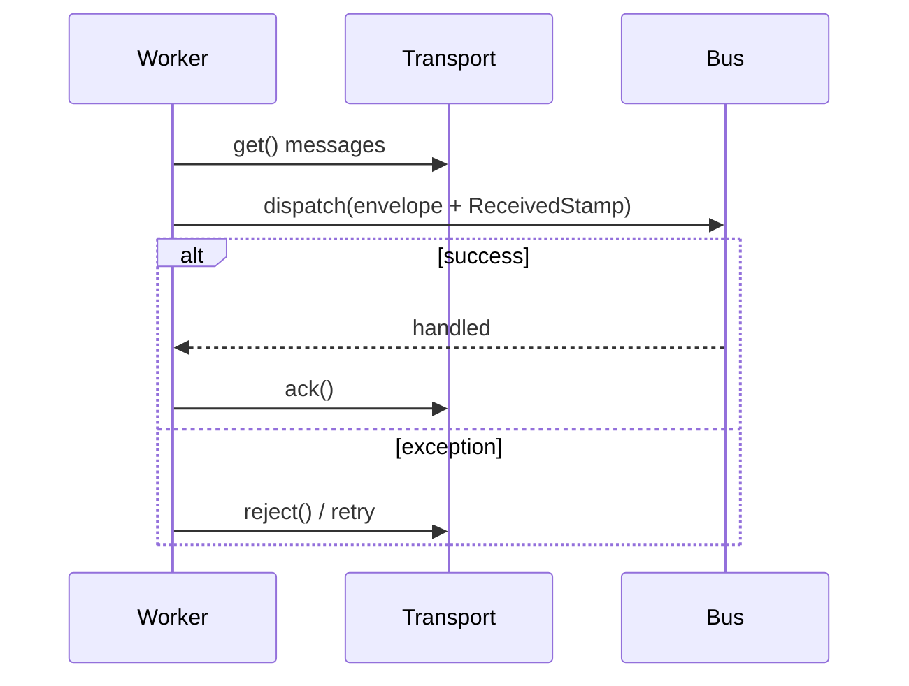

# Workers

!!! tip "In a nutshell"
    `messenger:consume <transport>` builds a `Worker` that loops:
    **receive → push through the bus (with `ReceivedStamp`) → ack on
    success / reject on failure**. It never stops on its own — deploy tools
    must recycle it with `--limit`/`--time-limit` or `messenger:stop-workers`,
    or it keeps running old code indefinitely.

!!! example "Real-world analogy"
    A worker is a courier making rounds: pick up a letter from the sorting
    room (receive), attempt delivery (dispatch through the bus), then either
    mark it delivered (ack) or put it back for another attempt (reject). Left
    alone, the courier keeps making rounds forever — someone has to send them
    home at the end of a shift (`--time-limit`) or radio them to stop
    (`messenger:stop-workers`) after a new schedule (deploy) begins.

!!! abstract "Learning objectives"
    By the end of this chapter you can:

    - [ ] Trace the `messenger:consume` receive → dispatch → ack/reject loop.
    - [ ] Recycle workers safely across a deploy.
    - [ ] Explain what `ReceivedStamp` marks and when it is added.

    **Syllabus:** `Messenger → Workers` ·
    **Level:** Expert ·
    **Est. time:** 20 min ·
    **Prerequisites:** [Transports](transports.md), [Console](../console/index.md)

---

## Theory

`messenger:consume <transport>` builds a
`Symfony\Component\Messenger\Worker` that loops over one or more
transports: **receive** a message, **push it through the bus** (tagging it
with a `ReceivedStamp` first), then **ack** the transport on success or
**reject** (trigger retry/failure handling) on an exception.

```console
# Starts a Worker: receive → dispatch (with ReceivedStamp) → ack/reject loop
$ php bin/console messenger:consume async -vv --time-limit=3600
```

!!! question "Predict first"
    You deploy new code while a `messenger:consume` worker from before the
    deploy is still running. Does it automatically pick up the new code for
    the next message it processes?

??? note "Reveal"
    **No.** A long-running PHP process has the old code loaded in memory for
    its entire lifetime. You must recycle it — stop it (gracefully, via
    `--time-limit`/`--limit` or `messenger:stop-workers`) and let your
    process manager start a fresh one that loads the new deployed code.

## Deep Dive — how it works internally



`ReceivedStamp` is added by the worker itself, right before pushing the
envelope back through the bus — it marks "this envelope came from a
transport receive," which the retry/failure machinery (see
[Retries & Failures](retries-failures.md)) relies on to know it is handling
a redelivery, not a fresh dispatch.

!!! note "Source reference"
    `Symfony\Component\Messenger\Worker::run()` —
    [symfony/symfony `8.0`](https://github.com/symfony/symfony/blob/8.0/src/Symfony/Component/Messenger/Worker.php).

### Graceful shutdown

Three independent mechanisms recycle a worker instead of letting it run
forever:

| Option / command | Effect |
|---|---|
| `--limit=N` | Stop after handling N messages |
| `--time-limit=N` | Stop after N seconds |
| `--memory-limit=128M` | Stop once memory usage crosses the limit |
| `messenger:stop-workers` | Signal all running workers to stop after their current message |

`messenger:stop-workers` does **not** kill workers immediately — it sets a
flag each worker checks between messages, so an in-flight message is always
allowed to finish (ack/reject) before the process exits.

```console
$ php bin/console messenger:consume async -vv --limit=10 --time-limit=3600 --memory-limit=128M
$ php bin/console messenger:stop-workers
```

### Null behavior

A worker with **no messages waiting** does not error or return `null` — it
simply blocks/polls (transport-dependent) until one arrives or a recycling
limit is hit. "No message" is a normal, expected steady state for a worker,
not a failure condition to guard against.

!!! note "Null in real life"
    A courier standing at an empty sorting room isn't broken — waiting for
    the next letter is the job description, not an error state.

## Configuration & code

=== "Console"

    ```console
    $ php bin/console messenger:consume async -vv --limit=10 --time-limit=3600
    $ php bin/console messenger:stop-workers
    ```

=== "Supervisor-style recycling"

    ```console
    # A process manager restarts the worker after it exits from --time-limit,
    # so each fresh process picks up the latest deployed code.
    $ php bin/console messenger:consume async --time-limit=3600 --memory-limit=128M
    ```

## Best practices & anti-patterns

| ✅ Do | ❌ Avoid |
|---|---|
| Use `--limit`/`--time-limit` + a process manager to recycle workers | Long-lived workers that never restart |
| Call `messenger:stop-workers` on every deploy | Assuming workers pick up new code automatically |
| Set `--memory-limit` for handlers with leaky dependencies | Letting memory grow unbounded across thousands of messages |
| Let a supervisor restart a worker that exits | Manually babysitting worker processes |

## When (not) to use it / alternatives

Run a dedicated `messenger:consume` worker whenever any transport routes
messages asynchronously — without one, queued messages simply accumulate
and are never processed. If everything is routed to `sync://` (or
unrouted), no worker is needed at all.

!!! danger "Certification traps"
    - A running worker does **not** reload code automatically on deploy —
      it must be recycled.
    - `messenger:stop-workers` signals a **graceful** stop between messages,
      it does not kill in-flight processing.
    - `ReceivedStamp` is added by the **worker**, not by the transport or
      the original `dispatch()` call.
    - `--limit`, `--time-limit`, and `--memory-limit` are three
      **independent** recycling mechanisms — any one of them can trigger a stop.

!!! warning "Common mistakes"
    - Deploying new code and forgetting to restart/recycle workers, leaving
      old code running for hours.
    - Confusing `messenger:stop-workers` with an immediate kill signal.

## Exercises

1. **(Advanced)** Start a worker that stops after 1 hour or 128 MB of
   memory, whichever comes first.
2. **(Expert)** After a deploy, long-running workers keep executing the old
   code. Which command safely recycles them, and why doesn't it interrupt
   an in-flight message?

??? success "Solutions"

    **1.**
    ```console
    $ php bin/console messenger:consume async --time-limit=3600 --memory-limit=128M
    ```

    **2.** `php bin/console messenger:stop-workers` — it sets a flag each
    worker checks **between** messages, so the current message always
    finishes (ack/reject) before the process exits; a process manager then
    starts a fresh worker that loads the newly deployed code.

## Certification questions

??? question "Q1. After a deploy, long-running workers keep executing the old code. Which command addresses this?"
    - [x] A. `messenger:stop-workers` ✅
    - [ ] B. `messenger:consume --reload`
    - [ ] C. `cache:clear`
    - [ ] D. Workers reload automatically; no command is needed

    **Why:** workers are long-running PHP processes with old code loaded in
    memory; `stop-workers` gracefully recycles them so a fresh process picks
    up the new deploy. **Ref:** [Messenger — Deploying](https://symfony.com/doc/current/messenger.html#deploying-to-production).

??? question "Q2. Which options let `messenger:consume` stop a worker gracefully for zero-downtime deploys?"
    - [x] A. `--limit`, `--time-limit`, `--memory-limit` ✅
    - [ ] B. `--stop-now`
    - [ ] C. `--kill-after`
    - [ ] D. None — workers must be `kill -9`'d

    **Why:** all three are independent, graceful recycling mechanisms that
    let the current message finish first.
    **Ref:** [Messenger — Consuming messages](https://symfony.com/doc/current/messenger.html#consuming-messages-running-the-worker).

??? question "Q3. Which stamp does the worker add before pushing a received envelope back through the bus?"
    - [x] A. `ReceivedStamp` ✅
    - [ ] B. `SentStamp`
    - [ ] C. `HandledStamp`
    - [ ] D. `BusNameStamp`

    **Why:** `ReceivedStamp` marks that the envelope came from a transport
    receive, which retry/failure logic relies on.
    **Ref:** [Symfony source — Worker](https://github.com/symfony/symfony/blob/8.0/src/Symfony/Component/Messenger/Worker.php).

## Key takeaways

- The worker loop: receive → dispatch (with `ReceivedStamp`) → ack/reject.
- Workers never auto-reload code; recycle them on every deploy.
- `--limit`/`--time-limit`/`--memory-limit` and `messenger:stop-workers` are
  the graceful recycling tools; none of them interrupt an in-flight message.
- A worker with nothing to consume is a normal steady state, not an error.

## Last-minute revision

!!! tip "Cheat sheet"
    - `messenger:consume <transport> --limit --time-limit --memory-limit`.
    - `messenger:stop-workers` — graceful, between-message stop signal.
    - Worker adds `ReceivedStamp`; loop is receive → dispatch → ack/reject.
    - Old code keeps running until the worker process is recycled.

## Connections

- **Depends on:** [Transports](transports.md) — a worker consumes from a
  named transport; [Console](../console/index.md) — the worker *is* the
  `messenger:consume` command.
- **Reused in:** [Events](events.md) — the worker fires `WorkerMessage*`
  events around each step of this exact loop.
- **Confused with:** [Retries & Failures](retries-failures.md) — the
  worker's ack/reject decision is what *triggers* retry logic, but the
  retry strategy itself is configured on the transport.

## Official References

- [Official docs — Consuming messages](https://symfony.com/doc/current/messenger.html#consuming-messages-running-the-worker)
- [Official docs — Deploying to production](https://symfony.com/doc/current/messenger.html#deploying-to-production)
- [Symfony source — Worker](https://github.com/symfony/symfony/blob/8.0/src/Symfony/Component/Messenger/Worker.php)

## Video references

!!! tip "Watch & learn"
    These are official, continuously-updated video channels — search them for
    "Symfony Messenger worker" to reinforce this chapter. We link stable channels rather than
    individual videos so the references never rot.

    - [SymfonyCasts screencasts](https://symfonycasts.com/tracks/symfony) — scripted, code-along tutorials.
    - [Symfony official YouTube](https://www.youtube.com/@SymfonyOfficial) — SymfonyCon conference talks & keynotes.
    - [Official docs for this topic](https://symfony.com/doc/current/messenger.html#consuming-messages-running-the-worker) — some Symfony doc pages embed a screencast.

## Confidence check

I'm ready when I can:

- [ ] explain **why** workers need explicit recycling after a deploy
- [ ] configure `--limit`/`--time-limit`/`--memory-limit` in Symfony 8
- [ ] debug a worker stuck running old code after a deploy
- [ ] spot the trap: `messenger:stop-workers` is graceful, not a kill
- [ ] trace the receive → dispatch → ack/reject loop and where `ReceivedStamp` fits

---

<small>Related: [Transports](transports.md) · [Retries & Failures](retries-failures.md) · [Events](events.md)</small>
