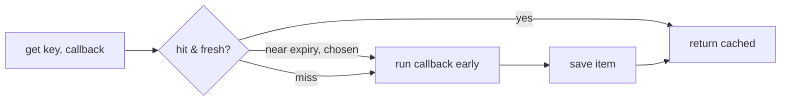

# Cache Component

!!! tip "In a nutshell"
    Symfony Cache stocke les résultats coûteux pour ne les calculer qu'une seule
    fois. Préférez le contrat `CacheInterface::get($key, $callback)` — il calcule
    la valeur en cas de miss et intègre une protection contre le stampede.
    Retenez : seul PSR-6 (via un `TagAwareAdapter`) prend en charge les tags ;
    PSR-16 non.

!!! example "Real-world analogy"
    Un cache est un **bloc-notes que vous consultez avant de faire un travail
    coûteux**. Avant de recalculer une valeur onéreuse, vous jetez un œil au bloc
    (`get()`) : si la réponse y est déjà écrite (un hit), vous la lisez ; sinon
    (un miss), vous faites le travail **une seule fois**, vous le notez, puis vous
    rendez le résultat — la prochaine fois, vous vous contentez de lire la note.
    Les tags sont des étiquettes autocollantes qui regroupent des notes liées afin
    de pouvoir toutes les arracher d'un coup (`invalidateTags()`).

!!! abstract "Learning objectives"
    À la fin de ce chapitre, vous saurez :

    - [ ] Distinguer PSR-6, PSR-16 et les **contracts** Symfony Cache.
    - [ ] Utiliser `CacheInterface::get()` avec un callback et choisir un adapter.
    - [ ] Appliquer des **tags** de cache et expliquer la **stampede protection**.

    **Syllabus:** `Miscellaneous → Cache` ·
    **Level:** Advanced → Expert ·
    **Est. time:** 40 min ·
    **Prerequisites:** [Dependency Injection](../dependency-injection/index.md)

---

## Theory

Symfony Cache propose trois API qui se recouvrent :

| API | Interface | Style |
|---|---|---|
| **PSR-6** | `Psr\Cache\CacheItemPoolInterface` | Pool + objets `CacheItem` |
| **PSR-16** | `Psr\SimpleCache\CacheInterface` | Simple get/set par clé |
| **Symfony contracts** | `Symfony\Contracts\Cache\CacheInterface` | `get()` à base de callback avec stampede protection intégrée |

L'API des **contracts** est celle recommandée : `get($key, callable $callback)`
calcule et stocke en cas de miss, en un seul appel.

## Deep Dive — how it works internally

!!! question "Predict first"
    Votre callback de `get()` retourne `null` (l'enregistrement n'a pas été
    trouvé). Au **prochain** appel avec la même clé, le callback s'exécute-t-il à
    nouveau ?

??? note "Reveal"
    Non. `null` est une **valeur mise en cache valide** : le cache des contracts
    la stocke et l'appel suivant la retourne comme un **hit**, en sautant le
    callback jusqu'à son expiration. Seul un vrai miss (rien de stocké) relance le
    callback.

### PSR-6 pool + item lifecycle

`CacheItemPoolInterface::getItem($key)` retourne un
`Psr\Cache\CacheItemInterface`. Vous vérifiez `$item->isHit()`, et en cas de miss
vous appelez `$item->set($value)->expiresAfter($ttl)` puis `$pool->save($item)`.
Les items sont des objets avec état — c'est verbeux mais explicite.

### The contracts API and stampede protection

`Symfony\Contracts\Cache\CacheInterface::get()` :

```php
public function get(string $key, callable $callback, ?float $beta = null, ?array &$metadata = null): mixed
```

En cas de miss, elle appelle `$callback(ItemInterface $item, bool &$save)` pour
calculer la valeur, la sauvegarde et la retourne. Son atout majeur est
l'**expiration anticipée probabiliste** (« stampede protection ») : quand un item
approche de son expiration, une request est choisie (via le facteur `$beta`) pour
recalculer *en avance* pendant que les autres servent encore la valeur en cache —
ce qui évite un **cache stampede**, où de nombreuses requests concurrentes
recalculent toutes en même temps une valeur coûteuse. Mettre `$beta = INF` force
le recalcul ; `0` désactive l'expiration anticipée.



Les pools concrets implémentent à la fois PSR-6 et l'interface des contracts
(par ex. `Symfony\Component\Cache\Adapter\FilesystemAdapter`).

!!! note "Source reference"
    `Symfony\Contracts\Cache\CacheInterface` et `ContractsTrait` (expiration anticipée) —
    [symfony/symfony `8.0`](https://github.com/symfony/symfony/blob/8.0/src/Symfony/Contracts/Cache/CacheInterface.php).

### Adapters

| Adapter | Backing store |
|---|---|
| `FilesystemAdapter` | Fichiers sur disque |
| `ApcuAdapter` | Mémoire partagée APCu |
| `RedisAdapter` | Serveur Redis |
| `ArrayAdapter` | En mémoire (par request ; tests) |
| `ChainAdapter` | Essaie plusieurs adapters dans l'ordre |
| `NullAdapter` | No-op (désactive le cache) |
| `PhpFilesAdapter` | Fichiers PHP compatibles opcache |

### Tags

Le `TagAwareAdapter` (qui enveloppe n'importe quel adapter) implémente
`Symfony\Contracts\Cache\TagAwareCacheInterface`. Dans le callback, vous appelez
`$item->tag(['products'])` ; plus tard, `$pool->invalidateTags(['products'])`
évince **tous** les items portant ce tag — une invalidation par préoccupation
plutôt que par clé.

### PSR-6 vs PSR-16

PSR-16 (`SimpleCache`) est une API clé→valeur minimaliste, sans objets item, sans
tags, sans sauvegardes différées — pratique mais limitée. PSR-6 prend en charge
les sauvegardes différées (`saveDeferred`/`commit`) et les métadonnées. Les
contracts Symfony enveloppent PSR-6 avec l'ergonomie du callback + la stampede
protection.

### Null behavior

`CacheInterface::get()` **ne retourne jamais null pour signifier « miss »** — en
cas de miss, elle exécute votre callback, stocke ce qu'il calcule et retourne
cette valeur. Point crucial : `null` est une **valeur mise en cache valide** — si
votre callback retourne `null`, le cache stocke null et les appels suivants le
retournent comme un **hit** (ils ne recalculent *pas*). C'est pourquoi l'API des
contracts contourne le piège classique de PSR-6, où `getItem($key)->get()`
retourne `null` aussi bien pour « absent » que pour « null stocké » — avec PSR-6,
vous devez vérifier `isHit()` pour les distinguer. Mettre en cache « aucun
résultat » sous forme de `null` est correct ; retenez simplement que cela compte
comme un hit jusqu'à expiration.

!!! note "Null in real life"
    Un `null` stocké est une note sur le bloc qui dit « vérifié — rien ici ». Vous
    lisez quand même la note au lieu de refaire le travail ; un bloc vierge (aucune
    note du tout) est le vrai miss.

!!! info "Expert note"
    La stampede protection est invisible jusqu'au moment où vous *cessez* d'en
    bénéficier. Dès que vous repassez à l'API PSR-6 brute `getItem()`/`save()` (ou
    que vous mettez `$beta = 0`), vous perdez le recalcul anticipé probabiliste —
    sous charge, chaque request qui voit l'item expiré recalcule en même temps.
    Gardez les clés chaudes sur `CacheInterface::get($key, $cb)`, et réservez PSR-6
    aux cas où vous avez réellement besoin de sauvegardes différées ou de
    métadonnées.

??? example "Debugging story"
    **Symptôme :** `invalidateTags(['products'])` ne faisait rien — des prix
    périmés continuaient d'être servis. **Diagnostic :** le pool était un simple
    `FilesystemAdapter`, jamais enveloppé dans un `TagAwareAdapter` ; `$item->tag()`
    était donc de fait un no-op et aucune métadonnée de tag n'était stockée.
    **Correction :** activer `tags: true` sur le pool afin qu'une
    `TagAwareCacheInterface` soit injectée. **À éviter :** appeler `tag()` en
    supposant que le pool gère les tags — vérifiez le type injecté.

??? abstract "Source-code tour"
    - `Symfony\Contracts\Cache\CacheInterface::get()` est implémentée via
      `Cache\Traits\ContractsTrait`, qui calcule l'expiration anticipée
      probabiliste à partir des métadonnées de l'item et de `$beta`.
    - Les adapters comme `Cache\Adapter\FilesystemAdapter` étendent
      `Cache\Adapter\AbstractAdapter` et implémentent **à la fois** le
      `CacheItemPoolInterface` PSR-6 et l'interface des contracts.
    - `Cache\Adapter\TagAwareAdapter` décore n'importe quel pool en stockant des
      clés tag→version ; `invalidateTags()` incrémente la version d'un tag pour
      que tous les items taggés deviennent périmés d'un coup.
    - `Cache\CacheItem` porte la valeur, l'expiration et les métadonnées de tag
      que le trait lit pour décider hit / expiration anticipée / miss.

## Configuration & code

=== "PHP Attributes"

    ```php
    <?php
    declare(strict_types=1);

    namespace App\Service;

    use Symfony\Contracts\Cache\CacheInterface;
    use Symfony\Contracts\Cache\ItemInterface;

    final class PriceService
    {
        public function __construct(private readonly CacheInterface $cache) {}

        public function priceFor(int $id): float
        {
            return $this->cache->get("price_$id", function (ItemInterface $item): float {
                $item->expiresAfter(3600);
                $item->tag(['prices']);

                return $this->recomputeExpensivePrice(); // runs only on miss
            });
        }

        private function recomputeExpensivePrice(): float { return 9.99; }
    }
    ```

=== "YAML"

    ```yaml
    # config/packages/cache.yaml
    framework:
        cache:
            app: cache.adapter.filesystem
            pools:
                prices.cache:
                    adapter: cache.adapter.redis
                    tags: true
    ```

=== "Console"

    ```console
    $ php bin/console cache:pool:list
    $ php bin/console cache:pool:clear cache.app
    ```

## Best practices & anti-patterns

| ✅ Do | ❌ Avoid |
|---|---|
| Utiliser l'API à callback `get()` des contracts | `isHit()`/`save()` manuels, sauf besoin réel de PSR-6 |
| Tagger les items liés et `invalidateTags()` | Supprimer les clés une par une |
| S'appuyer sur la stampede protection pour les clés chaudes | Recalculer les valeurs coûteuses à chaque rafale de miss |
| Choisir l'adapter selon les données (APCu local, Redis partagé) | Un seul pool filesystem pour tout ce qui est partagé |

## When (not) to use it / alternatives

Utilisez le cache applicatif pour les calculs coûteux et réutilisables. Préférez
le **HTTP caching** (voir [HTTP Caching](../http-caching/index.md)) pour des
responses entières. Utilisez `ArrayAdapter`/`NullAdapter` dans les tests pour
qu'ils restent déterministes.

!!! danger "Certification traps"
    - `CacheInterface::get()` exécute le callback **uniquement en cas de miss** ; la valeur de retour est mise en cache.
    - Stampede protection = **expiration anticipée probabiliste** via `$beta`.
    - Les tags nécessitent un **`TagAwareAdapter`**/un pool avec `tags: true`.
    - PSR-16 n'a **ni tags ni sauvegardes différées** ; PSR-6 si.
    - `$beta = INF` force le recalcul immédiat.

!!! warning "Common mistakes"
    - Appeler `$item->tag()` sur un pool sans gestion des tags → erreur.
    - S'attendre à ce que les données d'`ArrayAdapter` survivent d'une request à l'autre.

## Exercises

1. **(Advanced)** Mettez en cache un prix coûteux pendant 1 heure, taggé
   `prices`, avec l'API des contracts ; puis invalidez par tag.
2. **(Advanced)** Expliquez ce qui se passe sous charge quand 500 requests
   frappent une clé chaude expirée avec la stampede protection activée.

??? success "Solutions"

    **1.** Voir `PriceService` ci-dessus ; invalidez avec
    `$pool->invalidateTags(['prices'])` sur un pool `TagAwareCacheInterface`.

    **2.** À l'approche de l'expiration de l'item, une request est choisie de
    manière probabiliste pour recalculer en avance et rafraîchir le cache pendant
    que les autres requests continuent de servir la valeur en cache encore valide
    — évitant ainsi un recalcul en troupeau (thundering herd).

## Certification questions

??? question "Q1. `Symfony\Contracts\Cache\CacheInterface::get()` runs its callback…"
    - [x] A. only on a cache miss ✅
    - [ ] B. on every call
    - [ ] C. never — you must call save()

    **Why:** Le callback calcule la valeur en cas de miss ; le résultat est stocké
    et retourné. **Ref:** [Cache contracts](https://symfony.com/doc/current/cache.html#cache-contracts).

??? question "Q2. Which API supports cache tags?"
    - [ ] A. PSR-16 SimpleCache
    - [x] B. PSR-6 pools via a TagAwareAdapter ✅
    - [ ] C. Neither

    **Why:** Les tags nécessitent un `TagAwareAdapter` ; PSR-16 n'a aucune prise en charge des tags.
    **Ref:** [Cache tags](https://symfony.com/doc/current/cache.html#using-cache-tags).

??? question "Q3. Stampede protection is implemented by…"
    - [x] A. probabilistic early expiration controlled by `$beta` ✅
    - [ ] B. a global mutex on every key
    - [ ] C. disabling TTLs

    **Why:** Le recalcul anticipé est choisi de manière probabiliste à l'approche de l'expiration.
    **Ref:** [Stampede prevention](https://symfony.com/doc/current/cache.html#stampede-prevention).

## Key takeaways

- Trois API : PSR-6 (items), PSR-16 (simple), contracts Symfony (`get()` à callback).
- Le `get($key, $cb, $beta)` des contracts = calcul en cas de miss + stampede protection.
- Adapters : filesystem, apcu, redis, array, chain, null, phpfiles.
- Tags via `TagAwareAdapter` → `invalidateTags()`.

## Last-minute revision

!!! tip "Cheat sheet"
    - `CacheItemPoolInterface` (PSR-6) · `SimpleCache` (PSR-16) · `CacheInterface` (contracts).
    - `get($key, fn(ItemInterface $i) => ..., $beta)` ; `$i->expiresAfter()`, `$i->tag()`.
    - Stampede = expiration anticipée ; `$beta=INF` force le recalcul.
    - `cache:pool:clear`, `pools:` avec `tags: true`.

## Connections

- **Depends on:** [Dependency Injection](../dependency-injection/index.md) — les pools sont configurés comme services et autowirés par nom de pool.
- **Reused in:** [Deployment](deployment.md) — les cache warmers préconstruisent les pools/métadonnées ; [HTTP Caching](../http-caching/index.md) met en cache des responses entières plutôt que des valeurs.
- **Confused with:** [Lock](lock.md) — les deux touchent à la concurrence, mais le Lock impose une exclusion mutuelle tandis que la stampede protection ne fait que *réduire* les recalculs en double.

## Official References
- [Official docs — Cache](https://symfony.com/doc/current/cache.html)
- [Official docs — Cache contracts](https://symfony.com/doc/current/components/cache.html)
- [Symfony source — CacheInterface](https://github.com/symfony/symfony/blob/8.0/src/Symfony/Contracts/Cache/CacheInterface.php)

## Video references

!!! tip "Watch & learn"
    Voici des chaînes vidéo officielles, mises à jour en continu — cherchez-y
    « Symfony components » pour consolider ce chapitre. Nous référençons des
    chaînes stables plutôt que des vidéos individuelles pour que les références ne
    périment jamais.

    - [SymfonyCasts screencasts](https://symfonycasts.com/tracks/symfony) — tutoriels scénarisés à suivre en codant.
    - [Symfony official YouTube](https://www.youtube.com/@SymfonyOfficial) — conférences et keynotes SymfonyCon.
    - [Official docs for this topic](https://symfony.com/doc/current/cache.html#cache-contracts) — certaines pages de la doc Symfony intègrent un screencast.

## Confidence check

Je suis prêt quand je peux :

- [ ] expliquer **pourquoi** l'API à callback `get()` surpasse les `isHit()`/`save()` manuels
- [ ] mettre en cache et tagger une valeur, puis `invalidateTags()` en Symfony 8
- [ ] déboguer des tags qui n'invalident pas (pool sans gestion des tags) et un « miss » null qui ne recalcule jamais
- [ ] repérer le piège : un `null` stocké est un hit ; PSR-16 n'a pas de tags
- [ ] décrire comment `$beta` pilote l'expiration anticipée probabiliste en interne

---

<small>Related: [HTTP Caching](../http-caching/index.md) · [Lock](lock.md) · [Deployment](deployment.md)</small>
