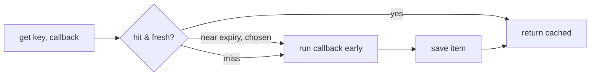

# Cache Component

!!! tip "In a nutshell"
    Symfony Cache stores expensive results so you compute them once. Prefer the
    contracts `CacheInterface::get($key, $callback)` — it computes on miss and
    adds built-in stampede protection. Remember: only PSR-6 (via a
    `TagAwareAdapter`) supports tags; PSR-16 does not.

!!! abstract "Learning objectives"
    By the end of this chapter you can:

    - [ ] Distinguish PSR-6, PSR-16 and the Symfony Cache **contracts**.
    - [ ] Use `CacheInterface::get()` with a callback and choose an adapter.
    - [ ] Apply cache **tags** and explain **stampede protection**.

    **Syllabus:** `Miscellaneous → Cache` ·
    **Level:** Advanced → Expert ·
    **Est. time:** 40 min ·
    **Prerequisites:** [Dependency Injection](../dependency-injection/index.md)

---

## Theory

Symfony Cache offers three overlapping APIs:

| API | Interface | Style |
|---|---|---|
| **PSR-6** | `Psr\Cache\CacheItemPoolInterface` | Pool + `CacheItem` objects |
| **PSR-16** | `Psr\SimpleCache\CacheInterface` | Simple get/set by key |
| **Symfony contracts** | `Symfony\Contracts\Cache\CacheInterface` | Callback-based `get()` with built-in stampede protection |

The **contracts** API is the recommended one: `get($key, callable $callback)`
computes-and-stores on miss in a single call.

## Deep Dive — how it works internally

### PSR-6 pool + item lifecycle

`CacheItemPoolInterface::getItem($key)` returns a
`Psr\Cache\CacheItemInterface`. You check `$item->isHit()`, and on miss call
`$item->set($value)->expiresAfter($ttl)` then `$pool->save($item)`. Items are
stateful objects — this is verbose but explicit.

### The contracts API and stampede protection

`Symfony\Contracts\Cache\CacheInterface::get()`:

```php
public function get(string $key, callable $callback, ?float $beta = null, ?array &$metadata = null): mixed
```

On a miss it calls `$callback(ItemInterface $item, bool &$save)` to compute the
value, saves it, and returns it. Its killer feature is **probabilistic early
expiration** ("stampede protection"): as an item approaches expiry, one request
is chosen (via the `$beta` factor) to recompute *early* while others still serve
the cached value — preventing a **cache stampede** where many concurrent
requests all recompute an expensive value at once. Setting `$beta = INF` forces
recomputation; `0` disables early expiration.



The concrete pools implement both PSR-6 and the contracts interface (e.g.
`Symfony\Component\Cache\Adapter\FilesystemAdapter`).

!!! note "Source reference"
    `Symfony\Contracts\Cache\CacheInterface` and `ContractsTrait` (early expiration) —
    [symfony/symfony `8.0`](https://github.com/symfony/symfony/blob/8.0/src/Symfony/Contracts/Cache/CacheInterface.php).

### Adapters

| Adapter | Backing store |
|---|---|
| `FilesystemAdapter` | Files on disk |
| `ApcuAdapter` | APCu shared memory |
| `RedisAdapter` | Redis server |
| `ArrayAdapter` | In-memory (per-request; tests) |
| `ChainAdapter` | Tries several adapters in order |
| `NullAdapter` | No-op (disable caching) |
| `PhpFilesAdapter` | Opcache-friendly PHP files |

### Tags

`TagAwareAdapter` (wrapping any adapter) implements
`Symfony\Contracts\Cache\TagAwareCacheInterface`. In the callback you call
`$item->tag(['products'])`; later `$pool->invalidateTags(['products'])` evicts
**all** items carrying that tag — invalidation by concern instead of by key.

### PSR-6 vs PSR-16

PSR-16 (`SimpleCache`) is a thin key→value API with no item objects, no tags, no
deferred saves — convenient but limited. PSR-6 supports deferred saves
(`saveDeferred`/`commit`) and metadata. Symfony contracts wrap PSR-6 with the
callback + stampede protection ergonomics.

## Configuration & code

=== "PHP Attributes"

    ```php
    <?php
    declare(strict_types=1);

    namespace App\Service;

    use Symfony\Contracts\Cache\CacheInterface;
    use Symfony\Contracts\Cache\ItemInterface;

    final class PriceService
    {
        public function __construct(private readonly CacheInterface $cache) {}

        public function priceFor(int $id): float
        {
            return $this->cache->get("price_$id", function (ItemInterface $item): float {
                $item->expiresAfter(3600);
                $item->tag(['prices']);

                return $this->recomputeExpensivePrice(); // runs only on miss
            });
        }

        private function recomputeExpensivePrice(): float { return 9.99; }
    }
    ```

=== "YAML"

    ```yaml
    # config/packages/cache.yaml
    framework:
        cache:
            app: cache.adapter.filesystem
            pools:
                prices.cache:
                    adapter: cache.adapter.redis
                    tags: true
    ```

=== "Console"

    ```console
    $ php bin/console cache:pool:list
    $ php bin/console cache:pool:clear cache.app
    ```

## Best practices & anti-patterns

| ✅ Do | ❌ Avoid |
|---|---|
| Use the contracts `get()` callback API | Manual `isHit()`/`save()` unless you need PSR-6 |
| Tag related items and `invalidateTags()` | Deleting keys one by one |
| Rely on stampede protection for hot keys | Recomputing expensive values on every miss burst |
| Choose the adapter per data (APCu local, Redis shared) | One filesystem pool for everything shared |

## When (not) to use it / alternatives

Use application caching for expensive, reusable computations. Prefer **HTTP
caching** (see [HTTP Caching](../http-caching/index.md)) for whole responses.
Use `ArrayAdapter`/`NullAdapter` in tests to keep them deterministic.

!!! danger "Certification traps"
    - `CacheInterface::get()` runs the callback **only on miss**; the return value is cached.
    - Stampede protection = **probabilistic early expiration** via `$beta`.
    - Tags require a **`TagAwareAdapter`**/pool with `tags: true`.
    - PSR-16 has **no tags and no deferred saves**; PSR-6 does.
    - `$beta = INF` forces immediate recomputation.

!!! warning "Common mistakes"
    - Calling `$item->tag()` on a non-tag-aware pool → error.
    - Expecting `ArrayAdapter` data to survive across requests.

## Exercises

1. **(Advanced)** Cache an expensive price for 1 hour, tagged `prices`, using the
   contracts API; then invalidate by tag.
2. **(Advanced)** Explain what happens under load when 500 requests hit an
   expired hot key with stampede protection enabled.

??? success "Solutions"

    **1.** See `PriceService` above; invalidate with
    `$pool->invalidateTags(['prices'])` on a `TagAwareCacheInterface` pool.

    **2.** As the item nears expiry, one request is probabilistically chosen to
    recompute early and refresh the cache while the other requests keep serving the
    still-valid cached value — avoiding a thundering-herd recompute.

## Certification questions

??? question "Q1. `Symfony\Contracts\Cache\CacheInterface::get()` runs its callback…"
    - [x] A. only on a cache miss ✅
    - [ ] B. on every call
    - [ ] C. never — you must call save()

    **Why:** The callback computes the value on miss; the result is stored and
    returned. **Ref:** [Cache contracts](https://symfony.com/doc/current/cache.html#cache-contracts).

??? question "Q2. Which API supports cache tags?"
    - [ ] A. PSR-16 SimpleCache
    - [x] B. PSR-6 pools via a TagAwareAdapter ✅
    - [ ] C. Neither

    **Why:** Tags need a `TagAwareAdapter`; PSR-16 has no tag support.
    **Ref:** [Cache tags](https://symfony.com/doc/current/cache.html#using-cache-tags).

??? question "Q3. Stampede protection is implemented by…"
    - [x] A. probabilistic early expiration controlled by `$beta` ✅
    - [ ] B. a global mutex on every key
    - [ ] C. disabling TTLs

    **Why:** Early recomputation is chosen probabilistically as expiry nears.
    **Ref:** [Stampede prevention](https://symfony.com/doc/current/cache.html#stampede-prevention).

## Key takeaways

- Three APIs: PSR-6 (items), PSR-16 (simple), Symfony contracts (callback `get()`).
- Contracts `get($key, $cb, $beta)` = compute-on-miss + stampede protection.
- Adapters: filesystem, apcu, redis, array, chain, null, phpfiles.
- Tags via `TagAwareAdapter` → `invalidateTags()`.

## Last-minute revision

!!! tip "Cheat sheet"
    - `CacheItemPoolInterface` (PSR-6) · `SimpleCache` (PSR-16) · `CacheInterface` (contracts).
    - `get($key, fn(ItemInterface $i) => ..., $beta)`; `$i->expiresAfter()`, `$i->tag()`.
    - Stampede = early expiration; `$beta=INF` forces recompute.
    - `cache:pool:clear`, `pools:` with `tags: true`.

## Official References
- [Official docs — Cache](https://symfony.com/doc/current/cache.html)
- [Official docs — Cache contracts](https://symfony.com/doc/current/components/cache.html)
- [Symfony source — CacheInterface](https://github.com/symfony/symfony/blob/8.0/src/Symfony/Contracts/Cache/CacheInterface.php)

---

<small>Related: [HTTP Caching](../http-caching/index.md) · [Lock](lock.md) · [Deployment](deployment.md)</small>
