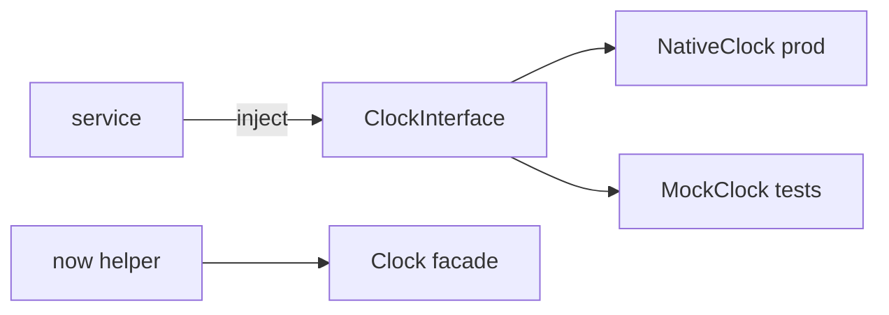

# Clock Component

!!! tip "In a nutshell"
    Le Clock component remplace `new \DateTime()` par une horloge injectable, ce
    qui rend testable le code dépendant du temps : la prod utilise `NativeClock`,
    les tests figent ou avancent une `MockClock`. Retenez que
    `ClockInterface::now()` retourne toujours un `DatePoint` immuable (un
    `\DateTimeImmutable`).

!!! example "Real-world analogy"
    Une horloge, c'est **la pendule murale de la pièce — que vous pouvez remplacer
    par un accessoire de théâtre**. En production, c'est la vraie pendule
    (`NativeClock`). Dans les tests, vous accrochez une fausse pendule
    (`MockClock`) dont vous réglez les aiguilles à la main et que vous pouvez
    faire tourner en avant instantanément : « quelle heure est-il ? » (`now()`)
    répond toujours ce dont la scène a besoin — sans attendre que de vraies
    minutes s'écoulent.

!!! abstract "Learning objectives"
    À la fin de ce chapitre, vous saurez :

    - [ ] Obtenir l'heure courante via `ClockInterface`/`now()` au lieu de `new \DateTime()`.
    - [ ] Choisir entre les horloges Native/Mock/Monotonic et contrôler le temps dans les tests.
    - [ ] Utiliser `DatePoint` et le `ClockAwareTrait`.

    **Syllabus:** `Miscellaneous → Clock` ·
    **Level:** Advanced ·
    **Est. time:** 25 min ·
    **Prerequisites:** [Testing](../testing/phpunit-bridge.md)

---

## Theory

Coder en dur `new \DateTimeImmutable()` rend intestable le code dépendant du
temps. Le Clock component injecte une **horloge** afin que la production utilise
l'heure réelle tandis que les tests la figent ou l'avancent de manière
déterministe. `now()` est un helper global adossé à la même abstraction.

```php
use function Symfony\Component\Clock\now;

// Untestable: reads the real wall clock directly
$deadline = new \DateTimeImmutable('+30 minutes');

// Testable: now() reads the swappable global clock
$deadline = now()->modify('+30 minutes');
```

## Deep Dive — how it works internally

!!! question "Predict first"
    Dans un test, vous figez `new MockClock('2026-07-06 12:00')` et vous
    l'injectez, mais le service testé compare son résultat à
    `new \DateTimeImmutable()`. L'assertion sera-t-elle stable d'une exécution à
    l'autre ?

??? note "Reveal"
    Non. La `MockClock` est figée à midi tandis que `new \DateTimeImmutable()` lit
    la vraie horloge murale — elles divergent à chaque exécution. Lisez l'heure
    depuis l'**horloge** des deux côtés ; ne mélangez jamais temps mocké et temps
    réel.

### The contract and implementations

`Psr\Clock\ClockInterface::now(): \DateTimeImmutable` est la base PSR-20 ;
`Symfony\Component\Clock\ClockInterface` l'étend avec `sleep(float)` et
`withTimeZone()`. Implémentations :

| Clock | Behaviour |
|---|---|
| `NativeClock` | Heure murale réelle (défaut, prod) |
| `MockClock` | Heure fixe que vous réglez/avancez ; `sleep()` avance virtuellement |
| `MonotonicClock` | Haute résolution, insensible aux changements d'horloge système (pour les durées) |

```php
// PSR-20 base contract: now() only
$time = $clock->now(); // \DateTimeImmutable

// Symfony's ClockInterface adds two methods:
$clock->sleep(0.5); // wait 0.5s (virtual on MockClock)
$paris = $clock->withTimeZone('Europe/Paris'); // same clock, other timezone
```

Le framework autowire `ClockInterface` (le service `clock`) en `NativeClock`.
La façade statique `Symfony\Component\Clock\Clock` enveloppe une instance
d'horloge globale ; `now()` et `Clock::get()` la lisent, et
`Clock::set(new MockClock(...))` la remplace globalement (utilisé dans les
tests).

```php
use Symfony\Component\Clock\Clock;
use Symfony\Component\Clock\MockClock;
use function Symfony\Component\Clock\now;

Clock::get(); // global clock (NativeClock by default)
Clock::set(new MockClock('2026-07-06 12:00')); // swap it globally (tests)
now(); // reads the global clock -> 12:00
```



### DatePoint

`Symfony\Component\Clock\DatePoint` est une sous-classe de `\DateTimeImmutable`
dotée d'un constructeur plus strict qui lève des exceptions, et de modificateurs
pratiques ; `now()` retourne un `DatePoint`. Elle est interopérable partout où un
`\DateTimeImmutable` est attendu.

```php
use Symfony\Component\Clock\DatePoint;
use function Symfony\Component\Clock\now;

$point = now();                                 // a DatePoint instance
var_dump($point instanceof \DateTimeImmutable); // true — drop-in replacement

new DatePoint('not a date'); // throws an exception (strict constructor)
```

### Testing time

Dans les tests, `Symfony\Component\Clock\Test\ClockSensitiveTrait`
sauvegarde/restaure l'horloge globale autour de chaque test et fournit
`self::mockTime()`. Avec une `MockClock`, vous pouvez figer « maintenant », puis
`$clock->sleep(3600)` pour sauter une heure sans délai réel — parfait pour les
tests d'expiration de token, de TTL et de planification. Voir
[PHPUnit Bridge](../testing/phpunit-bridge.md).

```php
use Symfony\Component\Clock\Test\ClockSensitiveTrait;

final class ExpiryTest extends TestCase
{
    use ClockSensitiveTrait; // saves/restores the global clock per test

    public function testTokenExpires(): void
    {
        $clock = self::mockTime('2026-07-06 12:00'); // freeze "now" (MockClock)
        $clock->sleep(3600);                         // jump 1 hour, no real delay

        self::assertSame('13:00', $clock->now()->format('H:i'));
    }
}
```

### ClockAwareTrait

`Symfony\Component\Clock\ClockAwareTrait` ajoute un `setClock()` (autowiré) et un
`now()` protégé à n'importe quel service : vous lisez l'heure via `$this->now()`
et le test peut injecter une `MockClock`.

```php
use Symfony\Component\Clock\ClockAwareTrait;

final class ReportScheduler
{
    use ClockAwareTrait; // provides setClock() (autowired) + protected now()

    public function isDue(\DateTimeImmutable $at): bool
    {
        return $this->now() >= $at; // tests call setClock(new MockClock(...))
    }
}
```

!!! note "Source reference"
    `Symfony\Component\Clock\ClockInterface`, `MockClock`, `DatePoint` —
    [symfony/symfony `8.0`](https://github.com/symfony/symfony/blob/8.0/src/Symfony/Component/Clock/ClockInterface.php).

### Null behavior

Le temps est un des endroits où null ne peut tout simplement **pas** apparaître :
`ClockInterface::now()` est typée `: \DateTimeImmutable`, elle rend donc toujours
un vrai `DatePoint` — jamais `null`, même avec une `MockClock` figée. Le service
`clock` autowiré est lui aussi toujours présent : une `ClockInterface` injectée
n'est jamais nulle. La leçon est l'inverse de la garde null habituelle : puisque
`now()` ne peut pas être null, vous n'avez jamais besoin de `?->` dessus — mais
vous *pouvez* encore obtenir une valeur trompeuse si vous comparez l'heure d'une
`MockClock` au vrai `new \DateTime()`. Lisez l'heure depuis l'horloge des deux
côtés, pas depuis un mélange d'horloge et d'heure murale.

```php
$frozen = new MockClock('2026-07-06 12:00');

$now = $frozen->now(); // always a DatePoint — never null, no ?-> needed

// Anti-pattern: mixing the mocked clock with the real wall clock
$drift = (new \DateTime())->getTimestamp() - $now->getTimestamp(); // flaky!
```

!!! note "Null in real life"
    Demander « quelle heure est-il ? » obtient toujours une réponse — l'horloge ne
    hausse jamais les épaules. L'erreur n'est pas une heure manquante, c'est de
    lire deux horloges différentes en même temps.

## Configuration & code

=== "PHP Attributes"

    ```php
    <?php
    declare(strict_types=1);

    namespace App\Service;

    use Psr\Clock\ClockInterface;

    final class TokenFactory
    {
        public function __construct(private readonly ClockInterface $clock) {}

        public function expiresAt(): \DateTimeImmutable
        {
            return $this->clock->now()->modify('+1 hour');
        }
    }
    ```

    ```php
    <?php
    declare(strict_types=1);

    namespace App\Tests;

    use App\Service\TokenFactory;
    use PHPUnit\Framework\TestCase;
    use Symfony\Component\Clock\MockClock;

    final class TokenFactoryTest extends TestCase
    {
        public function testExpiry(): void
        {
            $clock = new MockClock('2026-07-06 12:00:00');
            $expiry = (new TokenFactory($clock))->expiresAt();

            self::assertSame('2026-07-06 13:00:00', $expiry->format('Y-m-d H:i:s'));
        }
    }
    ```

=== "Console"

    ```console
    $ php bin/console debug:container clock
    ```

=== "YAML"

    ```yaml
    # config/services.yaml — the framework registers ClockInterface automatically.
    # For tests you typically call Clock::set(new MockClock(...)).
    ```

## Best practices & anti-patterns

| ✅ Do | ❌ Avoid |
|---|---|
| Injecter `ClockInterface` / utiliser `now()` | `new \DateTime()` éparpillé dans les services |
| Utiliser `MockClock` dans les tests | `sleep()`/attendre le temps réel dans les tests |
| Utiliser `MonotonicClock` pour les durées | Des diffs de `NativeClock` à travers des sauts NTP |
| `ClockAwareTrait` pour une adoption rapide | Des appels statiques à `date()` que vous ne contrôlez pas |

## When (not) to use it / alternatives

Utilisez le Clock dès qu'un comportement dépend de « maintenant » (expiration,
planification, fenêtres de rate limiting). Pour mesurer la durée d'un code,
préférez `MonotonicClock`/Stopwatch, pas l'horloge murale. Les scripts triviaux
sans logique dépendante du temps n'en ont pas besoin.

!!! danger "Certification traps"
    - `ClockInterface::now()` retourne un **`\DateTimeImmutable`** (`DatePoint`), jamais un objet mutable.
    - L'horloge par défaut du framework est **`NativeClock`** ; les tests y substituent une `MockClock`.
    - `MockClock::sleep()` avance un temps **virtuel** — aucun délai réel.
    - `now()` et la façade `Clock` lisent l'horloge **globale** (`Clock::set()` pour la remplacer).
    - `MonotonicClock` sert aux durées, insensible aux changements d'horloge système.

!!! warning "Common mistakes"
    - Comparer un résultat de `MockClock` à `new \DateTime()` (l'heure réelle) dans les tests.
    - Oublier de restaurer l'horloge globale entre les tests (utilisez `ClockSensitiveTrait`).

## Exercises

1. **(Advanced)** Injectez une horloge et calculez une expiration à une heure de
   maintenant.
2. **(Advanced)** Testez cette expiration avec une `MockClock` figée, en
   affirmant l'heure exacte.

??? success "Solutions"

    **1.** Voir `TokenFactory::expiresAt()` — `$this->clock->now()->modify('+1 hour')`.

    **2.** Voir `TokenFactoryTest` — construisez `new MockClock('2026-07-06 12:00:00')`
    et vérifiez que le résultat est `13:00:00`, sans attente réelle.

## Certification questions

??? question "Q1. `ClockInterface::now()` returns…"
    - [x] A. a `\DateTimeImmutable` (a `DatePoint`) ✅
    - [ ] B. a Unix timestamp `int`
    - [ ] C. a mutable `\DateTime`

    **Why:** Elle retourne une date/heure immuable. **Ref:** [Clock](https://symfony.com/doc/current/components/clock.html).

??? question "Q2. Which clock advances time without real delay for tests?"
    - [x] A. `MockClock` ✅
    - [ ] B. `NativeClock`
    - [ ] C. `MonotonicClock`

    **Why:** `MockClock` vous permet de régler/avancer le temps (son `sleep()` est virtuel).
    **Ref:** [Testing with Clock](https://symfony.com/doc/current/components/clock.html#usage-in-tests).

??? question "Q3. Which clock is best for measuring elapsed durations?"
    - [x] A. `MonotonicClock` ✅
    - [ ] B. `NativeClock`
    - [ ] C. `MockClock`

    **Why:** Elle est monotone et insensible aux ajustements de l'horloge système. **Ref:** [Clock](https://symfony.com/doc/current/components/clock.html).

## Key takeaways

- Injectez `ClockInterface`/utilisez `now()` au lieu de `new \DateTime()`.
- `NativeClock` (prod), `MockClock` (tests), `MonotonicClock` (durées).
- `now()` retourne un `DatePoint` immuable ; la façade `Clock` détient l'horloge globale.
- `ClockSensitiveTrait`/`ClockAwareTrait` facilitent les tests et l'adoption.

## Last-minute revision

!!! tip "Cheat sheet"
    - `ClockInterface::now(): \DateTimeImmutable` ; aussi `sleep()`, `withTimeZone()`.
    - `new MockClock('2026-07-06 12:00')` → régler/avancer ; `$c->sleep(3600)`.
    - `Clock::set(new MockClock(...))` ; `now()` lit la façade.
    - `DatePoint` étend `\DateTimeImmutable`.

## Connections

- **Depends on:** [Dependency Injection](../dependency-injection/index.md) — le service `clock` (`NativeClock`) est autowiré via `ClockInterface`.
- **Reused in:** [PHPUnit Bridge](../testing/phpunit-bridge.md) — `ClockSensitiveTrait` substitue une `MockClock` ; les délais/retries de [Messenger](messenger.md) raisonnent sur « maintenant ».
- **Confused with:** `MonotonicClock` — celle-ci sert à mesurer des *durées*, pas à lire le « maintenant » de l'horloge murale.

## Official References
- [Official docs — Clock](https://symfony.com/doc/current/components/clock.html)
- [Symfony source — ClockInterface](https://github.com/symfony/symfony/blob/8.0/src/Symfony/Component/Clock/ClockInterface.php)
- [Symfony source — MockClock](https://github.com/symfony/symfony/blob/8.0/src/Symfony/Component/Clock/MockClock.php)

## Video references

!!! tip "Watch & learn"
    Voici des chaînes vidéo officielles, mises à jour en continu — cherchez-y
    « Symfony components » pour consolider ce chapitre. Nous référençons des
    chaînes stables plutôt que des vidéos individuelles pour que les références ne
    périment jamais.

    - [SymfonyCasts screencasts](https://symfonycasts.com/tracks/symfony) — tutoriels scénarisés à suivre en codant.
    - [Symfony official YouTube](https://www.youtube.com/@SymfonyOfficial) — conférences et keynotes SymfonyCon.
    - [Official docs for this topic](https://symfony.com/doc/current/components/clock.html) — certaines pages de la doc Symfony intègrent un screencast.

## Confidence check

Je suis prêt quand je peux :

- [ ] expliquer **pourquoi** injecter une horloge rend testable le code dépendant du temps
- [ ] injecter `ClockInterface` et figer le temps avec `MockClock` en Symfony 8
- [ ] déboguer une assertion temporelle instable (mélange de `MockClock` et de `new \DateTime()`)
- [ ] repérer le piège : `now()` retourne un `DatePoint` immuable, jamais null
- [ ] décrire comment la façade `Clock` détient l'horloge globale substituée dans les tests

---

<small>Related: [Debugging](debugging.md) · [PHPUnit Bridge](../testing/phpunit-bridge.md) · [Messenger](messenger.md)</small>
