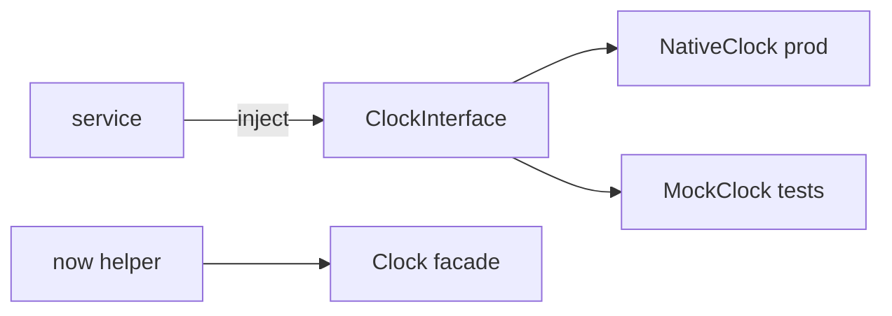

# Clock Component

!!! tip "In a nutshell"
    The Clock component replaces `new \DateTime()` with an injectable clock so
    time-dependent code becomes testable: prod uses `NativeClock`, tests freeze
    or advance a `MockClock`. Remember `ClockInterface::now()` always returns an
    immutable `DatePoint` (a `\DateTimeImmutable`).

!!! example "Real-world analogy"
    A clock is the **wall clock in the room — one you can swap for a stage prop**.
    In production it's the real wall clock (`NativeClock`). In tests you hang a
    fake clock (`MockClock`) whose hands you set by hand and can spin forward
    instantly, so "what time is it?" (`now()`) always answers what the scene
    needs — no waiting for real minutes to pass.

!!! abstract "Learning objectives"
    By the end of this chapter you can:

    - [ ] Get the current time via `ClockInterface`/`now()` instead of `new \DateTime()`.
    - [ ] Choose Native/Mock/Monotonic clocks and control time in tests.
    - [ ] Use `DatePoint` and the `ClockAwareTrait`.

    **Syllabus:** `Miscellaneous → Clock` ·
    **Level:** Advanced ·
    **Est. time:** 25 min ·
    **Prerequisites:** [Testing](../testing/phpunit-bridge.md)

---

## Theory

Hardcoding `new \DateTimeImmutable()` makes time-dependent code untestable. The
Clock component injects a **clock** so production uses the real time while tests
freeze or advance it deterministically. `now()` is a global helper backed by the
same abstraction.

## Deep Dive — how it works internally

### The contract and implementations

`Psr\Clock\ClockInterface::now(): \DateTimeImmutable` is the PSR-20 base;
`Symfony\Component\Clock\ClockInterface` extends it with `sleep(float)` and
`withTimeZone()`. Implementations:

| Clock | Behaviour |
|---|---|
| `NativeClock` | Real wall-clock time (default, prod) |
| `MockClock` | Fixed time you set/advance; `sleep()` advances virtually |
| `MonotonicClock` | High-resolution, immune to system clock changes (for durations) |

The framework autowires `ClockInterface` (the `clock` service) as `NativeClock`.
The static facade `Symfony\Component\Clock\Clock` wraps a global clock instance;
`now()` and `Clock::get()` read it, and `Clock::set(new MockClock(...))` swaps it
globally (used in tests).



### DatePoint

`Symfony\Component\Clock\DatePoint` is a `\DateTimeImmutable` subclass with a
stricter, exception-throwing constructor and convenient modifiers; `now()`
returns a `DatePoint`. It interoperates anywhere a `\DateTimeImmutable` is
expected.

### Testing time

In tests, `Symfony\Component\Clock\Test\ClockSensitiveTrait` saves/restores the
global clock around each test and provides `self::mockTime()`. With a `MockClock`
you can freeze "now", then `$clock->sleep(3600)` to jump an hour with no real
delay — perfect for token-expiry, TTL and scheduling tests. See
[PHPUnit Bridge](../testing/phpunit-bridge.md).

### ClockAwareTrait

`Symfony\Component\Clock\ClockAwareTrait` adds a `setClock()` (autowired) and a
protected `now()` to any service, so you read time via `$this->now()` and the
test can inject a `MockClock`.

!!! note "Source reference"
    `Symfony\Component\Clock\ClockInterface`, `MockClock`, `DatePoint` —
    [symfony/symfony `8.0`](https://github.com/symfony/symfony/blob/8.0/src/Symfony/Component/Clock/ClockInterface.php).

### Null behavior

Time is one place where null simply **cannot** appear: `ClockInterface::now()` is
typed `: \DateTimeImmutable`, so it always hands back a real `DatePoint` — never
`null`, even with a frozen `MockClock`. The autowired `clock` service is likewise
always present, so an injected `ClockInterface` is never null. The lesson is the
inverse of the usual null guard: because `now()` can't be null you never need
`?->` on it — but you *can* still get a misleading value if you compare a
`MockClock` time against the real `new \DateTime()`. Read time from the clock on
both sides, not from a mix of clock and wall time.

!!! note "Null in real life"
    Asking "what time is it?" always gets an answer — the clock never shrugs. The
    mistake isn't a missing time, it's reading two different clocks at once.

## Configuration & code

=== "PHP Attributes"

    ```php
    <?php
    declare(strict_types=1);

    namespace App\Service;

    use Psr\Clock\ClockInterface;

    final class TokenFactory
    {
        public function __construct(private readonly ClockInterface $clock) {}

        public function expiresAt(): \DateTimeImmutable
        {
            return $this->clock->now()->modify('+1 hour');
        }
    }
    ```

    ```php
    <?php
    declare(strict_types=1);

    namespace App\Tests;

    use App\Service\TokenFactory;
    use PHPUnit\Framework\TestCase;
    use Symfony\Component\Clock\MockClock;

    final class TokenFactoryTest extends TestCase
    {
        public function testExpiry(): void
        {
            $clock = new MockClock('2026-07-06 12:00:00');
            $expiry = (new TokenFactory($clock))->expiresAt();

            self::assertSame('2026-07-06 13:00:00', $expiry->format('Y-m-d H:i:s'));
        }
    }
    ```

=== "Console"

    ```console
    $ php bin/console debug:container clock
    ```

=== "YAML"

    ```yaml
    # config/services.yaml — the framework registers ClockInterface automatically.
    # For tests you typically call Clock::set(new MockClock(...)).
    ```

## Best practices & anti-patterns

| ✅ Do | ❌ Avoid |
|---|---|
| Inject `ClockInterface` / use `now()` | `new \DateTime()` scattered in services |
| Use `MockClock` in tests | `sleep()`/waiting for real time in tests |
| Use `MonotonicClock` for durations | `NativeClock` diffs across NTP jumps |
| `ClockAwareTrait` for quick adoption | Static `date()` calls you can't control |

## When (not) to use it / alternatives

Use the Clock whenever behaviour depends on "now" (expiry, scheduling, rate
windows). For measuring code duration prefer `MonotonicClock`/Stopwatch, not wall
clock. Trivial scripts with no time-dependent logic don't need it.

!!! danger "Certification traps"
    - `ClockInterface::now()` returns a **`\DateTimeImmutable`** (`DatePoint`), never mutable.
    - Default framework clock is **`NativeClock`**; tests swap in `MockClock`.
    - `MockClock::sleep()` advances **virtual** time — no real delay.
    - `now()` and `Clock` facade read the **global** clock (`Clock::set()` to override).
    - `MonotonicClock` is for durations, unaffected by system clock changes.

!!! warning "Common mistakes"
    - Comparing a `MockClock` result to `new \DateTime()` (the real time) in tests.
    - Forgetting to restore the global clock between tests (use `ClockSensitiveTrait`).

## Exercises

1. **(Advanced)** Inject a clock and compute an expiry one hour from now.
2. **(Advanced)** Test that expiry with a frozen `MockClock`, asserting the exact time.

??? success "Solutions"

    **1.** See `TokenFactory::expiresAt()` — `$this->clock->now()->modify('+1 hour')`.

    **2.** See `TokenFactoryTest` — construct `new MockClock('2026-07-06 12:00:00')`
    and assert the result is `13:00:00`, with no real waiting.

## Certification questions

??? question "Q1. `ClockInterface::now()` returns…"
    - [x] A. a `\DateTimeImmutable` (a `DatePoint`) ✅
    - [ ] B. a Unix timestamp `int`
    - [ ] C. a mutable `\DateTime`

    **Why:** It returns an immutable date/time. **Ref:** [Clock](https://symfony.com/doc/current/components/clock.html).

??? question "Q2. Which clock advances time without real delay for tests?"
    - [x] A. `MockClock` ✅
    - [ ] B. `NativeClock`
    - [ ] C. `MonotonicClock`

    **Why:** `MockClock` lets you set/advance time (its `sleep()` is virtual).
    **Ref:** [Testing with Clock](https://symfony.com/doc/current/components/clock.html#usage-in-tests).

??? question "Q3. Which clock is best for measuring elapsed durations?"
    - [x] A. `MonotonicClock` ✅
    - [ ] B. `NativeClock`
    - [ ] C. `MockClock`

    **Why:** It is monotonic and immune to system clock adjustments. **Ref:** [Clock](https://symfony.com/doc/current/components/clock.html).

## Key takeaways

- Inject `ClockInterface`/use `now()` instead of `new \DateTime()`.
- `NativeClock` (prod), `MockClock` (tests), `MonotonicClock` (durations).
- `now()` returns an immutable `DatePoint`; the `Clock` facade holds the global clock.
- `ClockSensitiveTrait`/`ClockAwareTrait` ease testing and adoption.

## Last-minute revision

!!! tip "Cheat sheet"
    - `ClockInterface::now(): \DateTimeImmutable`; also `sleep()`, `withTimeZone()`.
    - `new MockClock('2026-07-06 12:00')` → set/advance; `$c->sleep(3600)`.
    - `Clock::set(new MockClock(...))`; `now()` reads the facade.
    - `DatePoint` extends `\DateTimeImmutable`.

## Official References
- [Official docs — Clock](https://symfony.com/doc/current/components/clock.html)
- [Symfony source — ClockInterface](https://github.com/symfony/symfony/blob/8.0/src/Symfony/Component/Clock/ClockInterface.php)
- [Symfony source — MockClock](https://github.com/symfony/symfony/blob/8.0/src/Symfony/Component/Clock/MockClock.php)

---

<small>Related: [Debugging](debugging.md) · [PHPUnit Bridge](../testing/phpunit-bridge.md) · [Messenger](messenger.md)</small>
