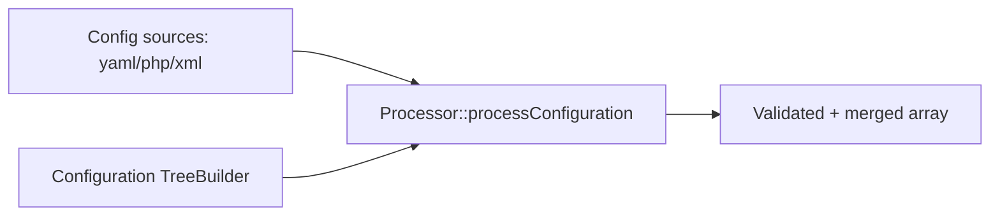

# Configuration (Config, DotEnv, ExpressionLanguage)

!!! tip "In a nutshell"
    Trois composants se cachent ici : Config valide des options structurées contre un
    schéma `TreeBuilder`, DotEnv charge les fichiers `.env*`, ExpressionLanguage
    évalue des règles dynamiques. À retenir pour l'examen : `.env.local` est ignoré dans
    l'environnement `test`, et les vraies variables d'environnement de l'OS gagnent toujours.

!!! example "Real-world analogy"
    Pensez à la préparation du poste de travail d'un nouvel employé. Une checklist de
    paramètres (le schéma Config) rejette les choix impossibles avant leur application —
    impossible de demander une taille d'écran qui n'existe pas. Les préférences par défaut
    viennent d'une pile de documents de politique interne (les fichiers `.env`), mais une
    consigne directe déjà épinglée sur la machine par l'IT (une vraie variable
    d'environnement de l'OS) prime sur tout ce que dit un document. Et la petite fiche de
    règles « si ceci, alors cela » que le manager consulte sur le moment, c'est
    l'ExpressionLanguage.

!!! abstract "Learning objectives"
    À la fin de ce chapitre, vous saurez :

    - [ ] Construire et valider un arbre de configuration avec `TreeBuilder` et `Processor`.
    - [ ] Expliquer la cascade `.env`, `APP_ENV` et le dump `.env.local.php`.
    - [ ] Évaluer et compiler des expressions avec `ExpressionLanguage` et ajouter des providers.

    **Syllabus:** `Miscellaneous → Configuration` ·
    **Level:** Advanced → Expert ·
    **Est. time:** 40 min ·
    **Prerequisites:** [Dependency Injection](../dependency-injection/index.md)

---

## Theory

Trois composants distincts se rangent sous « configuration » :

- **Config** — définit un *schéma* pour la configuration structurée (les classes
  `Configuration` des bundles) et valide/fusionne les tableaux bruts contre celui-ci.
- **DotEnv** — charge les fichiers `.env*` dans les variables d'environnement au bootstrap.
- **ExpressionLanguage** — un petit moteur d'expressions cloisonné, utilisé partout dans
  Symfony (sécurité, conditions de routing, définitions de services, validation).

```php
// Config: validate raw arrays against a bundle Configuration schema
$config = (new Processor())->processConfiguration(new Configuration(), $rawConfigs);

// DotEnv: load the .env* cascade into environment variables
(new Dotenv())->loadEnv(__DIR__.'/.env');

// ExpressionLanguage: evaluate a small sandboxed rule
$allowed = (new ExpressionLanguage())->evaluate('user.age >= 18', ['user' => $user]);
```

## Deep Dive — how it works internally

!!! question "Predict first"
    `.env.local` définit `APP_ENV=dev`, mais l'OS exporte déjà `APP_ENV=prod`.
    Lequel gagne — et `.env.local` est-il seulement chargé dans l'environnement `test` ?

??? note "Reveal"
    La **vraie variable de l'OS gagne** : `.env*` n'écrase jamais une variable
    d'environnement déjà définie. Et `.env.local` est délibérément **ignoré en `test`**
    pour que les tests restent reproductibles quelle que soit la machine du développeur.

### Config: TreeBuilder + Processor

Un bundle expose une méthode `ConfigurationInterface::getConfigTreeBuilder()` retournant un
`Symfony\Component\Config\Definition\Builder\TreeBuilder`. Le
`Symfony\Component\Config\Definition\Processor` fusionne toutes les sources de
configuration et les valide contre cet arbre, en appliquant valeurs par défaut,
normalisation et contraintes. Types de nœuds : `arrayNode`, `scalarNode`, `booleanNode`,
`integerNode`, `enumNode`, avec `->isRequired()`, `->defaultValue()`,
`->cannotBeEmpty()`, `->validate()->ifTrue()->thenInvalid()`.

```php
// Inside ConfigurationInterface::getConfigTreeBuilder()
$tb = new TreeBuilder('acme');
$tb->getRootNode()
    ->children()
        ->scalarNode('endpoint')->isRequired()->cannotBeEmpty()->end()
        ->integerNode('timeout')->defaultValue(30)->end()
        ->booleanNode('enabled')->defaultValue(true)->end()
        ->enumNode('mode')->values(['sync', 'async'])->end()
        ->arrayNode('servers')->scalarPrototype()->end()->end()
        ->scalarNode('dsn')
            ->validate()
                ->ifTrue(fn ($v) => !str_contains((string) $v, '://'))
                ->thenInvalid('Invalid DSN %s.')
            ->end()
        ->end()
    ->end();

// Processor merges every source, applies defaults and validates
$config = (new Processor())->processConfiguration($configuration, $rawConfigs);
```



Le `Symfony\Component\Config\FileLocator` et les loaders (`YamlFileLoader`,
`PhpFileLoader`) lisent les fichiers ; `ConfigCache`/`ConfigCacheFactory` mettent le
résultat en cache et vérifient sa fraîcheur via `ResourceInterface` (par exemple
`FileResource`), de sorte que le mode debug reconstruit quand les sources changent.

!!! note "Source reference"
    `Symfony\Component\Config\Definition\Processor::processConfiguration()` —
    [symfony/symfony `8.0`](https://github.com/symfony/symfony/blob/8.0/src/Symfony/Component/Config/Definition/Processor.php).

### DotEnv: the cascade

`Symfony\Component\Dotenv\Dotenv` alimente `$_ENV`/`$_SERVER`. Ordre de chargement (un
fichier ultérieur n'écrase **pas** les vraies variables d'environnement, mais écrase les
fichiers précédents) :

1. `.env` — valeurs par défaut committées pour tous les environnements.
2. `.env.local` — surcharges propres à la machine (ignorées par git ; **ignorées en `test`**).
3. `.env.<APP_ENV>` — par exemple `.env.prod` (committé).
4. `.env.<APP_ENV>.local` — surcharges machine spécifiques à l'environnement (ignorées par git).

`APP_ENV` sélectionne l'environnement ; `APP_DEBUG` active ou non le debug. En production,
exécutez `composer dump-env prod`, qui compile tout ce qui précède en un unique
**`.env.local.php`** (un simple tableau PHP). Lorsqu'il est présent, Symfony charge
*uniquement* ce fichier et saute le parsing des `.env*`, économisant des I/O à chaque request.

### ExpressionLanguage

`Symfony\Component\ExpressionLanguage\ExpressionLanguage` parse une expression
en AST, puis soit `evaluate($expr, $vars)` (interprétation), soit
`compile($expr, $names)` (émission de code source PHP). Les résultats sont mis en cache
via un pool PSR-6. La syntaxe prend en charge les opérateurs, `?.`/`??`, les appels de
fonctions et l'accès aux objets. Étendez-le avec des **providers** implémentant
`ExpressionFunctionProviderInterface::getFunctions()`, qui retourne des objets
`ExpressionFunction`.

```php
<?php
declare(strict_types=1);

use Symfony\Component\ExpressionLanguage\ExpressionLanguage;

$el = new ExpressionLanguage();
$el->evaluate('user.isActive() and role in roles', [
    'user'  => $user,
    'role'  => 'ROLE_ADMIN',
    'roles' => ['ROLE_ADMIN'],
]); // bool

// Compile to reusable PHP source:
$php = $el->compile('1 + a', ['a']); // "(1 + $a)"
```

## Configuration & code

=== "PHP Attributes"

    ```php
    <?php
    declare(strict_types=1);

    namespace App\DependencyInjection;

    use Symfony\Component\Config\Definition\Builder\TreeBuilder;
    use Symfony\Component\Config\Definition\ConfigurationInterface;

    final class Configuration implements ConfigurationInterface
    {
        public function getConfigTreeBuilder(): TreeBuilder
        {
            $tb = new TreeBuilder('acme');
            $tb->getRootNode()
                ->children()
                    ->integerNode('timeout')->defaultValue(30)->min(1)->end()
                    ->scalarNode('endpoint')->isRequired()->cannotBeEmpty()->end()
                ->end();

            return $tb;
        }
    }
    ```

=== "YAML"

    ```yaml
    # .env  (committed defaults)
    APP_ENV=dev
    APP_SECRET=change_me
    ```

=== "Console"

    ```console
    $ php bin/console debug:dotenv
    $ php bin/console debug:config framework
    $ composer dump-env prod   # writes .env.local.php
    ```

## Best practices & anti-patterns

| ✅ Do | ❌ Avoid |
|---|---|
| Committer `.env`, exclure `.env.local` via git | Committer des secrets dans `.env` |
| `dump-env prod` au déploiement | Parser `.env` à chaque request en prod |
| Valider la configuration avec les contraintes de `TreeBuilder` | Lire des tableaux bruts sans schéma |
| Ajouter des fonctions ExpressionLanguage via un provider | Interpoler des entrées utilisateur dans `evaluate()` |

## When (not) to use it / alternatives

Utilisez le composant Config lorsque vous écrivez un **bundle** réutilisable avec des
options structurées. Pour des réglages au niveau applicatif, préférez les paramètres liés
et les variables d'environnement. Utilisez ExpressionLanguage pour des règles dynamiques
(expressions de sécurité, conditions de routes), pas pour du calcul lourd — il est interprété.

!!! danger "Certification traps"
    - `.env.local` est **ignoré dans l'environnement `test`** (les tests doivent être reproductibles).
    - Lorsque `.env.local.php` existe, les fichiers `.env*` ne sont **pas** parsés.
    - Les vraies variables d'environnement de l'OS gagnent toujours sur les valeurs `.env*`.
    - `Processor::processConfiguration(Configuration, arrays)` fusionne *et* valide.
    - `compile()` retourne du **code source** PHP, `evaluate()` retourne la valeur.

!!! warning "Common mistakes"
    - Passer directement des entrées utilisateur à `ExpressionLanguage::evaluate()` (risque d'injection).
    - Oublier les appels `->end()` lors de la construction de nœuds imbriqués.

## Exercises

1. **(Advanced)** Ajoutez un scalaire `endpoint` requis et non vide, ainsi qu'un entier
   `timeout` (30 par défaut, min 1) à l'arbre de configuration d'un bundle.
2. **(Advanced)** Expliquez ce que produit `composer dump-env prod` et pourquoi cela
   accélère la production.

??? success "Solutions"

    **1.** Voir la classe `Configuration` ci-dessus — `integerNode('timeout')->min(1)->defaultValue(30)`
    et `scalarNode('endpoint')->isRequired()->cannotBeEmpty()`.

    **2.** Il compile toute la cascade `.env*` pour `APP_ENV=prod` en un unique
    `.env.local.php` retournant un tableau. Symfony charge ce tableau directement et
    saute le parsing DotEnv à chaque request.

## Certification questions

??? question "Q1. In which environment is `.env.local` NOT loaded?"
    - [ ] A. dev
    - [ ] B. prod
    - [x] C. test ✅

    **Why:** Les tests doivent être déterministes, donc `.env.local` est ignoré en `test`.
    **Ref:** [Configuring environments](https://symfony.com/doc/current/configuration.html#selecting-the-active-environment).

??? question "Q2. `ExpressionLanguage::compile()` returns…"
    - [ ] A. the evaluated value
    - [x] B. a string of PHP source code ✅
    - [ ] C. an AST node

    **Why:** `compile()` transpile l'expression en PHP ; `evaluate()` l'interprète.
    **Ref:** [ExpressionLanguage](https://symfony.com/doc/current/components/expression_language.html).

??? question "Q3. Which class validates raw config against a tree?"
    - [x] A. `Processor` ✅
    - [ ] B. `TreeBuilder`
    - [ ] C. `FileLocator`

    **Why:** `Processor::processConfiguration()` fusionne et valide contre l'arbre de la
    `Configuration`. **Ref:** [Config component](https://symfony.com/doc/current/components/config/definition.html).

## Key takeaways

- Config = schéma (`TreeBuilder`) + validation/fusion (`Processor`).
- Cascade DotEnv : `.env` → `.env.local` → `.env.<env>` → `.env.<env>.local` ; `test` ignore `.env.local`.
- `dump-env prod` → `.env.local.php`, pas de parsing `.env` à l'exécution.
- ExpressionLanguage : `evaluate()` interprète, `compile()` émet du PHP ; extension via providers.

## Last-minute revision

!!! tip "Cheat sheet"
    - Types de nœuds : `scalarNode`, `integerNode`, `booleanNode`, `enumNode`, `arrayNode` ; `->isRequired()`, `->defaultValue()`.
    - Précédence env : vraie variable d'env > `.env.<env>.local` > `.env.<env>` > `.env.local` > `.env`.
    - `debug:dotenv`, `debug:config <bundle>`, `composer dump-env prod`.
    - Les providers implémentent `ExpressionFunctionProviderInterface`.

## Connections

- **Depends on:** [DI: Parameters](../dependency-injection/parameters.md) — la configuration validée devient des paramètres du container et des arguments de services.
- **Reused in:** [Deployment](deployment.md) — `dump-env prod` compile la cascade ; [Runtime](runtime.md) lit `APP_ENV`/`APP_DEBUG` depuis `$context`.
- **Confused with:** les variables d'environnement applicatives — le composant Config définit des schémas de **bundle**, pas des réglages par application.

## Official References
- [Official docs — Configuration](https://symfony.com/doc/current/configuration.html)
- [Official docs — Config component](https://symfony.com/doc/current/components/config.html)
- [Official docs — ExpressionLanguage](https://symfony.com/doc/current/components/expression_language.html)
- [Symfony source — Dotenv](https://github.com/symfony/symfony/blob/8.0/src/Symfony/Component/Dotenv/Dotenv.php)

## Video references

!!! tip "Watch & learn"
    Ce sont des chaînes vidéo officielles, mises à jour en continu — cherchez-y
    "Symfony components" pour consolider ce chapitre. Nous référençons des chaînes stables
    plutôt que des vidéos individuelles afin que les références ne périment jamais.

    - [SymfonyCasts screencasts](https://symfonycasts.com/tracks/symfony) — tutoriels scénarisés, à coder en suivant.
    - [Symfony official YouTube](https://www.youtube.com/@SymfonyOfficial) — conférences et keynotes de SymfonyCon.
    - [Official docs for this topic](https://symfony.com/doc/current/configuration.html#selecting-the-active-environment) — certaines pages de la doc Symfony intègrent un screencast.

## Confidence check

Je suis prêt quand je peux :

- [ ] expliquer **pourquoi** un schéma `TreeBuilder` vaut mieux que la lecture de tableaux de configuration bruts
- [ ] construire/valider un arbre de configuration et évaluer une expression dans Symfony 8
- [ ] déboguer la précédence des variables d'environnement (vraie variable d'env > `.env.<env>.local` > … > `.env`)
- [ ] repérer le piège : `.env.local` est ignoré en `test` ; `.env.local.php` court-circuite le parsing
- [ ] décrire comment `Processor::processConfiguration()` fusionne et valide

---

<small>Related: [Deployment](deployment.md) · [Dependency Injection](../dependency-injection/index.md) · [Runtime](runtime.md)</small>
